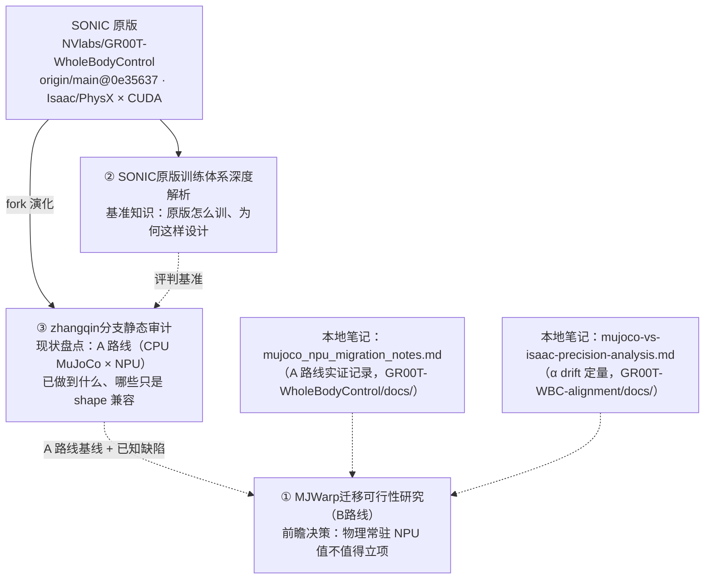
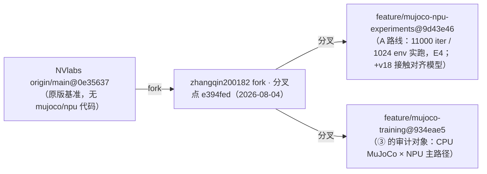

# 00_总览 — SONIC→昇腾 NPU 迁移文档套件

> **版本**: v1.2 — 2026-09-08（同步 ② v1.7：新增 Token 与动作的具体数值样本）
> **用途**: 三份报告 + 两份本地笔记的导航入口：关系图、分支谱系、阅读顺序、统一术语表、证据等级图例、冗余收敛指针。

## 1. 文档关系

**阅读顺序（同一条决策链：懂原版 → 盘现状 → 评新路）**：② 原版解析 → ③ 分支审计 → ① MJWarp 报告。

## 2. 分支谱系（证据锚点总表）

> **已实证（E1，2026-09-03 fetch）**：两分支同属 zhangqin200182 fork，自共同分叉点 `e394fed`（2026-08-04）分出的**兄弟分支**，互不包含（`git merge-base --is-ancestor` 双向 false）。仍待补：A 路线 11000 iter 记录的确切 commit（E4）。

## 3. 证据等级图例（三份报告通用）

| 等级 | 含义 | 使用规则 |
|---|---|---|
| **E1** | 源码行号实证（`file:line`，锁定 commit 可复核） | 可直接引用 |
| **E2** | 配置实证（yaml / resolved 配置锚点） | 可直接引用 |
| **E3** | 文档记载 / 逻辑推断（含设计动机类陈述） | 引用时须标注 |
| **E4** | 外审转述未复核（如 5.28 万行、11000 iter） | 不得用于立项承诺，P0 复核前不得浮动 |

## 4. 统一术语表

| 术语 | 含义 | 备注 |
|---|---|---|
| **A 路线** | CPU 经典 MuJoCo 采样 + NPU `torch_npu` 训练（SHM 边界） | = ③ 的“CPU MuJoCo × NPU”主路径 |
| **B / B′ 路线** | MJWarp G1 子集迁移 NPU（纯 NPU / 带 CPU fallback） | ① §11 |
| **B1/B2/B3/备选D** | B 路线内部技术路径（Ascend C 重写 / GE 图算子 / 重写 mjx / 换 ovphysx） | ① §14 |
| **P0–P7** | ① 的 WBS 阶段编号（P0=探针） | 勿与审计发现编号混淆 |
| **F-1~F-8** | ③ 的审计发现编号（见其 §0.2 汇总表） | 替代旧 P0-x 体系 |
| **world**（①） | MJWarp 物理并行世界数（1 world ≈ 1 env） | 与训练侧 world_size 不同义 |
| **world_size**（②③） | DDP 进程数（每 rank 独立 env 组与 SHM） | |
| **930/1645/1761/29** | actor_obs / critic_obs / tokenizer_obs / 动作维度 | 权威拆分见 ② §2.2/§2.3 |
| **4336/4365** | SHM obs 维度：930+1645+1761；PhysX 再 +ref_action 29 | ③ §3.1 |
| **α drift** | 每步漂浮量（轨迹一致性度量），背景表见 ① 附录 C | 非 MJWarp–NPU 门禁 |

## 5. 冗余收敛指针（单一权威出处）

| 内容 | 权威出处 | 其他报告的处理 |
|---|---|---|
| 1761 / 930 / 1645 逐字段拆分 | ② §2.2 / §2.3 | ③ §2.4 保留合计 + 差异项 |
| CPU↔NPU 每步两次搬运 / SHM 非零拷贝 | ③ §3.3（代码级） | ① §7 仅一句结论 + 引用 |
| spawn/forkserver、fork 继承问题 | ③ §1.1（F-4，源码实证） | ① §10/§18 风险表引用 |
| MuJoCo vs Isaac 语义差异清单 | ③ §2.1（七项差异表） | ① 执行摘要互链 |
| α 背景数值 | ① 附录 C | ③ 不重复 |
| Stub 冒烟定位与参数 | ③ §4 | ② 附录 A 压缩为口径 + 引用 |
| PD 控制 / 动作语义原理 | ② §4.1 | ③ §2.2 只做分支对照表 |
| GAE truncated 补偿原理 | ② §5.3 | ③ §5 仅列 `_orig_done` diff |

## 6. 交付物清单

| 文件 | 角色 | 版本 |
|---|---|---|
| `SONIC原版训练体系深度解析.md` | ② 基准知识 | v1.7（2026-09-08） |
| `SONIC_NPU适配深度报告_zhangqin分支.md` | ③ 现状审计 | v1.4（2026-09-03） |
| `MuJoCo_Warp架构与昇腾NPU全量迁移B路线报告.md` | ① 前瞻决策 | v1.4（2026-09-03） |
| `讲解提纲.md` | 演讲材料（从 ③ 外迁） | v1.0 |
| `GR00T-WholeBodyControl/docs/mujoco_npu_migration_notes.md` | 本地笔记（A 路线） | — |
| `GR00T-WBC-alignment/docs/mujoco-vs-isaac-precision-analysis.md` | 本地笔记（α 分析） | — |
