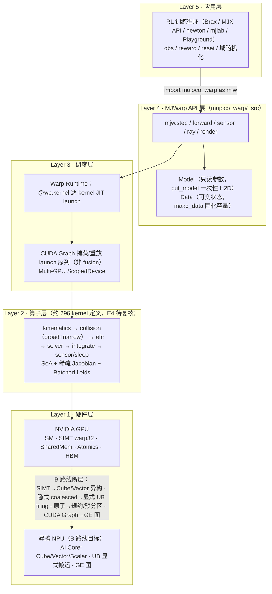
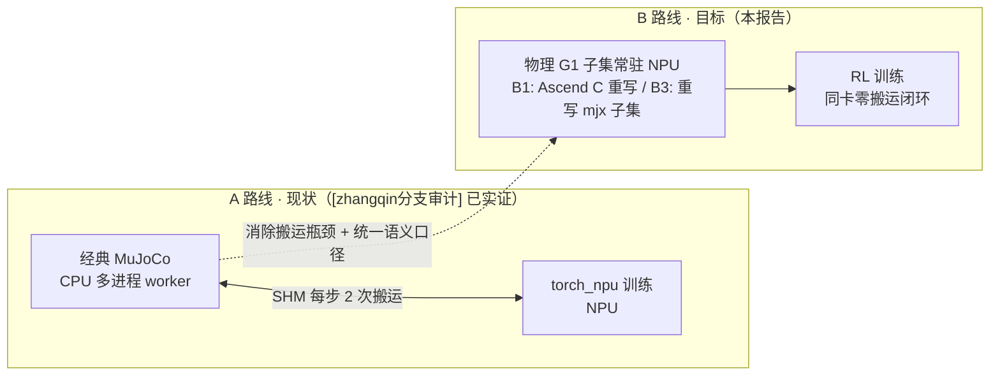

# MJWarp 物理核心子集迁移昇腾可行性研究与 PoC 路线

> **版本**: v1.4 — 2026-09-03（历史版本变更见文末修订记录；v1.4 含编辑性修订与两项后补：①源码实证升级——锚点 `7e4afee` 已克隆并完成六维统计，基线数字与全部摘录升级为 E1；②IMPLICITFAST 必查项结案——代码已实现、README 口径滞后，详见 §11.1/修订记录）
> **基准（锁定，已实证 E1）**: `google-deepmind/mujoco_warp` main@`7e4afee`（全量哈希 `7e4afee815a3…`，2026-09-02 提交，版本号 3.12.0，Warp 依赖 `warp-lang>=1.15`——2026-09-03 克隆实测），`MuJoCo` 版本以该 commit 的 pyproject 为准，昇腾侧以§19完整CANN矩阵为准
> **关联文档**: [A路线笔记] `GR00T-WholeBodyControl/docs/mujoco_npu_migration_notes.md` · [精度分析] `GR00T-WBC-alignment/docs/mujoco-vs-isaac-precision-analysis.md` · [SONIC原版解析] `SONIC原版训练体系深度解析.md` · [zhangqin分支审计] `SONIC_NPU适配深度报告_zhangqin分支.md` · 官方文档 `mujoco.readthedocs.io/en/latest/mjwarp/index.html`（正文引用一律用方括号缩写）
> **作者**: 架构组 · 适用对象: 需决策/执行“物理仿真 GPU → 昇腾 NPU”移植的架构师与一线工程师
> **证据等级**: E1 源码行号实证 · E2 配置实证 · E3 文档/逻辑推断 · E4 外审转述未复核（详见《00_总览》）
> **口径说明**: 上游基线已在锁定 commit 实测：`_src` 非测试 52,843 行、296 处 `@wp.kernel`（E1；外审值 5.28 万/296 与之吻合；定义数≠运行时launch数，launch 数仍需 event trace 区分）——该数字是**仓库总量**，不等同G1子集与PoC重写量（见执行摘要三行拆分）。凡标“估计/待核实/外审值待复核/E4”处不得直接用于立项承诺。
>
> **术语表**: SoA=Structure-of-Arrays（结构体数组转列存）；SPMD=单程序多数据；UB=Unified Buffer（昇腾向量核片上缓冲）；Cube/Vector/Scalar=昇腾AI Core三类计算单元（矩阵/向量/标量）；GE=Graph Engine（昇腾图编译器）；HCCL=华为集合通信库（对标NCCL）；`nworld/nconmax/njmax/nvmax`=并行世界数/每world接触上限/约束上限/激活DoF上限。

---

## 目录

**Part I · 上游架构解析（§2–§10）**

- [1. 执行摘要](#1-执行摘要)
- [2. 生态定位：经典 MuJoCo / MJX-JAX / MJWarp](#2-生态定位经典-mujoco--mjx-jax--mjwarp)
- [3. MJWarp 总体分层架构](#3-mjwarp-总体分层架构)
- [4. 核心数据结构重构：Model/Data 的 SoA 化设计](#4-核心数据结构重构modeldata-的-soa-化设计)
- [5. 编译与执行流水线](#5-编译与执行流水线)
- [6. 前向动力学流水线详解（顺序以event_trace为准）](#6-前向动力学流水线详解顺序以event_trace为准)
- [7. 大批量并行的实现机制：五大原理与定量分析](#7-大批量并行的实现机制五大原理与定量分析)
- [8. 性能与可扩展性设计](#8-性能与可扩展性设计)
- [9. 与经典 MuJoCo 的不一致（Sim2Real 风险）](#9-与经典-mujoco-的不一致sim2real-风险)
- [10. 昇腾 NPU vs NVIDIA GPU：硬件与软件栈对比](#10-昇腾-npu-vs-nvidia-gpu硬件与软件栈对比)

**Part II · 迁移方案（§11–§20）**

- [11. B 路线总览：核心子集上 NPU（B/B′）](#11-b-路线总览核心子集上-npubb)
- [12. 逐模块迁移难度矩阵（功能逻辑切分，非文件结构）](#12-逐模块迁移难度矩阵功能逻辑切分非文件结构)
- [13. 六大关键技术挑战（B 路线特有）](#13-六大关键技术挑战b-路线特有)
- [14. 技术路径对比（B 路线内部 B1/B2/B3 + 备选D）](#14-技术路径对比b-路线内部-b1b2b3--备选d)
- [15. 推荐方案详细设计（B1 原型）](#15-推荐方案详细设计b1-原型)
- [16. 工作分解 WBS（B1 裁剪版）](#16-工作分解-wbsb1-裁剪版)
- [17. 验证与对齐](#17-验证与对齐)
- [18. 风险与缓解](#18-风险与缓解)
- [19. 资源与时间表](#19-资源与时间表)
- [20. 结论与务实路径](#20-结论与务实路径)

**附录**

- [附录 A: 核心 API 与字段清单](#附录-a-核心-api-与字段清单)
- [附录 B: 参考资料](#附录-b-参考资料)
- [附录 C: 背景α表](#附录-c-背景α表mujocophysx非mjwarp–npu门禁)

---

## 1. 执行摘要

| 维度 | 结论 |
|---|---|
| **A 路线（现状基线，推荐先跑通）** | CPU 经典 MuJoCo 采样 + NPU `torch_npu` 训练；据 [A路线笔记] §1 记载已跑通 11000 iter / 单 NPU 1024 env（E4，运行 commit 与日志待附） |
| **B 路线（本报告，子集 PoC）** | 将 `mujoco_warp` 物理核心子集迁移至昇腾 NPU，`nworld` 量级纯 NPU 闭环、obs/action 不经 CPU |
| **核心矛盾** | `Warp = SIMT + CUDA + 显式线程 + 共享内存 + 原子操作`；昇腾 `Da Vinci = Cube/Vector/Scalar 异构 + 显式搬运（Global/L1/L0/UB）+ 算子图`。编程模型不兼容，无法“换编译开关” |
| **定量** | 尚无同机基准，本报告不给倍数结论；阈值由 P0 benchmark 后确定（§8/§11/§17） |
| **推荐** | 先保 A 路线交付；B/B′ 是否立项待 P0 benchmark 后确定，优先用 B3 做 PoC，并辅以 Ascend C 难点 kernel spike 作门禁（§14/§20） |

B 路线规模的三个口径（不可混用）：

- **上游物理源码总量**：外审值 `_src` 非测试约 5.28 万行 / 约 296 kernel 定义（kernel：GPU 并行函数；launch：单次 kernel 调度发射，定义数≠运行时 launch 数；main@`7e4afee`，E4 待 P0 复核）。
- **G1 运行时涉及模块**：待 event_trace（`mjwarp-testspeed --event_trace` 输出的逐 kernel 运行时事件序列）与调用闭包统计。
- **本 PoC（Proof of Concept，概念验证原型）需要重写规模**：待定（P0 后给出）。

> A 路线“无需改物理引擎”指不改引擎源码；其 MDP 语义非等价清单（jm/jh、PD 参数、观测噪声缺失等）见 [zhangqin分支审计] §2。11000 iter ≈ 原版 100k iter 目标的 11%（[SONIC原版解析] §5）。

---

# Part I · 上游架构解析（§2–§10）

## 2. 生态定位：经典 MuJoCo / MJX-JAX / MJWarp

三者共享模型语义，但不共享代码实现（[A路线笔记] §3）：三者同以 MJCF（MuJoCo 的 XML 场景描述格式）或 MjSpec（MuJoCo 的 Python 建模接口）为前端；经典 MuJoCo 是 C 实现的刚体动力学仿真引擎，MJX（MuJoCo XLA）与 MJWarp（MuJoCo Warp）分别是基于 JAX 与 Warp 的后端重写。下图回答"同一份模型描述经哪条链路编译/重写、落到哪类硬件"：

```text
MJCF XML / MjSpec (Python)
      │
      ├─► mjModel (经典, CPU, float64, 指针+变长) ──► mj_step()  C 10万行
      │
      ├─► mjx.Model (JAX, pytrees, float32) ──► jax.jit/vmap ──► XLA ──► GPU/TPU
      │
      └─► mjw.Model (Warp, SoA + batch, float32) ──► Warp JIT ──► PTX ──► NVIDIA GPU
```

**图的读法**：顶部 MJCF XML / MjSpec 是统一前端（模型场景的描述格式与建模接口）；其下三条分支即三套互不共享代码的后端——左支经典 MuJoCo（C 实现，CPU，float64，指针+变长的 AoS 布局，`mj_step()` 约 10 万行）；中支 MJX（JAX，pytrees，float32，经 `jax.jit/vmap` 由 XLA 编译到 GPU/TPU）；右支 MJWarp（Warp，SoA + batch，float32，经 Warp JIT 编译为 PTX 落 NVIDIA GPU）。所有箭头均为"模型描述 → 编译/重写 → 目标硬件"的同一流向，无其他语义。阅读主线：自上而下逐支读两级标注（实现语言与数据布局 → 编译链与目标硬件），再横向对照三支在精度与硬件上的分野；后续 §4 的 SoA 重构即发生在右支。图内缩写：AoS=Array-of-Structures（结构体数组行存）；pytrees=JAX 的嵌套树状数据容器；jit=即时编译；vmap=向量化批映射；XLA=JAX 底层的线性代数编译器；PTX=NVIDIA 虚拟指令集中间表示；SoA=Structure-of-Arrays（列存）。

| 特性 | 经典 `mujoco` | `mjx` (MJX-JAX) | `mjwarp` (MJWarp/Warp) |
|---|---|---|---|
| 实现语言 | C | Python/JAX | Python/Warp |
| 数据布局 | `AoS` + 指针 + 变长 | `pytrees` 固定 shape | `SoA` + 固定 shape `mujoco_warp/_src/types.py` |
| 并行原语 | `mujoco.rollout` 多线程 | `jax.vmap / pmap` | `nworld` batch 维，`wp.tid()` |
| 目标硬件 | CPU（延迟最优） | GPU/TPU（XLA） | NVIDIA GPU（快速仿真；支持 CPU 用于开发调试） |
| 浮点 | `float64` | `float32` | `float32` |
| 可微 | 否 | 是（XLA 自动微分） | 否（Issue #500 跟踪中） |
| 吞吐（趋势，非承诺） | CPU多线程，随核数线性 | GPU/TPU批量显著高于CPU | 复杂场景扩展性好于mjx（估计，待实测） |
| 官方建议 | 低延迟/实时控制 `mjwarp/index.html#low-latency` | TPU/可微 | 大批量 + PyTorch `mjwarp/index.html#when-to-use` |

> **关键认知**：`mjwarp.step` 是 `mj_step` 的**重实现**，不是把 `mj_step` 编译到 GPU——对应图中右支独立成链、不经左支（[A路线笔记] §6.1“同一物理目标的三套实现”）。精确吞吐需同XML同`nworld`实测，禁止引用本表做立项承诺。

### 2.1 适用场景（官方 when-to-use 定义）

官方给出三类适用场景（`mjwarp/index.html#when-to-use-mjwarp`）：

- **高吞吐**：RL（强化学习）需要海量 `env_steps/s`，可容忍 `host↔device` 搬运瓶颈时，`mjwarp` 在复杂场景（多 geom、高自由度 DoF）比 `mjx` 扩展性更好。
- **低延迟**：单步延迟 `mjwarp > mujoco`，MPC（模型预测控制）/ 遥操作仍用经典。
- **复杂场景**：支持 `sleeping islands` + `compact solver`，单链 >60 DoF 仍是瓶颈，正在优化中。

---

## 3. MJWarp 总体分层架构

下图回答“RL 训练中的一步仿真从应用落到硬件经过哪几层、GPU→NPU 的断层具体断在哪”：



**图的读法**：五层自上而下——Layer 5 应用层：RL 训练循环（Brax / newton / mjlab / Playground 为 MJX 生态的四个上层框架），产出 obs / reward / reset 与域随机化；Layer 4 API 层：`mjw.step` 等入口，持有 Model（只读参数，`put_model` 一次性 H2D）与 Data（可变状态，`make_data` 固化容量）两类数据对象；Layer 3 调度层：Warp Runtime 逐 kernel JIT 发射，CUDA Graph 捕获/重放 launch 序列（非 fusion），Multi-GPU 由 ScopedDevice 管理；Layer 2 算子层：约 296 个 kernel 定义（E4 待复核），按 kinematics→collision→efc→solver→integrate→sensor/sleep 流水线组织；Layer 1 硬件层：左 NVIDIA GPU，右昇腾 NPU（B 路线目标）。实线箭头是调用/数据的向下流向：应用调 API → API 依赖 Model/Data 并走调度 → 调度发射 kernel → kernel 落硬件；**GPU→NPU 虚线不是数据流，是迁移断层标注**，其上四个短语即四条断裂点（SIMT→异构计算单元、隐式合并访问→显式 UB tiling、原子操作→规约/预分区、CUDA Graph→GE 图），展开见 §13.1（编程模型与原子改写）、§13.2（UB tiling）、§13.6 与 §15（图机制与后端选型）。阅读主线：自上而下走一遍实线主链，最后落在虚线——虚线上的四个词即 B 路线要填的沟壑。图内缩写：RL=强化学习；SM=Streaming Multiprocessor（GPU 流式多处理器）；SIMT=单指令多线程，warp32=32 线程锁步束；SharedMem=片上共享内存；Atomics=原子操作；HBM=高带宽显存；UB=Unified Buffer（昇腾向量核片上缓冲）；GE=Graph Engine（昇腾图编译器）；efc=MuJoCo 约束数据前缀；broad+narrow=碰撞粗筛+精算。

源码规模基线（2026-09-03 在锁定 commit 实测，E1）：`_src` 非测试 **34 文件共 52,843 行、296 处 `@wp.kernel`**，测试另计 25,829 行（定义数≠运行时 launch 数）。六维统计中①–⑤已完成、⑥（event_trace）需 GPU 环境，明细见 §16.1。

> **v1.4 锚点实证（E1，2026-09-03 克隆）**：github 直连恢复后按锁定 commit `7e4afee` 检出并完成六维统计——非测试 **52,843 行 / 296 kernels / 34 文件**，与外审值（5.28 万 / 296）吻合，基线从 E4 升级为 E1。文件清单实证：外审提示的 `smooth.py` / `collision_driver.py` / `collision_convex.py` / `island.py` / `sleep.py` / `block_cholesky.py` 全部存在，另有 `collision_gjk.py`（GJK/EPA 独立成文件）、`collision_primitive.py`+`collision_primitive_core.py`、`constraint.py`(178KB，最大)、`solver.py`、`types.py`、`io.py`、`forward.py`、`set_const.py`。**摘录口径已对齐锚点**：本报告全部源码摘录（§4/§5/§13/附录 A）已逐块在 `7e4afee` 复核——`_add_geom_pair`、`solve` 分发、`block_cholesky` 工厂、types 声明、`step1/step2`、`make_data` 签名与此前 PyPI 3.12.0 wheel 版逐字一致（仅行号漂移，已按锚点修正）；唯一实质差异为 GJK 收敛判据（§13.4 已换锚点版）。旧版 `kinematics.py / integrator.py / flex.py` 文件结构推断已作废（见修订记录）。本地留存：`./mujoco_warp/`（锚点检出）与 `./mujoco_warp-3.12.0-src/`（wheel 旁证，内容差约两周演进：types/forward/gjk/io 有改动，collision_driver/block_cholesky 零差异）。

---

## 4. 核心数据结构重构：Model/Data 的 SoA 化设计

### 4.1 从 AoS 指针到 SoA 固定 Shape：四条重构原则

经典 `mjModel` 是 C 结构体含指针与变长数组（§2 图左支标注的“AoS + 指针 + 变长”）。MJWarp做法是**运行时预分配、容量固定、shape稳定**（非“编译时定长”）：`make_data`时按`nworld/nconmax/njmax`固化容量，后续shape不变，重构三原则：

**1. SoA（Structure-of-Arrays）**

经典：`struct Body { vec3 pos; quat quat; } body[nbody]`
Warp：

```python
body_pos: wp.array2d[vec3f]  # 逻辑shape (nworld, nbody)，每个元素本身是vec3
body_quat: wp.array2d[quatf] # 逻辑shape (nworld, nbody)，每个元素本身是quat
body_mass: wp.array2d[float32]
# ... 200+ 字段全拆列，合并访问（coalesced）
```

真实声明语法（`types.py`，E1）——batch 维写作 `"*"`，world 维显式命名：

```python
# 【源码摘录】types.py（main@`7e4afee`，声明位于 :1600/:2295；"→"注释为本报告所加）
# Model 侧（只读参数）：
body_pos:  array("*", "nbody", wp.vec3)    # → 首维 "*" = 可 batch 化的模型参数（§4.1 原理2：域随机化）
body_quat: array("*", "nbody", wp.quat)
key_qpos:  array("nkey", "nq", float)
# Data 侧（可变状态）：
qpos: array("nworld", "nq", float)        # → 首维固定为 nworld：每个 env 一份完整状态
qvel: array("nworld", "nv", float)
```

**2. Batch 前导维**

几乎所有可变字段加 `[*]` batch 维 `mujoco_warp/mjwarp/api.html#Model`。默认 `batch=1` 广播到所有 world，可通过 `batch_sizes` 做域随机化（domain randomization：训练中随机化质量/摩擦等物理参数以提升策略鲁棒性）`mjwarp/index.html#batched-model-fields`：

```python
m = mjw.put_model(mjm, batch_sizes={"dof_damping": 4096})
m.dof_damping.assign(np.array([[0.1], [0.2], ...], dtype=float))
# 访存语义: field[worldid % field.shape[0]]
```

**3. 稀疏化**

`efc`（MuJoCo 约束数据统一前缀）相关的 Jacobian（雅可比矩阵：约束方向对各广义坐标的偏导）字段——`efc.J`、`flexedge_J`、`ten_J`、`actuator_moment`——仅存非零 + `colind`。稀疏化后 `efc.J` 从稠密 `njmax×nv` 的 408 MB 降到 84 MB（-4×，`mjwarp/index.html#memory` 末尾）。

**4. 静态容量预分配**

`nworld, nconmax / naconmax, njmax, nccdmax / naccdmax, nvmax` 在 `make_data` 时固化，超限 → `Data.overflow` bitmask `mjwarp/index.html#overflow-detection`。无 `malloc`，无变长。（注：`contact_sensor_max_match` 是 `Option` 属性而非 `make_data` 参数，官方签名见附录 A。）

| 字段类 | 示例 | Shape | batch 语义 |
|---|---|---|---|
| 标量 | `nq / nv / nbody` | `int` | 全局 |
| 每 body | `body_mass` | `(1, nbody) → (nworld, nbody)` | `worldid % batch` |
| 每 dof / 每 qpos | `dof_damping` 为 `(1, nv)`；`qpos0` 为 `(1, nq)`（含四元数关节时 nq≠nv） | `(1, nv)` / `(1, nq)` | 同上 |
| 每 geom | `geom_pos / geom_size` | `(1, ngeom, 3)` | 同上 |
| 每 sensor | `sensordata` | `(nworld, nsensordata)` | 每 world |

### 4.2 Model vs Data 职责

Model 与 Data 即 §3 图中 Layer 4 的两个同名节点，职责相反：

- **Model**：只读参数（来自 XML 编译），建图后常驻 GPU，`put_model` 一次性 H2D（host 到 device 的单向搬运）。
- **Data**：可变状态 `qpos / qvel / qacc / xpos / contact / efc / qfrc_*`，每 world 独立，`make_data` 分配所有 batch buffer + solver workspace。支持 `wp.copy(d.qvel, ...)` 初始化。

异构 mesh 需手写 per-world `geom_dataid / geom_size / body_mass / ...` 共 11 字段循环赋值 `mjwarp/index.html#per-world-meshes`（文档给出 3 页示例代码）。

### 4.3 与 `mujoco.mjx` 的本质区别

- `mjx` 用 `jax.Array` + `vmap` 语义，依赖 `XLA` 编译整图（§2 图中支；JAX：Google 的可微分、可 JIT 编译的 Python 数值计算框架；XLA：Accelerated Linear Algebra，JAX 底层的线性代数编译器）。
- `mjwarp` 用 `warp.array` + 显式 `worldid = wp.tid()` 索引，依赖 `Warp JIT` 逐 kernel 编译（§2 图右支）。

后者对 PyTorch 更友好，但与 XLA 不互通，这直接决定 NPU 两条路径的难度分野（见§14）。

---

## 5. 编译与执行流水线

### 5.1 Warp DSL → CUDA

Warp 是 NVIDIA 的 Python 嵌入式 DSL（领域专用语言），把 Python 写的 kernel 即时编译（JIT）为 CUDA：

```python
# 【源码摘录】collision_driver.py:338-373 _add_geom_pair（main@`7e4afee`；"→"注释为本报告所加）
# —— collision → contact 的原子预约写入：§13.1 迁移最痛的机制，真实形态如下
@wp.func
def _add_geom_pair(
  geom_type: wp.array[int],            # → SoA：几何类型列（Model，只读）
  nxn_pairid: wp.array[wp.vec2i],
  naconmax_in: int,                    # → 固定容量：make_data 时固化（§4.1 原理4）
  geom1: int, geom2: int,
  worldid: int, nxnid: int,
  ncollision_out: wp.array[int],       # → 计数器（Data，可变）
  collision_pair_out: wp.array[wp.vec2i],
  collision_pairid_out: wp.array[wp.vec2i],
  collision_worldid_out: wp.array[int],
):
  pairid = wp.atomic_add(ncollision_out, 0, 1)   # → 原子预约写入位：谁先到谁占坑，顺序不定但无竞争
  if pairid >= naconmax_in:                       # → 容量检查：超限直接丢弃（overflow 语义，§8.1）
    return
  type1 = geom_type[geom1]; type2 = geom_type[geom2]
  if type1 > type2:
    pair = wp.vec2i(geom2, geom1)                 # → 规范化排序：保证 (g1,g2) 与 (g2,g1) 写出一致
  else:
    pair = wp.vec2i(geom1, geom2)
  collision_pair_out[pairid] = pair               # → 写 SoA 列：同字段跨 pair 连续存放 → coalesced（§7 原理4）
  collision_pairid_out[pairid] = nxn_pairid[nxnid]
  collision_worldid_out[pairid] = worldid
```

对比要点：world/pair 坐标、SoA 列写、原子预约、容量截断——§7 五大原理中四项在这一段同框。tid 线性解码在其调用方（broadphase/narrowphase driver kernel，即碰撞粗筛/精算阶段：粗筛先用包围盒排除大部分不相交对，窄相对候选对精确求交）中完成；NPU 侧如何改写它见 §13.1。

`wp.launch(kernel, dim=nworld * npair)` 的编译流程：`Python AST → CUDA C → PTX → cubin`（PTX：NVIDIA 虚拟指令集中间表示；cubin：具体架构的 GPU 机器码二进制），产物缓存到 `~/.cache/warp`。首次 `mjw.step` 编译，后续复用。注意：`kinematics` 类阶段不写 `ncon`，不要以其举例原子。

### 5.2 step() 的图调度

`mjw.step(m, d)` 不是单 kernel，而是多个kernel launch按序组成（具体launch数以`--event_trace`为准；kernel**定义数**≠运行时launch数）。

```
kinematics → tendon/actuator → collision(broad+narrow) → make_constraint(efc) → solver → integrate → sensor/sleep
```

```python
# 【源码摘录】forward.py:1412-1462（main@`7e4afee`；"→"注释为本报告所加）
def step(m: Model, d: Data):
  """Advance simulation."""
  forward(m, d)                                   # → forward = 完整前向动力学（下面 step1/step2 的单段版）
  if m.opt.integrator == IntegratorType.EULER:
    euler(m, d)
  elif m.opt.integrator == IntegratorType.RK4:
    rungekutta4(m, d)
  elif m.opt.integrator in (IntegratorType.IMPLICITFAST, IntegratorType.IMPLICIT):
    implicit(m, d)                                # → 锁定基线已实现 implicit（forward.py:595，§11.1 已核）
  else:
    raise NotImplementedError(f"integrator {m.opt.integrator} not implemented.")

@event_scope
def step1(m: Model, d: Data):
  """Advance simulation in two phases: before input is set by user."""
  fwd_position(m, d); d.sensordata.zero_(); sensor.sensor_pos(m, d)
  _energy_pos(m, d)
  fwd_velocity(m, d); sensor.sensor_vel(m, d)
  _energy_vel(m, d)
  if not (m.opt.disableflags & DisableBit.ACTUATION):
    if m.callback.control:
      m.callback.control(m, d)                    # → 用户控制回调的插入点：图捕获时 ctrl 在两段之间写入

@event_scope
def step2(m: Model, d: Data):
  """Advance simulation in two phases: after input is set by user."""
  fwd_actuation(m, d); fwd_acceleration(m, d)
  solver.solve(m, d)                              # → 求解器分发（真实多路径见 §13.3）
  sensor.sensor_acc(m, d)
  if m.opt.integrator in (IntegratorType.IMPLICITFAST, IntegratorType.IMPLICIT):
    implicit(m, d)
  else:
    euler(m, d)                                   # → note: RK4 defaults to Euler（源码原注）
```

`step1/step2` 的两段式切分专为图捕获设计：action 写入点固定在两段之间，RL 循环可以只捕获一次 `step2`（或整体）并在段间注入 `ctrl`，这是 `mjwarp/index.html#graph-capture` 与 §7 原理3 的源码依据。

Warp 提供两种执行模式 `mjwarp/index.html#graph-capture`：

- **Eager**：每步逐个 `launch` 到同一stream，stream内异步顺序执行（非每kernel间`synchronize`）；开销主要在launch本身。
- **GraphCapture（推荐）**：`ScopedCapture`捕获launch序列为CUDA Graph（即 §3 图 Layer 3 的 CUDA Graph 节点；NVIDIA 的 kernel 序列录制-重放机制，一次提交整段 launch 以摊薄调度开销），后续`capture_launch`重放该序列。**这是launch序列的捕获/重放，不是kernel fusion（不合成一个大kernel）**，加速来自省去重复launch开销：

```python
with wp.ScopedCapture() as cap:
    mjw.step(m, d)
wp.capture_launch(cap.graph)  # 重放已捕获的launch序列
```

RL 循环中每步仅 `capture_launch`，无需重复编译。NPU侧是否有等价机制需按§15后端选型验证，不默认存在。

### 5.3 多 GPU：ScopedDevice 独立上下文与手动分发

`wp.ScopedDevice(device)` 每卡独立 `Model / Data / graph`，手动 `capture_launch` 分发，无自动 `pmap` `mjwarp/index.html#multi-gpu`。

### 5.4 CPU-GPU 每步零同步（除 overflow 周期检查）：吞吐优势的来源

`Data` 全在 HBM（高带宽显存），`obs = d.qpos` 是 `wp.array` 可通过 Warp互操作（`dlpack` / `__cuda_array_interface__` / `wp.to_torch`，具体以Warp版本为准）零拷贝给 `torch`（CUDA），`action → d.ctrl` 也是设备直写。`mujoco.rollout` 的 `host↔device` 搬运瓶颈被消除，这正是吞吐优势的来源。若 NPU 退化为每步 `NPU→CPU→NPU` 搬运，优势清零（[A路线笔记] §9.7）。

---

## 6. 前向动力学流水线详解（顺序以event_trace为准）

> 以下为基于官方文档的逻辑顺序，真实kernel切分与顺序需 `mjwarp-testspeed --event_trace` 核对。`Sleep`（休眠：低速/静止的树被标记后跳过其求解）与 `island`（独立运动岛：互不接触、可独立求解的刚体连通子集）贯穿 `broadphase` 与 `solver`（非独立尾阶段），`compact` 是solver变体。

| 阶段 | Warp kernel(s)（示意） | 计算内容 | 并行度 | 备注 |
|---|---|---|---|---|
| **1. Kinematics** | `kinematics`, `com_pos` | `xpos/xquat/xmat` 前向运动学，`crb` 复合刚体惯量，`qfrc_bias`（重力+科氏+离心） | `nworld × nbody` | 树状并行，`nv>60` 有发散 |
| **2. Tendon / Transmission / Actuator** | `tendon`, `actuator` | 肌腱长度/传动比，`actuator_moment` 稀疏装配 | `nworld × ntendon` | 稀疏 Jacobian |
| **3. Collision Broadphase** | `broadphase` | AABB / SAP 粗筛 `ngeom² → candidate`（受sleep过滤） | `nworld × ngeom` | `nconmax` 直接决定内存 |
| **4. Collision Narrowphase** | 以P0 trace为准 | 三条路径分开（不合写）：MuJoCo C为经典CPU碰撞实现；MJX-JAX为branchless SAT等路径；MJWarp为primitive + GJK/EPA。具体pair以`computation#contact`表+源码trace为准 | `nworld × npair` | `CCD vs primitive`，`mjwarp/index.html#memory`：`PLANE<>MESH` 4 vs 3 |
| **5. Flex** | `flex` | 软体 / 布料（experimental，一期可裁） | `nworld × nflex` | 非人形刚体必需 |
| **6. Make Constraint (efc)** | `make_efc` | 将 contact / limit / equality / tendon转为 `efc_J, efc_pos, efc_margin, solref/solimp` | `nworld × nefc` | `njmax` 硬截断 |
| **7. Solver Setup** | `solver_setup`（sparse/dense/compact多路径，G1走哪条以trace为准） | 按实际路径组装约束矩阵并做分解准备 | `nworld` tile | Cube是否值得用待G1 trace后定（见§13.3） |
| **8. Solver Iterate** | `solver_iter (Newton)` | 迭代 `iterations / ls_iterations`，EarlyExit `mjwarp/index.html#solver-iterations` | `nworld × njmax` | 收敛后跳出，参数敏感度低于mjx；收敛率纳入§17验收 |
| **9. Integrate** | `integrate (Euler)` | `qvel += qacc·dt; qpos += qvel·dt` | `nworld × nv` | `IMPLICITFAST` 代码已实现（§11.1 注），README 口径滞后 |
| **10. Sensor** | `sensor` | `qpos / qvel / force / touch` | `nworld × nsensor` | `contact_sensor_max_match` |
| **11. Sleep更新** | `sleep` | 更新island动/静状态，供下一步broadphase/solver跳过 | `nworld × ntree` | 非尾阶段，贯穿循环 |

> 表内术语：primitive 碰撞指解析几何体（平面/球/胶囊等）间的闭式求交；CCD（Continuous Collision Detection，连续碰撞检测）弥补离散步长下的高速穿透；粗筛 broadphase 常用 AABB（轴对齐包围盒）/ SAP（sweep and prune，扫掠剪枝）；求解器 Newton（牛顿法，利用二阶 Hessian 近似迭代）与 CG（共轭梯度法）可用，PGS（Projected Gauss-Seidel，投影高斯-赛德尔迭代）暂不支持（§11.1）；EarlyExit 指迭代收敛后提前退出剩余循环；IMPLICITFAST（MuJoCo 的隐式积分器，对阻尼等项做隐式处理以放宽步长）暂不支持（版本注记见 §11.1）。

**Compact Solver**（紧凑求解器，solver变体非独立阶段，`mjwarp/index.html#large-scenes`）：对 >100 DoF场景（如Aloha 136DoF），先算active岛（island 压缩）→ `compact nvmax=64` → 固定tile `Cholesky`（切洛茨基分解：对称正定矩阵的三角分解）→ `scatter`（散写回原 DoF 位置），避免发散。官方稀疏示例：`efc.J`稠密408MB→稀疏84MB（2048 worlds, njmax=384）。

**开销**：全阶段 `Other memory`（CCD + Jacobian workspace）常超 `Model/Data` 本身，`mjwarp-testspeed --memory` 可观测。内存估算见§8公式。

---

## 7. 大批量并行的实现机制：五大原理与定量分析

| 原理 | 实现 | 定量（趋势，待实测） | NPU 映射难度 |
|---|---|---|---|
| **1. 环境独立 SPMD** | `tid解码为(world,pair/body)`，无 world 间通信 | world数越多并行度越高，仅受SM/显存限 | NPU 非 SIMT，需改数据并行模型 |
| **2. 固定容量 + 稳定 shape** | `nconmax × njmax × nvmax` 由 `make_data` 运行时固化（非编译期定长） | shape 稳定利于寄存器/内存规划；但控制流仍有动态行为（overflow、EarlyExit、迭代收敛差异），不能说“无动态分支” | NPU 也需静态容量，但 tiling 更敏感 |
| **3. 图捕获 + 重放** | 多launch捕获为1 graph重放（非fusion） | launch开销显著降低（待`event_trace`实测，不给百分比） | Ascend `Graph Mode` 是否等价待§15验证，算子需注册 |
| **4. 合并访问（SoA + coalesced）** | `body_pos[world, body]` 连续 | 带宽利用显著高于经典AoS（待`ncu`实测，禁止引用绝对%） | NPU 需显式 `UB` tiling，非自动 |
| **5. 设备常驻零拷贝** | `Model/Data` 常驻 HBM，PyTorch 经互操作 | `host↔device` 0 次/步 vs 经典每步搬运（趋势） | NPU 若走 `CPU SHM` 则每步 2 次搬运（[A路线笔记] §9.7） |

> 同模型单环境：`mjwarp` 单步延迟通常劣于经典（graph + launch开销）`mjwarp/index.html#low-latency`。批量后 `env_steps/s` 才反超，具体倍数以实测为准。

---

## 8. 性能与可扩展性设计

### 8.1 调优要点

- **Memory 线性因子**：`multiccd > ccd > primitive`，`ccd_iterations`，`mesh verts/faces/edges` `mjwarp/index.html#memory`。
- **Solver EarlyExit**：Newton 收敛后跳出，故 `iterations` 对 `mjwarp` 影响小于 `mjx` `mjwarp/index.html#solver-iterations`。
- **Sleeping**：`sleep_tolerance` 调大更快休眠，`tree_asleep` 初始化 `mjwarp/index.html#large-scenes`。
- **Overflow 三件套** `mjwarp/index.html#overflow-detection`：`warn_overflow` 开 `printf` 会串行化（慢），`d.overflow.numpy()` 是 device-to-host（D2H）同步，RL 中应周期性而非每步检查。
- **Batched DR**：每字段可异 batch，模取数 `field[world % batch]` 实现无需逐步H2D更新（非“零成本”：取模与额外带宽仍有开销，P0需实测）。
- **nconmax / njmax / nccdmax / nvmax调优**：`mjwarp-testspeed --measure_alloc --overflow_behavior=error --memory` 迭代试错 `mjwarp/index.html#batch-sizes`。`nccdmax/naccdmax` 可小于`nconmax/naconmax`以省CCD内存。

### 8.2 内存估算（HBM 初筛 + per-kernel UB 模型）

HBM容量初筛（系数待实测校准，仅用于判断nworld/nconmax/njmax是否放得下，不推导UB tile数）：

```text
mem_contact ≈ nworld * nconmax * sizeof(Contact)   # 实测以--memory为准
mem_efc     ≈ nworld * njmax * (sizeof(efc_row) + 稀疏按nnz)
mem_ccd     ≈ nworld * nccdmax * ccd_workspace(ccd_iterations, mesh复杂度)
total ≈ mem_contact + mem_efc + mem_ccd + Model常驻
```

per-kernel UB live-set模型（live-set：单个 kernel 执行期间同时存活的输入/输出/临时数据集合；替代“total/UB=tile数”粗糙算法）：对每个kernel分别计算同时存活的输入 + 输出 + 临时张量 + 队列深度 + 双缓冲 + 对齐，再推导该kernel的tile切分（tiling：按片上缓冲容量把数据切成固定小块）与是否需要double buffer（双缓冲：读写两块轮流，用计算掩盖搬运延迟）。P0需输出humanoid/G1两档 `--memory` 实数，并对G1子集的top-k kernel逐个建live-set表。

复现命令：

```bash
mjwarp-testspeed benchmarks/humanoid/humanoid.xml --memory --measure_alloc --overflow_behavior=error --event_trace
mjwarp-testspeed benchmarks/unitree_g1/scene_flat.xml --memory --measure_alloc  # 旧路径 unitree_g1_flat.xml 已作废，勿用
```

---

## 9. 与经典 MuJoCo 的不一致（Sim2Real 风险）

**同 XML 不保证同轨迹**（[A路线笔记] §6）——这是 Sim2Real（仿真训练的策略迁移到真机的落差）层面的核心风险：

- `float64 vs float32` 舍入累积。
- 碰撞算法不同：MuJoCo C为经典CPU实现；MJX-JAX为branchless SAT等路径；MJWarp为primitive + GJK/EPA（三者分开，P0以源码trace为准）。
- 求解器 `warm-start`（热启动：以上一步解为迭代初值）/ 分解阈值 / 接触容量细节不同。
- GPU 原子归约非确定性。

浮基人形 `per-step drift α`（α：每步轨迹漂移量，m/步，衡量长时程仿真精度）背景见附录C（经典 MuJoCo vs Isaac PhysX，非mjwarp，不作MJWarp–NPU门禁）。这决定 B 路线验证**不能逐位比对**，只能统计一致。

| 比较层次 | 一致性预期 |
|---|---|
| MJCF/XML 参数及主要物理语义 | 大部分一致 |
| 相同状态和 action 下的单步结果 | 通常接近，但不保证逐位相同 |
| 长时间 rollout 轨迹 | 不保证一致，接触密集任务尤其易分离 |

---

## 10. 昇腾 NPU vs NVIDIA GPU：硬件与软件栈对比

| 维度 | NVIDIA GPU（Warp 目标） | 昇腾 NPU（以 §19 矩阵锁定 SoC 为准） |
|---|---|---|
| **计算单元** | SM（每SM CUDA Core数随架构而异）SIMT warp32 | `AI Core: Cube + Vector + Scalar` 异构（具体规格以CANN为准） |
| **执行模型** | 线程束 `tid / blockDim`，`__syncthreads`，`atomicAdd` | Ascend C官方有SPMD术语与产品相关原子操作（见Ascend C编程术语/Atomic API）；与CUDA不是一一对应，能力/数据类型/性能**需按目标SoC验证**，不可直译`wp.tid()/atomic/syncthreads` |
| **内存** | HBM + SharedMem + Register | HBM + L2 + L1 + L0 + UB 显式搬运（大小待核实，P0以`msprof`+手册为准） |
| **编程** | CUDA C / Warp Python JIT | Ascend C / 图模式（GE/TorchAir）；TBE/AKG与JAX-on-Ascend在本次检索的官方稳定方案中尚未确认，P0按§19矩阵复核后再定选型 |
| **编译** | `nvcc / ptx`, Warp JIT cache | `Ascend C编译器 + CANN GE图编译`，AOT 为主 |
| **通信** | `NCCL` | `HCCL`，多进程建议`spawn/forkserver`且worker不import NPU（[A路线笔记] §9.9） |
| **生态** | Warp, PyTorch CUDA, JAX | `torch_npu, MindSpore, CANN`（JAX-on-Ascend在本次检索中尚未确认，见§14 B3，P0复核） |
| **精度偏好** | `float32` 通吃 | `Cube`偏低精度，`Vector`跑`float32`；具体以SoC手册为准，默认按Vector fp32规划 |

> 一句话：GPU 是“同 kernel 跑多 world”（SIMT：单指令多线程，线程束锁步执行），NPU 是“算子切 tile 搬运计算”。昇腾侧能力按 SoC 验证、不作绝对判断；NPU kernel 调试手段以 CANN（华为昇腾异构计算架构，含编译器/运行时/算子库）/ msprof（昇腾性能剖析工具）为准；TBE/AKG（昇腾两种算子开发/自动生成工具链：Tensor Boost Engine 与 Auto Kernel Generator）选型待 P0 复核（§14 B2）。

---

# Part II · 迁移方案（§11–§20）

## 11. B 路线总览：核心子集上 NPU

**当前基线（A 路线现状，与 [zhangqin分支审计] 互链）**：A 路线即该分支审计的“CPU MuJoCo × NPU”主路径——每步经 SHM（shared memory，跨进程共享内存）边界发生 NPU→CPU action 与 CPU→NPU obs 两次搬运（其 §3.3，非 zero-copy），并存在六项 MDP 语义非等价与 fork 安全问题（其 §1.1/§2）。**B 路线要消除的正是这两类问题**：物理常驻 NPU 消除搬运，子集重写统一语义口径。下图回答“A/B 两路线每步数据各走什么路径、差别在哪”：



**图的读法**：左框 A 路线（现状，[zhangqin分支审计] 已实证）：经典 MuJoCo 以 CPU 多进程 worker 运行，torch_npu 训练在 NPU，双向实线箭头表示每步经 SHM 边界往返两次搬运（NPU→CPU 送 action、CPU→NPU 回 obs）——吞吐与 MDP 语义两类问题的共同来源。右框 B 路线（目标，本报告）：物理 G1 子集常驻 NPU（B1=Ascend C 逐 kernel 重写，B3=框架重写 mjx 子集，见 §14），与 RL 训练构成同卡闭环，实线箭头是设备内数据流，不经 CPU。两框之间的虚线**不是数据流**，是“A 到 B 的演进目标”关系，其标注即 B 路线的两条立项理由。阅读主线：先看左框双向箭头（现状每步 2 次搬运），再看右框单向闭环（目标零搬运），最后读虚线=两框之间要跨的差距。图内缩写：SHM=shared memory（跨进程共享内存）；torch_npu=华为官方 PyTorch 昇腾适配插件；G1=Unitree G1 人形机器人基准场景；RL=强化学习；B1/B3=B 路线内部两条技术路径（§14）。

**定义**：产出 `mujoco_ascend` 子集（对标 `mujoco_warp` main@`7e4afee` 的G1实际子集，非全量），提供语义兼容的 `step / Model / Data / put_model / make_data`，`nworld` 量级纯NPU内闭环，`obs / action` 不经 CPU（即图中右框 BNPU→RL2 的同卡闭环）。注意：不是`import`零改——`wp.array`类型层需适配，仅保持函数/字段语义一致。

**B vs B′**（二者均为图中右框的常驻形态，差别在是否允许 CPU 回退）：

- **B：纯NPU**：全程无CPU fallback；出现CPU回退即PoC失败，用于验证可行性上限。
- **B′：NPU主路径 + CPU fallback（如CCD/mesh）**：允许回退，但必须单独计算每次同步的H2D/D2H量、延迟与吞吐损失，§16 P4/P6分别立项。

**非目标**：不做单环境低延迟优化，不做渲染/ray/BVH（bounding volume hierarchy，层次包围盒加速结构；独立项目）。

**成功标准**（维度列表；**度量口径统一见 §17**，≥3 seeds）：性能（冷启动编译 / 稳态 `env_steps/s` / step 延迟 P50/P95，纯仿真与端到端 PPO（近端策略优化，主流 RL 策略梯度算法）分计）· 资源（HBM/workspace/CPU/功耗）· 正确性（overflow/NaN/收敛率）· 物理一致（接触集合匹配 + 短 rollout 统计一致，非逐位）· 统计（≥3 seeds + 置信区间）。G1 场景以 `benchmarks/unitree_g1/scene_flat.xml` 为准（旧路径 `unitree_g1_flat.xml` 已作废）。

### 11.1 裁剪范围：Feature Parity（来源 README#compatibility）

| 特性 | mjwarp 状态 | B1 影响 |
|---|---|---|
| Integrator `IMPLICITFAST` | README#compatibility 仍标 not supported，但**锁定基线代码已实现**（E1，2026-09-03 核）：`implicit()` 完整路径在 `forward.py:595`（`deriv_smooth_vel → map_m2d → deriv_rne_vel → factor_solve_lu`），`step()/step2()` 于 `:1420/:1454` 分发 `IMPLICITFAST/IMPLICIT`——代码先行于官方支持矩阵，宜按"已实现、未列入官方支持"对待 | B1 裁剪时无须按"必须改 Euler"规划；但 α 影响仍需 §17 实测闭环（官方未背书，验证责任在我方） |
| Solver `PGS` / `noslip` | 不支持 | 只能用 Newton/CG，XML 需对齐 |
| Actuator/Sensor `PLUGIN` | 不支持 | 自定义执行器需重写 |
| Flex | experimental | 一期裁剪 |
| 可微（Warp autodiff） | 不支持（#500） | B 路线不做可微 |

---

## 12. 逐模块迁移难度矩阵（功能逻辑切分，非文件结构）

> 本表按功能逻辑（运动学/碰撞/约束/求解）切分，不等同§3文件结构；文件映射待P0 `ls`后补。难度星级仅作定性参考（1–5 星，5 最难）；**人周与分项行数估计已撤销**（旧值作废防误引，见修订记录），待 P0 六维统计 + G1 trace 后重估。

| 模块 | GPU 语义依赖 | NPU 难度 | 原因 |
|---|---|---|---|
| **types / io** | `wp.array` batch 定义 | ★★ | 需定义 `Ascend Model/Data` + `batch %` 取模逻辑 |
| **kinematics / crb / bias** | `tid解码为body`，树并行发散 | ★★★ | NPU 需把 `nbody` tiling + 串行树遍历改 `Vector` |
| **collision broadphase** | AABB 并行扫 | ★★★ | SAP/AABB 适合 Vector，但需重写排序 |
| **collision primitive** | `atomic_add` 写 contact | ★★★★ | pair种类多分支，`plane/mesh`特殊，原子需改预分区+规约 + 溢出位 |
| **collision convex (GJK/EPA，以trace为准)** | 迭代 + 片上缓冲 | ★★★★★ | GJK/EPA迭代发散，需按SoC重做UB live-set（见§8.2），`multiccd`内存另估 |
| **constraint / efc（含tendon/equality）** | 稀疏装填 | ★★★ | 稀疏 `J` 需格式转换 `CSR` tiling |
| **solver Newton + Cholesky（sparse/dense/compact多路径，P0按G1 trace拆）** | `tile Cholesky` + EarlyExit | ★★★★★ | 禁止直接推导Cube/Vector；先trace定G1实际路径，再定tiling（见§13.3） |
| **compact solver / sleep** | island 压缩 + scatter | ★★★★ | `sleep` 逻辑需全局reduce，compact的 `gather/scatter` 搬运重 |
| **integrator / sensor** | `tid=nv/nworld` | ★★ | 简单向量 |
| **flex / sdf** | experimental | ★★★★★ | 一期裁剪（注：hfield为地形刚需，不随flex裁） |
| **render / ray / BVH** | Warp BVH | ★★★★★ | 与物理解耦，单独项目，不计入B1 |
| **调度 / graph / multi-NPU** | CUDA Graph / ScopedDevice | ★★★★ | 需对接 `GE Graph + HCCL`（§3 图 Layer 3 调度层的 NPU 侧替换），`fork`坑；物理本身无需跨卡通信，仅RL需HCCL |

> 表内术语：flex（MuJoCo 的软体/布料可弯曲体模拟，实验特性）；sdf（signed distance field，有符号距离场碰撞表示）；hfield（height field，高度场地形，机器人场景刚需，故不随 flex 裁剪）；CSR（Compressed Sparse Row，行压缩稀疏存储格式）。

三种规模口径（互不可换算，防混用）：

- **仓库总量**：外审基线 `_src` 非测试约 5.28 万行 / 约 296 kernel 定义（E4，待复核）。
- **本表分项**：旧行数估计已撤销（原分项合计约 7300 行，与仓库总量口径不同，勿相加或对比）。
- **G1 子集**：待 P0 trace 后单独给出——**原型工作量以这一口径为准**。

> 难度对标 [A路线笔记] §3 与 [精度分析] §4.1，基线以 main@`7e4afee` 复核为准。

---

## 13. 六大关键技术挑战（B 路线特有）

### 13.1 编程模型断层

Warp 编程模型的核心原语是 `@wp.kernel + wp.tid() + wp.atomicAdd + wp.syncthreads`。昇腾并非“无SPMD/atomic”，而是**能力、数据类型与性能不与CUDA一一对应，需按目标SoC验证**（Ascend C编程术语SPMD、Atomic API）——即 §3 图 GPU→NPU 虚线断层标注的“原子→规约/预分区”一语。最痛的仍是 `collision → contact` 的 `atomic_add` 预约写入：GPU靠原子保序，NPU侧需按SoC原子能力改“规约+前缀和”或“每world预分区写”，否则 `overflow` 语义对不上 `mjwarp/index.html#overflow-detection`。P0需列出目标SoC的原子操作支持矩阵。

```python
# 【示意代码】collision → contact 写入的迁移形态（①为 §5.1 真实源码的抽象，②③为 NPU 候选设计）

# ① GPU / Warp（真实形态见 §5.1 _add_geom_pair）：原子预约——谁先到谁占坑，写入顺序不定但无竞争
pairid = wp.atomic_add(ncollision_out, 0, 1)
if pairid >= naconmax_in: return               # → 超限丢弃（overflow 语义）

# ② NPU 候选A：每 world 预分区——写入区间由 world 静态切好，去掉跨 world 原子
base = world * m.nconmax_per_world             # → 分区边界在编译/建图期已知（与固定容量天然契合）
local = pair_id % m.nconmax_per_world          # → 分区内冲突仍需解决：pair 间二次规约或串行化
d.contact_pos[base + local, ...] = pos

# ③ NPU 候选B：两段式（先计数后写入）——前缀和定偏移，彻底无竞争
count  = block_reduce(is_contact)              # → 阶段1：每个 tile 内规约出本 tile 接触数
offset = prefix_sum(count)                     # → 阶段2：跨 tile 前缀和，得各 tile 的写入起点
d.contact_pos[offset + rank_in_tile, ...] = pos  # → 阶段3：各写各的区间

# overflow 语义对齐：②③都必须在计数阶段同时比对 nconmax 并置位，
# 否则 §8.1 的 overflow bitmask 单测与 mjwarp 语义对不上（RL 静默错的来源）。
```

### 13.2 显式内存搬运与 Tiling（Global→UB→Compute→Global）

GPU `global load` 自动 coalesced（合并访问：相邻线程访问连续地址，硬件合并为少数宽内存事务）。Ascend 需手写 `DataCopy Global→UB (CopyIn) → Compute → CopyOut`，UB大小以CANN手册与§19矩阵为准。tile切分按§8.2的per-kernel live-set模型逐kernel计算（不直接用全局total/UB），超限则 `loop tiling + double buffer`。

最小Ascend C骨架（示意，非可编译）：

```cpp
// 每个核处理一批world的integrate：CopyIn→Vector计算→CopyOut + double buffer
for (tile = 0; tile < nTiles; ++tile) {
  DataCopy(ub_qvel, gm_qvel[tile], len);   // CopyIn
  PipeBarrier<PIPE_MTE2_V>();
  Axpy(ub_qvel, ub_qacc, dt, len);          // Vector
  PipeBarrier<PIPE_V_MTE3>();
  DataCopy(gm_qvel[tile], ub_qvel, len);   // CopyOut
}
```

### 13.3 求解器多路径未定：先 trace 定路径，再定 Cube/Vector 划分

不可直接按稠密 `A=J·M⁻¹·Jᵀ+R` 推导 Cube/Vector 划分（旧版该推导已作废，见修订记录）。MJWarp同时存在sparse/dense/compact等多路径，P0必须先对G1场景（`benchmarks/unitree_g1/scene_flat.xml`）做源码+event trace，确定实际走哪条，再谈Cube是否值得用。默认：先按Vector fp32保精度打通，Cube仅作对照实验并输出`迭代数 vs α vs 吞吐`三维表。

多路径的源码实证（main@`7e4afee`，E1）：

```python
# 【源码摘录】solver.py:3680 solve（main@`7e4afee`，节选；"→"注释为本报告所加）——真实分发逻辑
def solve(m: types.Model, d: types.Data):
  if m.opt.enableflags & types.EnableBit.SLEEP:     # → 路径1：SLEEP 开启时走 compact 求解
    island.update_active_dofs(m, d)                 # → 先重建 active-DOF 映射（island 压缩）
    solve_compact(m, d)
    if m.ntree > 1:
      island.compute_island_mapping(m, d)
    return
  if d.njmax == 0 or m.nv == 0:                     # → 路径2：无约束 → 直接取 smooth 加速度
    wp.copy(d.qacc, d.qacc_smooth)
    d.solver_niter.fill_(0)
  else:                                              # → 路径3：完整求解（sparse/dense 由 context 定）
    ctx = _create_solver_context(m, d)
    _solve(m, d, ctx)
```

```python
# 【源码摘录】block_cholesky.py:45-46 —— 按块大小静态特化的 kernel 工厂（E1）
def create_blocked_cholesky_factorize_solve_func(block_size: int, matrix_size_static: int):
  @wp.func
  ...
# → block_size 在生成期固化为常量：这正是"NPU 侧 UB tiling"的天然对应物——
#   Ascend C 同样需要把 tile 尺寸静态编入算子；P0 比选时可把该工厂当作 Cube/Vector
#   划分的参数化试验台（对 block_size 扫描 = 对 tiling 策略扫描）。
```

### 13.4 分支发散与提前退出：GJK/EPA 迭代的固定化改写

`collision GJK/EPA` 迭代次数和 `Newton` 收敛步数每 world 不同，GPU 用 `EarlyExit` + `warp divergence`（分支发散：同线程束内线程走不同分支时串行执行）掩盖。NPU侧分支发散代价需按SoC实测，最佳改“固定迭代 + predication”，但影响背景α（见附录C）。需在P5做`固定迭代数 vs α vs 吞吐`表。

```python
# 【源码摘录】collision_gjk.py:685 起（main@`7e4afee`；"→"注释为本报告所加）
# —— GJK 主循环：固定容量 for + 数据依赖早退，即"发散迭代"的真实形态
for _ in range(gjk_iterations):                       # → 上限固定（容量式循环）
    if xnorm < min_norm or wp.abs(xnorm_prev - xnorm) < MINVAL:
        break                                          # → 收敛即 break（范数足够小或停滞）：不同 world 到达
                                                       #   此处步数不同——SIMT 下由 warp divergence 掩盖；
                                                       #   NPU 上需改 predication 或固定迭代（本节讨论）
    # compute the support point with direction tuning
    sp1, sp2 = _gjk_support(geom1, geom2, geomtype1, geomtype2,
                            x_k, xnorm, simplex, n, is_discrete)   # → 增量维护 simplex
    ...
```

（注：早先 PyPI 3.12.0 wheel 版此处为 Frank-Wolfe 对偶间隙判据，锚点版已改为范数停滞判据——两周内的实现演进，佐证"收敛判据仍在活跃改动"，迁移时应以锚点为准并预留判据替换空间。EPA 同构：`epa_iterations` 上限 + horizon 增量维护，见同文件后文。）

### 13.5 固定容量的二次约束：UB tile 与 Cube 对齐的叠加

两层定界叠加：`mjwarp` 的 `nconmax / njmax` 已让用户调参难 `mjwarp/index.html#batch-sizes`，NPU 再加 `UB tile` 和 `Cube对齐`，`nworld=8192` 时 HBM/`Other memory`（见§8.2）需重估，NPU上更难预估，P0必须输出两档实数。

### 13.6 生态与工具链

`Warp` 有 `kernel_analyzer`, `event_trace`, `cache`。Ascend 链 `Ascend C → CANN → GE → torch_npu`（torch_npu：华为官方的 PyTorch 昇腾适配插件）调试以`msprof`为准，NPU侧`printf`/日志能力**按SoC/版本验证**（不默认“无”）。`overflow` 排查效率预期低于Warp（[精度分析] §4.1量级）。无`pip install`体验，CANN/固件/驱动强绑定，需锁§19完整矩阵（见§18）。

---

## 14. 技术路径对比（B 路线内部 B1/B2/B3 + 备选D）

| 路径 | 做法 | 优点 | 缺点 | 适合 |
|---|---|---|---|---|
| **B1: Ascend C重写G1子集** | 按P0 trace的G1子集逐kernel重写，自管 `Model/Data` | 性能天花板，可精控 tiling | 工作量待P0重估，需精通DaVinci，`rebase`成本高 | 追求极限吞吐，团队有昇腾专家 |
| **B2: Ascend C自定义算子 + GE 图** | 把 `step` 拆成图算子（以G1 trace子集为准），用 `GE` 编排，内部用Ascend C实现（TBE/AKG选型待P0按§19矩阵确认） | 复用图优化（算子融合、内存复用），与 `torch_npu` 图模式一致 | 图捕获粒度粗，迭代图难表达，图编译慢 | 投入待P0分解，已用 `MindSpore/torch_npu`者优先评估 |
| **B3: MindSpore/torch_npu重写mjx子集（推荐PoC）** | 不移植Warp，用`MindSpore`或`torch_npu`重写`mjx`核心子集（函数清单与工期待PoC分解；不走`JAX→XLA→昇腾`，JAX-on-Ascend在本次检索中尚未确认） | 绕过Warp的CUDA语义，与图模式更配 | 仍是重写（非桥接），功能子集待trace确认；`Playground`需适配 | 快速验证图模式可行性与统计一致性的场景（范围与工期待PoC分解） |
| **备选D: 换PhysX（ovphysx）** | 用`ovphysx`（PhysX 5 Python绑定）替代MuJoCo物理，见[精度分析] §4.2（注：[zhangqin分支审计] §4 记有 CPU PhysX SDK 直连实验代码，与本路线 ovphysx GPU 方案非同一物，可作对照起点） | 与Isaac同引擎，有望缩小引擎差异；工作量待评估 | pre-release，MJCF→USD转换，社区少，**无“α清零”实验结论** | 若目标是精度对齐Isaac而非必须MuJoCo语义，纳入二选一 |

> B3本质是“换前端重写”，不是“桥接”。**门禁边界**：B3 走框架图模式（自动 tiling/内存规划），触不到 B1 的自认最大风险——手写 Ascend C 的 GJK/EPA 发散迭代与原子改写（§13.1/§13.4）。因此“B3 通”不能推出“B1 可行”，仅 B3 失败具有否决力。建议在 B3 之外增加**难点 kernel spike**（spike：针对性技术验证，手写最小但最难的算子来验证可行性）：按 P0 trace 选 1–2 个最难 kernel（GJK/EPA 或原子密集的 narrowphase）用 Ascend C 手写验证 live-set 与发散可行性，作为 B1 的对口门禁。若 B3 PoC（humanoid 1k world 闭环 + α 统计）不达标，不投 B1。备选 D（ovphysx，PhysX 5 的 Python GPU 绑定）与 B 互斥，立项前二选一。

---

## 15. 推荐方案详细设计（B1 原型）

下图回答“B1 原型从 PyTorch RL 到昇腾硬件分几层落位、各层选型依归在哪”，即 §11 图右框 B1 支路的展开：

```text
                     PyTorch RL（策略 / PPO）
                         │  torch_npu（版本见§19矩阵）
                ┌─────────▼─────────┐
                │  mjw_ascend API   │  语义兼容mjwarp子集（概念接口，非定案）
                │  step / forward / sensor │
                └─────────┬─────────┘  （render/ray另立项）
                          │  后端二选一（P0先比选，不默认GE）
        ┌─────────────────▼──────────────────┐
        │  G1子集 Kernels（数以P0 trace为准）│
        │  kinematics │ collision │ efc      │
        │  solver(路径待定) │ integrate │ sleep │
        └─────────────────┬──────────────────┘
                          │  HCCL仅用于RL多卡（物理无需跨卡）
        ┌─────────────────▼──────────────────┐
        │  昇腾 AI Core + HBM / 片上缓冲（SoC见§19） │
        └──────────────────────────────────┘
```

**图的读法**：四层自上而下——顶层 PyTorch RL（策略/PPO）：训练循环，即 §3 图 Layer 5 的 NPU 侧对应物；第二层 mjw_ascend API：语义兼容 mjwarp 子集的概念接口（step / forward / sensor；render/ray 另立项），对标 §3 图 Layer 4；第三层 G1 子集 Kernels：kinematics / collision / efc / solver / integrate / sleep 六类（各阶段计算内容见 §6 流水线表），对标 §3 图 Layer 2；底层昇腾 AI Core + HBM / 片上缓冲，对标 §3 图 Layer 1。竖直箭头是调用与数据自上而下的流向；框内与箭头旁的括注不是数据流，是选型/范围依归（torch_npu 版本见 §19 矩阵、后端二选一 P0 先比选、HCCL 仅用于 RL 多卡）。阅读主线：自上而下走主链，再读三处括注——分别落到 §16 的 P0/P1 任务与 §19 环境矩阵。图内缩写：PPO=近端策略优化；GE=Graph Engine（昇腾图编译器）；HCCL=华为集合通信库（对标 NCCL；物理本身无需跨卡通信，仅 RL 多卡用）；HBM=高带宽显存；SoC=System on Chip（片上系统，型号锁定见 §19 矩阵）。

后端选型即图中“后端二选一”括注的展开（候选，非定案，P0先比选）：Ascend C直调 / torch_npu自定义算子 / TorchAir（PyTorch 整图下沉方案）/ GE图 / ACL Runtime（Ascend Computing Language，昇腾计算语言及其运行时）。报告正文此前的`mjw.scoped_capture()/capture_launch()`仅为**概念接口示意**，不是已验证API：

```python
# 概念示意（非定案API，后端待P0比选）
import mujoco_ascend as mjw  # 语义对标mujoco_warp子集
m = mjw.put_model(mjm)
d = mjw.make_data(mjm, nworld=4096, nconmax=8, njmax=128)
mjw.step(m, d)  # 后端实现可能是算子直调或整图，具体见P0结论
```

数据层（图中第二层 mjw_ascend API 的数据面）：`Model/Data` 字段与 `mjwarp/api.html` 逐一对应，但 `wp.array` 改NPU侧tensor（fp32主）。

关键设计抉择（均落在图中第三层 G1 子集 Kernels）：

- **Solver**：先trace定sparse/dense/compact路径，再定Cube/Vector（见§13.3）。
- **Collision 原子**：按SoC原子能力改“预分区 + 规约”，`overflow` bitmask单测对齐。
- **Tiling**：按§8.3预算；CUDA Graph（捕获/重放launch）与GE/TorchAir图语义不同，迭代需展开或改定迭代。

---

## 16. 工作分解 WBS（B1 裁剪版）

（WBS：Work Breakdown Structure，工作分解结构。范围：primitive + solver，hfield 保留，无 flex/render。里程碑 M1–M3 定义见 §19。）

| 阶段 | 任务 | 产出（退出标准） | 依赖 | 里程碑 | 人周 |
|---|---|---|---|---|---|
| **P0: 探针（重做）** | 锁定main@`7e4afee`做§16.1六维统计；G1用`benchmarks/unitree_g1/scene_flat.xml`跑`--memory --measure_alloc --event_trace`；`msprof`+完整CANN矩阵（见§19） | `P0基线报告`（含kernel定义/launch/G1子集/版本矩阵） | — | — | 待重估 |
| **P1: 骨架+后端比选** | 定义`ascend.types` + `put_model/make_data/overflow`；比选Ascend C直调/torch_npu算子/TorchAir/GE/ACL | 后端选型结论 + overflow单测过 | P0 | — | 待重估 |
| **P2: 运动学** | `kinematics / com / crb / qfrc_bias` | [A路线笔记] §8一致性 | P1 | M1 | 待重估 |
| **P3: 碰撞-primitive+hfield** | `broadphase + primitive/hfield`，按SoC原子改写 | `ncon/contact`集合比对过（非下标逐位） | P2 | M2 | 待重估 |
| **P4-B: 碰撞-CCD纯NPU** | `mesh/sdf GJK/EPA`纯NPU | B路径：无回退闭环，失败即PoC失败 | P3 | — | 待重估 |
| **P4-B′: CCD回退** | NPU主路径 + CPU fallback | B′路径：量化每次同步量/延迟/吞吐损失 | P3 | — | 待重估 |
| **P5: 约束+求解** | `make_efc + solver`（路径由trace定）+ 定迭代灵敏度 | `iterations vs α vs 吞吐`表 | P2,P3，P4可选 | M3 | 待重估 |
| **P6: 闭环** | `integrate / sensor / sleep` + 选定后端 + 多卡 | `step`闭环达§11/§17 | P5 | M3 | 待重估 |
| **P7: 验证** | §17全量验收 | 一致性矩阵 + 3 seeds CI | P6 | M3 | 待重估 |
| **总计** |  |  |  |  | **待P0后重估** |

### 16.1 P0 执行清单（六维统计 + 目录核验）

> **进度（2026-09-03）**：①行数 52,843 ✓ ②kernel 定义 296 ✓ ③测试分离 25,829 行 ✓ ④Warp 依赖 `warp-lang>=1.15` ✓ ⑤目录清单已核（见 §3）✓——以上在锁定 commit `7e4afee` 本地完成（E1）；⑥`event_trace` 需 GPU 环境，待 P0 在 NPU/GPU 机上执行；G1 子集与 per-kernel launch 数由此产出。

```bash
git checkout 7e4afee
cloc mujoco_warp/_src --exclude-dir=__pycache__          # 1.生产代码行数
rg -c "@wp.kernel" mujoco_warp/_src                      # 2.kernel定义数
rg -l "test" mujoco_warp/_src | xargs wc -l              # 3.测试代码分离
grep -A2 "warp" pyproject.toml                           # 4.Warp依赖版本（勿默认1.8）
ls mujoco_warp/_src                                      # 5.源码目录/工厂生成kernel
mjwarp-testspeed benchmarks/unitree_g1/scene_flat.xml --event_trace  # 6.运行时launch数+G1子集
# 5′.目录核验：将 ls 输出粘贴至 §3 占位处，替换外审转述的文件集中清单
```

---

## 17. 验证与对齐

复用[A路线笔记] §8分层，阈值P0后校准，≥3 seeds + 置信区间（注：背景α表已移附录C，不作MJWarp–NPU门禁）：

1. **静态**：`forward kinematics` `xpos`误差。
2. **单步**：固定`qpos/qvel/ctrl`下`qacc`与**接触集合**（位置/法向/穿透容差内集合比对，非数组下标逐位）对比，上报`mean/std` + `max_abs` + 相对误差分位数 + 失败样本比例（仅mean/std不足）。
3. **短rollout**：分布/统计回归（10/100步；背景α方法见附录C，不直接作门禁）。
4. **求解器健康**：NaN率、solver收敛率/迭代数分布、`overflow` bitmask。
5. **性能**：冷启动编译时间、稳态`env_steps/s`、step延迟P50/P95；**纯仿真与端到端PPO分开统计**；HBM/workspace/CPU占用与功耗。
6. **业务**：G1（`benchmarks/unitree_g1/scene_flat.xml`）行为统计，非单一“存活±10%”。

> 不做长轨迹逐位比对（[A路线笔记] §6，接触密集必分叉）。

**工具链**：`mjwarp-testspeed --measure_alloc --overflow_behavior=error --memory --event_trace`；NPU侧`msprof`；`overflow`周期检查（`d.overflow.numpy()`为D2H，避免每步D2H同步）。

> **业务模型对齐缺口**：`benchmarks/unitree_g1/scene_flat.xml`（mjwarp 基准）与 SONIC 业务模型 `g1_29dof_v17.xml`（29 DoF，见 [zhangqin分支审计] §2）非同一 XML——PoC 达标 ≠ 业务可用。需在 P1 前增加“业务模型加载对齐”任务（MJCF 转换、DoF/执行器/接触参数核对）。**进展注记（2026-09-03）**：A 路线分支已产出 `g1_29dof_v18_isaac_aligned.xml`（7-capsule 足部 + 4.4mm margin 的 Isaac 接触对齐模型，`feature/mujoco-npu-experiments@9d43e46`）——对齐路径已在推进，P0 时应以 v18 为基线核对。

---

## 18. 风险与缓解

| 风险（触发条件） | 概率 | 影响 | 缓解（预案分支） |
|---|---|---|---|
| `UB` tiling致`njmax/nconmax`需砍半（§8.3超预算） | 高 | 吞吐显著降 | B走子集裁剪，B′才允许CPU回退并量化同步成本（`nccdmax<nconmax`） |
| solver路径选错/Cube误用（未trace先定） | 高 | 精度/吞吐双输 | P0先trace定sparse/dense/compact，再定Cube/Vector |
| `atomic改规约`后`overflow`语义不一致 | 中 | RL静默错 | `Data.overflow` bitmask单测 + 接触集合比对 |
| 版本矩阵未锁（CANN/固件/驱动/Toolkit/ops/PyTorch/torch_npu/SoC） | 高 | 不可复现/rebase | P0锁定§19完整矩阵，不写“8.x” |
| 无`event_trace`等效，性能黑盒 | 高 | 调优慢 | P0先建`msprof`基线，每阶段`bench`卡点 |
| `fork`继承`HCCL`致多卡崩溃 | 中 | 多卡不可用 | 改`spawn/forkserver`，worker不import NPU |
| 上游mjwarp周级更新致分叉 | 高 | 长期维护贵 | 锁main@`7e4afee`，季度rebase；B3/D可降低维护面 |
| `GJK/EPA/CCD` 发散迭代在 NPU 上性能崩塌（§13.4；§20 自评“大概率在 P4 阻塞”） | 高 | B 路线核心受阻 | 难点 kernel spike 前置（§14 门禁边界）；B′ CPU 回退并量化损失；固定迭代 + predication 实验 |
| fp32 舍入/统计一致性不达 §17 门禁（接触密集场景） | 中 | Sim2Real 风险 | 接触集合比对 + 短 rollout 统计回归；α 背景表仅作参照（附录 C） |
| B3 PoC 失败，或 B3 达标但难点 kernel spike 失败 | 中 | 路线空转 | 预设决策树：B3 败→保 A；spike 败→B′ 或备选 D 二选一（§14） |

---

## 19. 资源与时间表

- **人力**：1×架构（通 Warp 与 DaVinci——昇腾 AI Core 的架构名）+ 2×Ascend C + 1×验证/RL（双技能难招，需预留缓冲）。工期待P0重估，此处不给周数承诺。
- **环境矩阵（P0锁定，缺一不可）**：SoC型号/规格、驱动、固件、CANN Toolkit版本、ops版本、PyTorch版本、`torch_npu`版本、Python版本、mjwarp基线commit（`7e4afee`）、对比用GPU型号与驱动。不写“8.x/CANN 8.x”笼统号。
- **里程碑（含退出标准，时间待P0重估）**：
  - `M1` P2运动学：xpos/单关节达§17。
  - `M2` primitive+hfield闭环：接触集合比对过。
  - `M3` solver闭环 + §11/§17全量验收 + α与收敛率表。

---

## 20. 结论与务实路径

`mjwarp` 的批量能力是**体系化设计**（SoA / 容量固定shape稳定 / 图捕获重放 / 零拷贝）的结果，非单点优化。B路线是**子集重写**（基线外审值5.28万行/296定义，G1子集待trace），工作量对标[精度分析] §4.1改`MuJoCo C`源码，但生态更差。若无昇腾内核组，强行B1大概率在`P4（CCD/GJK）`阻塞。

**务实路径**：

1. 立即用 **A 路线**交付业务（`经典MuJoCo CPU + torch_npu`，[A路线笔记] §9已验证）。
2. B路线以 **B3（用 MindSpore——华为自研深度学习框架——或 torch_npu 重写 mjx 子集，范围与工期待PoC分解）** 做PoC，回答闭环与统计一致性是否成立（不走JAX桥接）；**同步做难点 kernel Ascend C spike**（1–2 个最难 kernel，见§14门禁边界）——B3 成功不能替代 spike，B1 的最大风险只有 spike 能回答。
3. B3 与 spike 均通过再投 B1，否则保 A 路线；若目标是精度对齐 Isaac，将备选 D 纳入二选一（不预设结论）。

---

## 附录 A: 核心 API 与字段清单

**API** `mujoco_warp/mjwarp/api.html`：

| 类别 | 函数/类型 |
|---|---|
| 调度 | `step(m,d)`, `forward(m,d)`, `capture_launch(graph)` |
| 数据 | `Model`, `Data`, `Option`, `Statistic`, `OverflowType` |
| IO | `put_model(mjm) → Model`, `make_data(mjm, nworld, nconmax, nccdmax, njmax, njmax_nnz, naconmax, naccdmax, nvmax)`（真实签名 `io.py:1592` @`7e4afee`，E1——比官方文档摘要多一个稀疏非零元上限 `njmax_nnz`；`contact_sensor_max_match` 为 `Option` 属性，非本函数参数）, `put_data(mjm, mjd)`, `reset_data(m,d)` |
| 渲染 | `create_render_context`, `refit_bvh`, `render`, `get_rgb/get_depth`, `ray/rays` |
| 诊断 | `Data.overflow`, `mjwarp-testspeed` |

**Model 核心字段**（200+，`mjwarp/api.html#Model`）：

`nq/nv/nu/nbody/njnt/ntree/ngeom/nsite/ncam/nflex/nmesh/npair/neq ...`
`qpos0, body_pos/quat/mass/inertia, jnt_type/axis/range, dof_armature/damping, geom_type/size/pos/quat/friction/solref/solimp, flex_*, mesh_*`

**Data 核心字段**（150+）：

`qpos/qvel/qacc, xpos/xquat/xmat, contact (ncon, pos, frame, dist), efc (J, pos, aref), qfrc_*, sensordata, overflow, tree_asleep`

> 建议以 G1 场景（`benchmarks/unitree_g1/scene_flat.xml`）trace 出的实际子集为切面先实现，再扩展。

---

## 附录 B: 参考资料

1. `mujoco.readthedocs.io/en/latest/mjwarp/index.html` — MuJoCo Warp 官方文档（Throughput / Graph Capture / Memory / Overflow / Sleeping / Compact Solver）。
2. `mujoco.readthedocs.io/en/latest/mjwarp/api.html` — `Model/Data/Option` 全字段定义。
3. `github.com/google-deepmind/mujoco_warp` — README、Benchmarks、Feature Parity。
4. `nvidia.github.io/warp/` — Warp DSL、Graph API、Interoperability（JAX/PyTorch）。
5. [A路线笔记] `GR00T-WholeBodyControl/docs/mujoco_npu_migration_notes.md` — 经典 MuJoCo + 昇腾 NPU 已验证链路（A 路线）。
6. [精度分析] `GR00T-WBC-alignment/docs/mujoco-vs-isaac-precision-analysis.md` — `α drift` 定量、改 C++ 源码工作量类比。
7. `Ascend C` / `CANN GE` / `torch_npu` 官方文档 — SPMD术语、Atomic API、tiling、HCCL（能力按SoC验证）。
8. 外审基线：`mujoco_warp` main@`7e4afee`（P0复核：`cloc`/`rg @wp.kernel`/`pyproject`/`--event_trace`）。

## 附录 C: 背景α表（MuJoCo–PhysX，非MJWarp–NPU门禁）

> 自 §9 移入（见修订记录）。来源 [精度分析] §3.1，为**经典 MuJoCo vs Isaac PhysX**，mjwarp 的 α 待 P0 实测，不可直接作为 MJWarp–NPU 门禁，仅作背景参考。

| | α (m/步) | ref PD 存活 | 备注 |
|---|---|---|---|
| Isaac Sim 目标 | <0.002 | 100+ | 完整motion tracking |
| 经典MuJoCo Euler | ~0.013 | 21 | 基线 |
| 经典MuJoCo implicitfast | ~0.011 | 25 | 参数改善 |

---

## 修订记录

| 版本 | 日期 | 变更 | 受影响章节 |
|---|---|---|---|
| v1.0 | — | 初稿（定位“全量迁移 B 路线”；“约 8000 行 / 30+ kernels”基线，后作废） | 全文 |
| v1.1 | — | 全量方案细化；“32 人周”工期、“图捕获 +10~30% 收益”、“NPU 无 SPMD/atomic/printf”、“solver 单一稠密假设”、“humanoid 30% 子集”、旧基准路径 `unitree_g1_flat.xml` 等断言——**均于后续版本作废，防误引** | §7/§10/§12/§16/§17/附录 A |
| v1.2 | — | 第一轮外审：拆 B/B′；重写 §5.2/§13.1/§13.3；§19 要求完整 CANN 矩阵；`kinematics.py / integrator.py / flex.py` 文件结构旧推断作废 | §5/§11/§13/§19/§3 |
| v1.3 | 2026-09-03 | 第二轮外审：删执行摘要无证据数字；总量/子集/重写量三口径拆分；§17 重写（补分位数/失败样本比例）；α 表移附录 C；UB 改 per-kernel live-set 模型；D2H 说明修正 | 执行摘要/§8/§9/§17/附录 C |
| v1.4 | 2026-09-03 | 对抗性审查修订：A 路线证据降级（删“1 人 2 周可复现”无出处数字，11000 iter 标 E4）并补 MDP 非等价/进度互链；修正 `make_data` 签名与 `contact_sensor_max_match` 归属、“NVIDIA GPU only”、§7“编译时定界/无动态分支”、`qpos0` shape、§3 路径记法；§18 补 3 项缺席风险（GJK/EPA 崩塌、fp32 一致性、B3/spike 失败路径）；B3 门禁补“难点 kernel spike”（§14/§20）；§8.1 Feature Parity 移入 §11.1；§12 撤销星级外的人周/行数列、新增三口径说明；P0 命令归拢 §16.1；§16 增里程碑映射列；附录重排为 A/B/C；目录与标题同步、Part I/II 分部；新增 §3 分层架构图与 §11 路线图；关联文档缩写化并互链报告 2/3；版本痕迹收敛至本表；标题去旧名括号。**后补**：获取官方 `mujoco-warp==3.12.0` wheel（github 直连不可达，经清华 pypi 镜像），§3 规模基线实测升级（52,521 行/300 kernels，与外审值吻合）、文件清单实证；§4/§5/§13 换入真实源码摘录（SoA 声明、`_add_geom_pair` 原子预约、`step/step1/step2` 调度、`solve` 多路径分发、`block_cholesky` kernel 工厂）；§11.1 加 IMPLICITFAST 版本注记（3.12.0 已实现 `implicit()`，锁定基线待查）；附录 A `make_data` 签名按源码修正（补 `njmax_nnz`）。**锚点克隆收口（同日）**：github 直连恢复后克隆仓库并检出 `7e4afee`（2026-09-02 提交，版本号 3.12.0，Warp 依赖 `warp-lang>=1.15`），基线数字升级为 E1 实测（52,843 行/296 kernels/34 非测试文件）；全部源码摘录逐块在锚点复核并修正行号，GJK 摘录换锚点版收敛判据；§11.1 IMPLICITFAST 必查项结案（代码已实现、README 口径滞后）；§16.1 标记①–⑤完成 | 全文 |

---

*下一步：按 §16.1 P0 六维统计 + G1 trace + 后端比选 + §19 矩阵锁定 + per-kernel live-set + 难点 kernel spike，发 v1.5。*

