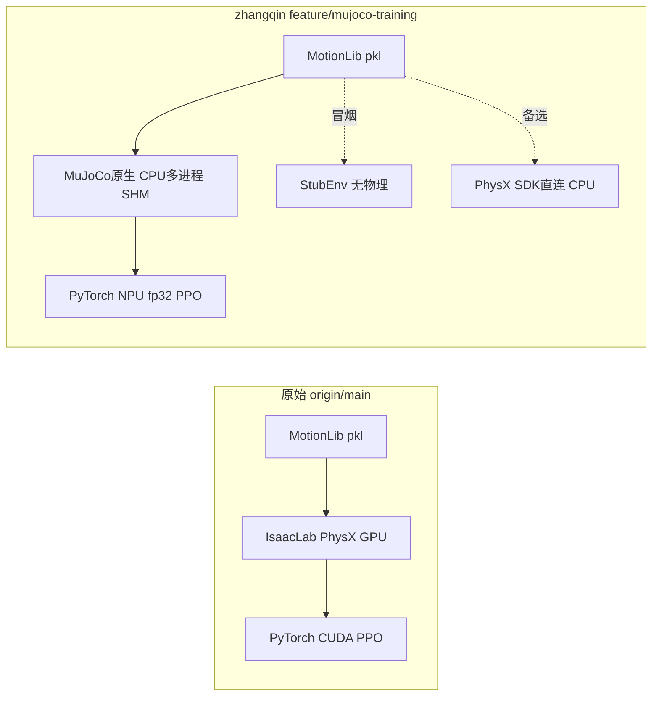
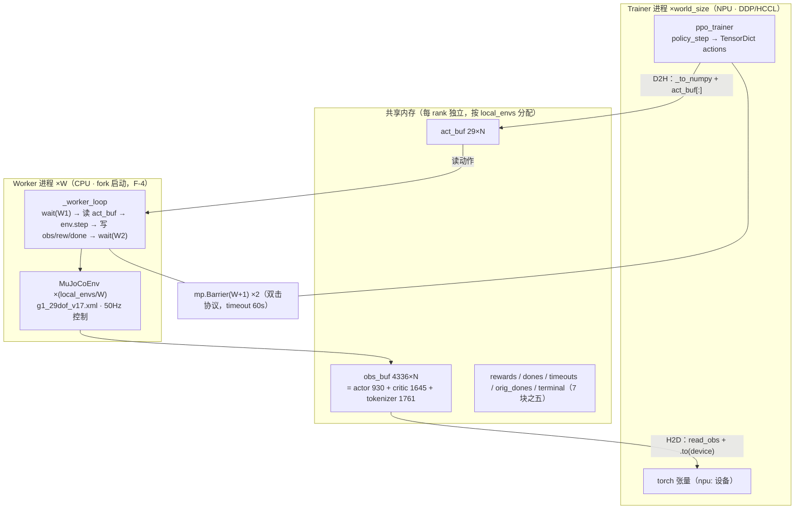
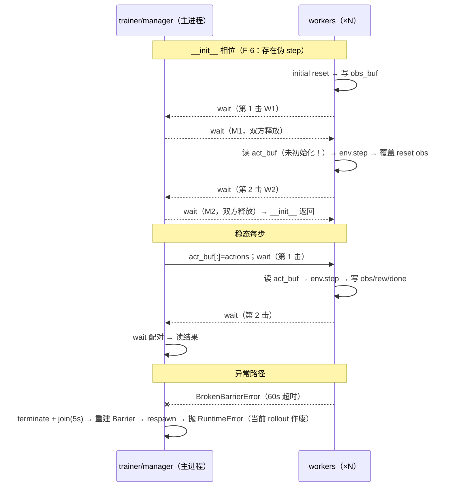

# zhangqin 分支 NPU/CPU-MuJoCo 静态源码审计 — `feature/mujoco-training`

> **版本**: v1.4 — 2026-09-03（v1.1 对抗性外审修订；v1.2 编辑性修订；v1.3 更正 F-1 的 Isaac 侧口径；v1.4 上游版本核对——fetch 最新，锚点 `627743e`→`934eae5`，增量仅文档、结论不变，另记 A 路线分支 v18 对齐模型进展；历史更正见文末修订记录）
> **锚点**：原始项目 `NVlabs/GR00T-WholeBodyControl` `origin/main@0e35637`（仅 `IsaacLab + PhysX + CUDA`，无 `mujoco/npu` 代码）
> **对比分支**：`zhangqin200182/GR00T-WholeBodyControl` `origin/feature/mujoco-training@934eae5`（2026-09-03 fetch 核对：审计原锚点 `627743e` 之后仅 1 个纯文档 commit——`docs/NPU训练全流程指导.md` 增补 RLHF 类比图解，**零代码改动**，全部行号与审计结论不变）
> `https://github.com/zhangqin200182/GR00T-WholeBodyControl/tree/feature/mujoco-training`
> **口径**：`git diff origin/main..origin/feature/mujoco-training --stat`，核心文件 `train_agent_trl.py + mujoco_env.py + mujoco_env_manager.py + stub_env.py + ppo_trainer_aux_loss.py + physx/*`
> **证据等级声明**：本报告为静态源码审计（E1 源码行号实证 / E2 配置实证 / E3 推断，图例详见《00_总览》），只能证明存在 NPU 路由和形状兼容代码，不能证明训练适配已经完成。训练收敛、性能、稳定性需另附运行证据（日志/曲线/复现容器）——**本报告无“验收结果”章节**，不得引用为运行结论。
> **关联文档**: [SONIC原版解析] `SONIC原版训练体系深度解析.md` · [MJWarp迁移报告] `MuJoCo_Warp架构与昇腾NPU全量迁移B路线报告.md`（B 路线要消除的本报告 §3.3 搬运瓶颈）· 演讲材料见《讲解提纲》

## 目录

- [0. 执行摘要](#0-执行摘要静态审计口径)（含正交维度 / 审计发现汇总 / 五类分类）
- [1. 训练入口 train_agent_trl.py](#1-训练入口-gear_sonictrain_agent_trlpy--npu-感知的总控)
- [2. 物理引擎替换 mujoco_env.py](#2-物理引擎替换--gear_sonicenvsmujoco_envpy552行原始无此文件)
- [3. 并行管理器 mujoco_env_manager.py](#3-并行管理器-gear_sonicenvsmujoco_env_managerpy401行)
- [4. stub_env、physx 与 stub 配置的定位说明](#4-stub_envpy-physx-与-stub-配置的定位说明)
- [5. PPO Trainer 改动](#5-ppo-trainer-改动以-diff-为准)
- [6. 保留项与重实现项](#6-保留项与重实现项)
- [7. 文件级清单](#7-文件级清单)
- [8. 评审问答（FAQ）](#8-评审问答事实口径)
- [附录A：溯源命令](#附录a溯源命令)
- [修订记录](#修订记录)

---

## 0. 执行摘要（静态审计口径）

原始 SONIC：原版训练路径主要面向 `IsaacLab + CUDA`（IsaacLab：NVIDIA 基于 Isaac Sim 的机器人仿真框架；`ManagerBasedRLEnv(PhysX)` + GPU 仿真，PhysX 为 NVIDIA 的 GPU 加速物理引擎；是否实际使用 BF16 应以 resolved `TrainingArguments` 和日志为准，本报告在 `origin/main` 未找到 `bf16/fp16` 硬编码证据，不做断言）。

zhangqin分支：模型拓扑基本保留，但训练数值路径和 MDP 语义发生显著变化——分支在检测到 NPU（Neural Processing Unit，神经网络处理器，本文指华为昇腾 Ascend 系列）时条件强制 `BF16/FP16→FP32`（半精度格式退回 float32 单精度；CUDA 路径不受影响），并改变了 `init_noise_std` 和 `clamp`、环境/数据采样/动作映射、`reward`/`termination`、`DDP`（Distributed Data Parallel，PyTorch 分布式数据并行：`world_size` 个进程各按 `rank` 编号协同训练同一模型）参数、`rollout`（用当前策略与环境交互、收集训练样本的阶段）行为与辅助损失（新增 BC loss——Behavior Cloning 行为克隆损失，监督策略输出逼近参考动作，见 §5）。主路径为 `CPU MuJoCo × NPU`（MuJoCo：开源的多体物理仿真器，在 CPU 上运行）。两条链路的端到端形态对比如下图（实线＝主链路数据流，虚线＝非主路径变体，读法见图后）：



**图的读法**：

- **分组与节点**：两个 subgraph 各是一条端到端训练链路——ORIG＝锚点 `origin/main`（仅 IsaacLab + PhysX + CUDA，无 mujoco/npu 代码），ZQ＝zhangqin 分支；节点职责一句话：`MotionLib pkl`＝动作数据源（动作库的 pkl 存档），`IsaacLab PhysX GPU`＝GPU 物理仿真（IsaacLab：NVIDIA 机器人仿真框架；PhysX：其 GPU 加速物理引擎，详释见 §0 首段），`MuJoCo原生 CPU多进程 SHM`＝CPU 物理仿真 + 进程间共享内存（SHM：多进程映射同一段物理内存交换数据），末端 PPO 节点＝学习设备与算法，`StubEnv`＝无物理桩环境，`PhysX SDK直连`＝绕过 IsaacLab 的裸 SDK 路线。
- **箭头语义**：实线＝主链路数据流；两根虚线（冒烟→StubEnv、备选→PhysX SDK 直连）＝非主路径变体，仅 `SONIC_STUB_ENV` / `SONIC_PHYSX_ENV` 置位时启用（路由见 §1.1），不承载常规训练数据。
- **阅读主线**：自左向右沿实线读一条链路（数据源 → 物理环境 → 学习设备）；先读 ORIG 建立 baseline，再读 ZQ 看两处替换——物理从 GPU 移到 CPU 多进程、学习从 CUDA 移到 NPU 并强制 fp32。
- **与正文的对应**：`MuJoCo原生 CPU多进程 SHM` 拆开即 §2（`mujoco_env.py`）+ §3（`mujoco_env_manager.py`）；`PyTorch NPU fp32 PPO` 即 §1.2 精度强制与 §5 trainer 改动；`StubEnv` / `PhysX SDK直连` 的定位见 §4；ZQ 侧 `MotionLib pkl` 被截到 ≤500 条即 F-3（§2.6）。
- **本图的位置**：§0.1 正交维度表是本图两个维度（物理环境 × 学习设备）的穷举展开（回指见该节）；§0.3 五类分类把 diff 文件归位到图上各节点。

### 0.1 正交维度（物理环境 × 学习设备）

| 维度 | 选项 |
|---|---|
| 物理环境 | Isaac PhysX / CPU MuJoCo / Stub（无物理）/ PhysX SDK 直连 |
| 学习设备 | CUDA / NPU / CPU |

zhangqin分支的主路径为 `CPU MuJoCo × NPU`（即 [MJWarp迁移报告] 中的 A 路线形态；见图中 ZQ 组实线主链），`Stub × NPU` 仅用于冒烟（Stub：无物理的桩环境，只产生形状合法的观测；冒烟即 smoke test——以最小代价先验证主链路能跑通；见图中“冒烟”虚线），`PhysX SDK × NPU/CPU` 为附带备选（见图中“备选”虚线）。MJWarp 报告的 B 路线（物理常驻 NPU）正是要消除本报告 §3.3 实证的每步两次搬运。

### 0.2 审计发现汇总（F-x 编号，正文各处按编号引用）

F-x 是本报告自定义的审计发现编号体系（F=finding，F-1~F-8 按立案顺序固定），正文各处按编号交叉引用；标“外审复核新增”者为对抗性外审补充确认的发现。

| 编号 | 发现 | 位置 | 严重度 | 建议动作 | 状态 |
|---|---|---|---|---|---|
| F-1 | `feet_acc` 权重三处互不一致（MuJoCo `-2.5e-9` / stub `-2.5e-6` / Isaac terms `-2.5e-7`），且关节范围与 Isaac 不同（Isaac 为全关节 `joint_acc_l2`，本分支仅 4 踝关节；分支注释的“Isaac 足部笛卡尔加速度”说法与配置不符） | §2.5 | 高 | 对齐为一处并统一关节范围定标 | 待整改 |
| F-2 | 观测/动作 shape 兼容但语义非等价（六项差异） | §2.1 | 高 | 逐项语义对齐或显式声明偏移 | 待整改 |
| F-3 | 数据管线裁剪：≤500 条 motion、向下截断取帧（无 lerp/slerp）、无自适应采样 | §2.6 | 高 | 扩容 + 插值对齐 + 补采样 | 待整改 |
| F-4 | fork-after-init：默认 `fork` 继承已初始化的 Ascend 运行时 | §1.1 | 高 | `spawn`/`forkserver` + 多 rank × 多 worker 启停测试 | 待整改 |
| F-5 | 可复现环境缺失：版本矩阵未锁、容器绝对路径、NPU 不可用静默降级 | §1.3 | 中 | compatibility matrix + lock + fail-fast | 待整改 |
| F-6 | Barrier `__init__` 双击引发“伪 step”：reset 观测被未初始化动作推进一步后覆盖 | §3.2（外审复核新增） | 高 | worker 首轮跳过动作读取 / init 单侧同步 | 待整改 |
| F-7 | 崩溃恢复链竞态：`join(timeout=5)` 后无条件 respawn（老 worker 复活并发写 SHM）、init 60s 超时假阳性（每 env 重复加载 motion） | §3.2（外审复核新增） | 中 | 逐 worker 确认退出后再重建；motion 库共享加载 | 待整改 |
| F-8 | DDP 下 `env.config.num_envs`（全局）与 `env.num_envs`（局部）错配，minibatch/统计口径差 world_size 倍 | §1.3（外审复核新增） | 高 | 入口回写 `config.num_envs = local_envs` 或统一取 local | 待整改 |

### 0.3 分支改动的五类分类

| 类别 | 文件 | 说明 |
|---|---|---|
| 核心 NPU 路由 | `train_agent_trl.py:193-223`（`torch_npu` 检测/`fp32`/`device`） | NPU 核心依赖 |
| CPU-MuJoCo 环境适配 | `mujoco_env.py`、`mujoco_env_manager.py`（含通用 `_to_numpy` 边界）、`stub_train.yaml`、`mujoco_math.py`、`g1_29dof_v17.xml` | 物理替换主体，实验性 shape-compatible |
| Smoke Test | `stub_env.py`（`SONIC_STUB_ENV=1`） | 诊断工具，非 NPU 核心依赖 |
| 日志/评测/训练目标增强 | `ppo_trainer.py:20,247` `TensorBoard`、`actor_critic_modules.py:141,424,433` `deterministic_rollout`、`ppo_trainer_aux_loss.py` BC loss | 日志功能、评测选项与新增损失项 |
| PhysX 实验功能 | `physx/*`、`physx_env*.py`、`isaac_replay_kit/*.npz`、`record_walk.py` 等 | `PhysX SDK` 直连备选/审计工具，与 NPU 是否可用无关 |

---

## 1. 训练入口 `gear_sonic/train_agent_trl.py` — NPU 感知的总控

### 1.1 环境类型路由

```python
# 【源码】gear_sonic/train_agent_trl.py:28-31
# PhysX fork safety: import PhysXEnvManager BEFORE torch/HCCL
# so child processes don't inherit Ascend runtime state.
if os.environ.get("SONIC_PHYSX_ENV"):
    from gear_sonic.envs.physx_env_manager import PhysXEnvManager  # noqa

# 【源码】gear_sonic/train_agent_trl.py:165-168
if os.environ.get("SONIC_MUJOCO_ENV"): simulator_type = "MuJoCo"
elif os.environ.get("SONIC_STUB_ENV"): simulator_type = "Stub"
elif os.environ.get("SONIC_PHYSX_ENV"): simulator_type = "PhysX"
else: simulator_type = "IsaacSim"
```

原始仅 `IsaacSim`；zhangqin用环境变量四选一。入口文件开头仍会尝试 `import isaaclab`（`train_agent_trl.py:33-50` `try: import isaaclab / except ImportError`），只是在非 Isaac 模式（`SONIC_STUB_ENV / SONIC_MUJOCO_ENV / SONIC_PHYSX_ENV` 任一置位）允许失败而不 `sys.exit(1)`，并非将 `import` 延迟到 Isaac 分支。

**fork 安全（F-4）**：源码注释自认的做法（提前 `import Manager`，上方 `:28-31`）**不能**解决 fork-after-init（先初始化加速器运行时、再派生子进程——`fork` 是 Linux 默认的子进程创建方式，快照式复制父进程内存，会把已初始化的运行时一并继承；`spawn` 则启动全新解释器、不继承父进程状态）——fork 的危险取决于 fork 时刻的运行时状态，而非 import 顺序。实证链（E1，本报告证据分级中的“源码行号实证”级，全套分级见页眉“证据等级声明”）：`Accelerator`（Hugging Face Accelerate 库的核心对象，统一管理设备分发与混合精度；`train_agent_trl.py:211`）的创建过程包含 `torch_npu`（华为提供的 PyTorch 昇腾适配插件，使 torch API 可运行于 NPU）与 HCCL（Huawei Collective Communication Library，华为集合通信库，DDP 在昇腾上的梯度同步后端）初始化，且早于 `MuJoCoEnvManager`（`train_agent_trl.py:382`）构造；而后者用默认 `mp.Process`（`mujoco_env_manager.py:286,391`，无 `get_context("spawn")/forkserver`、`set_start_method`）。源码注释（`mujoco_env_manager.py:283`）甚至写着 `"# Spawn workers (before DDP/HCCL init!)"`，与真实调用顺序（Manager 在 Accelerator 之后构造）直接矛盾，暴露作者的心智模型偏差。Linux 默认 `fork` 会继承已初始化的加速器运行时。应显式使用 `mp.get_context("spawn")` 或 `forkserver`，并做多 `rank ×` 多 `worker` 启停测试（参见 PyTorch multiprocessing 指南）。

### 1.2 NPU 检测与精度强制

```python
# gear_sonic/train_agent_trl.py:193-223
import torch
_is_npu = False
try:
    import torch_npu  # noqa
    if torch.npu.is_available():
        _is_npu = True
        training_args.bf16 = False
        training_args.fp16 = False
        logger.info("NPU detected — forcing fp32 (NPU doesn't support bf16 torch.normal)")
except ImportError:
    pass

_mixed_precision = "no" if _is_npu else None
# 冻结encoder/decoder时DDP容忍无梯度参数
_freeze_parts = bool(os.environ.get("SONIC_PHYSX_ENC_ADAPT") or os.environ.get("SONIC_PHYSX_BC_ONLY") or os.environ.get("SONIC_PHYSX_FREEZE_ENCODER"))
ddp_kwargs = DistributedDataParallelKwargs(find_unused_parameters=_freeze_parts)
kwargs = InitProcessGroupKwargs(timeout=timedelta(seconds=6000))  # 原始main已存在，非新增
accelerator = Accelerator(
    gradient_accumulation_steps=training_args.gradient_accumulation_steps,
    kwargs_handlers=[ddp_kwargs, kwargs],
    mixed_precision=_mixed_precision,
)
device = str(accelerator.device)
if device == "cuda": device = "cuda:0"
if _is_npu:
    device = f"npu:{torch.npu.current_device()}"
```

**配套讲解：**

* **为何关 `bf16/fp16`**：在特定版本组合下复现失败——代码注释称昇腾 `torch_npu` 的 `torch.normal` 不支持 `bf16`（`train_agent_trl.py:193-201`）。正式结论应写成“在特定版本组合下复现失败”，并附最小 `probe`（`torch.normal` 在 `bf16/NPU` 下的复现脚本 + `torch/torch_npu/CANN/固件` 版本，CANN 为华为昇腾异构计算架构、`torch_npu` 依赖的底层软件栈），zhangqin分支未附。本报告不将其作为普适硬件结论。
* **`find_unused_parameters`**：原始分支在此处硬编码 `False`（`origin/main:182`）；zhangqin在冻结 `encoder/quantizer`（`ENC_ADAPT/BC_ONLY/FREEZE_ENCODER`）时置 `True`，否则 `DDP` 因部分参数无梯度而报错。
* **`timeout=6000s`**：原始分支已有（`main:183`），zhangqin沿用，不是新增。
* **`device`**：NPU 下为 `npu:<current_device>`，后续 `.to(device)` 的模型与 `rollout` 的 `storage` 均落此设备。

### 1.3 四类环境实例化与 DDP 负载切分

```python
# gear_sonic/train_agent_trl.py:373-395
from gear_sonic.envs.mujoco_env_manager import MuJoCoEnvManager
# MuJoCo专用探索噪声（此前泄漏到全局ppo_im_phc.yaml，已收敛到此分支内）
OmegaConf.update(config.algo.config, "init_noise_std", 0.15, force_add=True)
OmegaConf.update(config.algo.config, "std_clamp_min", 0.05, force_add=True)
OmegaConf.update(config.algo.config, "std_clamp_max", 1.0, force_add=True)
# DDP：按world_size均分负载，每个rank独立建SHM
local_envs = config.num_envs // accelerator.num_processes
env = MuJoCoEnvManager(
    num_envs=local_envs,
    num_workers=getattr(config, "mujoco_workers", 160) // accelerator.num_processes,
    model_xml="/gear_sonic_deploy/g1/g1_29dof_v17.xml",
    pkl_dir="/sample_data/robot_filtered",
    env_config=OmegaConf.create({"alive_bonus": 0.0}),  # train_agent_trl.py:387
)
config_dict["obs"]["obs_dims"] = {"actor_obs": 930, "critic_obs": 1645, "tokenizer": 1761}
```

* `PhysX` 分支同理（`train_agent_trl.py:404-458`），仅 `obs_dims` 多 `ref_action:29`。
* `DDP` 切分是均分负载（每个 `rank` 独立建 SHM——Shared Memory，共享内存：多进程映射同一段物理内存以交换数据），不是解决命名冲突（`SharedMemory(create=True)` 本来随机名）。健壮性缺口：`local_envs = num_envs // world_size`（`train_agent_trl.py:381`）与 `num_workers // world_size`（`:384`）未处理余数（整除丢弃尾数）与结果为零（`num_workers < world_size` 时 `MuJoCoEnvManager` 除零/零worker），需加 `guard`。
* **config 流向错配（F-8，外审复核新增）**：入口把**全局** env 数写入 `config_dict["num_envs"] = config.num_envs`（`train_agent_trl.py:397`，如 `base.yaml` 的 4096），而 manager 实际按 `local_envs` 建 SHM、`storage` 等张量也按 local 分配（`ppo_trainer.py:772,807,810,920`，均取 `env.num_envs`）；但 trainer 侧的 `local_batch_size`（`ppo_trainer.py:534`，`local_batch_size = env.config.num_envs`）与 `self.num_envs`（`:740`）取全局值。world_size>1 时 minibatch 划分与统计口径和真实 batch 差 world_size 倍——轻则 assert 崩、重则静默错分；world_size=1 不触发。修复：入口处回写 `config.num_envs = local_envs`，或 trainer 侧统一取 local。
* `alive_bonus`：环境侧默认 `4.0`（`mujoco_env.py:97`），但训练入口覆盖为 `0.0`（`train_agent_trl.py:387`），以 `alive_bonus` 不干扰跟踪奖励。
* 探索噪声：`init_noise_std 0.15 / std clamp [0.05,1.0]` 仅在 `MuJoCo` 分支内覆盖，不污染全局 `ppo_im_phc.yaml`。
* **可复现环境缺失（F-5）**：`pyproject.toml` 仅为工具配置，未锁定 `torch/torch_npu/CANN/驱动/固件/Accelerate` 版本；`model_xml="/gear_sonic_deploy/g1/g1_29dof_v17.xml"`（`:385`）、`pkl_dir="/sample_data/robot_filtered"`（`:386`）为容器绝对路径，不可移植；`try: import torch_npu / except ImportError: pass` 在 NPU 不可用时静默继续（`_is_npu=False`），非 `fail-fast`（快速失败：前置条件不满足时立即报错退出，而非静默降级继续）。正式报告应给 `compatibility matrix`、容器/`lock` 文件，并在请求 NPU 时 `fail-fast`（参考 Ascend PyTorch 兼容矩阵）。

---

## 2. 物理引擎替换 — `gear_sonic/envs/mujoco_env.py`（552行，原始无此文件）

### 2.1 常量与接口契约

```python
# mujoco_env.py:8-30
NUM_DOF = 29
NUM_FUTURE = 10; NUM_SMPL_FUTURE = 10; FUTURE_DT_REF = 0.1
BODY_NAMES = ("pelvis","left_hip_roll_link","left_knee_link","left_ankle_roll_link",
              "right_hip_roll_link","right_knee_link","right_ankle_roll_link",
              "torso_link","left_shoulder_roll_link","left_elbow_link",
              "left_wrist_yaw_link","right_shoulder_roll_link","right_elbow_link","right_wrist_yaw_link")
VR_3POINT_BODY = ("left_wrist_yaw_link","right_wrist_yaw_link","torso_link")
LOWER_JOINT_INDICES = list(range(12))
ACTOR_DIM = 930; CRITIC_DIM = 1645; TOKENIZER_DIM = 1761; HIST = 10
```

`930/1645/1761` 仅为 **shape-compatible**（形状兼容）。这句话的可验证性分三层，明确如下——**“结构可加载”是 E3 推断**：维度与拓扑对得上，但本机未做实例化验证（补装 loguru/tensordict 后 CPU 实例化、数参数、比对 state_dict 键形即可完成，尚未执行）；**“行为兼容未验证”是事实性陈述而非措辞保守**：本地与仓库内不存在任何运行证据，且缺三要素——预训练 checkpoint 文件（本地无 `.pt/.pth/.ckpt`）、`/sample_data` 动作数据（容器路径，本机无）、Isaac 参照环境（需 IsaacSim+CUDA）；**闭环路径**：补齐三要素后，F-2 的验收 = 加载 checkpoint → 冻结策略跑 N 步 MuJoCo rollout → 按 §2.5 各奖励项对比 Isaac 基线。在此闭环完成且下表差异逐项对齐或声明之前，“预训练 `37M` 权重零修改加载”的说法不成立（F-2），非等价项如下：

| # | 差异 | 证据 |
|---|---|---|
| 1 | 动作仿射变换不同（`action*jh+jm` vs Isaac `0.25*effort/stiffness` 逐关节） | `mujoco_env.py:213-215` vs `robots/g1.py` |
| 2 | 统一 `kp=100/kd=5` vs Isaac 逐关节参数 | `mujoco_env.py:72` |
| 3 | 部分速度/状态定义不同（MuJoCo 有限差分 vs Isaac 特权状态） | `mujoco_env.py` `_compute_critic_obs` 有限差分 |
| 4 | MuJoCo 未复现 Isaac 观测噪声 | `mujoco_env.py` 无 `noise`（`grep noise` 为空）；Isaac `local_dir_hist.yaml/unitoken_all_noz.yaml` 有 `AdditiveUniformNoiseCfg` |
| 5 | SMPL 输入全零 | `mujoco_env.py:312-380` `smpl_j/o/w` 零占位 |
| 6 | reward/termination 已改变（`feet_acc` 权重、新增 `anti_shake`、`_ORI_THRESH` 等阈值放宽） | `mujoco_env.py:382-395, ~470-490` |
| 7 | 物理子步结构不同：Isaac `sim_dt 0.005 × decimation 4`（200Hz）vs MuJoCo `native_dt 0.002 × decimation 10`（500Hz），`ctrl_dt` 同为 0.02s | `mujoco_env.py:213-226`；[SONIC原版解析] §1.1 |

表中 `decimation` 指每个控制步内物理子步的次数（控制周期 `ctrl_dt` = decimation × 物理步长），决定控制频率与物理积分频率之比。

### 2.2 关节归一化（jm/jh）与 PD 增益（kp/kd）：Isaac 真值与统一值对照

```python
# mujoco_env.py:50-83
self.jm = np.array([0.1745,1.2217,0.0,1.3963,-0.1745,0.0, ...], dtype=np.float64)  # limit_midpoint，来自Isaac
self.jh = np.array([2.7052,1.7453,2.7576,1.4835,0.6981,0.2618, ...], dtype=np.float64)  # half_range
self.kp = np.ones(self.nu)*100.0; self.kd = np.ones(self.nu)*5.0  # mujoco_env.py:72，统一增益
# torque limit解析自XML actuatorfrcrange，fallback 50.0 — mujoco_env.py:74-81
self._torque_limit = parsed_from_jnt_actfrcrange
self.model.opt.iterations = 200  # QACC稳定 — mujoco_env.py:83
# 注：无 dof_armature 写入，无 impratio 改动
```

**背景（`docs/Task7_Action_Mismatch.md` 记录的问题）：** 动作到关节角的映射依赖归一化参数 `jm/jh`（关节限位的中点 limit_midpoint 与半区间 half_range：网络输出的 [-1,1] 动作经 `action×jh+jm` 反归一化为关节目标角）。若用 `MuJoCo XML`（即 MJCF，MuJoCo 的 XML 模型描述格式，`jnt_range` 为其中定义的关节限位）做归一化，与 `Isaac` 训练时的 `jm/jh` 不一致，同一网络输出映射到错误关节角。zhangqin将 `jm/jh` 改为 `Isaac` 真值。

**现状对照表：**

| 项 | 原始 Isaac（`robots/g1.py`） | zhangqin `mujoco_env.py` |
|---|---|---|
| `jm/jh` | `limit_midpoint/half_range` | 已采用 Isaac 真值 `mujoco_env.py:60-70` |
| `kp/kd` | 逐关节 `stiffness=armature*(10*2π)², damping=2*2*armature*10*2π` | 统一 `100/5` `mujoco_env.py:72` |
| `act_scale` | `0.25*effort/stiffness` | 未引入，用 `jh` 直接缩放 `_pd_control` |
| `armature` | `dof_armature=armature` | 未写入 |
| `solver` | PhysX | `iterations=200` |


### 2.3 控制时序：每子步重算力矩

```python
# mujoco_env.py:213-226
def _pd_control(self, action):
    self._pd_target = action * self.jh + self.jm

def _physics_step(self):
    for _ in range(self.decimation):  # 10, native_dt=0.002 → ctrl_dt=0.02s
        torque = self.kp*(self._pd_target - self.data.qpos[7:]) - self.kd*self.data.qvel[6:]
        self.data.ctrl[:] = np.clip(torque, -self._torque_limit, self._torque_limit)
        mujoco.mj_step(self.model, self.data)
```

力矩由 PD 控制（比例-微分控制：`kp` 为位置误差的比例增益、`kd` 为速度的微分阻尼增益）产生。每子步重算的动机来自源码注释：若 10 子步冻结 `torque`，`qacc`（MuJoCo 的关节加速度状态量）会发散到 `1e5`——`kd*qd` 阻尼项无法响应步内加速（`mujoco_env.py:220-222`）。故每 `mj_step` 前重算，与 `Isaac` 的 `ImplicitActuator`（隐式执行器：力矩在物理子步内由求解器隐式积分）逐子步一致。

### 2.4 观测构造：三头 shape-compatible（非逐字段等价）

“三头”指同一环境状态按三个消费方分路输出：`actor_obs` 供策略网络、`critic_obs` 供价值网络（可含特权信息）、`tokenizer` 供 tokenizer 编码器；三路在 manager 侧拼成 4336 维写入 SHM。

* **Actor `930D`**：`g_hist(30)+ang_vel_hist(30)+jpos_hist(290)+jvel_hist(290)+act_hist(290)`，`HIST=10` 滑窗。
* **Critic `1645D`**：`cmd_mf(580)+pos_b(3)+ori_6d(6)+body_pos_b(42)+body_ori_6d(84)+lin_vel_hist(30)+...`，`future_dof` 为向下截断取前一帧（见§2.6），非 `lerp/slerp` 插值。
* **Tokenizer `1761D`**：`enc_idx(3)+cmd_nonflat(580)+cmd_z_mf(10)+ori_mf(60)+cmd_lower(240)+vr_local(9)+vr_orn(12)+ori_b6d(6)+cmd_z(1)+smpl_j(720)+smpl_o(60)+smpl_w(60)`，`SMPL`（Skinned Multi-Person Linear model，参数化人体网格模型）输入全零占位，仅为保住 `FSQ`（Finite Scalar Quantization，有限标量量化——tokenizer 的离散化层，输入维度固定）的维度。
* **Joint Order**：定义 `ISAAC_REORDER/ISAAC2XML` 两组关节重排索引（`mujoco_env.py:20-28`），`_ISAAC_JOINT_ORDER` 默认开。`obs` 侧 `jph[:,ISAAC_REORDER]`，`step` 侧 `action[ISAAC2XML]`，策略收发为 `isaaclab` 序、内部为 `xml` 序，与 `PhysX` 共契约。

### 2.5 奖励 13 项：含明确非等价项 `feet_acc`（F-1）

奖励共 13 项（`mujoco_env.py:382-395`，源码 r1–r13 逐项对应）：`anchor_pos(0.5,σ0.3)+anchor_ori(0.5)+relative_pos(1.0)+relative_ori(1.0)+linvel(1.0)+angvel(1.0)+action_rate(-0.1)+joint_limit(-10)+undesired_contact(-0.1)+anti_shake(-0.005)+vr_local(2.0,σ0.1)+feet_acc(-2.5e-9)+alive_bonus(默认0.0)`。

* **`anti_shake`（`mujoco_env.py:383-384`，`r10 = -0.005*self._anti_shake()`）**：Isaac 原版奖励集之外的**额外项**（惩罚手腕/头部角速度超标），属“reward 非等价”素材，此前枚举漏列。
* **`feet_acc` 非等价**：MuJoCo 为 **`-2.5e-9`**（`mujoco_env.py:387,393`），注释明确 `reduced 1000x from Isaac's -2.5e-6`，并记载了不做缩放的教训：踝关节角加速度（`rad/s²`）在接触时尖峰 `~1e8`，使该项均值达 `-441/step`（占全部惩罚 97%），驱动出“快点摔倒少攒惩罚”的退化策略。**Isaac 侧实测更正（E1）**：origin/main 的 feet_acc 项实为 IsaacLab 库函数 `joint_acc_l2`（`feet_acc.yaml:4` 经 `mdp/__init__.py` 的 `from isaaclab.envs.mdp import *` 再导出）——**全关节**角加速度平方和（rad/s²）；分支注释所称“Isaac 用足部笛卡尔加速度（m/s²）”与配置不符。因此两侧量纲其实相同（均为关节角加速度平方），真实差异在**关节范围**（Isaac 全部 29 关节 vs 本分支仅 4 个踝关节）与**权重**（-2.5e-7 vs -2.5e-9）；另注意 stub 配置为 `-2.5e-6`（`stub_train.yaml:40`），三处互不一致，不可称“一致”。

```python
# 【源码摘录】mujoco_env.py:346-378 _compute_reward（r1–r7；"→"注释为本报告所加）
root_pos = self.data.xpos[self._body_idx["pelvis"]]         # → MuJoCo 正运动学输出（mj_step 后的世界系位姿）
ref_root_pos = self._ref_root_pos(); ref_root_quat = self._ref_root_quat()
# 1. tracking_anchor_pos (w=0.5, σ=0.3)
err = np.linalg.norm(root_pos - ref_root_pos)
r1 = 0.5 * np.exp(-err**2 / 0.09)                           # → 0.09=σ²：全部跟踪项都是 exp(-err²/σ²) 核形式
# 3. tracking_relative_body_pos (w=1.0, σ=0.3)
ref_aligned = ref_body_pos - ref_root_pos + root_pos        # → 参考体位置平移到当前根下——“相对”语义的实现
r3 = 1.0 * np.exp(-np.sum((body_pos_w - ref_aligned)**2, axis=-1).mean() / 0.09)
# 5. tracking_body_linvel (w=1.0, σ=1.0)
body_lin_vel = (body_pos_w - self._prev_body_pos) / self.ctrl_dt   # → 速度由相邻帧差分（非模拟器特权真值）
r5 = 1.0 * np.exp(-np.sum((body_lin_vel - ref_lin_vel)**2, axis=-1).mean() / 1.0)
# 7. action_rate_l2 (w=-0.1)
r7 = -0.1 * np.sum((action - self._prev_action)**2)
```

```python
# 【源码摘录】mujoco_env.py:445-460 _feet_acc —— F-1 非等价的机制
ankle_vel = self.data.qvel[6:][indices]                     # → 4 个踝关节角速度（rad/s）
acc = (ankle_vel - self._prev_joint_vel[indices]) / self.ctrl_dt  # → 差分求角加速度（rad/s²）
return float(np.sum(acc**2))                                # → 平方和：接触尖峰 ~1e8，权重被迫缩到 -2.5e-9
```

### 2.6 数据管线重大裁剪（F-3）

* **最多 `500` 条 motion**：`_load_motions`（`mujoco_env.py:117-135`）设 `max_motions=500`、`rng=RandomState(0)` 固定洗牌后截断，非完整 `BONES-SEED` 动作数据集（约 14.2 万条，见 [SONIC原版解析] §0）；每条 motion 以 pkl（Python pickle 序列化档案）文件存盘、`joblib.load` 读取。
* **向下截断取前一帧，无 `lerp/slerp`**（lerp 线性插值 / slerp 球面线性插值——后者是四元数旋转的正确插值方式）：`_future_dof/_future_dof_vel`（`:153-165`）用 `(times*fps).astype(int)` 向下截断取前一帧；原版 `MotionLib`（动作库模块，统一存取与插值参考动作帧；`motion_lib_base.py:52-150,821-826`）对 `translation` 用 `linear`、对 `quat` 用 `slerp`，两者不对齐。
* **无 `adaptive sampling`（自适应采样：按训练难度加权挑选 motion 的机制）**：stub 配置显式关闭（`stub_train.yaml:59` `adaptive_sampling.enable: false`），且 `mujoco_env.py` 无 `update_adaptive_sampling_*` 对应逻辑（对比 `motion_lib_base.py:238-240,1067-1068`）。

```python
# 【源码摘录】mujoco_env.py:120-134 _load_motions —— F-3 的 500 条上限（"→"注释为本报告所加）
rng = np.random.RandomState(0)      # → 固定种子：源码注释记载 PID 洗牌曾致跨进程顺序随机、小样本评估双峰
rng.shuffle(pkls)
max_motions = 500                   # → 硬上限：非完整 BONES-SEED（约 14.2 万条）
for p in pkls:
    v = joblib.load(p)
    ...
    if len(motions) >= max_motions: break   # → 凑满即停：与原版分批加载/自适应采样机制完全不同
```

```python
# 【源码摘录】mujoco_env.py:154-158 _future_dof —— 截断取帧（与原版插值对照）
times = self._ref_time + np.arange(n) * dt_ref             # → 10 个未来采样点（0.1s 间隔）
indices = np.clip((times * fps).astype(int), 0, end - 1)   # → astype(int) 向下取整直接当帧号——无 lerp/slerp
return dof[indices].astype(np.float32)                     # → 对比原版 get_motion_state 的 blend 插值（[SONIC原版解析] §2.1）
```

### 2.7 重置与终止

reset 把根位姿直接设为参考帧、清零历史缓冲（`mujoco_env.py:499-518`）：`qpos[:3]=ref_root_trans, qpos[3:7]=[w,x,y,z], qpos[7:]=ref_dof`，随后调 `mj_forward`（MuJoCo 正向计算接口：按当前状态重算运动学等派生量、不推进时间）并清 `HIST`。
step 在 `ignore_terminations` 时透传 `info["_orig_done"]`（环境内部的真实终止标志，即未被 `ignore_terminations` 屏蔽前的原始 done；`mujoco_env.py:523-545`），设计意图是为 `GAE`（Generalized Advantage Estimation，广义优势估计——PPO 计算优势函数的标准方法）提供 `termination/timeout` 信息，正确性仍需用终止和截断单测验证（见§5）。

```python
# 【源码摘录】mujoco_env.py:499-512 reset（节选；"→"注释为本报告所加）
self.data.qpos[:3] = self._ref_root_trans[idx]              # → 根平移直接取参考帧
pk = self._ref_root_rot[idx]
self.data.qpos[3:7] = [pk[3], pk[0], pk[1], pk[2]]          # → 四元数重排 [x,y,z,w]→[w,x,y,z]（MuJoCo 约定 w 在前）
self.data.qpos[7:] = ref_q0.astype(np.float64); self.data.qvel[:] = 0
mujoco.mj_forward(self.model, self.data)                    # → 重算正运动学，保证 xpos/xquat 与新 qpos 一致
for b in (self._gdh, self._avh, self._jph, self._jvh, self._ah, self._lvh): b.fill(0)
                                                            # → 6 个历史缓冲清零，防跨 episode 泄漏（对应 930 维的 HIST 滑窗）
```

---

## 3. 并行管理器 `gear_sonic/envs/mujoco_env_manager.py`（401行）

总体结构：**trainer 进程（NPU）— 共享内存 7 块 buffer — worker 进程（CPU MuJoCo）**，每步经 Barrier（`multiprocessing.Barrier`，集合同步原语：全部参与方都到达同一集合点后才一并放行）双击同步一次；数据面每步发生两次设备搬运（§3.3）。三层结构与同步关系画成下图（组框＝进程/内存边界；实线箭头＝数据流，边上 D2H/H2D 标注＝设备搬运方向；与 BAR 相连的无箭头连线＝同步关系、不传数据）：



**图的读法**：

- **TR 组**＝trainer 进程 ×world_size（每 rank 一个，NPU 上以 DDP/HCCL 训练——分布式数据并行及其昇腾集合通信后端，见 §1.1）：PPO 节点执行 `policy_step` 产出 TensorDict actions（TensorDict＝类字典张量容器，见 §3.3），TORCH 节点为落在 `npu:` 设备上的张量侧。
- **SHMM 组**＝该 rank 独立建的共享内存 7 块 buffer：ACT＝动作区 `act_buf 29×N`，OBS＝三头拼接观测 `obs_buf 4336×N`，MISC＝rewards/dones/timeouts/orig_dones/terminal（7 块之五）；布局与容量明细即 §3.1。
- **WKS 组**＝CPU worker 进程 ×W：LOOP＝`_worker_loop` 的每步循环，MJ＝每 worker 实例化的 MuJoCoEnv（50Hz 控制）；组上括注的 “fork 启动” 即 F-4（fork-after-init，§1.1）。
- **BAR 节点**＝`mp.Barrier(W+1)×2`（双击协议，timeout 60s）；其两根无箭头连线（LOOP—BAR、PPO—BAR）＝同步关系（约束“何时可读写”），不是数据流。
- **实线边与标注**：实线箭头＝数据流向；`D2H：_to_numpy + act_buf[:]` 与 `H2D：read_obs + .to(device)` 两条边标＝设备↔主机搬运方向（D2H/H2D＝Device-to-Host / Host-to-Device），此两跳正是 [MJWarp迁移报告] B 路线要消除的每步两次搬运（§3.3）。
- **阅读主线（一个动作的往返）**：PPO →（D2H 边）→ ACT → LOOP 在 W1 放行后读取 → MJ 执行 `env.step` → 写 OBS →（H2D 边）→ TORCH 回到 PPO；BAR 连线为往返定节拍，LOOP 节点内标注的 W1/W2 循环即 §3.2 审计时序，逐步展开见 §3.2 时序图。

### 3.1 共享内存布局

```python
# mujoco_env_manager.py:20-28 — MuJoCo为4336，PhysX为4365(+ref_action 29)
OBS_DIM = 4336       # actor(930) + critic(1645) + tokenizer(1761)
ACT_DIM = 29
OBS_BYTES = OBS_DIM*4  # float32 → 17344 B/env
ACT_BYTES = ACT_DIM*4
# 7块：obs/terminal/actions/rewards/dones/timeouts/orig_dones
```

共享内存对象一次建 7 块 buffer（见图中 SHMM 组的 ACT/OBS/MISC 三节点），`names` 传给子进程 `attach`（`EnvSharedMemory`，`mujoco_env_manager.py:30-56`）。容量核算：`obs` 区 `4336*4*1024=17,760,256 B≈16.94 MiB`，`terminal` 区同尺寸，7 块合计约 **34 MiB**（“约17MB”只算了 `obs` 一区，漏了 `terminal`，勿再引用）。**数字锚点溯源**：上述按 1024 env 计——该值出自 PhysX 文档 `docs/physx-action-space-audit-and-plan.md:20`（“1024 envs × 128 workers”）的实验口径，本分支 MuJoCo 配置实际为 `base.yaml` 4096 / `stub_train.yaml` 64；按 4096 env 计 obs 区 ≈67.7 MiB、7 块 ≈136 MiB。引用容量数字时须注明 env 数口径。`SHM` 一次创建、双 `Barrier` 间经 `numpy` 视图读写，每步仍有拷贝（见§3.3），不可称 `zero-copy`（零拷贝：数据从生产方到消费方不经中间复制）。

**`terminal` 有效位缺失**：`worker` 仅在 `info["terminal_obs"]`（环境终止瞬间的最终观测，供价值函数做收尾估计）非 `None` 时写 `terminal_buf`（`mujoco_env_manager.py:243-250`），而读取侧无 `valid` 位，未终止环境会读到旧值，消费方须以 `dones/timeouts` 门控。

```python
# 【源码摘录】mujoco_env_manager.py:20-47 EnvSharedMemory（节选；"→"注释为本报告所加）
OBS_DIM = 4336       # actor(930) + critic(1645) + tokenizer(1761)
ACT_DIM = 29
layouts = {
    "obs":        (num_envs * OBS_BYTES, np.float32, (num_envs, OBS_DIM)),  # → 每步观测（三头拼接后一次写入）
    "terminal":   (num_envs * OBS_BYTES, np.float32, (num_envs, OBS_DIM)),  # → 终止观测：与 obs 同尺寸（故 §3.1 容量按 2 倍 obs 计）
    "actions":    (num_envs * ACT_BYTES, np.float32, (num_envs, ACT_DIM)),
    "rewards":    (num_envs * REW_BYTES, np.float32, (num_envs,)),
    "dones":      (num_envs * DONE_BYTES,  np.uint8, (num_envs,)),          # → uint8 的 0/1 标量位
    "timeouts":   (num_envs * TIMEOUT_BYTES, np.uint8, (num_envs,)),        # → GAE truncated 门控位
    "orig_dones": (num_envs * ORIG_DONE_BYTES, np.uint8, (num_envs,)),      # → _orig_done：ignore_terminations 用
}
for name, (size, dtype, shape) in layouts.items():
    shm = SharedMemory(create=True, size=size)               # → 实建 7 块（类 docstring 误写 "6 regions"，又一处文档/实现不一致）
    setattr(self, f"_{name}", np.ndarray(shape, dtype=dtype, buffer=shm.buf))  # → 主进程直接建 numpy 视图读写
```

### 3.2 Barrier 双击同步协议（初始化 / 稳态 / 异常三条路径）

```python
# mujoco_env_manager.py:281-300,256,378
self._barrier = mp.Barrier(self._actual_workers + 1)  # N workers + trainer
BARRIER_TIMEOUT = 60
# worker: wait → 读act_buf → env.step → 写obs/rew/done → wait
# trainer: act_buf[:]=actions; wait; wait; 读结果
# BrokenBarrierError → _handle_worker_crash()重建Barrier并respawn，随即抛RuntimeError，当前rollout作废
```

该协议按三个相位画成下述时序图（实线箭头＝消息/调用，虚线箭头＝返回/屏障释放，`--x`＝异常；读法紧随图后逐相位给出）：



**图的读法**（逐相位）：

- **参与者与 Note 段**：T＝trainer/manager 主进程（§3 架构图 TR 组），W＝×N 个 worker 进程（WKS 组），W 侧每条消息表示全体 worker 并行执行同一动作；三段 Note（`__init__` 相位 / 稳态每步 / 异常路径）分别对应 §3.2 正文的三部分审计，下文 F-6、F-7 两段均回指相应 Note 段。
- **箭头语义**：实线箭头＝消息/调用（`W->>W` 自环＝worker 自身执行的一段计算）；虚线箭头＝返回/屏障释放（W1/W2＝worker 侧第一/二次 wait，M1/M2＝manager 侧与之配对的 wait）；`--x`＝异常（BrokenBarrierError）。
- **`__init__` 相位——为何出现“读未初始化 act_buf”（F-6 的图文推导）**：barrier 只按到达顺序配对、不区分相位，manager 为“只等 reset”发出的 M1 会把已完成 initial reset、停在 W1 的 worker 直接放行进 while 循环体——worker 随即读取从未被写入的 act_buf（未初始化 SHM）执行一次完整 `env.step`，覆盖刚写入的 reset 观测并推进 `_ref_time / self.ep`；W2 与 M2 配对后 `__init__` 才返回。后果（trainer 首次 `reset_all()` 读到“零/垃圾动作推进一步后”的观测）展开见下文 F-6 段。
- **稳态每步（四步）**：① trainer 写 `act_buf[:]=actions` 并发出第 1 击；② worker 读动作 → `env.step` → 写 obs/rew/done；③ worker 发出第 2 击；④ trainer 配对后读结果——即 §3 架构图 LOOP 节点内标注的循环，对应下方 `_worker_loop` 与 `manager.step()` 两段源码摘录。
- **异常路径——竞态点（对应 F-7）**：manager 侧 wait 60s 超时（worker 侧 wait 无超时）→ barrier 破碎，图中以 `--x` 标记 BrokenBarrierError；manager 随即 terminate + `join(5s)` 后**无条件**重建 Barrier 并 respawn——老 worker 若 5s 内未真正退出，复活后不知新 barrier 存在、将与新 worker 并发写同一 SHM（静默污染）；最终抛 RuntimeError、当前 rollout 作废。respawn 语义与三个竞态窗口的完整枚举见下文 F-7 段。

**初始化相位的“伪 step”（F-6，外审复核新增；图形推导见上图 `__init__` 相位 Note 段）**：`__init__` 末尾的 double-wait（`mujoco_env_manager.py:294-297`，注释 "wait for all workers to finish initial reset"）并**不能**只等 reset——barrier 不区分相位、只按到达顺序配对，init 的第一击会把 worker 拖过一整轮循环：worker 完成 initial reset 写入 obs_buf 后到达 W1 → manager 的 M1 与之释放 → worker 立即读取**尚未写入任何动作的 act_buf**（未初始化 SHM）执行一次完整 `env.step()`，覆盖刚写入的 reset 观测并推进 `_ref_time / self.ep` → worker 到达 W2 与 manager 的 M2 释放 → `__init__` 返回。此时 trainer 首次 `reset_all()`（`:323-326`，仅读 SHM、无真实 reset）读到的是“零/垃圾动作推进一步后”的观测而非 reset 观测，源码注释的意图（只同步 reset）未达成。修复方向：worker 首轮跳过动作读取，或 init 只做单侧同步并显式管理相位。（对比：respawn 后的新 worker 停在 W1、无伪 step，与 `__init__` 行为不对称。）

```python
# 【源码摘录】mujoco_env_manager.py:193-250 _worker_loop（节选；"→"注释为本报告所加）
def _worker_loop(worker_id, start_env, num_envs, shm_names, barrier, model_xml, pkl_dir, env_config=None):
    signal.signal(signal.SIGINT, signal.SIG_IGN)             # → Ctrl-C 交给父进程统一处理
    shm = EnvSharedMemory.attach(shm_names)                  # → 按 name 附着 7 块 SHM
    obs_buf = np.ndarray((num_envs, OBS_DIM), np.float32, buffer=shm._shm["obs"].buf,
                          offset=start_env * OBS_BYTES)      # → 每 worker 只映射自己的段（offset 视图）
    envs = [MuJoCoEnv(model_xml, pkl_dir, config=env_config) for _ in range(num_envs)]
                                                             # → 每个 env 各自 _load_motions（F-7 的冗余加载源头）
    for i, env in enumerate(envs):                           # → initial reset，写入 obs_buf
        obs = env.reset(); obs_buf[i] = np.concatenate([...])

    while True:
        barrier.wait()                                       # → W1：等 trainer 写完 act_buf（init 时这里是伪 step 入口，F-6）
        actions = act_buf.copy()                             # → 首轮读到的是未初始化 SHM
        for i, env in enumerate(envs):
            obs, reward, done, info = env.step(actions[i])   # → worker 内逐 env 串行 step
            obs_buf[i] = np.concatenate([...]); rew_buf[i] = reward
            done_buf[i] = int(done); to_buf[i] = int(info.get("time_outs", False))
            orig_done_buf[i] = int(info.get("_orig_done", done))
        barrier.wait()                                       # → W2：通知 trainer 结果就绪
```

```python
# 【源码摘录】mujoco_env_manager.py:338-360 manager.step()（节选）—— trainer 侧双击
def step(self, policy_state_dict):
    actions = _to_numpy(policy_state_dict if not isinstance(policy_state_dict, dict)
                        else policy_state_dict["actions"])   # → TensorDict → CPU ndarray（§3.3 边界）
    act_buf[:] = actions                                     # → 写 SHM（此刻起 worker 可读）
    try:
        self._barrier.wait(timeout=self.BARRIER_TIMEOUT)     # → 第 1 击：放行 worker 执行
        self._barrier.wait(timeout=self.BARRIER_TIMEOUT)     # → 第 2 击：等 worker 写完结果
    except BrokenBarrierError:
        self._handle_worker_crash()                          # → terminate/join(5s)/重建/respawn（F-7 竞态窗口）
        raise RuntimeError("Worker crash during step — current rollout data is stale, ...")
    obs = self._shm.read_obs()                               # → 读结果返回 trainer
```

**崩溃恢复链（respawn 语义；respawn 指崩溃后重启新 worker 进程顶替旧进程）**：`manager` 会 `respawn worker`，但随即抛出 `RuntimeError("Worker crash during step — current rollout data is stale")`（`mujoco_env_manager.py:355-360`），训练器没有自动恢复当前 `rollout`，不能写成“自动恢复训练”。

**恢复链竞态窗口（F-7，外审复核新增；时序见上图“异常路径”Note 段）**：(1) `p.terminate(); p.join(timeout=5)` 后无条件重建 barrier 并 respawn——卡在 native 代码的 healthy worker 若 5s 内未真正退出，复活后将与新 worker 并发写同一 SHM buffer（老 worker 不知新 barrier 存在），当前及后续 rollout 数据**静默污染**；(2) init 假阳性：worker 侧 wait 无超时、manager 侧 init 60s 超时，而每个 worker 需为**每个** env 各自 `_load_motions` 加载 ≤500 条 pkl（默认 160 workers、4096 envs ≈ 26 envs/worker，即每 worker 上万次潜在加载），冷盘/网络盘极易超 60s → 报 "Worker crash during init" 误杀全部健康 worker（顺带：每 env 重复加载 motion 库本身是冗余设计，应共享加载）；(3) barrier 破碎后仍在 step 的 healthy worker 到达 W2 时收到未捕获的 `BrokenBarrierError` 直接崩溃，与真实故障源混淆，排障方向会被带偏。

**`worker` RNG（Random Number Generator，随机数发生器）缺失**：`_load_motions` 用固定 `RandomState(0)` 洗牌（`mujoco_env.py:122-124`），`_sample_motion` 用全局 `np.random.randint/uniform` 无独立派生；`_worker_loop`（`mujoco_env_manager.py:193-`）`fork` 后无 `seed(worker_id/start_env)`，多 `worker` 可能重复采样序列，需加独立 `RNG` 派生。

### 3.3 TensorDict→CPU SHM 边界 `_to_numpy`（非NPU专属）

```python
# mujoco_env_manager.py:136-190,345-346
def _to_numpy(x):
    if isinstance(x, np.ndarray): return x
    if isinstance(x, torch.Tensor): return x.detach().cpu().numpy()
    if hasattr(x,"storage"): raw=x.storage(); ... reshape ...
    if hasattr(x,"to"): tmp=x.to("cpu"); r=tmp.numpy(); ...
    if isinstance(x,dict) and "actions" in x: return _to_numpy(x["actions"])
    raise TypeError(f"Cannot convert actions: type={type(x)}, ...")
# 调用点 mujoco_env_manager.py:345
actions = _to_numpy(policy_state_dict if not isinstance(...) else policy_state_dict["actions"])
```

**触发条件与实际机制（外审实测修正）**：`policy_step` 返回 `TensorDict`（类字典张量容器：键值对均为张量、可整体 `.to()` 搬运）时，实测 `isinstance(td, dict)=False`、**无 `storage` 属性**（`_to_numpy` 里 `hasattr(x,"storage")` 分支对 TensorDict 是死代码），且 `td.to("cpu").numpy()` 实际能成功返回 plain dict——函数真正命中的是 `.to("cpu")` 分支内 `isinstance(r,dict) and "actions" in r` 的递归；末端的 `TypeError: Cannot convert actions...` 来自函数自身 raise，而非 `cpu().numpy()` 失败。结论不变：这是所有设备上的 `TensorDict→CPU SHM` 边界，不是 NPU 专属机制；`CUDA/CPU` 下同样经过此函数。

**搬运说明**：每步仍发生两次设备↔主机搬运（即 D2H/H2D：Device-to-Host / Host-to-Device；见 §3 架构图中标注 `D2H：_to_numpy + act_buf[:]` 与 `H2D：read_obs + .to(device)` 的两条边）——`NPU→CPU action`（`_to_numpy` + `act_buf[:]`）和 `CPU→NPU observation`（`shm.read_obs` 的 `.copy()` + `torch.from_numpy` + `.to(device)`，`ppo_trainer.py:956-965` 附近），不可泛称 `zero-copy`——此即 [MJWarp迁移报告] B 路线要消除的瓶颈。

### 3.4 对 trainer 的外部接口（_EnvStub 兼容层）

`_EnvStub` 兼容层向 trainer 暴露 `observation_space={policy:930,critic:1645}`、`action_space=29`（`mujoco_env_manager.py:310-336`），`reset_all/step` 保持主要 `trainer` 接口兼容，但 `trainer` 本身仍有 `_orig_done`、`rollout mask`、存档、日志与 BC loss 修改（见§5），不可称“零改动接入”。

---

## 4. `stub_env.py`、`physx` 与 stub 配置的定位说明

* **`stub_env.py`（812行，NPU冒烟必需）**：`Uses MotionLib directly (no isaaclab)`，无物理，直接供观测验证 `PPO+NPU` 循环。`SONIC_STUB_ENV=1` 跑通才进 `MuJoCo`。
* **`physx/*` + `physx_env*.py`（附带备选）**：裸 `PhysX SDK` 直连，`worker` 需 `init_foundation()` 后建 `PxScene`，`torch` 懒导入。`SHM` 与 `mujoco` 一致，多 `ref_action`。`SONIC_PHYSX_ENV=1` 启用，与 NPU 可用性无关。（注意与 [MJWarp迁移报告] §14 备选 D 的 ovphysx GPU 方案区分：非同一物，可作对照起点。）
* **stub 配置 `gear_sonic/config/exp/stub_train.yaml`（+103，NPU 模板）**：

```yaml
defaults: [/algo:ppo_im_phc, /actor_critic:universal_token/all_mlp_v1, ...]
num_envs: 64
algo.trl.bf16: false; fp16: false  # 与NPU强制一致
manager_env.commands.motion: {num_future_frames: 10, dt_future_ref_frames: 0.1}
```

`future 10帧/0.1s` 与 `mujoco_env.py FUTURE_DT_REF` 对齐。

---

## 5. `PPO Trainer` 改动（以 `diff` 为准）

| 改动 | 位置 | 说明 |
|---|---|---|
| `TensorBoard` 落盘 | `ppo_trainer.py:20,247` `SummaryWriter` | 无 `wandb` 时 `tb/` 看曲线 |
| `_orig_done` 对齐 | `ppo_trainer.py:932,979,986` `cur_dones=None` + `storage.update_key("dones", infos["_orig_done"])` | `ignore_terminations` 下 `GAE` 用真终止、`transformer mask` 不跨 `episode` 污染（原版无此键，见 [SONIC原版解析] §5.2/勘误表） |
| `torch_npu` 存档修复 | `ppo_trainer.py:2246` `torch.empty(...).copy_(value)` | `torch_npu` 旧格式 `Byte storage` 使 `deepcopy` 崩，重建 fresh storage |
| `deterministic_rollout` | `actor_critic_modules.py:141,424,433` | 开关开时 `rollout` 用 `action_mean` 不采样，供确定性评测 |
| **新增 BC 辅助损失**（外审复核补录，训练目标级） | `trl/trainer/ppo_trainer_aux_loss.py`（+27）：`compute_bc_loss`/`bc_loss_coef`，`loss_dict["loss"] += bc_loss * self.bc_loss_coef`，`MSE(action_mean, ref_action)` | 默认 `compute_bc_loss: false`；读 `mb_obs_dict["ref_action"]`，而 MuJoCo 路径无该观测键（4336 vs 4365），MuJoCo 模式误开即 `KeyError`。与 §1.2 的 `SONIC_PHYSX_BC_ONLY` 冻结开关联动（BC_ONLY 冻结 + BC loss 闭环） |

保持主要 `trainer` 接口，但 `trainer` 本身仍有 `_orig_done`、`rollout mask`、存档、日志与 **BC 辅助损失（训练目标级）** 修改——不能笼统称“其余训练主循环逻辑与原始一致”。

```python
# 【源码摘录】ppo_trainer_aux_loss.py 分支 diff（+27 的核心；"→"注释为本报告所加）
self.compute_bc_loss = self.config.get("compute_bc_loss", False)   # → 默认 False：不开则训练目标与原版一致
self.bc_loss_coef = self.config.get("bc_loss_coef", 1.0)
...
if self.compute_bc_loss:
    action_mean = forward_results["policy_results"]["action_mean"]
    ref_action = mb_rollout_data["mb_obs_dict"]["ref_action"]      # → 仅 PhysX 路径有该观测键（4365 = 4336 + 29）
    bc_loss = torch.nn.functional.mse_loss(action_mean, ref_action)
    loss_dict["loss"] += bc_loss * self.bc_loss_coef               # → 训练目标级改动：PPO 总损失上叠加 BC 项
```

---

## 6. 保留项与重实现项

| 保留（结构可加载） | 重实现/裁剪（行为已变） |
|---|---|
| 模型拓扑 `all_mlp_v1`（`g1/teleop/smpl→FSQ 2×32→g1_kin/g1_dyn`） | 数据加载：≤500 条截断 + 固定洗牌（§2.6） |
| `MotionLib pkl` 文件字段（`dof/root_rot/root_trans_offset/fps`） | 插值：向下截断取帧（vs 原版 `lerp/slerp`，§2.6） |
| `yaml` 配置体系框架 | 采样：无 `adaptive sampling`（§2.6） |
| 观测/动作维度 930/1645/1761/29 | `reward`：13 项含 `anti_shake`/`feet_acc` 非等价（§2.5） |
|  | `termination`：阈值放宽（§2.1 差异 6） |
|  | 训练目标：新增 BC loss（§5） |

> 口径：结构可加载 ≠ 语义等价，不可称 “MDP 保形”（§2.1 差异表、§2.5、§2.6）。

---

## 7. 文件级清单

**审计范围声明**：本报告审计覆盖下表标“已审计”的文件；`docs/ + scripts/`（占 diff 量约 75%）与根目录文档**未逐文件审计**，另行审计或以范围外声明处理。总数以 `git diff origin/main..origin/feature/mujoco-training --numstat`（numstat：git diff 的逐文件增/删行数统计选项）为准（33188 insertions / 40 deletions / 174 文件）。

| 路径 | 规模（`--numstat` +/-） | 本报告覆盖 | 说明 |
|---|---|---|---|
| `gear_sonic/train_agent_trl.py` | `+316 / −35` | §1 | NPU分支、四分支路由、DDP切分、`find_unused`、`alive_bonus 0.0`、`noise` 收敛（旧表“+351”系误将删除行计入加项） |
| `gear_sonic/envs/mujoco_env.py` | `+552` | §2 | 实验性 shape-compatible 环境（非“全兼容”） |
| `gear_sonic/envs/mujoco_env_manager.py` | `+401` | §3 | SHM+Barrier、通用 `_to_numpy` 边界 |
| `gear_sonic/envs/mujoco_math.py` | `+63` | §2 | 四元数工具 |
| `gear_sonic/envs/stub_env.py` | `+812` | §4 | 无物理冒烟（Smoke Test） |
| `gear_sonic/envs/physx/*` + `physx_env*.py` | 约 `+4150`（10 文件） | §4（定性） | PhysX 实验功能 |
| `gear_sonic/trl/trainer/ppo_trainer_aux_loss.py` | `+27` | §5（外审补录） | **BC 辅助损失（训练目标级）** |
| `gear_sonic/trl/trainer/ppo_trainer.py` | 见 §5 diff 表 | §5 | `_orig_done`/TB/存档修复 |
| `gear_sonic/trl/modules/actor_critic_modules.py` | 见 §5 diff 表 | §5 | `deterministic_rollout` |
| `gear_sonic/utils/release_ckpt.py` | `+29` | §5（外审补录，未展开） | 新文件：`weights_only=False` + 动态 stub 注入的 checkpoint 加载器 |
| `gear_sonic/utils/motion_lib/torch_humanoid_batch.py` | `+8 / −1` | 外审补录，未展开 | open3d 改可选依赖 |
| `gear_sonic/config/exp/stub_train.yaml` | `+103` | §4 | NPU模板 |
| `gear_sonic_deploy/g1/g1_29dof_v17.xml` | `+295` | §2（引用） | MJCF |
| `SONIC_Training_Report.md` | `+1054` | 范围外（fork 运行记录，不作证据，见 [SONIC原版解析] 附录 A） | 根目录新增 |
| `docs/ + scripts/`（含 `tools/`） | 约 `+24784`（132 文件） | **未审计** | Task7、replay、record_walk、verify 单元脚本等 |

---

## 8. 评审问答（FAQ，事实口径；明细见对应章节）

**Q：NPU适配核心改哪？**
A：算力路由集中在 `train_agent_trl.py:193-223`（`torch_npu` 检测 + `fp32` 强制 + `device` 选择）；`mujoco_env*` 提供 `CPU` 物理；`_to_numpy` 为通用 `TensorDict→CPU SHM` 边界（`mujoco_env_manager.py:136`）。

**Q：SHM多大？**
A：按 1024 env 口径（PhysX 文档实验值，非本分支 MuJoCo 配置）：`obs` 区 `≈16.94 MiB`，`terminal` 区同尺寸，7 块合计约 `34 MiB`（4096 env 则约 136 MiB，见 §3.1 锚点溯源）；`PhysX 4365维`多 `ref_action 29`。

**Q：`_to_numpy`何时触发？**
A：`policy_state_dict["actions"]` 为 `TensorDict` 时（全设备通用），否则 `TypeError`。

**Q：`jm/jh`与`kp/kd`现状？**
A：`jm/jh` 为 `Isaac` 真值 `mujoco_env.py:60-70`；`kp/kd` 为统一 `100/5` `mujoco_env.py:72`；无 `dof_armature` 写入；`iterations=200`。维度相同仅代表结构可加载，行为兼容未验证（见§2.1 六项差异）。

**Q：`feet_acc`是否等价？**
A：否。MuJoCo `-2.5e-9`（仅 4 踝关节角加速度）vs `stub -2.5e-6` vs `Isaac terms -2.5e-7`（全关节 `joint_acc_l2`），三处互不一致，属奖励非等价。

**Q：`stub`与`physx`定位？**
A：`stub` 为冒烟；`physx` 为附带备选（`SONIC_PHYSX_ENV=1`）。

**Q：整改优先级？**
A：见 §0.2 汇总表——高严重度：F-1/F-2/F-3/F-4/F-6/F-8；中严重度：F-5/F-7。

---

## 附录A：溯源命令

```bash
git show origin/feature/mujoco-training:gear_sonic/train_agent_trl.py | sed -n '193,223p'
git show origin/feature/mujoco-training:gear_sonic/envs/mujoco_env.py | sed -n '50,83p;213,226p'
git show origin/feature/mujoco-training:gear_sonic/envs/mujoco_env_manager.py | sed -n '20,28p;136,190p'
git diff origin/main..origin/feature/mujoco-training --stat
git diff origin/main..origin/feature/mujoco-training -- gear_sonic/trl/trainer/ppo_trainer.py gear_sonic/trl/modules/actor_critic_modules.py gear_sonic/trl/trainer/ppo_trainer_aux_loss.py
```

---

## 修订记录

| 版本 | 日期 | 变更 |
|---|---|---|
| v1.0 | — | 初稿（未编号）。含此后被更正的错误：fork 安全旧结论（“提前 import 可避免 fork 死锁”）、`feet_acc -2.5e-6 且与 Stub 一致`、“最近帧”插值表述、SHM 容量“约 17MB”、“自动恢复训练”（respawn 行为）、奖励“13 项”漏列 `anti_shake`、`+351` 加项口径、§8 清单漏 4 个 diff 文件（含 BC loss） |
| v1.1 | 2026-09-03 | 对抗性外审修订（关键新发现均经锁定提交 `627743e` 源码复核）：建立 F-x 发现编号与 §0.2 汇总表；新增 F-6（Barrier init 伪 step）/ F-7（恢复链竞态）/ F-8（DDP num_envs 全局/局部错配）；补 `anti_shake(-0.005)` 使奖励枚举与 13 项一致；补录 `ppo_trainer_aux_loss.py` BC loss 等漏审文件并加审计覆盖标注；§2.1 差异表补第 7 项（物理子步 200Hz vs 500Hz）；F-4 补 `mujoco_env_manager.py:283` 源码注释矛盾实证；SHM 容量数字补 1024 env 锚点溯源；`_to_numpy` 机制按实测修正；正交维度并入 §0.1、stub 配置并入 §4；新增目录、§3 并行架构图与 §3.2 Barrier 时序图；讲解材料（4 处备注 + 讲解时间分配）外迁《讲解提纲》；历史勘误收敛至本表 |
| v1.2 | 2026-09-03 | 编辑性修订（无事实/结论变更）：全文逐句排查“行号出处做句子主语”病句共 11 处，改为结论先行、行号退句尾括号；专有术语首次出现处补缩写展开与一句话解释（NPU/DDP/HCCL/Accelerate/SHM/Barrier/fork-spawn/MuJoCo/MJCF/PKL/MotionLib/shape-compatible/PD 控制/jm-jh/decimation/三头观测/FSQ/BC loss/TensorDict/D2H-H2D/zero-copy/respawn/RNG/fail-fast/numstat/qacc/mj_forward/slerp/GAE/_orig_done/terminal_obs/smoke test，及 F-x、E1 证据等级等自有体系术语） |
| v1.3 | 2026-09-03 | 更正 F-1 的 Isaac 侧口径（E1，实测 origin/main `feet_acc.yaml:4` + `mdp/__init__.py`）：Isaac 的 feet_acc 实为 IsaacLab 库函数 `joint_acc_l2`（全关节角加速度平方和，rad/s²），分支源码注释所称“Isaac 用足部笛卡尔加速度（m/s²）”与配置不符；两侧量纲相同，真实差异为关节范围（全关节 vs 4 踝）与权重。同步更新 §2.5、§0.2 F-1 行、§8 FAQ |
| v1.4 | 2026-09-03 | 上游版本核对：`git fetch` 成功（此前 8 天未同步），`feature/mujoco-training` 627743e→934eae5 仅 1 个纯文档 commit（`docs/NPU训练全流程指导.md` +37 行 RLHF 类比），**零代码改动**，审计锚点升级、全部行号与 F-1~F-8 结论经 diff 确认不变；同仓 A 路线分支 `feature/mujoco-npu-experiments` 2c552cbb→9d43e46 新增 v18 接触对齐模型（`g1_29dof_v18_isaac_aligned.xml`，7-capsule 足部 + 4.4mm margin），已同步注记至 [MJWarp迁移报告] §17；另将 §2.1 首句改写为可验证性三层表述（E3 推断 / 事实性缺席及缺失清单 / 闭环验收路径） |
