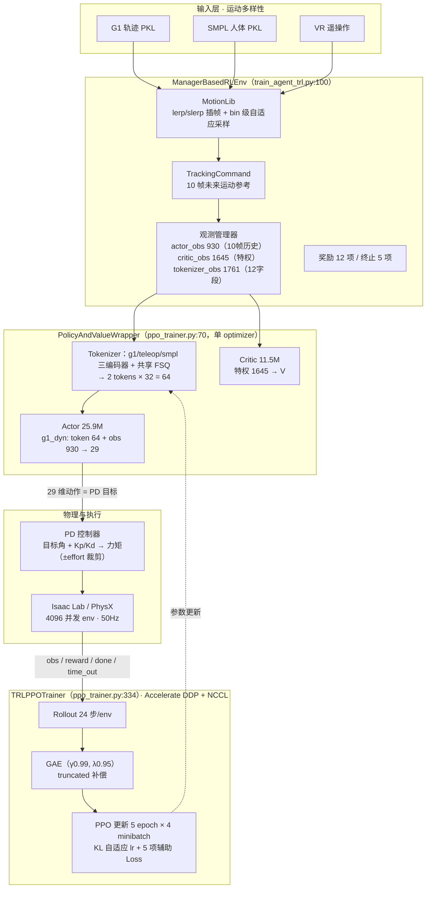
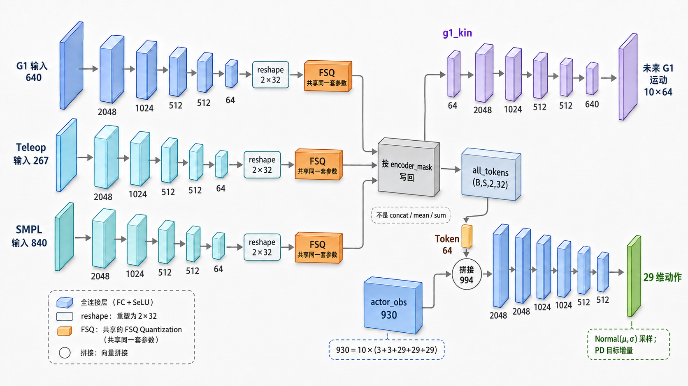

# SONIC 原版训练体系深度解析

> **版本**: v1.7 — 2026-09-08（v1.1 对抗性外审修订+源码实证；v1.2 编辑性修订；v1.3 补写 §6 任务定义；v1.4 章节重排；v1.5 上游核对 fork 锚点；v1.6 新增网络层级图并澄清 FSQ 路由/写回语义；v1.7 新增 §3.1 具体数值样本，逐步展开输入、完整 64 标量 Token、batch 写回、994 维拼接与 29 维动作）
> **provenance（本报告口径）**：官方基线 `origin/main@0e35637`（`NVlabs/GR00T-WholeBodyControl`，本地 `git rev-parse origin/main`），辅助对照 fork `feature/mujoco-npu-experiments@9d43e46`（2026-09-03 fetch 更新；该分支另含 v18 接触对齐模型，与本报告口径无关）。下文所有源码行号如无特别标注，均属官方基线 `origin/main@0e35637`；凡涉 `stub_env.py / stub_train.yaml` / MuJoCo 分支 / `std 0.05/1.0` 均明确标注为 fork 覆盖（`git diff origin/main HEAD` 可见），不计入原版。`origin/main` 上 `git cat-file -e origin/main:gear_sonic/envs/stub_env.py` 为 NOT found。resolved 主配置为官方 `sonic_release.yaml`（4096 env），checkpoint hash 不编造，以运行产物 `last.pt` 为准。
> **读法**：每节先讲设计意图，再贴原仓关键源码，最后解释为何这样做；不罗列名词，而是解释每个接口存在的理由。源码出处一律以**句尾括号**弱化标注（`文件:行号`），仅作复核线索，不是正文内容。
> **关联文档**: [MJWarp迁移报告] `MuJoCo_Warp架构与昇腾NPU全量迁移B路线报告.md` · [zhangqin分支审计] `SONIC_NPU适配深度报告_zhangqin分支.md` · 套件总览见《00_总览》
> **适用对象**: 需理解 SONIC 原版训练机制以支撑 NPU 适配评审的工程师
> **证据等级**: E1 源码行号实证 · E2 配置实证 · E3 文档/逻辑推断 · E4 外审转述未复核（图例详见《00_总览》）
>
> **原版 / fork 边界速查**（正文各处声明收敛于此表）：
>
> | 项 | 原版（origin/main@0e35637） | fork（mujoco-npu-experiments / zhangqin 分支） |
> |---|---|---|
> | 入口配置 | `sonic_release.yaml`（4096 env，100k iter） | `stub_train.yaml`（64 env，100 iter） |
> | 环境文件 | Isaac/PhysX；无 `stub_env.py` | 新增 `stub_env.py` / `mujoco_env.py` |
> | 探索 std 上下限 | `[0.001, 0.5]` | 覆盖为 `[0.05, 1.0]` |
> | dones 存储 | `dones`（= terminated\|truncated，`ppo_trainer.py:972`） | 新增 `_orig_done` 键（原版无此键，`git grep _orig_done origin/main` 为空） |
> | 迭代量级 | 100000 iter | 100（stub）/ 11000（A 路线实跑，E4） |

---

## 0. 一句话定位

SONIC（Supersizing mOtion tracking for Natural humanoId Control，NVIDIA 开源的全身控制训练体系）解决 **“一个控制器跟踪十万级异构动作”**。它不发明新 RL（Reinforcement Learning，强化学习）算法，而是把 **运动多样性卸载到统一 Token 表示**，让 PPO（Proximal Policy Optimization，近端策略优化：对单步策略更新幅度做裁剪的策略梯度算法）只学“如何把 Token 译成 29 维关节动作”。

下图回答“定位”的数据面问题：三类异构运动来源与本体历史经哪个中间表示、由谁执行为 G1 的关节控制。

```
G1 轨迹 / SMPL 人体 / VR 遥操作 ─┐
                              ├─→ 统一 Token (2 tokens × 32维=64) ─→ PD 控制器 → G1 (29 DoF @50Hz)
本体历史 (930) ──────────────────┘
```

**图的读法**：自左向右三段读。左端为三类异构动作来源（G1 轨迹与 SMPL 人体＝参数化人体模型动作，为两类 PKL 序列化数据文件；VR 遥操作＝真人戴 VR 设备演示生成的动作；格式与加载见 §2.1）；底部分叉汇入的“本体历史 (930)”是 10 帧堆叠本体观测 930 维（构成见 §2.3），它与 Token 汇合后才进入动作生成。中段“统一 Token (2 tokens × 32维=64)”是 SONIC 的核心中间表示（量化机制见 §3）。右端 PD 控制器（比例-微分控制：力矩＝Kp·位置偏差＋Kd·速度偏差）把网络输出译为力矩、驱动 G1 的 29 个旋转关节（DoF，自由度；动作语义见 §4.1），@50Hz 为控制频率。箭头全部指数据流向，方向自左向右，即部署/推理时的前向路径；训练回路（采样→更新→参数回写）不画入本图，见 §1.1 全景图 TRAIN 分组及其虚线。

* 上游只管产 Token（此处指运动的量化紧凑表示：每段参考运动被压成 2 个 32 维向量、共 64 维，详见 §3），下游只管跟 Token，中间是 SONIC。

| 项 | 数值 | 备注 |
|---|---|---|
| 模型参数（论文口径） | 约 42M | 与开源差 4.6M 未逐项核对（E3，或含 tokenizer/配置差异） |
| 模型参数（开源 release） | 约 37.4M | Actor 25.9M + Critic 11.5M |
| 数据规模 | BONES-SEED 约 14.2 万条 | 按 `commands.py:234-240` 的 `max_num_load_motions` 分批加载（E1）：为空且 `use_paired_motions` 时取全部 unique motions，否则取 `min(num_envs, 1024)`——“是否全驻内存”取决于该开关，不可一概而论 |

---

## 1. 总体训练框架

### 1.1 分层全景

训练入口唯一（`train_agent_trl.py:159`），由 Hydra（Meta 的分层配置框架：以 override 覆盖行增量拼装 YAML，换一行即可切换数据/模型/奖励）拼装。下图回答两个问题：训练体系由哪些部件组成；一次迭代中数据与梯度在部件间如何流动。分组自上而下即“输入→环境→模型→执行→训练引擎”的全链路，正是 §2→§5 的地图。



**图的读法**：本图即全文 §2→§5 的地图，各分组职责与其后章节的对应如下——

* **IN 输入层**：三类异构动作来源汇入动作库；PKL（pickle 序列化动作文件）与 SMPL、VR 数据的格式、帧率与加载见 §2.1（即图中 G1T/SMPL/VR→MLIB 三条边）。
* **MGR 管理器环境**（ManagerBasedRLEnv）：环境容器，持有动作库、跟踪指令与观测装配。MLIB＝MotionLib 动作库（插帧 lerp/slerp＝线性/球面插值、自适应采样，§2.1）；CMDM 的“10 帧未来运动参考”即 §2.2 B 组输入；OBSM＝观测管理器，即 §2.2/§2.3 详解的三头观测——tokenizer_obs 1761（12 字段）、actor_obs 930（10 帧历史）、critic_obs 1645（特权），分别供 TOK/ACT/CRI；RWD 奖励 12 项/终止 5 项见 §6。
* **MODEL 模型封装**（PolicyAndValueWrapper，单 optimizer 口径见 §6）：TOK＝Tokenizer（§3 的三编码器＋共享 FSQ）；ACT＝Actor（输入 token 64＋obs 930，输出 29）；CRI＝Critic（特权 1645 → V）。
* **EXEC 物理与执行**：PD 节点把 29 维输出按 Kp/Kd 译为力矩并裁剪（动作语义 §4.1）；ISAAC 节点承载 4096 并发 env @50Hz。
* **TRAIN 训练引擎**（TRLPPOTrainer）：ROLLOUT＝24 步/env 采样落盘（§5.2）→ GAE＝优势估计与 truncated 补偿（§5.3）→ PPOU＝PPO 更新（§5.4）；DDP（分布式数据并行：各卡采样/前向/反向、梯度 AllReduce 同步）＋NCCL（NVIDIA 集合通信库）为多卡同步设施（§5.3）。
* **箭头语义与阅读主线**：实线均为数据流——IN 经 MGR 装配观测、OBSM→TOK→ACT→PD→ISAAC 为一步前向推理，ISAAC→ROLLOUT（obs/reward/done/time_out）起转入训练回路；唯一虚线 PPOU -.-> TOK 是梯度/参数回写，非数据流。沿实线自上而下读一遍是推理路径（部署时仅保留 MGR 观测装配＋MODEL＋EXEC 这条竖线）；从 ISAAC 经 ROLLOUT→GAE→PPOU、再沿虚线回到 TOK，即学习闭环。
* **缩写速查**：FSQ＝有限标量量化器（§3）；GAE＝广义优势估计（§5.3）；PPO＝近端策略优化（§5.4）；其余缩写（PKL/SMPL/VR/lerp/slerp/DDP/NCCL）已见上文各分组行内。

release 配置用 8 个 `override`（Hydra 覆盖行：命令行上一条 `+group.name=value` 即可整体替换某组 YAML 配置）拼出一套完整训练（trainer / actor_critic / tokenizer / policy / critic / events / terminations / rewards，另有 5 个非 override 的 base 默认；`sonic_release.yaml:5`）。换一行配置即可切换数据、模型、奖励，这是 Hydra 在此仓的核心作用。

控制时序为 **50Hz**：`sim_dt 0.005 × decimation 4 = 0.02s`，回合上限 `episode_length_s 10.0`（`base_env.yaml:30`）。

### 1.2 启动流程：从入口到训练循环的组装时序

```python
# train_agent_trl.py:100, :459, :590（示意拼接，行号为各定义处）
env = ManagerBasedRLEnv(cfg=env_instance_cfg)
env = ManagerEnvWrapper(env, cfg)
policy = Actor(...)   # actor_critic_modules.py:18，backbone=UniversalTokenModule
value = Critic(...)   # actor_critic_modules.py:566，backbone=MLP
model = PolicyAndValueWrapper(policy, value)
trainer = TRLPPOTrainer(args, config, env, model, ...)
trainer.train()
```

**关键契约（仅 Isaac 路径；Isaac Lab＝NVIDIA 基于 PhysX 物理引擎的 GPU 并行机器人仿真框架）**：入口会用 `observation_space` 反向回填 `env.config.obs.obs_dims / group_obs_dims`（`train_agent_trl.py:430`）；`materialize_lazy_params` 是兼容性检查，仅当模型含未 materialize 的 `LazyLinear/LazyConv2d` 时才用 `env.reset()` 做一次 dummy 前向（`trl/utils/common.py:38`）——当前 release 不应断言一定存在 LazyLinear。fork 新增的 MuJoCo 分支则硬编码 `930/1645/1761`、不走该自适应路径（`train_agent_trl.py:379`），下文不再将其当作原版行为。

---

## 2. 训练的输入：从 PKL 到三头观测（1761 / 930 / 1645）

### 2.1 PKL 数据格式：可插帧的运动切片（非运行日志）

本节对应 §1.1 图的 IN 分组（G1T/SMPL/VR 三节点）与其汇入点、MGR 分组的 MLIB 节点。加载入口 `load_data` 支持单文件或目录；单条 PKL——Python pickle 序列化的运动数据文件，一条 PKL 即一段动作切片——解包后得到 `dof / pose_aa / root_rot / root_trans_offset / fps` 等字段。两类来源帧率不同：G1（Unitree G1 人形机器人，全身 29 个旋转关节，即 29 DoF（Degree of Freedom，自由度））轨迹约 30fps，SMPL（Skinned Multi-Person Linear Model，参数化人体模型；此处指其动作数据，以 24 关节 × 3 轴角＝72 维关节旋转序列描述人体运动）约 50fps；帧数均随动作长度而变、不固定（`motion_lib_base.py:364,367`）。

MotionLib（动作库模块：统一持有全部动作、负责驻内存存储/插帧采样/采样权重维护）初始化时把骨骼树（`skeleton_tree.from_mjcf`）、PKL 索引、采样权重载入内存，并预计算 `dof_pos / dof_vel / body_pos_w / body_quat_w` 全量张量（`__init__` / `load_motions`，`motion_lib_base.py:218,1006`）。运行时采样只做相邻两帧的 lerp（linear interpolation，线性插值：平移与关节角按权重直接混合）与 slerp（spherical linear interpolation，球面线性插值：旋转沿单位球最短弧过渡）混合、与磁盘无关（`get_motion_state`，`motion_lib_base.py:755`）——这是 4096 并发的前提。

```python
# 【源码摘录】motion_lib_base.py:755 get_motion_state（节选；"→"注释为本报告所加）
frame_idx0, frame_idx1, blend = self._calc_frame_blend(motion_times, motion_len, num_frames, dt)
f0l = frame_idx0 + self.length_starts[motion_ids]   # → 帧号→全局展平索引：所有动作串成一条大张量
f1l = frame_idx1 + self.length_starts[motion_ids]
...
body_pos_w = (1.0 - blend_exp) * body_pos_w0 + blend_exp * body_pos_w1      # → 平移：线性插值 lerp
body_lin_vel_w = (1.0 - blend_exp) * body_lin_vel_w0 + blend_exp * body_lin_vel_w1
if "dof_pos" in self.__dict__:  # Robot Joints
    dof_pos = (1.0 - blend) * local_rot0 + blend * local_rot1               # → G1 关节角：直接 lerp
else:
    local_rot = rotations.slerp(local_rot0, local_rot1, torch.unsqueeze(blend, axis=-1))  # → SMPL 旋转：球面插值
    dof_pos = self._local_rotation_to_dof_smpl(local_rot)
body_quat_w = rotations.slerp(body_quat_w0, body_quat_w1, blend_exp)        # → 四元数只 slerp，防插出非单位四元数
```

插值全部发生在**预计算好的张量**上（`load_motions` 一次性 `joblib.load` 全部 PKL 并展开为帧张量），运行时零磁盘 IO——这是 4096 env 并发采样的前提，也是 zhangqin 分支改为“逐 env 各自加载 + 截断取帧”后丢失的性质（见 [zhangqin分支审计] §2.6）。

采样分旧、新两套机制，不可混写（`origin/main@0e35637` 口径）：

* 旧版 motion-level：按采样概率抽整条 motion（`load_motions`，`motion_lib_base.py:1071`），再按终止历史更新权重（`update_soft_sampling_weight:491`）。
* 当前 bin-level：每条动作按 `bin_size 50` 切 bin（`init_adaptive_sampling`，`motion_lib_base.py:2258`；`motion.yaml` 基线 `enable: true`），逐 bin 维护失败率（`update_adaptive_sampling_probabilities:2558`）。release 仅覆盖 `adp_samp_failure_rate_max_over_mean: 200`（基线 50.0，`sonic_release.yaml:71`），继承基线的 `enable: true`，故实际走 bin-level；该参数先裁剪 failure_rate（取 `mean×multiplier` 上限，`motion_lib_base.py:2571,2705`），最终概率还经归一化与 `uniform_sampling_rate 0.1` blending，不能读成“最终概率最多200倍”。

数据来自 BONES-SEED 数据集（本仓配套的大规模动作库，约 14.2 万条，含 G1 轨迹与 SMPL 人体两类切片），路径为 `data/motion_lib_bones_seed/robot_filtered` 与 `data/bones_seed_smpl`（`smpl_y_up: true` 做 Y-up 转换；`sonic_release.yaml:72`），可配 `filter/remove/max_unique_motions` 做子集实验。

### 2.2 tokenizer 观测 1761 维的三组构成：A 路由 / B 未来参考 / C 人体与遥操作

tokenizer（运动编码前端：把下列观测编码并量化为 Token 的模块，结构详 §3）的编码器（Encoder：将某一模态输入压缩为连续特征向量的子网络）输入由 12 个观测字段组成，即图中 OBSM 节点标注的 tokenizer_obs 1761（`unitoken_all_noz.yaml`，配置类 `TokenizerCfg` 见 `observations.py:363`），按功能分三组：

**A. 这是谁的数据（3维）**
`encoder_index 3` 为 legacy 多热（multi-hot：向量中可同时多位为 1，区别于仅一位为 1 的单热 one-hot）路由，决定激活 `g1`、`teleop`（teleoperation 遥操作：真人戴 VR 头显/手柄实时演示生成的动作数据）与 `smpl` 三类 Encoder 中的哪几个（`universal_token_modules.py:518 create_encoder_masks`，掩码含 `g1_has_smpl / teleop_has_smpl` 等交集）。SMPL 原生 env 典型为 `[1,0,1]`（G1 与 SMPL 同时激活以提供配对 latent——latent 即编码器输出的连续特征向量（潜变量），后文“配对 latent”指同一动作两种模态各自编码出的对应表示），触发 `teleop_sample_prob_when_smpl 0.5` 时可为 `[1,1,1]`。（E3 提示：多热语义为 `create_encoder_masks` 实证；“典型值 [1,0,1]”的原版运行时出处待补，现有旁证含 fork stub 复刻 `stub_env.py:670`，仅能证明 fork 作者的理解。）

**B. 未来要去哪（650 维：G1 未来 + 高度 + 朝向差）**
G1 主输入是 `command_multi_future_nonflat（10帧×关节角+速度）`（图中 CMDM 节点“10 帧未来运动参考”即此），`dt_future_ref_frames 0.1`（`sonic_release.yaml:49`）对应 `arange(10)×0.1`（`commands.py:354`），即 10 个采样点、间隔0.1秒、末点约+0.9秒（非严格“1秒预视”）；`command_z_multi_future` 单抽高度因高度对平衡最敏感（设计动机推断，E3）；`motion_anchor_ori_b_mf_nonflat（10×6D）` 是参考根与机器人根的朝向差。**为何用6D（旋转矩阵前两列）而不用四元数**（`observations.py:1022`）：核心优势是避免四元数 ±q 双覆盖导致的回归目标不连续（Zhou et al. 2019）；万向锁是欧拉角的问题、四元数本身也连续可导，故“无万向锁”不是 6D 相对四元数的卖点。

**C. 人体/遥操作在参考系下长什么样（1108 维）**
统一 `tokenizer_obs` 容器中的三类相关槽位为：G1 `580 + 10 + 60 = 650`，Teleop `240 + 9 + 12 + 6 + 1 = 268`，SMPL `720 + 60 + 60 = 840`。但**容器槽位不等于 release Encoder 的实际选入维度**：`sonic_release.yaml:87-107` 覆盖输入列表后，G1 Encoder 不取 `command_z_multi_future 10`，实取 `580+60=640`；Teleop Encoder 不取 `command_z 1`，实取 `240+9+12+6=267`；SMPL Encoder 三项全取，仍为 `840`。因此后文网络层输入口径为 **G1/Teleop/SMPL = 640/267/840**，而 `650/268/840` 只用于解释 1761 容器的字段占位（E2；58D/72D/21D 为单帧切片口径，不能代替完整输入）。
`local` 不可一概读成“减参考根平移+航向”：各字段分别使用完整姿态差（`subtract_frame_transforms`）、仅去航向（`quat_apply_yaw`，`observations.py:816`）、或预处理后的 root-relative 数据（`vr_3point_local_target:1348`）。共性是网络看到的是去全局后的相对结构，这是跨 embodiment 可迁移的关键，但具体 canonicalization 需按字段查 `observations.py`，不可合并表述。

三组求和 `3 + (580+10+60) + (240+9+12+6+1) + (720+60+60) = 3 + 650 + 268 + 840 = 1761`，与入口常量 `TOKENIZER_OBS_DIMS` 一致（`train_agent_trl.py:348`）。其中的 `+1` 为 teleop 组的标量高度指令 `command_z`（`unitoken_all_noz.yaml` 第 9 项；`observations.py:528`，shape `(num_envs, 1)`，E1）。release 另设 `teleop_sample_prob_when_smpl 0.5` 与 `cat_upper_body_poses 0.5`（`sonic_release.yaml:48`），让 SMPL env 以一半概率叠加遥操作/上身增强，增加组合多样性。

**噪声**：tokenizer 侧的 `enable_corruption: true` 对朝向与 SMPL 关节加 `±0.05` 均匀噪声（`unitoken_all_noz.yaml:20`；`local_dir_hist.yaml:17` 对 actor 的 gravity/ang_vel/joint 亦然）。这是为 Sim2Real（仿真到真机的迁移）预留的域随机化（设计动机推断，E3），不是后加的 trick。

---

### 2.3 本体与特权观测：930 历史堆叠与 1645 特权输入

三头观测的另外两路由本节补完——至此 §1.1 图 OBSM 节点的三路输出（tokenizer 1761 / actor 930 / critic 1645）讲齐。


`actor_obs`（Actor 的输入观测；Actor 即策略网络——PPO 中被优化、直接输出动作的一方）由 `gravity 3 + ang_vel 3 + joint_pos 29 + joint_vel 29 + actions 29 = 93` 堆叠 10 帧得 `930`（`local_dir_hist.yaml:1`；`history_length 10` 见 `sonic_release.yaml:30`，prop 与 action 各 10）。该 930 即 §1.1 图 OBSM 节点标注的 actor_obs，下文 critic 的 1645 特权观测亦由同一节点装配（对应图中 OBSM→CRI 边）。**该堆叠主要由环境 Observation Manager 完成**；Actor 侧另有 rollout（推演采样：用当前策略在环境里跑若干步收集数据）buffer（`_update_obs_buffer`，`actor_critic_modules.py:355`），但本配置下 `max_rollout_history` 默认为 1——10 帧记忆来自环境侧而非 Actor 自维护。历史的作用是让无 RNN（循环神经网络）的 MLP（多层感知机，无状态的前馈网络）隐式看到加速度、接触相位等更长时标信息（速度本身已在单帧观测中），改善对非 Markov 动力学的近似。

critic（价值网络：拟合状态价值 V 以计算优势、仅在训练期使用的 Actor-Critic 另一半）的特权观测（privileged observation：仅训练期可见、部署时不可得的额外信息，如未来参考与仿真内部状态）共 10 组、合计 `1645`（`privileged_mf_hist.yaml`；配置类 `PrivilegedCfg` 见 `observations.py:280`），但**并非 10 组全部 history=10**：仅 `base_lin/ang_vel、joint_pos/vel、actions` 设了 `history_length`，`command_multi_future、anchor、body_pos/ori` 为单步或未来窗。逐项口径（E2，由 10 项配置 + release `critic_*_history_length=10` 重构）：

```
command_multi_future 580 + motion_anchor_pos_b 3 + motion_anchor_ori_b 6
+ body_pos 42 + body_ori 84            # 14 body × 3 / × 6
+ base_lin_vel 30 + base_ang_vel 30    # 3 × hist10
+ joint_pos 290 + joint_vel 290        # 29 × hist10
+ actions 290                          # 29 × hist10
= 1645
```

（body 42/84 与 [zhangqin分支审计] §2.4 的 `body_pos_b(42)/body_ori_6d(84)` 枚举互证。）这是**非对称 Actor-Critic**：训练时 Critic 多看未来参考与特权状态以降低价值方差，部署时丢弃；代价是对仿真特权有依赖，换域时需重估。

---

## 3. 模型结构设计：三编码器 + 共享 FSQ + 双解码器

本节展开 §1.1 图 MODEL 分组三个节点（TOK/ACT/CRI）的内部结构与设计取舍。模型关键超参（`all_mlp_v1.yaml:30`）：



**图 3-1　网络层级与张量流（E1/E2）**：三条 Encoder 均输出连续 `2×32` latent，再**分别调用同一个 FSQ 实例**完成量化；“共享”指共用量化器及其档位规则，不表示把三路 Token 做 `concat / mean / sum`。`assemble_all_tokens` 先创建 `(B×S,2,32)` 零张量，再执行 `all_tokens[encoder_masks[name]] = encoded_tokens[name]`，把各 Encoder 结果按样本行写回，最后 reshape 为 `(B,S,2,32)`（`universal_token_modules.py:542-574`，E1）。主控制支路将末两维展平为 64，与 `actor_obs 930` 拼成 994 后进入 `g1_dyn`；上方 `g1_kin` 是辅助运动学重构支路。

这里的“变成一个 Token 张量”是**batch 对齐**而非特征融合：单热/互斥掩码下，每个 `(B,S)` 行只由对应模态填充；legacy 多热掩码发生行重叠时，循环中后遍历的 Encoder 会覆写同一行的先前结果，而各模态原始 `encoded_tokens` 仍分别保存在字典中供 latent 对齐等辅助损失使用（赋值逻辑 E1；当前配置顺序 `g1→teleop→smpl` 为 E2）。

### 3.1 一个具体数值样本：Token 到底长什么样

> **口径说明**：本小节的维度、字段顺序和写回机制来自源码/配置（E1/E2）；具体数值是为解释张量外观而构造的合成样本（E3），不是官方 checkpoint 的真实运行输出。真实训练中这些张量通常为 `float32`，此处为可读性只保留两三位小数。

先把 batch 缩小为 `B=3, S=1`：第 0 行放一条 G1 样本，第 1 行放一条 Teleop 样本，第 2 行放一条 SMPL 样本。互斥路由可写成：

```python
encoder_index = [
    [1, 0, 0],  # batch row 0 → G1 Encoder
    [0, 1, 0],  # batch row 1 → Teleop Encoder
    [0, 0, 1],  # batch row 2 → SMPL Encoder
]
```

三种 Encoder 输入首先都是普通的浮点数，不是文字或离散 Token。以下只展开每个大向量中有物理意义的局部片段：

```python
# G1：每个未来时刻 29 个关节角 + 29 个关节速度 + 6D 根朝向 = 64
g1_frame_0 = [
    0.06, -0.12, 0.31, ..., 0.03,       # q[0:29]，rad
    0.21, -0.08, 0.44, ..., -0.14,      # dq[0:29]，rad/s
    0.999, 0.012, -0.005, -0.011, 0.998, 0.021,  # root orientation 6D
]
# 共 10 个未来时刻：10 × 64 = 640 个 float

# Teleop：下半身未来参考 240 + 三点位置 9 + 三点朝向 12 + 根朝向 6 = 267
teleop_example = {
    "lower_body_first_values": [0.03, -0.17, 0.42, 0.09, ...],
    "vr_xyz_m": [0.08, 0.02, 1.61,  -0.31, 0.18, 1.24,  0.34, 0.17, 1.22],
    "vr_orientation": [0.99, 0.01, -0.03, 0.00, 0.98, 0.06, ...],
    "anchor_orientation_6d": [1.00, 0.00, 0.01, -0.01, 1.00, 0.02],
}

# SMPL：每个未来时刻 72 维人体关节 + 6D 根朝向 + 6D 手腕 = 84
smpl_frame_0 = [
    0.01, -0.04, 0.13, ..., -0.09,      # joints[0:72]
    0.998, 0.015, -0.020, -0.012, 0.999, 0.018,  # root orientation 6D
    0.94, -0.08, 0.12, 0.05, 0.97, -0.16,       # wrist 6D
]
# 共 10 个未来时刻：10 × 84 = 840 个 float
```

以第 2 行 SMPL 样本为例，`SMPL Encoder` 的 MLP 将 840 个输入数映射为 64 个连续 latent，并 reshape 成两行、每行 32 个数。下面完整写出这 64 个标量；两行分别就是 Token 0 和 Token 1：

```python
smpl_latent_before_fsq = [
  [-1.28, -0.76, -0.31,  0.04,  0.20,  0.61,  1.14,  0.98,
   -0.58, -0.12,  0.27,  0.73, -0.42,  1.39,  0.11, -1.05,
    0.36,  0.64, -0.05, -0.71,  0.83, -0.19,  0.47,  1.22,
   -0.93,  0.07,  0.69, -0.54,  0.23,  1.08, -0.28,  0.57],

  [ 0.41,  0.33, -0.96, -0.07,  0.78, -0.49,  0.15,  1.31,
   -0.67,  0.58,  0.01, -0.88,  1.02, -0.22,  0.46, -0.35,
    0.91, -1.09,  0.12,  0.72, -0.57,  0.29,  1.25, -0.16,
    0.63, -0.40,  0.06,  0.82, -0.79,  0.50, -0.04, -1.01],
]  # shape = (2, 32)
```

FSQ 对这 64 个数**逐个标量**量化：每一维只能落到该维的 32 个有限档位之一。量化前后的 shape 不变，改变的是可取数值集合。下面是同一样本量化后的教学示意值（显示值已经四舍五入，所以只表达“落格点”的外观，不用于复算源码中的精确档位中心）：

```python
smpl_token_after_fsq = [
  [-0.81, -0.61, -0.29,  0.03,  0.16,  0.42,  0.68,  0.74,
   -0.48, -0.10,  0.23,  0.55, -0.35,  0.87,  0.10, -0.74,
    0.29,  0.48, -0.03, -0.55,  0.61, -0.16,  0.35,  0.81,
   -0.68,  0.06,  0.52, -0.42,  0.19,  0.77, -0.23,  0.45],

  [ 0.32,  0.26, -0.71, -0.06,  0.58, -0.39,  0.13,  0.84,
   -0.52,  0.45,  0.00, -0.65,  0.74, -0.19,  0.36, -0.29,
    0.68, -0.77,  0.10,  0.55, -0.45,  0.23,  0.81, -0.13,
    0.48, -0.32,  0.06,  0.61, -0.58,  0.39, -0.03, -0.74],
]  # 仍是 shape = (2, 32)，dtype 仍是浮点数
```

G1 与 Teleop 分支也分别得到自己的两个 32 维 Token。`assemble_all_tokens` 不把三者横向拼成 `6×32`，而是按 mask 放回 batch 的不同行：

```python
all_tokens[0, 0] = g1_token       # 一个具体的 2×32 矩阵
all_tokens[1, 0] = teleop_token   # 另一个 2×32 矩阵
all_tokens[2, 0] = smpl_token_after_fsq

# 因而 all_tokens.shape == (B=3, S=1, 2, 32)
```

对第 2 行样本进入 `g1_dyn` 时，只把它自己的上述两行首尾相接：

```python
token_flattened = [
    # 先放 Token 0 的 32 个数
    -0.81, -0.61, -0.29, ..., -0.23, 0.45,
    # 再放 Token 1 的 32 个数
     0.32,  0.26, -0.71, ..., -0.03, -0.74,
]  # length = 64

actor_obs = [
    0.01, -0.03, -0.999,              # 某帧局部重力方向
    0.12, -0.08, 0.04,                 # 某帧基座角速度
    0.05, -0.11, 0.27, ...,            # 关节角/速度/历史动作
]  # length = 930

g1_dyn_input = token_flattened + actor_obs  # 64 + 930 = 994 个 float
```

最后，`g1_dyn` 将这 994 个数映射为 29 个动作均值。某一步的合成输出可能长这样：

```python
action_mean = [
   0.04, -0.02,  0.08, -0.11,  0.05,  0.02, -0.06,  0.09,
  -0.03,  0.01,  0.07, -0.05,  0.12, -0.08,  0.03, -0.04,
   0.06, -0.02,  0.10, -0.07,  0.05, -0.01,  0.03, -0.09,
   0.04,  0.02, -0.05,  0.08, -0.03,
]  # length = 29；每项对应一个 G1 受控关节
```

训练时 Actor 以该 29 维均值和可学习标准差构造 `Normal(mean, std)` 再采样；执行端将采样值解释为默认关节角附近的 PD 目标增量，而不是直接力矩（详见 §4.1）。所以从“数据长相”看，整条链路始终是在传递浮点张量：**物理观测浮点数 → 连续 latent 浮点数 → 限定在离散档位上的 Token 浮点数 → 29 个动作浮点数**。

```yaml
num_fsq_levels: 32      # 每个 Token 的维度
fsq_level_list: 32      # 每维量化档数
max_num_tokens: 2       # Token 个数 = 10帧 / 2^down_t(2) 的下采样结果（10 // 4 = 2，整除；源码依据见下）
proprioception_features: ["actor_obs"]
encoder_sample_probs: {g1:1, teleop:1, smpl:1}
```

* **为何分三编码器？** 三种示范的单帧维度与语义不同（G1 58D vs SMPL 72D vs VR 21D），硬拼会污染梯度。分编码器 + 共享 FSQ 是多模态对齐的最简解。release 实际编码输入为 G1 640、Teleop 267、SMPL 840（字段选择见 `sonic_release.yaml:87-104`，E2）。
* **为何 FSQ 而非 VQ？** FSQ（Finite Scalar Quantization，有限标量量化：把向量每一维独立落到有限个标量档位上）无需 VQ（Vector Quantization，向量量化：需学习码本并做最近邻查找）的码本——量化器把每维按档量化（`universal_token_modules.py:221`），经 STE（Straight-Through Estimator，直通估计器：前向用量化值、反向把梯度直通回连续输入，绕过量化不可导问题）保持可导。`2 tokens × 32维 = 64` 扁平后与 930 拼成 994 送解码器（decoder：从 Token 还原出运动/动作输出的子网络）。2 是 10 帧 4 倍时域下采样的结果，兼顾时序与紧凑。
* **为何两个解码器？** `g1_kin`（`all_mlp_v1.yaml:57`）输入 Token 输出 10 帧未来运动，只做重构；`g1_dyn` 输入 Token+本体输出 29 维动作，只受 PPO 驱动。**运动理解与力控执行解耦**。

```python
# 【源码摘录】universal_token_modules.py:227-236（量化器初始化；"→"注释为本报告所加）
self.down_t = down_t                                              # → 时域下采样指数，默认 2（4 倍下采样）
if max_num_tokens is not None:
    self.max_num_tokens = max_num_tokens
else:
    self.max_num_tokens = max(1, self.num_future_frames // (2**self.down_t))  # → 10 // 4 = 2：整除，token 数由此确定
self.token_total_dim = self.token_dim * self.max_num_tokens       # → 32 × 2 = 64，即扁平后的 token 维度
```

```python
# 【源码摘录】universal_token_modules.py:518 create_encoder_masks（节选）——多热路由的机制证据
encoder_mask_combinations = [
    ("g1",    "smpl",   [("g1_has_smpl",     "smpl",   "g1")]),   # → g1 中有配对 SMPL 的样本子集
    ("teleop","smpl",   [("teleop_has_smpl", "smpl",   "teleop"),
                         ("smpl_has_teleop", "teleop", "smpl")]),
    ("g1",    "teleop", [("g1_has_teleop",   "teleop", "g1")]),
    ...
]
for key1, key2, mask_defs in encoder_mask_combinations:           # → 交集掩码由布尔索引派生：
    if key1 in encoder_masks and key2 in encoder_masks:          #   同一 env 可同时激活多个编码器
        for mask_name, mask_src, mask_cond in mask_defs:
            encoder_masks[mask_name] = encoder_masks[mask_src][encoder_masks[mask_cond]]
```

交集掩码机制即 §2.2 A 组“多热”的直接证据（E1）：`encoder_index=[1,0,1]` 时 g1 与 smpl 两个编码器都计算该样本的表示，配对 latent 喂给 §3.2 辅助 Loss 路径 A；进入动作解码器的 `all_tokens` 则遵循图 3-1 与 §3.1 所述按行写回/重叠覆写机制，不是把二者融合。

### 3.2 辅助损失：release 默认双向对齐，仅 compliance 路径单向蒸馏

辅助损失共 5 项系数：`g1_recon 0.01`，其余 4 项各 `1.0`，均为 `mse`（Mean Squared Error，均方误差损失；`g1_recon_and_all_latent.yaml:11`）。但实现要分两套路径看：

**路径A（release 默认启用）**：G1↔SMPL 配对损失直接取两侧 `encoded_latents` 算 MSE（`G1SmplLatentLoss`，`token_losses.py:589`）；`TeleopSmpl`、`G1Teleop` 同理（`:629/:678`）。Loss 内部**没有显式 `.detach()`**，掩码由 tokenizer 侧的交集逻辑生成（`universal_token_modules.py:522`）。结论：在 `encoded_latents` 非 rollout 期 `no_grad` 缓存、且两侧编码器均在 optimizer 参数组内这两个前提下，**梯度同时回两侧编码器，是双向拉齐**，不是“冻结教师、只训 SMPL”（两前提未逐行核验，实证以本节末尾的梯度范数打印为准）。

**路径B（compliance-aware paired）**：teacher 侧被显式 `.detach()`（`universal_token_modules.py:977,1012`；注释 `:974` 称固定 target 以省显存）后再送各 compliance 损失（`G1SmplCompliance:819 / TeleopSmplCompliance:896 / ReencodedCompliance:989`）。**只有这套才是单向 teacher→student**，且仅在含 `compliance` 观测的训练中生效。detach 相关注释（`token_losses.py:832` 起）指的也是这一套，不能拿来解释 release 默认 Loss。

`ReencodedSmplG1` 比较 `reencode(kin_decode(smpl))`（经 g1_kin 解码器 + G1 重编码，带梯度）与原 G1 配对 latent（`:776`），梯度会同时影响 SMPL 编码器、kin 解码器与重编码支路；`G1Recon` 重构原始 tokenizer obs（`:528`）。两计算图差异较大，建议补一次反向后三组 encoder 的梯度范数（如 `p.grad.norm()` 分 encoder 打印）来实证，而非仅凭注释推断。

---

## 4. 训练的输出：从 Token 到 29 维动作

模型（§3）把 tokenizer 1761 编码为 2×32 的 Token、与本体 930 拼接后解码为本章的 29 维动作——这是前向路径的最后一跳，对应 §1.1 图 ACT→PD 边的语义。


### 4.1 动作语义：29 维 PD 目标角（非直接关节角）

```python
# universal_token_modules.py:751 forward（示意）
tokenizer_obs = parse_tokenizer_obs(input_data)  # 1761 切 12 段
all_tokens = assemble_all_tokens(encoded_tokens, masks)  # (B,S,2,32)
action_mean = decoders["g1_dyn"](flatten(token) 64 + actor_obs 930 = 994)  # → 29
```

`action_mean` 通过 Actor 的 `update_distribution` 用 `Normal(mean, std)` 采样得 29 维（`actor_critic_modules.py:260`）。图中 ACT→PD 边标注的“29 维动作 = PD 目标”即本节语义：ACT 节点输出增量、EXEC 分组 PD 节点译为力矩。原版不直接输出关节角，而是走 IsaacLab 的 `JointPositionActionCfg`（`use_default_offset: true`，`actions/terms/joint_pos.yaml:2`）：**网络输出增量（与关节角同单位，rad 量级，非严格“无量纲”），先加默认关节偏置得目标角，再经 PD 控制器（Proportional-Derivative，比例-微分控制：力矩＝Kp·位置偏差＋Kd·速度偏差，Kp/Kd 即逐关节的刚度/阻尼增益）算力矩并裁至 `±effort` 与关节限位**；最外层再裁 `action_clip_value 20.0`（`base_env.yaml:64`）。逐关节的刚度/阻尼/力矩上限由 G1 资产定义——**不同关节的同一数值含义不同**，这是跨引擎必须先对齐动作语义的原因。

---

## 5. 训练引擎：单次迭代的执行流程与数据量

本节沿 §1.1 图 TRAIN 分组的三节点链 ROLLOUT→GAE→PPOU 走一遍单次迭代，DDP＋NCCL 多卡同步见 §5.3。

### 5.1 数据量公式（以 release 配置为准）

release 并行规模为 4096 env × 每 env 24 步（`sonic_release.yaml:27,79`；基类默认 32，release 覆盖为 24，见 `ppo_im_phc.yaml:32`），更新为 5 epoch（轮：同一批 rollout 数据被重复遍历的次数）× 4 minibatch（小批：每轮内切出的子批，每个子批做一次梯度更新）（`ppo_im_phc.yaml:10`）：

```
单 rank rollout = local_num_envs × 24
全局 rollout = 单 rank rollout × world_size   # ppo_trainer.py:534 batch_size = local_batch_size × world_size
PPO 更新 = 5 epoch × 4 minibatch = 20 次梯度
```

以 release 单 rank 4096 env 为例，全局 batch = 98,304 transitions；`100000 iter（ppo_im_phc.yaml:39）× 98k ≈ 98亿` **必须注明是单 rank 口径**，多 rank Isaac 下 `num_envs` 为每 rank 数，全局量还需乘 `world_size`。fork 配置把迭代改为 100、env 改为 64（`stub_train.yaml:74`），仅为 fork 验证模式（见附录 A），不计入原版总量。

### 5.2 Rollout：训练器只做采样与落盘

```python
# ppo_trainer.py:922（原循环，去注释）
for i in range(self.num_steps_per_env):
    policy_state_dict = self.policy_step(policy_model, obs_dict, cur_dones=dones)  # Actor:405 rollout
    self.storage.update_key(key, value)        # obs / actions / logprob 落盘 :942
    obs_dict, rewards, dones, infos = self.env.step(policy_state_dict)  # :954
    self.storage.update_key("dones", dones.unsqueeze(1))                # :972 原版
    self.storage.update_key("time_outs", infos["time_outs"].unsqueeze(1))  # :973
```

Actor 侧的 rollout buffer 在本配置下默认 `max_rollout_history=1`（`_update_obs_buffer`，`actor_critic_modules.py:355`；10 帧记忆来自环境 Observation Manager，见 §2.3，此处不再称“Actor 维护10帧滑窗”），reset 清零防泄漏。`env.step` 返回的已是新 episode 首帧，trainer 无需手动 reset。原版存储的 `dones` 即 wrapper 返回的 `terminated|truncated` 合并值（terminated＝摔倒等失败条件触发的真实终止，truncated＝动作播完/回合时限到达的人为截断，二者都置 done=1 但语义不同；`manager_env_wrapper.py:856`）；`_orig_done` 键为 fork 新增（用于区分截断与终止，见 [zhangqin分支审计] §6），原版不存在该键（E1：`git grep _orig_done origin/main` 为空）。

### 5.3 GAE 截断补偿：机制与数值示例

GAE（Generalized Advantage Estimation，广义优势估计：以 γ 折扣、λ 加权融合多步 TD 残差来估计优势函数，降低价值估计的方差）计算 returns 时，先对截断步做如下补偿（写回 storage 的 rewards 已含 bootstrap 项；图中 TRAIN 分组 GAE 节点标注的“truncated 补偿”即此）：

```python
# 【源码摘录】ppo_trainer.py:988-997 —— truncated 补偿（写回 storage 的 rewards 已含 bootstrap 项；"→"注释为本报告所加）
all_values = self._chunked_value_evaluate(value_model, all_obs_dict, episode_attnmask).transpose(0, 1)
values, last_values = all_values[:-1], all_values[-1]   # → values = 各步估值；last_values = 末步之后状态的 bootstrap 值
rewards = self.storage.query_key("rewards")
new_rewards = (
    rewards.to(device)
    + self.gamma * self.storage.query_key("time_outs").to(device) * values  # → 仅 time_outs=1（截断）的步加 γ·V：
)                                                                           #   顺利播完不被当作“终止”而丢掉未来价值
self.storage.batch_update_data("rewards", new_rewards)
```

```python
# 【源码摘录】ppo_trainer.py _compute_returns（核心循环；"→"注释为本报告所加）
for step in reversed(range(num_steps)):                  # → 从 rollout 末步向前递推
    if step == num_steps - 1:
        next_values = last_values                        # → 末步用 bootstrap 值
    else:
        next_values = values[step + 1]
    next_is_not_terminal = 1.0 - dones[step].float()     # → done=1（含 truncated）时 V_next 贡献清零——
    delta = rewards[step] + next_is_not_terminal * self.gamma * next_values - values[step]
    #                                                  ↑ 与上面的补偿配合：截断步的价值已折入 rewards，
    #                                                    这里清零 next_values 才不丢信息（补偿与门控成对出现）
    advantage = delta + next_is_not_terminal * self.gamma * self.lam * advantage
    returns[step] = advantage + values[step]
```

* `terminated`（摔倒）：`done=1, time_outs=0`，`V_next` 归零，合理。
* `truncated`（播完或 10s 回合上限）：`done=1, time_outs=1`。**前提实证（E1）**：“播完”终止项在配置 `motion_time_out` 中注册、且带 `time_out: true` 标志（`terminations/terms/motion_time_out.yaml`）——IsaacLab 将带此标志的终止项计入 truncated 而非 terminated；wrapper 随后置 `extras["time_outs"] = truncated`（`manager_env_wrapper.py:913`；`dones = terminated|truncated` 见 `:856`）。若不补偿，`delta = r - V` 会给正常结束一个负 Advantage（示意：若 `r=0.4, V=2.8` 则 `delta=-2.4`）。补偿后 `r'=r+γV`（示意约3.17，`delta`转正）——这是对截断的**偏差修正**（bootstrap 终值，`delta` 转正依赖 `V_next` 足够大，并非必然），不是额外奖励。

随后 `accelerator.gather`（Accelerate＝HuggingFace 的分布式封装库；DDP＝Distributed Data Parallel 分布式数据并行：各卡各自采样/前向/反向、梯度经 AllReduce 同步，通信走 NCCL——NVIDIA 的 GPU 集合通信库）做全局 `(A-mean)/std`（`ppo_trainer.py:498` 附近逻辑），保证多卡统计一致。

### 5.4 PPO Clip 与 KL 自适应

```python
ratio = exp(logπ_new - logπ_old)
pg = max(-A*ratio, -A*clamp(ratio, 1-ε, 1+ε))                 # ε = clip 0.2 见 ppo_im_phc.yaml:12
vf = max((V-ret)², (V_old + clamp(V-V_old, ±ε_v) - ret)²)     # clamp 相对 V_old（ppo_trainer.py:1386-1389），非绝对限幅
loss = pg + 1.0*vf + entropy_coef*(-entropy) + Σ aux          # vf 1.0, entropy 0.01 见 :15
```

这里的 `clip+max` 是悲观估计。`entropy_coef 0.01` 与可学习 `std`（`actor_critic_modules.py:116`）对抗形成探索-利用权衡；探索 std 上下限官方基线为 `[0.001,0.5]`（`sonic_release.yaml:80`；`bones_seed:75 / h2:72` 同），fork diff 将其覆盖为 `[0.05,1.0]`（`git diff origin/main HEAD` 可见），读数时以前者为准。学习率按 KL（Kullback-Leibler divergence，KL 散度：新旧策略概率分布的差异，衡量单次更新偏离旧策略的程度）自适应（图中 PPOU 节点标注的“KL 自适应 lr”即此）：`desired_kl 0.01`（`ppo_im_phc.yaml:22`），`>2×` 则 ÷1.5、`<0.5×` 则 ×1.5（`_adjust_learning_rate_based_on_kl`，`ppo_trainer.py:2155` 起），并钳在 `[1e-5, 2e-4]`。

```python
# 【源码摘录】ppo_trainer.py:2155-2167 —— KL 自适应学习率（"→"注释为本报告所加）
if kl_mean > self.desired_kl * 2.0:
    new_lr = max(self.adaptive_lr_min, self.args.learning_rate / 1.5)   # → KL 超标：缩步长（少动旧策略）
elif kl_mean < self.desired_kl / 2.0 and kl_mean > 0.0:
    new_lr = min(self.adaptive_lr_max, self.args.learning_rate * 1.5)   # → KL 过小：放大步长（加快拟合）
else:
    new_lr = self.args.learning_rate
for param_group in optimizer.param_groups:
    param_group["lr"] = new_lr                                          # → 单 optimizer，全部参数组统一改 lr
```

```python
# 【源码摘录】ppo_trainer.py:1386-1394 —— value clip（相对 V_old，非绝对限幅）
vpredclipped = torch.clamp(
    vpred,                                    # → 新估值 V
    mb_values - args.cliprange_value,         # → 下界 = V_old − ε_v
    mb_values + args.cliprange_value,         # → 上界 = V_old + ε_v
)
vf_losses1 = torch.square(vpred - mb_return)
vf_losses2 = torch.square(vpredclipped - mb_return)
vf_loss_max = torch.max(vf_losses1, vf_losses2)   # → 悲观取大：与 pg 的 clip+max 同型
```

---

## 6. 任务定义：奖励、终止与事件（原版 release）

本节对应 §1.1 图 MGR 分组的 RWD 节点与事件注入——**奖励回答"跟得多像"，终止回答"差到何时重来"，事件回答"对什么扰动鲁棒"**，三者共同定义"跟踪"任务。release 用三个 override 分别锁定 `rewards: tracking/base_5point_local_feet_acc`、`terminations: tracking/base_adaptive_strict_ori_foot_xyz`、`events: tracking/level0_4`（`sonic_release.yaml`）。

### 6.1 配置总览

| 维度 | 原版配置 | 出处 |
|---|---|---|
| 物理 | Isaac Lab + PhysX，`sim_dt 0.005 × decimation 4 = 50Hz` | `base_env.yaml:30` |
| 数据 | `data/motion_lib_bones_seed/robot_filtered` + `data/bones_seed_smpl` | `sonic_release.yaml:72` |
| 模型 | `UniversalToken all_mlp_v1` + MLP critic，`actor_obs` 作本体 | `all_mlp_v1.yaml:30` |
| 优化 | `Adam 统一 2e-5（见 §6.5），γ0.99 λ0.95 clip0.2, grad_clip 0.1` | `ppo_im_phc.yaml:7` + `sonic_release.yaml:76` |
| 并行 | `单 rank 4096×24, 5×4`，`sync_advantage_normalization` | `ppo_im_phc.yaml:29` + `ppo_trainer.py:534` |
| 奖励/终止/事件 | 12 项 + 5 项 + 5 项（§6.2–§6.4 逐项） | `rewards/terminations/events tracking/*.yaml` |
| fork 验证（非原版） | `SONIC_STUB_ENV=1 +exp=stub_train`（64 env, 100 iter） | fork 新增 `stub_train.yaml:1`，`origin/main` 无此文件 |

### 6.2 奖励 12 项：七个高斯核跟踪 + 五个惩罚

设计主旋律（E1/E2，逐项摘自 term 配置与 `rewards.py`）：**跟踪类奖励全部是高斯核 `exp(-‖err‖²/σ²)`**——输出恒在 [0,1]、梯度平滑、σ 即"宽容度"旋钮；**惩罚类是原始量（平方和/越界量）配负权重**。逐项：

| # | term | 实现函数* | 权重 | 参数 | 度量内容 |
|---|---|---|---|---|---|
| 1 | tracking_anchor_pos | 自研 | 0.5 | σ=0.3 | 根位置世界系误差（3 轴） |
| 2 | tracking_anchor_ori | 自研 | 0.5 | σ=0.4 | 根朝向角误差 |
| 3 | tracking_relative_body_pos | 自研 | 1.0 | σ=0.3 | 14 个 body 相对根的体位置差（根平移不变性） |
| 4 | tracking_relative_body_ori | 自研 | 1.0 | σ=0.4 | 体朝向差 |
| 5 | tracking_body_linvel | 自研 | 1.0 | σ=1.0 | 体线速度差 |
| 6 | tracking_body_angvel | 自研 | 1.0 | σ=3.14 | 体角速度差 |
| 7 | tracking_vr_5point_local | 自研 | **2.0** | σ=0.1 | 5 个跟踪点（2 腕+头+2 踝）在根局部系的位置差 |
| 8 | action_rate_l2 | IsaacLab 库 | -0.1 | — | 相邻两步动作差的平方和 |
| 9 | joint_limit | IsaacLab 库 | **-10.0** | — | 关节越界量（权重最重的惩罚） |
| 10 | undesired_contacts | IsaacLab 库 | -0.1 | — | 非期望接触力（接触传感器） |
| 11 | anti_shake_ang_vel_l2 | 自研 | -5e-3 | 死区 1.5 rad/s | 仅腕×2+头 3 个 body 的角速度超阈值部分的平方 |
| 12 | feet_acc | IsaacLab 库 `joint_acc_l2` | -2.5e-7 | — | **全关节**角加速度平方和（名称叫 feet_acc，实现并不是"足部"） |

\* "IsaacLab 库"指经 `mdp/__init__.py` 的 `from isaaclab.envs.mdp import *` 再导出的标准惩罚函数；"自研"指 `gear_sonic/envs/manager_env/mdp/rewards.py` 本仓实现。

```python
# 【源码摘录】rewards.py:59 tracking_anchor_pos_error（节选）——高斯核的统一形态
diff = command.anchor_pos_w - command.robot_anchor_pos_w     # → 参考根位置 − 机器人根位置（世界系）
sq_dist = (diff * diff).sum(dim=-1)
return torch.exp(-sq_dist / (std * std))                     # → exp(−‖err‖²/σ²)：满跟踪=1，σ 控制衰减快慢
```

```python
# 【源码摘录】rewards.py:563 anti_shake_ang_vel_l2（节选）——带死区的抖动惩罚
speed = torch.linalg.norm(ang_vel, dim=-1)          # → 仅 body_names 指定的腕×2+头的角速度模长
excess = torch.relu(speed - threshold)              # → 死区 1.5 rad/s：正常动作不罚，只罚超出部分
return (excess * excess).mean(dim=-1)               # → 超出量平方取均值（配负权重 -5e-3）
```

三个值得注意的设计细节：

- **σ 与权重的排序即任务的优先级**：5 点 VR 用最小的 σ（0.1，最严）配最大的正权重（2.0）——末端点位跟踪是任务核心；角速度用最大的 σ（3.14，最宽）。正权重合计 7.0/步（跟踪满格），惩罚合计最大约 -10.2（越界触发时）。
- **两个"名不副实"**：`feet_acc` 实为全关节角加速度 L2（`joint_acc_l2`，未指定 joint_names 即全部关节）；`anti_shake` 只盯腕/头 3 个小连杆，不是全身。
- **5 点 VR 的"local"**：参考点与机器人点都先减各自根位置、再转到各自根朝向系后比较（`tracking_local_vr_5point_error`）——奖励对全局平移/朝向不敏感，只罚相对构型差，与观测侧的 canonicalization（§2.2 C 组）同一设计哲学。

### 6.3 终止 5 项与 adaptive 阈值

| term | 实现函数 | 最终阈值* | adaptive |
|---|---|---|---|
| anchor_pos | `exceeded_anchor_height` | 0.15 m（根**高度**误差，非水平位置） | **是**：参考根高 <0.5 m 时放宽到 0.75 m |
| anchor_ori_full | `exceeded_anchor_ori` | 0.2（**平方**角误差阈值，rad²，≈26°） | 否 |
| ee_body_pos | `exceeded_body_height` | 0.15 m（末端体高度误差） | **是**：同上放宽到 0.75 m |
| foot_pos_xyz | `exceeded_body_pos` | 0.2 m（双踝 xyz 全轴误差） | 否 |
| motion_time_out | `tracking_time_out` | 播完（带 `time_out: true` → truncated，见 §5.3） | — |

\* 最终阈值 = term yaml 默认值被组合 yaml 顶层 params 覆盖后的 resolved 值（如 anchor_pos 默认 0.5 → 覆盖为 0.15；Hydra 双层参数，`base_adaptive_strict_ori_foot_xyz.yaml` 尾部覆盖块）。

**adaptive 双阈值机制（此前版本漏述，E1）**：高度类阈值带 per-env 自适应——参考动作的根高低于 0.5 m（蹲、坐等低重心动作）时，阈值自动从 0.15 m 放宽到 0.75 m，避免低重心动作因高度误差天然偏大被频繁误杀：

```python
# 【源码摘录】terminations.py:97 exceeded_anchor_height（节选）
height_diff = (command.anchor_pos_w[:, 2] - command.robot_anchor_pos_w[:, 2]).abs()
if threshold_adaptive:
    thresh = torch.full_like(height_diff, threshold)                      # → 默认紧阈值 0.15
    thresh[command.running_ref_root_height < root_height_threshold] = down_threshold
    return height_diff.gt(thresh)                                          # → 低参考根（蹲/坐）：放宽到 0.75
```

### 6.4 事件与域随机化（events: tracking/level0_4）

这是 Sim2Real 的第二层防线（第一层是观测噪声，§2.2）：5 个事件项在训练中持续注入物理扰动。

| 事件 | 模式 | 参数 | 作用 |
|---|---|---|---|
| physics_material | startup | 静摩擦 [0.3,1.6]、动摩擦 [0.3,1.2]、恢复系数 [0.0,0.5]，64 桶 | 地面/接触材质随机化 |
| add_joint_default_pos | startup | ±0.01 rad | 默认关节角偏置随机化（打破精确标定假设） |
| base_com | startup | 躯干质心 x±0.025 / y±0.05 / z±0.05 m | 质心偏移 |
| randomize_rigid_body_mass | startup | 腕×2+躯干质量 ×[0.8,2.5] | **level0_4 相对 base 唯一新增项**：腕载物/上身变重场景 |
| push_robot | interval（4–6 s） | 线速度 x/y ±0.5、z ±0.2 m/s + 三轴角速度扰动（roll/pitch ±0.52、yaw ±0.78 rad/s） | 周期性随机推搡 |

（"level0_4"命名的分级含义仓内无注释，E3；`startup` = IsaacLab 事件模式，随环境创建/重置采样一次，`interval` = 按时间区间周期触发。）

### 6.5 优化器口径

> **优化器口径**：基类配置虽定义了 `actor_learning_rate 2e-5` 与 `critic_learning_rate 1e-3`（`ppo_im_phc.yaml:17`），但 `algo.trl.learning_rate` 实际映射的是前者（`trl/ppo.yaml:3`），且 `PolicyAndValueWrapper`（类定义 `ppo_trainer.py:70`，实例化约 `:591`）把 Actor+Critic 包成单 Module 走统一 optimizer（`create_optimizer_and_scheduler:593`，`param_groups` 统一改 lr 见 `:2178`），仓内未发现 `critic_learning_rate` 被用于独立 parameter group（仅文档提及）。故当前实现**统一使用 2e-5；`critic_learning_rate` 疑似未生效**。若设计上要双学习率，需先改代码再改文档。

---

## 7. 端到端数据流追踪（SMPL env 单步示例）

以下六步即沿 §1.1 图实线自上而下走一遍、末步进入 TRAIN 分组学习回路的完整链路。

1. **采样**：`get_motion_state` 对某条 SMPL PKL 插帧（`motion_lib_base.py:755`），得 10 帧 `joints+root_ori+wrist`（SMPL 槽位 840 维）等字段，与其余槽位（G1 未来/teleop 等，未激活编码器对应字段由掩码处理）共同拼成 1761 维 tokenizer 输入。
2. **路由**：`encoder_index` 典型为 `[1,0,1]`（G1+SMPL 多热）→ `create_encoder_masks` 选中 smpl 并保留 G1 配对（`universal_token_modules.py:518`）；触发 teleop 增强时可为 `[1,1,1]`（口径与证据等级见 §2.2 A 组）。
3. **编码量化**：`smpl_mlp→latent(2,32)→FSQ`，与 G1 latent 算配对对齐损失（`G1SmplLatentLoss`，`token_losses.py:589`）。
4. **解码** `g1_dyn(flatten(token)64+actor_obs930)` → `action_mean 29` → `Normal` 采样。
5. **执行** Isaac 算 `Σ exp(-err²/std²)·w` 奖励，判终止/截断，回新 obs。
6. **学习** 24 步后 GAE → 20 次 PPO → AllReduce → Adam。

Isaac 动态推导路径下，若模型含未 materialize 的 Lazy 模块，维度错配会在 `materialize_lazy_params` 显性报错（当前 release 是否实际含 LazyLinear 未断言，见 §1.2），不会静默发散；硬编码的 MuJoCo 路径不具备同样保证，不在此断言范围内。

---

## 8. 小结

* 统一 Token 解耦数据多样性与控制稳定性，是扩展到十万级的关键。
* 非对称 Critic + 环境侧10帧历史 + 10帧预视让 MLP 无需 RNN 也能全身协调。
* 4 项 latent 对齐 Loss（各 `1.0`）在 release 默认下为**双向拉齐**（compliance 路径才为单向蒸馏）；`g1_recon 0.01` 为重构项，不涉及两编码器对齐——合计 5 项 mse，共同提供跨模态一致性约束。
* 管理器化环境 + Hydra 使观测/奖励/终止可组合，而非硬编码。

> 复现建议（原版）：`python gear_sonic/train_agent_trl.py +exp=manager/universal_token/all_modes/sonic_release` 的 4096 并发 Isaac 训练为准。`SONIC_STUB_ENV=1 +exp=stub_train` 为 fork 新增 Smoke Test，只验链路，不验性能。

---

## 附录 A：fork 边界与 Smoke Test（非原版训练结果）

> fork 新增的 stub 环境中，reward 为 `torch.randn×0.1` 随机噪声（`stub_env.py:772`），`step()` 的 done 含 `random_early_term p=0.002` 随机终止且 `action` 不影响下一状态（仅记入 history，`:743`）；`SONIC_Training_Report.md` 为 fork 运行记录（`origin/main@0e35637` 无此二文件）。不引用其曲线数值为证据：旧稿表格存在 100 iter 配置对 200 iter 表格、64 env 对“4096并发”、`use_wandb:false` 对“WandB出图”等内部矛盾，且无原始日志/resolved config/运行 commit 佐证（相关更正见文末勘误表）。

* 能证明（以配置为准，不以曲线为准）：Hydra 拼装（`stub_train.yaml:1`，64 env / 100 iter / `use_wandb:false`）、`PolicyAndValueWrapper` 单 optimizer、GAE/PPO 前向反向可跑通、TensorBoard（本地训练曲线可视化工具）出图链路存在。
* 不能证明：跟踪性能、站立、速度跟随、跨引擎、Sim2Real；不得声称“4096并发”与“WandB出图”已被该 Stub 验证。原版性能以 100k iter Isaac 的 `last.pt` 为准（健康参考：`KL≈0.01` 有 `desired_kl` 配置佐证；`clip_frac<20%` 为经验阈值，无配置出处，E3）。

---

## 勘误表（相对未编号旧稿，v1.1 起生效）

| 位置 | 旧稿说法 | 更正后 | 依据 |
|---|---|---|---|
| §2.1 | 旧版 motion-level 采样 `num_samples=4096` | `num_motion_to_load`（源码变量名） | `motion_lib_base.py:1071` |
| §2.2 A / §7 | `encoder_index=[0,0,1]` 单热 | `[1,0,1]` 多热（G1+SMPL 配对） | `create_encoder_masks`，`universal_token_modules.py:518` |
| §2.2 C / §3 图 3-1 | 将统一容器槽位与 Encoder 实取维度混为一谈 | 容器相关槽位 G1/Teleop/SMPL=`650/268/840`；release Encoder 实取=`640/267/840`（分别不取 `command_z_multi_future 10` / `command_z 1` / 全取） | `unitoken_all_noz.yaml` + `sonic_release.yaml:87-107`（E2） |
| §3 图 3-1 | “共享 FSQ”易被画成三路 Token 融合 | 三路分别调用同一 FSQ；`assemble_all_tokens` 按 mask 写回 batch 行，非 concat/mean/sum；重叠行后写覆盖 | `universal_token_modules.py:542-574,681-690,819-876`（E1） |
| §2.2 B/C 组标签 | “约900维 / 约800维” | 650 维 / 1108 维（精确口径） | 本版逐项复算（E2） |
| §3.2 辅助 Loss（原 §4） | “单向蒸馏（冻结教师）” | release 默认双向拉齐；仅 compliance 路径单向（teacher 侧 detach） | `token_losses.py` 双路径 |
| §5.2 | dones 存 `infos["_orig_done"]`（原版行为） | 原版存 `dones`（=terminated\|truncated）；`_orig_done` 为 fork 新增键 | `ppo_trainer.py:972`、`manager_env_wrapper.py:856`（E1） |
| §6 优化器 | “Actor/Critic 双学习率” | 统一 2e-5；`critic_learning_rate` 疑似未生效 | `trl/ppo.yaml:3`、`ppo_trainer.py:593` |
| §6（旧版整体） | 奖励/终止仅一句话带过；adaptive 阈值与事件随机化完全漏述 | §6.2–§6.4 逐项表 + 源码摘录；含更正：Isaac 的 `feet_acc` 实为全关节 `joint_acc_l2`（非“足部加速度”） | `rewards/terminations/events` 配置 + `rewards.py`/`terminations.py`（E1/E2，本版 v1.3 补） |
