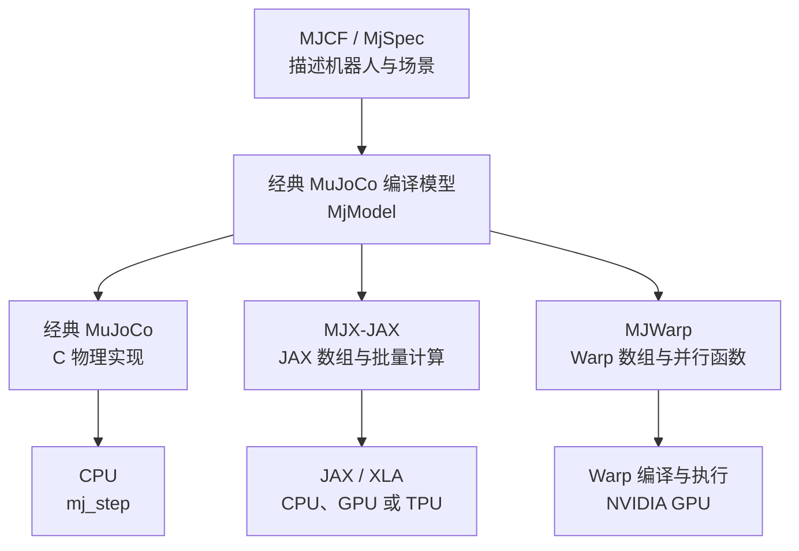
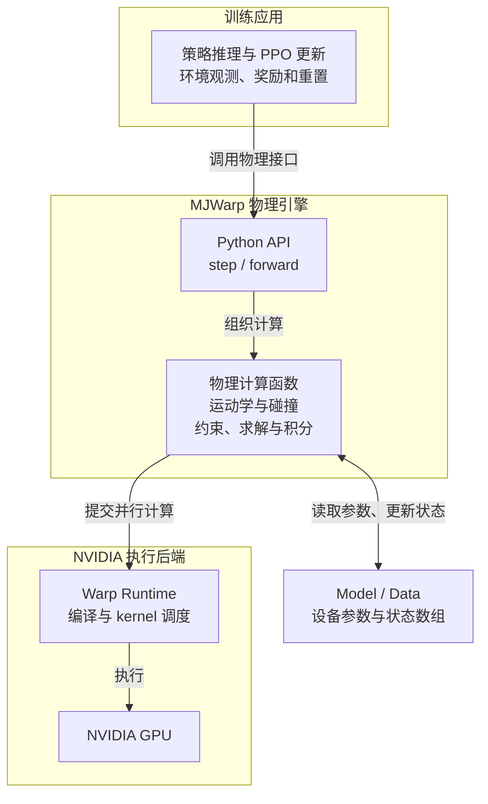
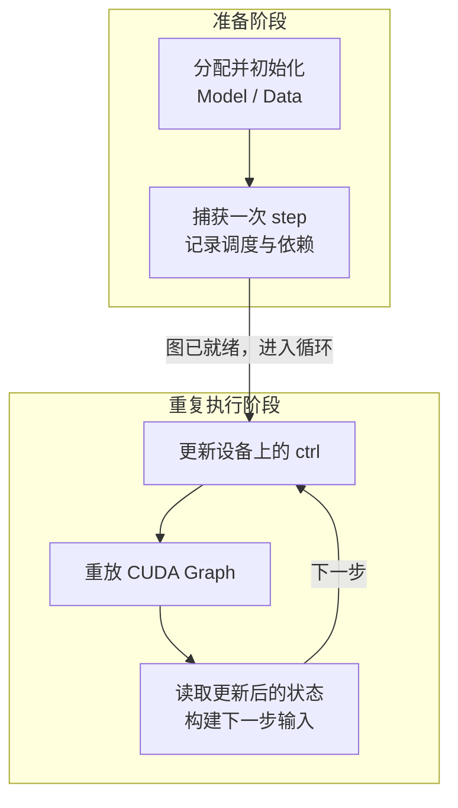
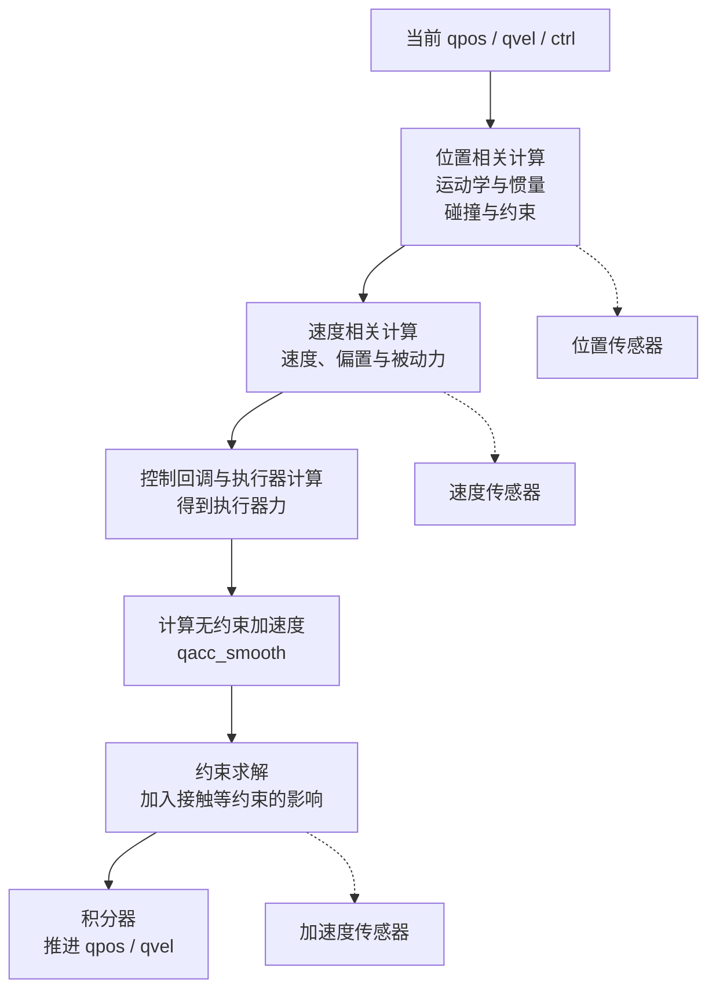
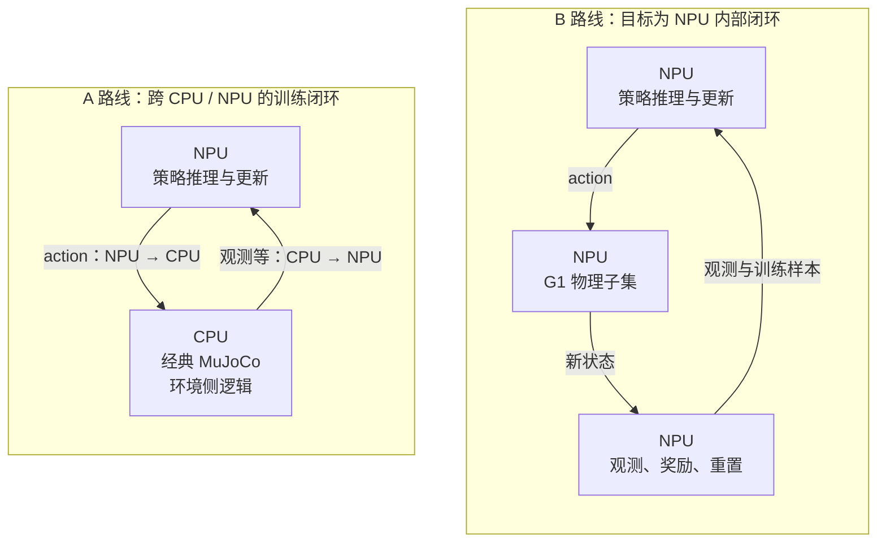
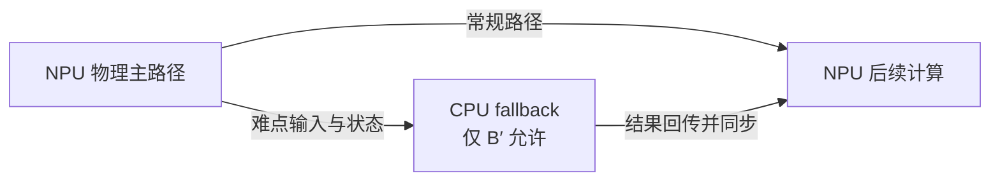
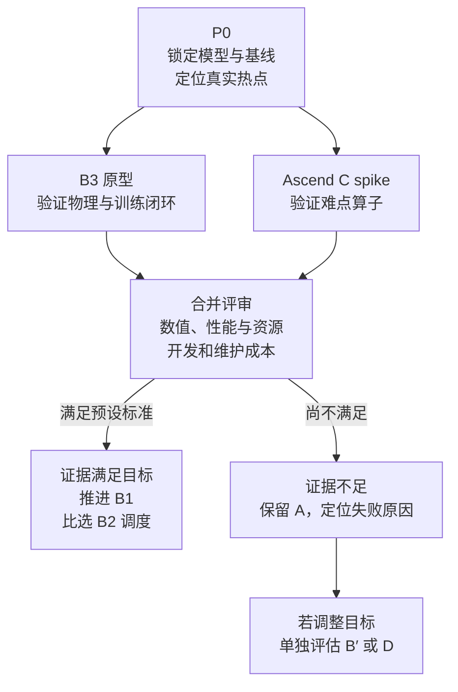
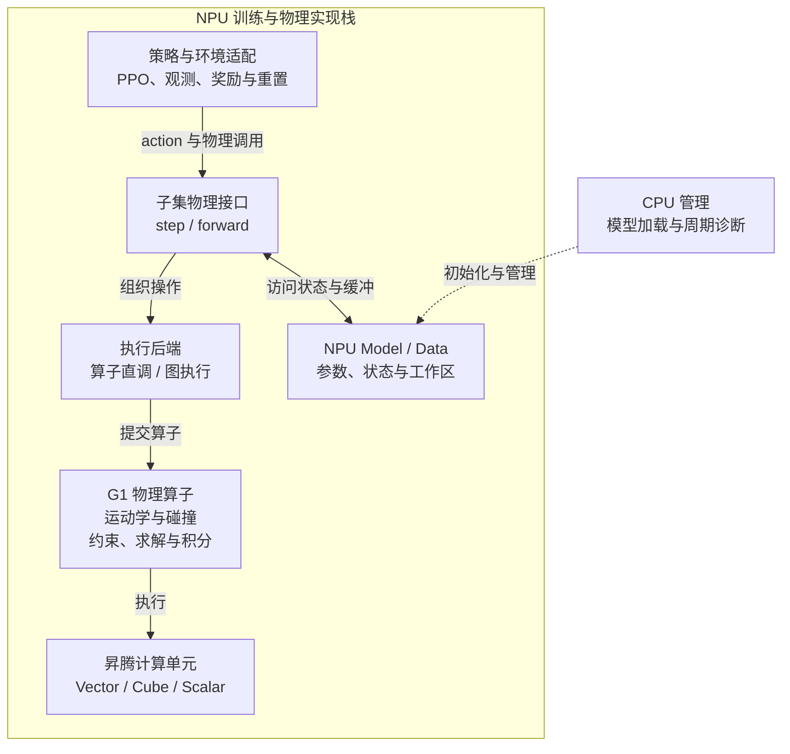

# MuJoCo Warp 架构与昇腾 NPU 迁移：从原理到 B 路线验证

> **版本：v1.5 · 2026-09-09**。本版重构阅读顺序、架构图、源码讲解和表格，并修正源码核对中发现的语义错误。历史变更见文末。
>
> **研究基线：** `google-deepmind/mujoco_warp@7e4afee815a35cd931119129d49937137a96bb67`。下文简称 `7e4afee`；本地源码已核对。该版本的 `pyproject.toml` 声明 `mujoco-warp==3.12.0`、`mujoco>=3.12.0`、`warp-lang>=1.15`。依赖下限不等于实验中实际安装的版本，运行环境仍须在 P0 锁定。（E1）
>
> **本文回答：** MJWarp 为什么适合大批量物理仿真；将 G1 所需的物理功能搬到昇腾 NPU，要重做哪些部分；应该用什么实验决定是否继续投入。文中的 B 路线以 **G1 功能子集**为范围，完整上游功能的迁移尚无工作量承诺。

## 阅读导航

第一次阅读，建议沿着“结论 → 上游怎么工作 → NPU 要改什么 → 怎样验收”读。已有背景的读者可以直接跳到相应部分：

- **判断是否值得做：** [§1 执行摘要](#s1)、[§11 目标与边界](#s11)、[§14 技术路径](#s14)、[§20 决策结论](#s20)。
- **理解架构与源码：** [§2 生态定位](#s2)、[§3 分层架构](#s3)、[§4 数据结构](#s4)、[§5 编译与调度](#s5)、[§6 一步物理计算](#s6)、[§7 并行机制](#s7)。
- **开展迁移设计：** [§8 内存与调优](#s8)、[§9 一致性边界](#s9)、[§10 硬件差异](#s10)、[§12 模块分工](#s12)、[§13 难点源码](#s13)、[§15 NPU 原型架构](#s15)。
- **安排实验与交付：** [§16 P0–P7](#s16)、[§17 验证方法](#s17)、[§18 风险处置](#s18)、[§19 资源与里程碑](#s19)。
- **查接口与依据：** [附录 A](#appendix-a)、[附录 B](#appendix-b)、[附录 C](#appendix-c)。

为保持与另外两份主报告的引用兼容，本版保留 §1–§20 编号，在章节内部调整组织方式。

### 证据与术语怎么读

本文的源码结论标 **E1**，配置事实标 **E2**，文档说明、设计建议和推断标 **E3**，未经日志或代码复核的转述标 **E4**。E4 不用于立项承诺。定义以 [《00_总览》](/Users/xerxes3/Documents/huawei实习/00_总览.md) §3 为准。

只需先记住三个词：**world** 是一份独立仿真环境；**kernel** 是设备上执行的并行计算函数；**launch** 是调用一次 kernel。同一个 kernel 可在一步仿真中多次调用，因此“有多少个 kernel 定义”不能回答“一步要调度多少次”。训练侧的 `world_size` 表示 DDP 进程数，与这里的 world 不同。

正文使用的关联文档简称如下。观测字段拆分、SHM 搬运实现和 A 路线审计细节保留在各自权威文档中：

| 简称 | 文档与用途 |
|---|---|
| [原版解析] | [SONIC 原版训练体系深度解析](/Users/xerxes3/Documents/huawei实习/SONIC原版训练体系深度解析.md)：理解原版训练与动作语义 |
| [分支审计] | [zhangqin 分支审计](/Users/xerxes3/Documents/huawei实习/SONIC_NPU适配深度报告_zhangqin分支.md)：核对 A 路线实现和已知差异 |
| [A路线笔记] | [NPU 迁移笔记](/Users/xerxes3/Documents/huawei实习/GR00T-WholeBodyControl/docs/mujoco_npu_migration_notes.md)：查实验背景 |
| [精度分析] | [MuJoCo 与 Isaac 精度分析](/Users/xerxes3/Documents/huawei实习/GR00T-WBC-alignment/docs/mujoco-vs-isaac-precision-analysis.md)：查跨引擎对齐背景 |

<a id="s1"></a>
## 1. 执行摘要：先用 A 路线推进业务，再用实验判断 B 路线

**当前建议是维持 A 路线交付，把 B 路线作为有退出条件的研究原型。** A 路线在 CPU 上运行经典 MuJoCo，在 NPU 上训练策略；B 路线希望让物理计算与策略训练都在 NPU 上完成。这样有机会减少每步跨设备交换数据的成本，但收益大小必须实测。（E3，决策建议；A 路线实现依据见 [分支审计] §3.3）

B 路线最难的工作是重新组织物理计算。MJWarp 使用 Warp 编写，线程索引、并行写入、片上内存和调度机制围绕 NVIDIA GPU 设计。昇腾需要按目标芯片重新安排计算块、数据搬运和同步。因此，“把训练张量改放到 NPU”并不能完成物理引擎迁移。（E1：§5、§13 源码；E3：迁移判断）

建议先做 P0，确认 G1 实际调用哪些功能、时间花在哪里、容量要留多大。随后用 **B3 框架重写原型**验证设备内闭环，同时用 **Ascend C 难点算子实验**验证 B1 最困难的碰撞与求解路径。两类实验回答不同的问题，结果共同用于后续决策。（E3，详见 §14）

### 已知什么，还缺什么

**已知的静态规模：** 锁定版本的 `_src` 非测试 Python 文件共 **34 个、52,843 行、296 处 `@wp.kernel`**；测试文件另计 **25,829 行**。这里的“行”包含注释与空行；装饰器出现次数也不等于工厂生成的所有特化实例数。（E1，§16.1 给出统计口径）

**尚缺的运行证据：** G1 的实际调用子集、每步 launch 次数、热点分布，以及 NPU 上的正确性和性能。这些决定 PoC 重写规模，不能从仓库总行数按比例折算。（E3，待 P0）

**A 路线的进度边界：** “11000 iter / 单 NPU 1024 env”来自既有笔记转述，确切运行 commit 与日志仍待补齐，保留 E4。该进度也不能证明 A 路线已与原版训练语义等价；差异见 [分支审计] §2。

本文不承诺加速倍数或固定人周。立项需要回答的是：在满足同一组物理与训练验收标准后，B 路线能否取得足以覆盖开发和维护成本的收益。（E3）

---

## 第一部分：MJWarp 如何完成大批量物理仿真

<a id="s2"></a>
## 2. 生态定位：同一份模型，三种执行实现

MuJoCo 的 XML 模型称为 **MJCF**，它描述刚体、关节、执行器、几何体和物理参数。经典 MuJoCo、MJX-JAX、MJWarp 都围绕这套模型语义工作，但物理计算由不同实现承担。读图时，先看公共模型输入，再看各分支的执行后端。（E3；[MJWarp 官方说明](https://mujoco.readthedocs.io/en/latest/mjwarp/index.html#when-to-use-mjwarp)）



MJWarp 的 `put_model` 会把经典模型转换为设备侧 `Model`，后续由自己的 `step` 实现推进状态。JAX 生态也可通过 MJX 接入 Warp；图中三条分支表示物理实现的区别，不表示上层接口互相隔绝。（E1：`io.py`、`forward.py`；E3：锁定版本 README “Integrating MuJoCo Warp”）

| 实现 | 计算表达方式 | 与本文的关系 |
|---|---|---|
| 经典 MuJoCo | CPU 上的物理程序 | A 路线的物理后端 |
| MJX-JAX | JAX 数组运算与编译 | B3 重写时参考的算法表达 |
| MJWarp | Warp 并行函数与设备数组 | B1 研究和对齐的源码基线 |

### 2.1 为什么强化学习会关注 MJWarp

机器人控制关心“一步多久完成”，训练采样还关心“单位时间总共得到多少步”。前者是**延迟**，后者是**吞吐**。例如同时推进 4096 个 world，即使一批计算的延迟高于 CPU 上一个 world 的延迟，总采样量仍可能更大。（E3，说明性例子）

MJWarp 面向大批量采样；经典 MuJoCo 仍适合低延迟控制。具体场景中的速度排序需要相同模型、相同数值设置和明确的批量规模才能比较。上游也支持 CPU 开发调试，但高吞吐目标是 NVIDIA GPU。（E3：[官方适用场景](https://mujoco.readthedocs.io/en/latest/mjwarp/index.html#when-to-use-mjwarp)；E1：锁定版本 README）

<a id="s3"></a>
## 3. 分层架构：训练循环、物理引擎和执行后端各负责什么

读这一节时，先区分**训练环境**与**物理引擎**。物理引擎更新位置、速度、接触和传感器等状态；训练环境还要把状态整理成观测，计算奖励，处理终止与重置。把 `step` 搬到 NPU，只完成了闭环中的一个环节。（E3，架构划分）



图中向下的主线表示调用与执行层次，旁侧数组框表示物理计算读写的数据。环境也会消费这些状态；完整训练反馈另在 §11 画出，避免在分层图中叠加所有往返箭头。环境职责划分为 E3；`Model/Data`、`step/forward` 与 Warp 调度关系为 E1（§4–§6）。CUDA Graph 是执行后端的调度选项，§5 单独解释。

对 B 路线而言，需要处理三层接口：训练环境怎样读取 NPU 状态；物理函数怎样用 NPU 张量表达；并行函数怎样在昇腾上执行。只替换最下方设备名称，不会自动补齐这些接口。（E3）

### 源码阅读入口

下面只列阅读入口。一个功能可能横跨多个文件，真正需要迁移的函数集合仍取决于 G1 运行路径。（文件存在性 E1，功能归组为源码导航）

| 想理解的内容 | 从哪个文件开始 |
|---|---|
| 参数、状态、容量 | `types.py`、`io.py` |
| 一步仿真的组织顺序 | `forward.py` |
| 运动学、惯量等基础计算 | `smooth.py` |
| 碰撞候选与几何求交 | `collision_driver.py`、`collision_primitive.py`、`collision_convex.py`、`collision_gjk.py` |
| 约束与数值求解 | `constraint.py`、`solver.py`、`block_cholesky.py` |
| 休眠与活跃自由度 | `sleep.py`、`island.py` |

文件均位于 [本地 `mujoco_warp/_src`](/Users/xerxes3/Documents/huawei实习/mujoco_warp/mujoco_warp/_src)。独立的 `mujoco_warp-3.12.0-src/` 是另一份源码快照，本文行号不指向它。

<a id="s4"></a>
## 4. 数据结构：一份模型参数，多份独立状态

### 4.1 先分清 Model 与 Data，再理解 SoA

**Model** 保存机器人和场景的参数，例如连杆质量、关节轴和几何尺寸。**Data** 保存仿真过程中的状态，例如 `qpos`（广义位置）、`qvel`（广义速度）和 `qacc`（广义加速度）。同一模型可以同时生成许多份状态，从而模拟许多独立 world。（E1：`types.py`、`io.py:1592`）

下面保留最能说明布局的四行声明。它们来自两个类，省略了其余字段；中文注释为本文添加。

**源码节选（E1）：** [`types.py:1600`](/Users/xerxes3/Documents/huawei实习/mujoco_warp/mujoco_warp/_src/types.py:1600)、[`types.py:2295`](/Users/xerxes3/Documents/huawei实习/mujoco_warp/mujoco_warp/_src/types.py:2295)。

```python
# Model：不同物理参数分别放在自己的数组里。
body_pos: array("*", "nbody", wp.vec3)   # 连杆相对父连杆的位置
body_quat: array("*", "nbody", wp.quat)  # 连杆相对父连杆的姿态

# Data：每个 world 都有一份独立的位置和速度。
qpos: array("nworld", "nq", float)
qvel: array("nworld", "nv", float)
```

这段代码说明了两个维度。沿着**字段**看，位置、姿态、速度分开存储，这就是 SoA（Structure of Arrays，按字段组织数组）的思路。沿着 **world** 看，`qpos[w]` 是第 `w` 个环境的完整广义位置，`qvel[w]` 是它的完整广义速度。

这种布局便于并行处理同一字段，也便于以数组形式搬运数据。不过，SoA 本身不保证访问一定连续；实际效率还取决于线程索引、数组步长和访问顺序。经典 MuJoCo 也有大量分字段数组与指针，不能把两者的全部差异简化成“经典都是 AoS，Warp 才有数组”。（E3，布局解释）

### 4.2 星号维度：共享参数与域随机化如何共存

上面的 `"*"` 表示可批量化的模型字段。某字段只有一份参数时，所有 world 共用；有多份时，各 world 按索引选取。这与 `Data` 的 `nworld` 维不同：状态必须区分环境，参数可以共享。（E1）

**源码节选（E1）：** [`smooth.py:110`](/Users/xerxes3/Documents/huawei实习/mujoco_warp/mujoco_warp/_src/smooth.py:110)。这是运动学函数内部的两行。

```python
# 用 world 编号选择参数批次，再取对应连杆的数据。
xpos = body_pos[worldid % body_pos.shape[0], bodyid]
xquat = body_quat[worldid % body_quat.shape[0], bodyid]
```

假设 `body_pos.shape[0] == 1`，任何 world 对 1 取余都得到 0，因此共用第 0 份参数；若首维为 2，world 0、2、4 使用第 0 份，world 1、3、5 使用第 1 份。这个例子解释了源码索引规则，不是建议使用的训练配置。（E3，示例）

域随机化可以据此为不同环境配置不同质量、阻尼或摩擦。NPU 迁移时需要保留这套索引语义；不能为了统一张量形状，悄悄把不同环境的参数变成同一份。（E3，设计要求）

### 4.3 容量：接触共享池与逐 world 约束上限不是一回事

**源码依据（E1）：** [`io.py:1608`](/Users/xerxes3/Documents/huawei实习/mujoco_warp/mujoco_warp/_src/io.py:1608) 的参数说明，以及 `:1648` 的总容量计算。

| 参数 | 准确含义 |
|---|---|
| `nworld` | 同时模拟的独立环境数 |
| `nconmax` | 按每 world 估算接触池容量的分配参数 |
| `naconmax` | 所有 world 共享的接触总容量；显式指定时覆盖前项 |
| `njmax` | 每个 world 的约束行硬上限 |
| `njmax_nnz` | 稀疏约束 Jacobian 的非零元容量参数 |
| `nccdmax / naccdmax` | 凸体碰撞工作容量的每 world 分配参数 / 总容量 |
| `nvmax` | 每个 world 压缩后的活跃自由度容量 |

例如，4 个 world 配置 `nconmax=8`，在未显式指定 `naconmax` 时，总接触容量为 32。某一个 world 可以有 10 个接触，只要整个共享池不超限；但某个 world 的约束行数不能超过它的 `njmax`。这直接影响 §13.1 中“按 world 预分区”的候选方案：固定分成四块后，容量语义可能已经改变。（E1：分配语义；E3：例子与迁移影响）

`make_data` 在运行时分配主要容量，之后数组 shape 保持稳定。稳定 shape 有利于调度和内存规划，但不代表所有临时空间都已预分配；例如 `implicit()` 内仍有 `wp.empty` 工作数组。（E1：`forward.py:595–625`）

超限信息由 `Data.overflow` 的 bitmask 表达，即一个整数中的不同位代表不同类型问题。迁移时要分别处理接触、约束、稀疏非零元、EPA 缓冲和迭代上限等状态。（E1：`types.py:152–168`）

### 4.4 稀疏存储：只保存真正参与约束的项

接触约束描述“哪些自由度会影响这个接触方向”。对应矩阵称为 **Jacobian**。一个接触通常只与部分自由度有关，因此没有必要总把大量零值存成完整矩阵。MJWarp 的相关结构包含数值、列索引和行信息，用于表达稀疏关系。（E1：`types.py` 的约束字段与 `solver.py` 稀疏访问路径）

对 NPU 而言，少存数据有利于降低全局内存占用，但索引读取和不规则访问也有成本。应先记录 G1 实际稀疏程度，再决定保留稀疏格式、局部转稠密，还是采用混合方法。（E3）

<a id="s5"></a>
## 5. 编译与调度：一次 step 为什么会调用很多 kernel

### 5.1 Python 负责组织，并行函数负责设备计算

MJWarp 的 Python 文件中既有普通调度函数，也有 Warp 装饰的设备函数。`@wp.kernel` 表示可发射的并行入口；`@wp.func` 是供设备代码调用的函数。它们看起来都像 Python，但不能据此认为替换 Python 张量设备就能完成移植。（E1：`forward.py`、`collision_driver.py`；E3：迁移解释）

下面的代码来自力计算的 kernel，省略签名和休眠分支，展示它怎样同时处理多个 world 与自由度。

**源码节选（E1）：** [`forward.py:1314`](/Users/xerxes3/Documents/huawei实习/mujoco_warp/mujoco_warp/_src/forward.py:1314)、`:1323–1328`。

```python
worldid, dofid = wp.tid()  # 当前并行任务负责哪个 world、哪个自由度

# 汇总这个自由度上的非约束力。
qfrc_smooth_out[worldid, dofid] = (
    qfrc_passive_in[worldid, dofid]    # 被动力
    - qfrc_bias_in[worldid, dofid]    # 扣除动力学偏置项
    + qfrc_actuator_in[worldid, dofid] # 执行器力
    + qfrc_applied_in[worldid, dofid]  # 外加广义力
)
```

这段计算对每个 `(worldid, dofid)` 都做同样的加减法。它容易理解，也说明了 GPU 并行程序的常见形式：**先确定自己负责哪个元素，再对那个元素计算**。调用方以 `dim=(d.nworld, m.nv)` 发射任务（`forward.py:1343–1345`）。

NPU 可以让一个计算核处理一批这样的元素，但批次大小、读写缓冲和执行同步需要重新设计。算术关系可保留，任务组织方式需要改写。（E3）

### 5.2 step 的主干：先算加速度，再推进时间

**源码节选（E1）：** [`forward.py:1412`](/Users/xerxes3/Documents/huawei实习/mujoco_warp/mujoco_warp/_src/forward.py:1412)。保留完整积分器分发，省略装饰器与文档字符串。

```python
def step(m: Model, d: Data):
    forward(m, d)  # 根据当前状态、控制和接触，计算动力学结果

    if m.opt.integrator == IntegratorType.EULER:
        euler(m, d)  # 用 Euler 路径推进状态
    elif m.opt.integrator == IntegratorType.RK4:
        rungekutta4(m, d)
    elif m.opt.integrator in (IntegratorType.IMPLICITFAST, IntegratorType.IMPLICIT):
        implicit(m, d)  # 锁定版本已有对应实现
    else:
        raise NotImplementedError(f"integrator {m.opt.integrator} not implemented.")
```

`forward` 内部还会调用位置计算、速度计算、执行器计算和求解器，因此这里的一个函数调用会展开成许多 kernel launch。积分器根据这些结果把状态推进到下一个时间点；RK4 等路径还可能包含额外计算，不能用一条简单流水线代表所有配置。（E1，§6 展开）

代码也明确证明 `IMPLICITFAST` 存在分发路径。具体实现和 README 的限定说明见 §11.1。

### 5.3 CUDA Graph：把调度序列记录下来反复执行

如果每一步都由 Python 逐个提交许多小 kernel，提交本身会占用时间。CUDA Graph 可以先记录这一串操作，再整体重放，减少重复提交开销。（E3：[官方 Graph Capture 说明](https://mujoco.readthedocs.io/en/latest/mjwarp/index.html#graph-capture)）



下面是 API 用法示意；假设 `m/d` 已创建，所需初始化和预热已完成，省略策略与观测代码。

```python
with wp.ScopedCapture() as capture:
    mjw.step(m, d)                 # 记录这次 step 的设备操作

wp.capture_launch(capture.graph)   # 后续可重复提交这张图
```

图重放保持多个操作之间的依赖，**并不等于把所有 kernel 融合成一个大 kernel**。NPU 原型也需要减少调度开销，但 GE、TorchAir 或直接算子调用能否满足本任务的控制流与内存要求，要通过 §15 的后端实验确认。（E3）

另有 `step1/step2` 两段式接口，允许在位置、速度相关计算之后设置控制，再继续执行器计算和积分。源码没有证明它们“专为图捕获设计”；而且 `step2` 对 RK4 配置回落到 Euler，不能把两段调用直接视为任意积分器下 `step` 的等价替代。（E1：`forward.py:1427–1458`）

### 5.4 设备内闭环还需要环境适配

GPU 上的状态数组可通过 Warp 与 PyTorch 的互操作供策略侧使用，但 SONIC 的完整观测并不等于 `d.qpos`。历史状态、参考动作、奖励、终止与重置都需要对应实现。字段与动作定义见 [原版解析] §2、§4。（E3，集成要求）

B 路线的目标是让热循环中的 action、状态和训练数据留在 NPU。周期日志、诊断与保存模型仍可与 CPU 交互。若某个物理步骤回退 CPU，其同步开销应归入 B′ 实测，不能直接断言全部收益归零。（E3）

多 GPU 场景可以使用 `ScopedDevice` 分别管理各卡的状态与调度。物理 world 之间通常可独立分配；策略多卡训练的梯度通信属于训练层职责。（E3，架构说明）

<a id="s6"></a>
## 6. 一步物理计算：从当前姿态走到下一时刻

下面以 `forward` 的主调用关系解释计算顺序。它是函数层级图；具体 kernel 数量、重复次数和耗时由 event trace 补充。（E1：`forward.py:1384–1423`）



实线表示主计算顺序，虚线表示对应阶段的传感器计算。图中的控制回调在配置后执行；外部也可在调用前写入 `ctrl`。这里的关键顺序是：**碰撞与约束准备位于位置阶段，执行器力计算随后发生**，不能把所有阶段按名字任意串排。

### 6.1 先确定身体在哪里，再找接触

运动学从关节状态计算连杆的世界坐标位置与姿态。碰撞粗筛（broadphase）排除明显不相交的几何对；精算（narrowphase）再为候选对计算接触。约束装配把接触、关节限位和等式条件整理为求解器能处理的形式。（E1：`forward.py:632–693` 及对应调用；E3：物理解释）

**源码节选（E1）：** [`forward.py:660`](/Users/xerxes3/Documents/huawei实习/mujoco_warp/mujoco_warp/_src/forward.py:660)、`:668–684`。仅展示未启用 sleep 时的碰撞分支；用注释标出省略内容。

```python
fwd_kinematics(m, d)                 # 计算连杆等对象的位置与姿态
# ……中间还有惯量相关计算……

if m.opt.run_collision_detection:
    # ……省略 sleep 分支；以下是非 sleep 路径……
    collision_driver.collision(m, d) # 找候选几何对并生成接触

constraint.make_constraint(m, d)     # 把接触、限位等组织成约束
```

这段代码把碰撞与求解之间的关系说清楚：接触数据先产生，约束矩阵后装配，求解器随后才使用它们。NPU 迁移若只让碰撞输出形状正确，却改变接触内容或容量截断方式，后续求解仍会受到影响。（E3）

### 6.2 从力算出加速度，再处理约束

速度阶段计算速度相关量；执行器阶段将控制输入转换为力；加速度阶段汇总非约束力，求出 `qacc_smooth`。约束求解再加入接触等条件的作用，得到用于积分的结果。可以把前者理解成“暂不考虑接触约束时会怎样运动”，后者负责使运动满足约束。（E1：`forward.py:1334–1408`；E3：解释）

求解器可能采用普通路径或 compact 路径，并根据数据结构使用稀疏计算。compact 会把当前活跃自由度集中处理，再映射回原状态，相关源码见 §13.3。

### 6.3 积分、传感器与休眠的边界

积分器推进时间；传感器按位置、速度、加速度类别插入相应阶段。浮基机器人包含四元数，姿态积分不能直接套用“每个 `qpos` 元素都加上 `qvel × dt`”的公式。（E1：`forward.py` 积分路径；E3：接口解释）

sleep（休眠）与 island（独立运动子系统）会影响碰撞筛选、活跃自由度和求解范围。它们贯穿计算过程；启用 sleep 时，位置阶段还可能进行第二次碰撞处理来响应新唤醒的物体，不能把 sleep 简画成一步结束后的独立开关。（E1：`forward.py:662–692`、`:1387–1390`）

<a id="s7"></a>
## 7. 大批量为何可能更快：五个机制共同作用

以下是基于源码组织方式的性能解释（E3），每项的收益都需要 P0 测量。

1. **同时推进多个 world。** 多个独立环境提供更多可并行任务。批量增加到一定程度后，还会受到内存、调度和算子效率限制，吞吐不会无限线性增长。
2. **稳定的主要数组容量。** 固定 shape 方便复用缓冲与调度图。接触数量、收敛步数和休眠状态仍会变化，因此控制流仍有动态行为。
3. **复用调度图。** 反复执行相似操作时，可减少重复提交开销。实际受益大小取决于 kernel 是否足够小、数量是否足够多。
4. **按字段组织数组。** 相邻任务若访问连续数据，能提高带宽利用率。布局与索引要一起看，不能仅凭 SoA 名称推导速度。
5. **让热循环数据留在设备上。** 物理与策略能直接共享设备数据时，可减少跨 CPU 边界的交换。A 路线每步两向搬运的源码分析统一见 [分支审计] §3.3。

这些机制说明了 B 路线值得研究的原因，也解释了为什么评估必须包含端到端训练：物理 kernel 加速后，观测构建、策略推理或同步仍可能成为新的瓶颈。（E3）

<a id="s8"></a>
## 8. 内存与调优：先保证放得下，再讨论跑得快

### 8.1 先用容量和收敛信息定位问题

调优应从能解释行为的量开始：接触峰值、约束峰值、求解迭代分布、各类 overflow，以及每个阶段的时间。仅看到总吞吐下降，无法判断是容量过大、迭代变多，还是调度和搬运占比上升。（E3，实验建议）

可优先观察四件事：

- **容量是否过大或不足。** 过大会占用更多内存，不足则丢失接触或约束。以峰值和压力场景确定余量，不能只取平均值。
- **求解器是否正常收敛。** 降低迭代上限可能减少时间，也可能降低物理质量。应同时记录残差、未收敛比例和轨迹统计。
- **复杂碰撞是否放大临时空间。** 凸体碰撞、multiccd 和 mesh 数据会引入额外工作区，需要与主要状态数组分开统计。
- **诊断是否扰动性能。** 设备日志和读取到 CPU 的检查会产生开销。验证阶段及时暴露错误，性能阶段记录诊断频率并单独核算。

前两项对应 `make_data`、求解器与 `OverflowType` 的源码行为（E1）；调优顺序及余量选择为 E3。上游测试工具提供 `--memory`、`--measure_alloc` 和 `--overflow_behavior`，可用于采集这些信息（E1：`testspeed.py`）。

### 8.2 HBM：所有环境和工作区总共占多少内存

HBM 是设备上的大容量全局内存。它要容纳模型、所有 world 的状态、接触、约束，以及执行中的临时工作区。下面是预算模型，变量中的字节系数必须通过实际数组或内存报告填入。（E3，估算式）

```text
接触池内存 ≈ naconmax × 单条接触记录字节数
约束内存   ≈ nworld ×（njmax × 每行基础字节数 + 稀疏存储字节数）
凸体工作区 ≈ naccdmax × 单项工作区字节数
峰值内存   ≈ 模型 + 状态 + 接触池 + 约束 + 同时存活的临时工作区
```

这里使用总接触容量 `naconmax`，避免误把共享接触池当成每 world 独立分区。临时工作区还可能受迭代上限、mesh 复杂度和求解路径影响；最终判断以峰值测量为准。（E1：容量语义见 §4.3；E3：预算方法）

### 8.3 UB：一个计算块执行时，哪些数据必须同时在片上

UB（Unified Buffer）是昇腾向量计算使用的片上缓冲。HBM 够用，并不表示单个算子的输入和临时量能一次装进 UB。此时需要 **tiling**：把大批数据切成小块，逐块搬入、计算、写回。（E3：[Ascend C 开发说明](https://www.hiascend.com/document/detail/zh/CANNCommunityEdition/82RC1/opdevg/Ascendcopdevg/atlas_ascendc_10_0001.html)）

应对每个热点 kernel 单独列出其 **live-set**，即某个时刻必须同时保留的数据：

```text
单 tile 片上需求
  = 同时存活的输入
  + 输出
  + 临时计算结果
  + 队列与对齐开销
  + 双缓冲增加的存储（若启用）
```

例如速度更新同时需要旧速度、加速度与结果缓冲；结果能否覆盖旧速度，取决于依赖和算子实现。双缓冲可以让搬运与计算交叠，但也会增加片上占用。需要先列清这些存活关系，再选 tile 大小。（E3，设计例子）

**不能用“全部仿真内存 ÷ UB 容量”推算 tile 数。** 两者的作用域不同：前者覆盖整套仿真，后者服务于一个算子的局部计算。P0 应为 G1 的主要热点逐个给出输入、输出、临时空间和候选 tile，而不是只报一个总内存数。（E3）

<a id="s9"></a>
## 9. 一致性边界：同一份 XML，为什么仍可能走出不同轨迹

同一份模型定义有助于保持参数一致，但不同物理实现可能在精度、碰撞点生成、求解初值、迭代停止和并行规约顺序上有差异。接触场景会将微小差异传递到后续状态，长轨迹逐渐分离并不罕见。（E3，背景依据见 [A路线笔记] §6）

应按比较层次分别要求：

| 比较对象 | 应检查的内容 |
|---|---|
| 模型与配置 | 自由度、执行器、坐标系、步长和接触参数是否对应 |
| 固定输入的一步计算 | 位置、加速度、接触集合等是否落在约定容差内 |
| 短期 rollout | 误差增长、接触和运动统计是否稳定 |
| 训练任务 | 多种子下的任务指标、稳定性与资源成本 |

这里仍然需要严格的单步数值检查。长轨迹难以逐位一致，不能成为跳过单步误差、接触漏检或 overflow 的理由。具体判据见 §17。（E3，验证原则）

[精度分析] 中的 **α drift** 是经典 MuJoCo 与 Isaac PhysX 的对齐背景，参考数值保留在附录 C。它没有验证 MJWarp 与 NPU 的误差，不能直接拿来规定本项目的通过阈值。（E3，证据适用范围）

<a id="s10"></a>
## 10. GPU 与昇腾的差异：迁移主要改在哪里

两类硬件都能执行并行计算，但任务划分与存储组织不同。对本项目，最有用的比较是“现有代码依赖什么、目标实现需要重新确定什么”。下表是设计层面对照（E3）；具体能力以 §19 锁定的 SoC 与 CANN 版本为准。

| 设计问题 | Warp / NVIDIA GPU | 昇腾迁移需要确认 |
|---|---|---|
| 谁处理哪些元素 | 用线程索引组织任务 | 每核处理范围与 tile 大小 |
| 数据如何进入计算单元 | 线程访存、缓存和共享内存 | 数据搬运、局部缓冲和同步 |
| 多任务如何共同写入 | 原子操作等并行机制 | 对应原子能力或重排算法 |
| 大量小操作如何提交 | Warp launch / CUDA Graph | 算子直调或图执行的实际开销 |

**计算单元的选择。** 昇腾的 Cube、Vector、Scalar 分别面向矩阵、向量和标量计算。物理计算含有矩阵运算，也含有索引、分支和迭代；不能看到 Cholesky 就认定整个求解器适合 Cube。初始原型建议先验证 fp32 正确性，再对适合的局部算子比较不同实现。（E3；机制背景见 [Ascend C 简介](https://www.hiascend.com/document/detail/zh/CANNCommunityEdition/82RC1/opdevg/Ascendcopdevg/atlas_ascendc_10_0001.html)）

**并发能力的选择。** 不应写“昇腾没有 SPMD 或原子操作”。需要列出目标芯片上支持的数据类型、操作和性能，再决定保留原子预约还是改成规约与扫描。§13.1 给出具体碰撞例子。（E3，待目标环境核验）

**工具链的选择。** Ascend C 负责自定义算子实现；`torch_npu`、TorchAir、GE、ACL 在集成与执行中承担不同角色，并非所有程序都必须依次经过的一条链。P0/P1 应比较可用组合，记录实际编译、运行和 profiling 结果。（E3，选型要求）

训练多卡通信的 HCCL 与物理 world 的任务分配也需分开考虑。进程启动与 NPU 初始化的已知问题统一引用 [分支审计] §1.1 的 F-4，不在本报告重复展开。（E3，集成建议）

---

## 第二部分：把迁移目标变成可验证的方案

<a id="s11"></a>
## 11. B 路线的目标与边界

A 路线的物理运行在 CPU，策略训练在 NPU；B 路线希望把物理和环境热循环一起放到 NPU。两者的主要数据流如下。A 路线事实依据见 [分支审计] §3.3；B 路线是目标设计（E3）。



物理常驻 NPU 可以消除热路径上的这类跨设备交换，**但不会自动修复动作、奖励或接触参数的语义差异**。语义对齐仍需独立的模型与环境验证任务。（E3）

### B 与 B′：是否允许物理回退 CPU

**B：纯 NPU 物理闭环。** 已纳入范围的物理步骤均在 NPU 上完成；如果运行中必须把物理计算回退到 CPU，就未满足 B 的通过条件。CPU 负责初始化、主机调度和周期记录不属于物理 fallback。（E3，项目定义）

**B′：NPU 主路径加 CPU 回退。** 允许某些难点物理计算回退，但必须记录触发频率、每次 H2D/D2H 字节数、同步延迟与总吞吐影响。B′ 需要单独验收，不能沿用 B 的“纯设备内闭环”结论。（E3，项目定义）



### 本轮要交付的范围

目标是一个 G1 所需的物理子集，以及能够接入训练环境的 `step / Model / Data / put_model / make_data` 语义接口。数组类型和调用适配可能变化，因此并不保证现有 Warp 程序原样 import 即可运行。（E3）

当前不包含渲染、ray 查询、完整柔性体功能和单环境低延迟优化。地形、mesh、SDF 是否属于必需项，应由最终选定的业务 XML 和运行 trace 决定；实际用到的功能不能仅因困难而静默删除。（E3）

### 11.1 功能裁剪前，先读准确的支持边界

**积分器：代码与 README 说的是不同粒度。** 锁定版本的 `step` 和 `step2` 都包含 `IMPLICITFAST/IMPLICIT` 分发，`implicit()` 也有实现。README 的原文限定为 **“`IMPLICITFAST` midpoint integrator feature”** 不支持，不能将其扩大为整个 `IMPLICITFAST` 不支持，也不应简单解释为 README 落后。（E1：`README.md` “MuJoCo API Compatibility”；`forward.py:595–628, 1412–1458`）

进一步看 `implicit()`：`IMPLICIT` 分支使用导数与 LU 路径；后面的分支另行处理相应隐式更新。旧版把前一个分支的全部调用链当成 `IMPLICITFAST` 的实现，应予纠正。P0 需要按业务实际积分器配置测试，不预设“必须改 Euler”。（E1：分支结构；E3：实验要求）

其他功能在锁定版本 README 中的状态如下（E1）：

| 功能 | 锁定版本说明 | 本项目处理 |
|---|---|---|
| PGS / noslip | 未支持 | 检查模型是否依赖 |
| 执行器、传感器 PLUGIN | 未支持 | 若业务使用，单独实现或调整范围 |
| Flex | 实验性支持 | 一期按刚体任务裁剪 |
| Warp 可微物理接口 | 尚未提供 | 不列入 B 路线验收 |

这些是固定版本的说明；未来升级应重新核验。G1 子集的最终支持清单必须同时附上配置和对应测试。（E3）

<a id="s12"></a>
## 12. 模块迁移：先建立依赖，再处理风险最高的部分

原版的难度星级不足以说明先做什么。本节改为按工程角色分组：哪些是后续工作的前提，哪些直接决定路线可行性，哪些需要由场景决定。以下为设计判断（E3），文件入口已在 §3 核验（E1）。

### 12.1 基础骨架：types、io 与简单状态更新

先定义 NPU 侧 Model/Data，明确字段、批量索引、容量与错误状态。随后接入状态初始化和最简单的更新算子。这部分为所有模块提供共同数据约定。

积分与传感器可作为早期接口验证对象，但仍要覆盖浮基四元数、所选积分器和实际传感器类型，不能笼统归为几行向量加法。产出应包括字段映射和单元级数值对照。

### 12.2 常规物理：运动学、粗筛与约束装配

运动学需要处理机器人树结构；碰撞粗筛需要生成候选集合；约束装配需要保留稀疏数值与索引的对应关系。这些模块的输入输出比较明确，适合按层建立测试。

优先验证顺序是：位置姿态正确 → 候选与接触集合正确 → 约束行正确。不要等完整训练跑起来以后再定位前面的偏差。

### 12.3 最高风险：凸体碰撞与求解器

凸体碰撞的 GJK/EPA 包含数据依赖循环、局部几何结构和工作区；求解器包含不同表示、分解方式和停止条件。两者的可行性不能由运动学成功推导。

P0 应从真实 G1 热点中挑选代表性函数，尽早做 Ascend C spike。实验要能暴露最坏接触场景和高迭代样本，不能只测试平均情况下的一次成功调用。源码分析见 §13。

### 12.4 条件功能：休眠、地形和复杂几何

sleep 与 compact 会改变活跃集合和计算范围；高度场 hfield、mesh、SDF 是否必需取决于场景。按业务模型逐项决定保留、后移或显式不支持，并记录裁剪会改变哪些测试条件。

渲染、ray、BVH 的独立功能不计入当前 PoC。调度和多卡集成另有 P1/P6 任务；物理 world 分配与训练 HCCL 通信分别测试。

**工作量口径：** 仓库静态总量见 §1，G1 函数闭包由 P0 输出，实际重写工作量还受复用程度与算法改写影响。三者应分别列明。（E3）

<a id="s13"></a>
## 13. 关键难点的源码讲解

本节每段只展示支撑当前论点的代码。标“源码节选”的语句来自锁定版本，中文注释和省略标记为本文添加；标“设计伪代码”的部分是候选方案，不能直接编译运行。

### 13.1 并行写入：原子预约保证唯一槽位，不保证排序

碰撞粗筛会并行产生许多候选几何对，它们需要写进同一个数组。先看现有实现如何领取写入位置。

**源码节选（E1）：** [`collision_driver.py:356`](/Users/xerxes3/Documents/huawei实习/mujoco_warp/mujoco_warp/_src/collision_driver.py:356)、`:369–371`。省略函数签名及几何类型排序。

```python
pairid = wp.atomic_add(ncollision_out, 0, 1)  # 加一，并取得加之前的计数

if pairid >= naconmax_in:
    return                                 # 槽位超出容量，不写入数组

# ……此处按几何类型整理 geom1/geom2，得到 pair……
collision_pair_out[pairid] = pair           # 保存候选几何对
collision_pairid_out[pairid] = nxn_pairid[nxnid]
collision_worldid_out[pairid] = worldid      # 记录该候选属于哪个 world
```

假设计数器当前为 7，两个任务同时到达原子加法，它们会分别领到 7 和 8，不会同时写第 7 个槽位。但谁领到 7 没有固定顺序。因此后续对照应匹配集合，而不能要求候选数组顺序逐项相同。（E3，对源码行为的解释）

还要分清对象：这里写入的是 **collision candidate 几何对**，不是最终接触点。计数已经增加后，超限任务才返回；这几行也没有直接设置全部 overflow 位。迁移需检查计数、丢弃、后续诊断的完整链路，不能把一个 `return` 当作完整溢出实现。（E1：所示源码；E3：迁移要求）

**NPU 候选：计数后分配连续区间。** 每个 tile 先统计有效项，跨 tile 做前缀和，最后按各自区间写出。以下为设计伪代码（E3）：

```python
valid = detect_candidates(tile)                 # 每个候选是否有效
local_rank = exclusive_scan(valid)              # 有效项在本 tile 内的唯一编号
tile_count = sum(valid)
tile_base = exclusive_scan(all_tile_counts)[tile_id]  # 本 tile 的全局起点

slot = tile_base + local_rank                   # 所有有效项获得不重叠槽位
write_where(valid & (slot < capacity), slot, candidate)
record_overflow_if(total_candidates > capacity) # 具体标志映射按上游核对
```

前缀和可以理解为“先知道前面各组占了多少位置”。它能避免并发任务抢同一槽位，但增加扫描、临时存储和阶段同步，是否更快必须测量。

另一种候选是按 world 预分区。它会改变 §4.3 的共享池弹性，还需要解决同一 world 内的并发写入。**用 `pair_id % capacity` 当槽位会发生碰撞覆盖**，因此本版删除该示例。预分区若改变容量语义，必须明确声明并验证。（E3）

### 13.2 数据搬运：把输入、临时量和同步一起设计

以速度更新为例，一个 tile 至少需要旧速度和加速度。原版示例只展示搬入速度，容易让读者误以为其余输入天然已在片上。下面补齐完整的数据依赖。（E3，设计伪代码；函数名仅表达步骤）

```cpp
for (int tile = 0; tile < tile_count; ++tile) {
    CopyIn(velocity_tile, velocity_global, tile); // 搬入旧速度
    CopyIn(accel_tile, accel_global, tile);       // 搬入对应加速度
    WaitForInputs();                             // 确认输入可用于计算

    velocity_tile += dt * accel_tile;            // 概念向量运算

    WaitForCompute();                            // 确认结果可写回
    CopyOut(velocity_global, velocity_tile, tile);
    WaitBeforeReuse();                           // 复用缓冲前完成所需同步
}
```

这段示意强调的是“搬入 → 计算 → 写回”的依赖。实际 Ascend C 实现还需指定 API、对齐、队列和流水同步。它没有实现双缓冲，也没有包含姿态积分；这些应在各自测试中补齐。

tile 太大可能装不进 UB，太小则增加调度和搬运次数。应按 §8.3 的 live-set 选择几个候选大小，在同一输入和精度下比较。（E3）

### 13.3 求解器：先确认路径，再决定如何使用矩阵单元

MJWarp 的 `solve` 入口直接表明求解并非只有一种路径。

**源码节选（E1）：** [`solver.py:3680`](/Users/xerxes3/Documents/huawei实习/mujoco_warp/mujoco_warp/_src/solver.py:3680)。保留入口分支，省略类型注解和原文注释。

```python
def solve(m, d):
    if m.opt.enableflags & types.EnableBit.SLEEP:
        island.update_active_dofs(m, d)    # 重建活跃自由度映射
        solve_compact(m, d)                # 按压缩后的集合求解
        if m.ntree > 1:
            island.compute_island_mapping(m, d)
        return

    if d.njmax == 0 or m.nv == 0:          # 容量为零或没有自由度
        wp.copy(d.qacc, d.qacc_smooth)
        d.solver_niter.fill_(0)
    else:
        ctx = _create_solver_context(m, d) # 建立求解上下文
        _solve(m, d, ctx)
```

这里首先按 sleep 配置选择 compact 路径，其次检查容量或自由度是否为零，最后进入普通求解。注意 `d.njmax == 0` 检查的是**分配容量**，不是“本步没有检测到接触”；后者还涉及实际约束数量。（E1）

普通路径内部还根据 `m.is_sparse` 等条件选择计算方式。例如 `_solve` 发射 `_solve_init_dof(warmstart, m.is_sparse)`（`solver.py:3700–3704`）。这就是 P0 必须同时记录配置和 trace 的原因：仅凭“G1 有多少自由度”推不出完整执行路径。（E1；E3：实验含义）

**再看一个分块计算片段。** 以下来自分块 Cholesky 工厂内部，展示两个局部矩阵块如何更新目标块。

**源码节选（E1）：** [`block_cholesky.py:67`](/Users/xerxes3/Documents/huawei实习/mujoco_warp/mujoco_warp/_src/block_cholesky.py:67)。

```python
for j in range(0, k, block_size):       # 逐个使用前面已完成的矩阵块
    U_block = wp.tile_load(
        U, shape=(block_size, block_size), offset=(j, k),
        storage="shared", bounds_check=False, aligned=True
    )
    wp.tile_matmul(
        wp.tile_transpose(U_block), U_block, A_kk_tile, alpha=-1.0
    )                                 # 从目标块扣除 U_block 的乘积贡献
```

Cholesky 把合适的对称正定矩阵分解为三角因子，以便求解线性系统。此处已经按块加载和计算，但 GPU 的 shared memory 与 NPU 的局部存储并非可直接互换。块大小还影响占用、对齐、精度和性能。（E3）

因此应先验证 fp32 基线，再对真实热点比较 Vector、Cube 或混合方案。报告中应同时给出误差、收敛、内存和时间；只报告矩阵乘法速度不足以评价整个求解器。（E3）

### 13.4 GJK/EPA：难点是数据依赖迭代与几何工作区

GJK 用于凸体之间的距离或相交判断；发生相交时，EPA 可进一步估计穿透信息。这里源码中的 `ccd()` 文档字符串明确写的是 **convex collision detection**。本文的 CCD 指这条凸体碰撞路径，不能据此声称它完成了时间连续的高速防穿透检测。（E1：`collision_gjk.py:2580–2605`）

先看 GJK 循环开头的一个退出条件。

**源码节选（E1）：** [`collision_gjk.py:685`](/Users/xerxes3/Documents/huawei实习/mujoco_warp/mujoco_warp/_src/collision_gjk.py:685)。

```python
for _ in range(gjk_iterations):       # 本次求交最多迭代这么多轮
    if xnorm < min_norm or wp.abs(xnorm_prev - xnorm) < MINVAL:
        break                        # 距离尺度足够小，或变化已经停滞

    sp1, sp2 = _gjk_support(
        geom1, geom2, geomtype1, geomtype2,
        x_k, xnorm, simplex, n, is_discrete
    )                                # 沿当前方向寻找新的支撑点
    # ……更新几何结构，并检查后续退出条件……
```

不同几何对可能在不同轮数满足条件。如果批量执行时总让所有任务运行到最大轮数，简单样本会做许多无用计算；如果按各自条件退出，又要处理活跃任务的管理和局部状态。这是 NPU spike 要测的问题。（E3）

锁定代码的后文还保留 Frank–Wolfe 对偶间隙退出判据（`collision_gjk.py:702–705`），所以不能把循环开头解释成“已经替换了原有全部收敛判据”。GPU 的分支发散同样会影响效率，也不能写成由硬件免费“掩盖”。（E1：判据；E3：执行解释）

NPU 可比较固定上限加 active mask、任务压缩等候选方法。active mask 表示已收敛项停止更新；它能表达状态冻结，但是否减少实际计算取决于实现。改变最大迭代次数或停止条件后，要重新检查接触误差与求解健康。（E3）

### 13.5 两层容量：全局池够用，局部几何工作区仍可能超限

接触总池 `naconmax`、逐 world 约束上限 `njmax` 解决的是全局容量；GJK/EPA 的局部结构、tile 缓冲和对齐解决的是单次计算的容量。两层都需要压力测试。（E1：容量字段与 `OverflowType`；E3：验证要求）

缩小 tile 通常应先作为实现选项评估。若最后不得不缩减可支持接触数、复杂几何或活跃自由度，需把它列为功能范围变化，不能用更小的物理问题来宣称同配置加速。（E3）

### 13.6 调试与复现：每个阶段都要留下可定位证据

上游提供 event trace 和 kernel 分析工具；NPU 侧应建立对应 profiling 记录，至少能区分算子计算、调度与数据搬运。具体采用的 `msprof` 参数和日志能力按目标环境核验。（E1：上游 README；E3：NPU 实验要求）

当接触不对时，应能回到“哪个输入、哪个候选、哪个容量或迭代标志”；当吞吐下降时，应能定位“哪个阶段、哪次同步”。这些诊断能力应进入 P0/P1 基础设施，避免只在完整 PPO 训练中排错。（E3）

<a id="s14"></a>
## 14. 技术路径：四个选项分别验证什么

本节是方案建议（E3），尚无 NPU 基准支持性能或工期承诺。先用一个简表定位，再分别说明代价。

| 路径 | 主要改什么 | 首先要验证的问题 |
|---|---|---|
| B1 | 用 Ascend C 重写 MJWarp 所需子集 | 最难物理算子能否高质量运行 |
| B2 | 自定义算子加图执行编排 | 调度收益是否覆盖图适配成本 |
| B3 | 用 NPU 框架重写 MJX 算法子集 | 设备内物理与训练闭环能否成立 |
| 备选 D | 改用 PhysX 相关实现 | 是否更符合跨引擎对齐目标 |

### B1：直接控制物理内核的实现

B1 以锁定 MJWarp 的行为为参考，用 Ascend C 实现 G1 实际需要的函数，自己维护 Model/Data 和工作区。它提供较细的控制能力，适合对热点做针对性优化，但碰撞、求解、容量和同步都需要工程团队承担。

B1 的先决证据是难点算子 spike：选 1–2 个真实路径中最有代表性的难点，用完整输入和压力样本验证误差、迭代、片上存储和时间。结果不足时，不应把完整重写的投入视为已经获准。（E3）

### B2：在自定义算子之外，再选择图执行方式

B2 的核心问题是调度。它仍可能使用 B1 编写的 Ascend C 算子，再由 GE、TorchAir 或相应集成方式组织执行。因此 B1 与 B2 有重叠：前者偏重**算子如何实现**，后者偏重**多个算子如何执行**。

需要比较直接调用与图模式的编译时间、稳态提交开销、动态控制流支持和内存复用。图优化收益是实验目标，不能提前写成必然发生的融合或加速。（E3）

### B3：用框架算子先建立物理闭环

B3 参考 MJX 的算法表达，用 MindSpore 或 `torch_npu` 可用运算重写选定子集。它仍是物理算法重写，需要逐项处理碰撞、约束、积分和环境接口；本文未建立可直接复用的 JAX 到 Ascend 桥接基线。（E3，候选方案）

B3 可帮助检查：NPU 张量能否串起整个流程，数值结果是否满足要求，训练侧能否消费这些状态。但它没有直接验证手写 Ascend C 的 GJK/EPA、原子替代和 UB 布局，因此成功不能替代 B1 spike。

反过来，B3 失败也不构成“B1 在技术上不可能”的证明。本文采用的是保守的**投入策略**：若框架原型尚不达标，暂停扩大投入，先判断是物理算法问题、框架限制还是实现缺陷。（E3，决策规则）

### 备选 D：改变物理后端，需要重新定义目标

既有 [精度分析] §4.2 提到 `ovphysx` 等 PhysX 方案，可作为更接近 Isaac 物理体系的候选。本文未验证其当前功能、部署条件和迁移成本，不能承诺“α 清零”或“物理可运行在昇腾”。（E3，待评估）

如果首要目标变成缩小与 Isaac 的差异，应单独比较 D 与 MuJoCo 方案；如果要求物理常驻 NPU，D 必须先证明符合该硬件要求。已有 CPU PhysX SDK 实验也不能直接代表 GPU 绑定方案。

### 建议的决策顺序

下图表示项目投入规则（E3）。“通过”均指满足预先登记的正确性、性能和资源标准，而非仅能完成一次运行。



<a id="s15"></a>
## 15. NPU 原型架构：同时设计物理层与训练接口

以下是 B1 原型的目标架构（E3），图中接口与模块名表示职责划分，不是已经存在的软件包。后端直调和图执行属于待比选项。



这张图按实现层次向下阅读：训练应用调用子集接口，接口经后端提交物理算子，算子在昇腾计算单元执行。旁侧 Model/Data 由接口管理、供物理与环境逻辑读写；训练反馈的数据流见 §11。CPU 可负责初始化、主机调度和周期记录，B 的要求是物理热路径不依赖 CPU 计算回退或每步状态往返。（E3）

### 15.1 数据层与接口层

每个已纳入范围的字段都要记录形状、数据类型、设备归属与读写时机。与 Warp 互操作的方式不应直接假定在 NPU 上同样可用；需要明确策略张量与物理状态之间是共享存储、设备内复制还是格式转换。（E3）

下面是接口设计示意，`world_count`、`contact_budget` 和 `constraint_budget` 来自 P0 的测量；模块尚未实现。

```python
import mujoco_ascend as mjw  # 概念模块：名称与 API 仍待实现

m = mjw.put_model(mjm)      # 转换模型参数
d = mjw.make_data(
    mjm,
    nworld=world_count,
    nconmax=contact_budget,
    njmax=constraint_budget,
)
mjw.step(m, d)              # 将物理状态推进一步
```

这个例子只规定职责，不预设 graph capture API。特别是 `nconmax` 必须保留 §4.3 的容量含义，`step` 必须使用选定的积分器和控制语义。（E3）

### 15.2 后端选型

先实现最短可测路径，再用相同输入比较两种执行组织：直接调用自定义算子，以及可用的图执行方案。比较时至少记录首次编译、重复执行时间、重编译条件、workspace 峰值和同步点。（E3）

需要使用 Cube 的算子、需要压缩活跃任务的循环、需要 CPU fallback 的函数，都应在此列成明确清单。HCCL 只在训练多卡确有通信需求时接入；物理 world 的独立分配单独实现和测试。（E3）

<a id="s16"></a>
## 16. 工作分解：每个阶段用什么证据退出

以下为 B1 子集原型的工作分解（E3）。阶段编号保留 P0–P7，工期和人数投入须在 P0 后重估。当前静态核验已完成；GPU trace 和 NPU 实验尚未完成。

| 阶段 | 本阶段交付 | 退出时必须拿到的证据 |
|---|---|---|
| P0 | 模型、版本与运行基线 | 功能闭包、热点、容量和可复现配置 |
| P1 | 数据骨架与后端选择 | 字段映射、模型加载和容量测试 |
| P2 | 运动学与基础动力学 | 分层数值对照通过 |
| P3 | 场景所需基础碰撞 | 接触集合与约束输入对照通过 |
| P4-B / P4-B′ | 复杂碰撞方案 | 纯 NPU 结果 / 回退成本报告 |
| P5 | 约束与求解器 | 误差、收敛和性能对照 |
| P6 | 环境与训练闭环 | 端到端数据流、性能和资源记录 |
| P7 | 完整验收 | 多种子结果、压力样本与失败清单 |

### 16.1 P0：完成静态核验，补齐运行证据

P0 有六个基础统计维度：生产文件行数、kernel 定义、测试规模、依赖声明、目录结构、运行时 trace。前五项已在 `7e4afee` 核验；第六项需要 GPU 环境。本版复核的静态结果仍为 **34 个非测试 Python 文件、52,843 行、296 处 kernel 装饰器**，另有 **30 个测试文件、25,829 行**。（E1）

下面的静态命令在 `mujoco_warp/` 仓库根目录执行。先确认提交号，再统计；总行数采用 `wc -l` 口径，包含空行和注释。

```bash
git rev-parse HEAD  # 应为 7e4afee815a35cd931119129d49937137a96bb67

# 非测试 Python 文件的总行数；同时可看到逐文件规模。
rg --files mujoco_warp/_src -g '*.py' -g '!*_test.py' | sort | xargs wc -l

# @wp.kernel 的静态出现次数，不代表运行时 launch 次数。
rg --count-matches '@wp\.kernel' mujoco_warp/_src -g '*.py' -g '!*_test.py' |
  awk -F: '{total += $NF} END {print total}'

# 测试文件单独统计；依赖下限与实际安装版本分别记录。
rg --files mujoco_warp/_src -g '*_test.py' | sort | xargs wc -l
rg -n 'version|mujoco>=|warp-lang>=' pyproject.toml
rg --files mujoco_warp/_src -g '*.py' | sort
```

在已配置的远程 GPU 环境中，再执行运行时采集。以下为命令模板，`--nworld 1024` 是待试的批量点，不代表已经测得的最佳值；按容量结果增加其他批量点。（E3，实验方案；参数入口 E1：`testspeed.py`）

```bash
# 先查锁定环境的命令参数，确认 trace 与容量选项。
uv run mjwarp-testspeed --help

# 采集 G1 的运行路径、内存与容量信息。
uv run mjwarp-testspeed benchmarks/unitree_g1/scene_flat.xml \
  --nworld 1024 --memory --measure_alloc \
  --overflow_behavior=error --event_trace

# humanoid 作为补充场景，不替代 G1 业务验收。
uv run mjwarp-testspeed benchmarks/humanoid/humanoid.xml \
  --nworld 1024 --memory --measure_alloc \
  --overflow_behavior=error --event_trace
```

带详细诊断的运行用于定位；正式性能测量应控制诊断和 trace 开销，分别保存配置。P0 的运行证据应补齐：

1. **实际功能范围。** 从 trace、配置和调用关系整理 G1 使用的函数与特化路径；覆盖重置、接触切换和压力场景，避免单条正常轨迹漏掉必要分支。
2. **时间与内存。** 记录 launch 数、各阶段耗时、容量峰值和热点工作区；为 NPU spike 建 live-set。
3. **对照条件。** 区分 MJWarp GPU 的算法基线与 A 路线的业务性能基线，保存各自硬件、模型和配置。
4. **投入门槛。** 在扩大实现前登记误差、吞吐、资源和维护目标；难点 spike 按 §14 单独报告。

以上为 E3 实验要求。P0 不应止于打印仓库行数。

### 16.2 P1：把业务模型对齐放在实现之前

上游 `benchmarks/unitree_g1/scene_flat.xml` 与 SONIC 的 G1 业务模型不是同一份 XML。P1 开始前需要冻结两个基准：一个用于复现上游，一个用于业务验收。（E3，既有报告记录）

既有报告提及 A 路线的 `g1_29dof_v18_isaac_aligned.xml`，本轮未重新验证其运行效果；P0 应检查当前目标文件和 commit，再决定业务基线。需要核对自由度、执行器顺序、坐标系、接触参数、控制步长和积分器。先过上游模型测试，不等于已经过 SONIC 业务测试。（E3）

### 16.3 P2–P5：按数据依赖接入物理模块

P2 建立运动学和基础动力学；P3 加入基础碰撞及业务必需的地形；P5 接入约束与求解器。每层先固定输入，与基线比输出，通过后再接下一层。（E3）

P4 专门处理凸体碰撞等复杂功能。B 分支要求纯 NPU，B′ 分支记录回退成本。如果目标 XML 使用这类碰撞，P4 就是完整闭环的依赖；若经核验场景完全不使用，可在支持清单中明确排除。难点 spike 仍应前置，避免最后才发现路线不可行。（E3）

### 16.4 P6–P7：从物理 step 走到训练闭环

P6 接入观测、奖励、终止、重置、积分器和实际传感器；训练多卡作为单卡闭环之后的增量任务。P7 按 §17 做多种子和压力场景验收，交付可重复运行的配置、结果和已知限制。（E3）

<a id="s17"></a>
## 17. 验证方法：正确性、性能和业务结果分别测

验证对象首先是**锁定 MJWarp 与 NPU 实现之间的差异**；业务层再与选定的 SONIC/A 路线基线比较。两组对照目的不同，需要分别记录。（E3）

### 17.1 静态与单步：先把误差定位到模块

固定 `qpos/qvel/ctrl`、模型和随机种子，逐层对照运动学位置、姿态、加速度、接触与约束。报告 `max_abs`、均值与标准差、相对误差分位数、失败比例。接近零的参考值需约定相对误差分母，避免指标失真。（E3）

接触按集合匹配：依据 world、几何对、位置、法向和距离等信息，在约定容差内匹配，并分别报告漏检、额外接触和几何误差。由于并发写入顺序可能不同，不能只按数组下标比较。（E1：§13.1；E3：验证方法）

容量测试要专门覆盖接触共享池、每 world 约束、稀疏非零元与复杂碰撞工作区。超限后的计数和错误标志也是接口行为的一部分。

### 17.2 短 rollout：看误差如何增长

在 10 步、100 步等固定窗口内比较运动、接触和误差分布，同时记录 NaN、未收敛比例、迭代数与 overflow。窗口长度是实验设计参数，应覆盖稳定站立、运动切换和接触密集情况。（E3）

不要求长轨迹逐位一致，但必须解释何时开始偏离、偏离是否超出预设范围。改变 GJK、EPA 或 solver 的迭代上限后，应重新执行这些对照。

### 17.3 性能：把纯物理与端到端训练分开

| 测量层次 | 必须记录 |
|---|---|
| 冷启动 | 编译、初始化与首次运行时间 |
| 稳态纯仿真 | `env_steps/s`、step 延迟 P50/P95 |
| 端到端 PPO | 完整迭代时间及各阶段占比 |
| 资源 | 峰值 HBM、workspace、CPU 占用与功耗 |
| B′ 回退 | 次数、字节量、同步时间和吞吐损失 |

性能测试必须写清 warm-up、同步计时方式、步数、批量、诊断频率和重复次数。纯物理的加速不能替代端到端收益，CPU fallback 的时间也不能从统计中删去。（E3）

### 17.4 业务验收：上游 G1 通过之后，再测 SONIC

在冻结的业务模型上评估跟踪质量、稳定性、任务成功与训练行为。至少 3 个随机种子，并报告统计汇总与置信区间；该种子数是最低实验要求，不意味着已足以证明所有结论。（E3）

最终阈值由 P0 根据基线和业务目标预先登记。附录 C 的 α 值仅解释跨引擎背景，不直接进入本项目通过条件。

<a id="s18"></a>
## 18. 风险处置：出现什么现象，就检查什么

以下按可观察信号组织预案（E3）。旧版未经测量的“高/中概率”已撤下，避免给人精确定量的印象。

**复杂碰撞耗时或工作区失控。** 如果 mesh/GJK/EPA 在压力输入下迭代激增、容量溢出或成为绝对热点，先检查停止条件、局部结构和 tile。继续满足纯 NPU 目标需有 spike 证据；转 B′ 时重新评估同步成本。

**求解器很快，但误差或未收敛比例变差。** 先检查是否改变了稀疏路径、精度、停止条件或有效约束集合。恢复已验证基线后逐项替换，再决定是否使用 Cube 或固定迭代。

**容量优化后接触变少。** 检查共享池是否被改为固定分区、槽位是否覆盖、计数是否被截断，以及 overflow 是否仍可见。接触数量变化不能只当作性能优化成果。

**单卡可用，多卡或进程模式失败。** 将训练通信、NPU 初始化和 CPU worker 启动分别诊断；既有 fork 风险见 [分支审计] F-4。物理独立 world 本身不要求跨卡通信。

**测不到真实热点，或换环境就复现不了。** 在继续优化前补齐 profiling 与版本矩阵。锁定代码不等于锁定实际算子库、驱动和固件。

**B3 与 spike 的结论不一致。** 分别分析框架限制和内核实现问题。暂停扩大投入可作为项目策略，但不能把一类原型的失败扩大为另一条路径的技术证明。

**上游演进导致长期维护增加。** 记录移植子集与上游接口差异，按计划评估升级；每次升级重新跑数值与容量回归。升级周期根据团队资源决定，不作固定季度承诺。

<a id="s19"></a>
## 19. 资源与里程碑：先锁环境，再估工期

本节为资源建议（E3）。可按架构与算法、Ascend C 实现、数值验证、RL 集成四类职责安排人员。原计划的“1 名架构 + 2 名内核开发 + 1 名验证/RL”可作配置草案，实际需求由 P0 的功能闭包和 spike 结果决定。

### 环境必须记录到可重建

将字段分成三组，每组保存精确版本或提交号：

- **硬件与底层：** NPU SoC 型号、卡数、驱动、固件、CANN Toolkit、算子包版本；CPU、内存及用于对照的 GPU 型号与驱动。
- **框架与工具：** Python、PyTorch、`torch_npu`；若使用 MindSpore、TorchAir、GE/ACL 相关组件，记录对应版本与编译选项；保存 profiling 工具版本。
- **实验输入：** MJWarp commit、MuJoCo/Warp 实际安装版本、模型文件哈希、resolved 配置、随机种子、启动命令。

环境中不适用的组件标明“不使用”。避免只写“CANN 8.x”或把依赖最低版本当作运行版本。（E3）

### 三个交付里程碑

| 里程碑 | 对应阶段 | 通过条件 |
|---|---|---|
| M1 基础计算 | P2 | 运动学与基础动力学数值检查通过 |
| M2 碰撞输出 | P3，必要时含 P4 | 目标场景接触集合及容量行为通过 |
| M3 完整闭环 | P5–P7 | 求解、环境、训练与资源验收通过 |

“通过”按 §17 的预登记阈值判定。P0 后再为里程碑排期；当前文档不提供固定周数承诺。（E3）

<a id="s20"></a>
## 20. 决策结论：用两类实验逐步缩小不确定性

MJWarp 的高吞吐来自并行环境、数组布局、容量管理、调度复用和设备内数据流共同作用。迁移时需要保留物理含义，再围绕 NPU 重做执行方式。（E1：本文源码关系；E3：架构结论）

近期行动仍是维持 A 路线业务推进，补齐其运行证据，同时开展 P0。P0 应交付 G1 实际功能范围、运行热点、内存容量和固定环境，使 B 路线从概念变成可测量的子集。（E3）

随后分别开展 B3 闭环原型与 Ascend C 难点 spike。前者回答集成和算法表达是否成立，后者回答 B1 的关键硬件实现是否成立。符合正确性、端到端收益和资源目标后，再扩大到 B1；B2 的调度选择通过同输入实验确定。（E3）

若证据尚不足，保留 A 并定位问题；若允许 CPU 回退或更换引擎，则按 B′ 或 D 的目标另行评估。任何路线的继续投入，都应能够对应到具体测试结果和明确的功能边界。（E3）

---

<a id="appendix-a"></a>
## 附录 A：查接口时，先看哪些字段

### 核心接口

`step(m, d)` 推进时间，`forward(m, d)` 计算当前状态下的动力学量。两者区别见 §5。`put_model` 转换模型，`make_data` 分配状态，`put_data` 导入已有状态，`reset_data` 用于重置。（E1：锁定源码 API）

`make_data` 的完整参数名以 [`io.py:1592`](/Users/xerxes3/Documents/huawei实习/mujoco_warp/mujoco_warp/_src/io.py:1592) 为准：

```python
# 接口签名简写：省略类型注解，保留参数名和默认值。
make_data(
    mjm, nworld=1,
    nconmax=None, nccdmax=None,
    njmax=None, njmax_nnz=None,
    naconmax=None, naccdmax=None, nvmax=None,
)
```

`contact_sensor_maxmatch` 属于 Option，不是上面函数的参数（`types.py:938`）。旧稿的 `contact_sensor_max_match` 拼写与锁定源码不符。图执行示例中的 `wp.capture_launch` 属于 Warp 调度 API，不应混写为已实现的 NPU 接口。（E1）

### 常用数据

| 要查看的信息 | 主要字段 |
|---|---|
| 模型规模 | `nq / nv / nu / nbody / ngeom` |
| 连杆与关节参数 | `body_* / jnt_* / dof_*` |
| 几何与接触参数 | `geom_*` |
| 当前状态 | `qpos / qvel / qacc` |
| 世界坐标变换 | `xpos / xquat / xmat` |
| 接触记录 | `contact.dist / pos / frame / geom / worldid` |
| 求解与诊断 | `efc / qfrc_* / solver_niter / overflow` |

字段依据为 `types.py`（E1）。完整支持范围由业务模型和 P0 trace 决定，本表仅用于定位。

<a id="appendix-b"></a>
## 附录 B：参考资料与源码引用规则

**源码锚点。** 本文所有 MJWarp 行号均指 [`7e4afee815a35cd931119129d49937137a96bb67`](https://github.com/google-deepmind/mujoco_warp/tree/7e4afee815a35cd931119129d49937137a96bb67)。正文的本地链接便于阅读，未来仓库切换版本时须回到该 commit 复核。（E1）

**官方资料。** 网页用于解释机制（E3），固定版本支持状态优先读锁定源码与 README：

- [MJWarp 官方文档](https://mujoco.readthedocs.io/en/latest/mjwarp/index.html)：吞吐、图捕获、容量、内存和休眠。
- [MJWarp API](https://mujoco.readthedocs.io/en/latest/mjwarp/api.html)：接口与字段查询。
- [锁定版本 README](https://github.com/google-deepmind/mujoco_warp/blob/7e4afee815a35cd931119129d49937137a96bb67/README.md)：支持边界、工具入口和集成关系。
- [NVIDIA Warp 文档](https://nvidia.github.io/warp/)：并行函数、数组、图与互操作。
- [Ascend C 开发说明](https://www.hiascend.com/document/detail/zh/CANNCommunityEdition/82RC1/opdevg/Ascendcopdevg/atlas_ascendc_10_0001.html)：用于理解算子开发机制；此链接的文档版本不代表已经选定项目 CANN 版本。

**工作区依据。** [原版解析]、[分支审计]、[A路线笔记]、[精度分析] 的完整链接见文首。A 路线 SHM 的代码细节、SONIC 观测字段与动作语义仍以这些权威章节为准。

<a id="appendix-c"></a>
## 附录 C：α 背景值的适用范围

下表保留 [精度分析] §3.1 的既有文档记录（E3）。比较的是**经典 MuJoCo 与 Isaac PhysX**，本轮没有重新运行实验；不能作为 MJWarp–NPU 验收阈值，也不能用来推导 NPU 的误差。

| 对照项 | α（米/步） | ref PD 存活步数 |
|---|---:|---:|
| Isaac Sim 目标 | < 0.002 | 100+ |
| 经典 MuJoCo / Euler | 约 0.013 | 21 |
| 经典 MuJoCo / implicitfast | 约 0.011 | 25 |

ref PD 指用参考运动作为 PD 跟踪目标。原文 §2.3、§3.1 将存活记录按步数表达，并使用踝位置误差阈值 `ANK=0.2 m`；α 用于描述每步踝位置跟踪偏差。表中仅保留其已有背景记录，MJWarp–NPU 的误差需要按 §17 固定输入、比较对象与统计方法后重新测量。（E3）

---

## 修订记录

### v1.5 · 2026-09-09：可读性重构与源码语义校正

正文改为原理解释、短源码节选、代码整体含义、迁移影响的阅读顺序；保留跨报告使用的章节编号。将 ASCII 图和过载框图改成 Mermaid，补齐反馈路径、CPU fallback、NPU 环境适配与决策流程。将多列长表拆为短表和主题小节，集中历史说明。

源码复核统一了已完成的静态统计口径，并修正以下内容：

- `nconmax` 是共享接触池的分配参数，`njmax` 才是逐 world 的约束硬上限。
- `_add_geom_pair` 写候选几何对；原子预约不保证稳定顺序，函数内部返回也不代表完成所有 overflow 处理。
- 删除取模领取槽位会覆盖数据的示例，NPU 搬运伪代码补齐输入和同步关系。
- 准确区分 `IMPLICITFAST` 实现、`IMPLICIT` 分支以及 README 对 midpoint feature 的限定。
- 按 `forward` 源码重排阶段，纠正 sleep 仅在末尾、两段 step 专为图捕获、所有临时内存均已预分配等表述。
- 按 `ccd()` 源码解释凸体碰撞；说明 GJK 多个退出判据并存。
- 移除“迁移硬件自动修复语义”“回退使收益必然归零”“B3 失败证明 B1 不可行”等过度推断。

本次完成文档、源码引用和图形检查；GPU event trace、NPU 正确性、性能和工期仍待 P0 实验。

### v1.4 · 2026-09-03：锁定源码基线

完成 `7e4afee` 本地检出，静态规模核验为 52,843 行、296 处 kernel 装饰器、34 个非测试文件；测试为 25,829 行。源码引用由此前 wheel 旁证切换至锁定 commit。A 路线 11000 iter 记录保留 E4，完善 B/B′、spike、环境矩阵与验收边界。本版中对部分源码的解释已在 v1.5 纠正。

### v1.3 · 2026-09-03：收敛证据与验收口径

拆分仓库总量、G1 子集、PoC 重写量；撤销无证据性能数字；补充误差分位数和失败比例；α 背景表移至附录；UB 改用 per-kernel live-set 估算。

### v1.0–v1.2 · 历史稿

最初按全量迁移组织方案，后经审查改为子集 PoC，加入 B/B′ 分支并修正求解与调度认识。早期“约 8000 行 / 30+ kernels”“32 人周”“图捕获固定百分比收益”“昇腾无 SPMD/atomic/printf”、单一稠密求解器假设，以及不存在的文件结构推断均已作废，不得继续引用。
