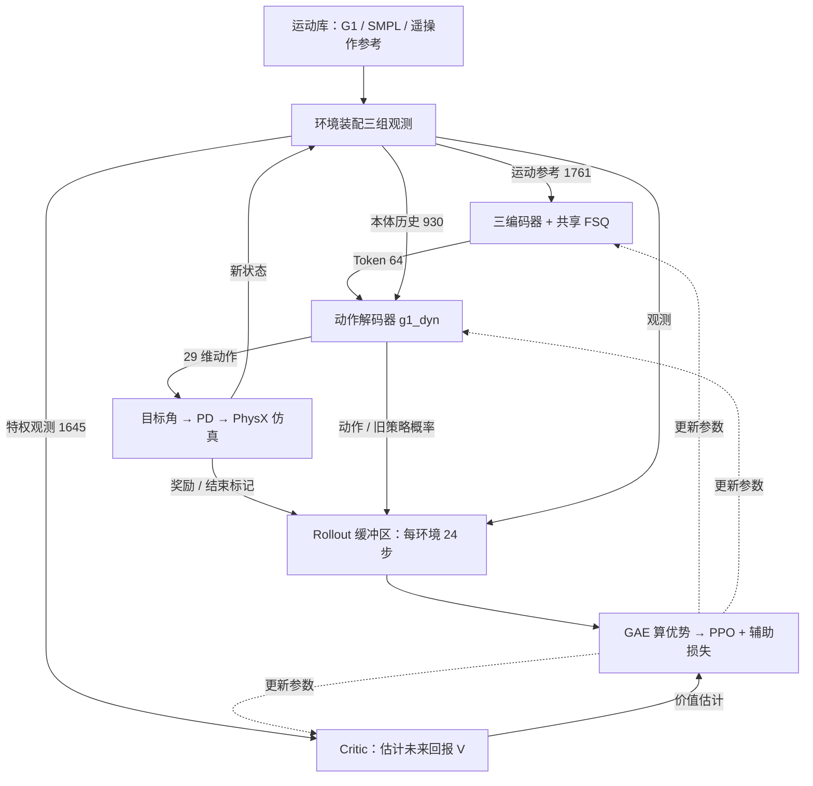

# SONIC 原版训练体系深度解析

> **版本：v1.8 — 2026-09-09**（重写阅读主线与源码讲解；核对固定版本源码，修正配置覆盖、Token 数量和截断补偿等表述）
> **范围：** NVIDIA 官方基线 `NVlabs/GR00T-WholeBodyControl@0e35637`，以 `sonic_release.yaml` 为配置入口。本文解释原版怎样训练，为 NPU 适配提供比较基准。
> **证据：** E1＝固定版本源码；E2＝配置；E3＝文档、设计推断或教学示例；E4＝尚未复核的外部转述。以下每段代码单独标明“源码节选”或“教学示意”；中文注释由本报告添加。代码节选省略外围逻辑，不能直接当作独立脚本运行。
> **关联阅读：** [套件总览](00_总览.md) · [A 路线现状审计](SONIC_NPU适配深度报告_zhangqin分支.md) · [B 路线迁移报告](MuJoCo_Warp架构与昇腾NPU全量迁移B路线报告.md)。原版与 fork 的边界统一放在附录 A，源码路径索引放在附录 B。

## 0. 先理解：SONIC 到底在学什么

给机器人一段“人正在下蹲”的参考运动，机器人不能照抄人体的关节角：人体与 G1 的骨骼不同，机器人还必须维持平衡、满足电机能力，并根据自身当前姿态调整动作。SONIC 要解决的就是这个问题：**把不同形式的运动参考，变成 G1 每一步可执行的全身控制动作。** 这里的 G1 有 29 个受控关节。（任务概括 E3；输出接口 E1/E2）

理解它只需先区分两类信息：**参考运动告诉机器人“接下来想怎么动”，本体观测告诉它“现在实际处于什么状态”。** 两者缺一不可。相同的下蹲参考，在机器人已经蹲下与仍然站立时，需要不同的控制输出。（E3，教学解释）

```text
参考运动（G1 / 人体 SMPL / 遥操作）
             ↓ 对应编码器 + FSQ 量化
        运动 Token：64 个数 ─────┐
                              ├→ 动作解码器 → 29 维动作
机器人自身的 10 帧历史：930 个数 ─┘                  ↓
                                           目标关节角 → PD → 力矩
```

Token 在这里是运动的紧凑表示，共两个 32 维向量。它不是文本词元，也不是直接下发给电机的指令。动作解码器读取 Token 和机器人历史，输出关节目标的调整量；底层 PD 控制器再根据目标与实际状态的差距计算力矩。**从 Token 到动作之间还有一个需要训练的网络。**（E1/E2；§3、§4）

训练采用 PPO 强化学习：让策略在仿真中尝试，依据跟踪效果与动作代价，调整网络参数。同时，辅助损失要求不同模态描述的同一段运动具有相近表示，并能从表示重构运动。运动编码器与动作策略因此共同参与学习，不能把 PPO 的作用缩成“只训练最后一个解码器”。（E1/E2；§3.2、§5）

**建议阅读顺序：** 先读 §1 的训练闭环，再读 §2–§4 的“输入→网络→执行”。想理解优化过程读 §5，想知道什么算“跟得好”读 §6。最后用 §7 的单步示例串起来。章节编号沿用原报告，方便其他报告继续引用。

## 1. 总体框架：先采样，再用这批经验更新网络

### 1.1 一次训练迭代的全景

训练有两个交替进行的阶段。**采样阶段**用当前策略控制仿真机器人，记录观测、动作、奖励和结束标记；**更新阶段**用这些记录计算学习目标，多次更新网络。更新后的策略再去采下一批数据。（E1，`ppo_trainer.py` 的训练循环）



实线表示数据流，虚线表示网络参数更新。Critic 是训练期的“评分预测器”：它估计从当前状态继续执行能得到多少回报，帮助判断某次动作是否好于预期；执行动作的主路径不需要它。（E1/E2；非对称 Actor-Critic 的解释 E3）

release 每个训练进程使用 4096 个并行环境。仿真步长为 0.005 秒，每 4 个仿真步更新一次策略动作，因此控制周期是 0.02 秒，即 **50 Hz**。一次采样收集每个环境的 24 步经验，之后做 5 轮、每轮 4 个小批次的 PPO 更新。（E2，`sonic_release.yaml:27,79`、`base_env.yaml`、`ppo_im_phc.yaml`）

### 1.2 启动时，各部件怎样组装

Hydra 是配置组装工具。`sonic_release.yaml` 选择环境、观测、模型、奖励等配置，再覆盖具体参数。读配置时应看**覆盖后的值**，不能只看被引用文件的默认值；例如每环境采样步数最终是 24。（E2）

```python
# 教学示意：保留启动顺序，省略具体构造参数（E3，依据 train_agent_trl.py）。
env = ManagerBasedRLEnv(cfg=env_cfg)     # 创建仿真、观测、奖励和终止管理器
wrapped_env = ManagerEnvWrapper(env, cfg)  # 把环境接口整理成训练器需要的形式
policy = Actor(...)                    # 运动编码器、量化器和动作解码器
value = Critic(...)                    # 独立的价值预测网络
model = PolicyAndValueWrapper(policy, value)  # 统一交给优化器管理
trainer = TRLPPOTrainer(...)
trainer.train()                        # 开始“采样 → 更新”的循环
```

这段代码的重点是职责分工：环境负责物理状态和任务评分，模型负责决策与估值，训练器负责组织经验和优化。Isaac 路径还会从环境的 `observation_space` 回填观测维度，让模型按实际接口构建。`materialize_lazy_params` 只在存在尚未初始化的 Lazy 模块时执行试前向；不能据此断言 release 一定使用 `LazyLinear`，也不能把它当成完整的语义校验。（E1，`train_agent_trl.py`、`trl/utils/common.py`）

## 2. 训练的输入：参考运动与机器人状态分别装在哪里

先看三组观测的分工。这里的“维度”就是单个样本中标量的个数，`1761`、`930` 和 `1645` 是三个不同输入接口，不是网络的三层。（E2）

| 输入 | 回答的问题 | 接收模块 |
|---|---|---|
| `tokenizer_obs`：1761 维 | 参考运动是什么、用哪种编码方式 | 运动编码前端 |
| `actor_obs`：930 维 | 机器人最近实际怎么动 | 动作解码器，与 Token 拼接 |
| `critic_obs`：1645 维 | 结合更多仿真信息，未来回报可能多高 | 训练期 Critic |

### 2.1 运动库：把离散动作帧变成任意时刻的参考

PKL 是序列化数据文件，存放参考运动，而非训练日志。运动数据包括关节姿态、根位置、根旋转和帧率等信息；SMPL 则用参数化人体模型描述人体动作。MotionLib 负责加载所选运动、准备帧张量，并按所需时刻取出参考状态。（E1，`motion_lib_base.py:364,1006,755` 的 `load_data`、`load_motions`、`get_motion_state`）

**为什么需要插值？** 策略每 0.02 秒动作一次，参考文件的帧时刻未必正好对齐。若所需时刻位于两帧之间，MotionLib 会在相邻帧之间插值，让参考连续变化，而不是突然跳到下一帧。（E3，机制解释）

```python
# 源码节选（E1）：motion_lib_base.py:755 起，get_motion_state。
# 两个局部帧号加上该动作的起始偏移，变成帧张量中的全局索引。
f0l = frame_idx0 + self.length_starts[motion_ids]
f1l = frame_idx1 + self.length_starts[motion_ids]
# ……省略按索引取出相邻帧，以及权重维度调整……
body_pos_w = (1.0 - blend_exp) * body_pos_w0 + blend_exp * body_pos_w1
# 旋转使用四元数球面插值，而非逐坐标线性混合。
body_quat_w = rotations.slerp(body_quat_w0, body_quat_w1, blend_exp)
```

例如两帧的某个位置坐标是 0.2 m 和 0.4 m，中点时刻的线性插值结果就是 0.3 m。旋转则用 slerp，让插值保持合法旋转。运行时这些运算针对已加载的张量进行，不需要每个仿真步重新读 PKL；但“已加载”不等于“整个数据集一次全部驻内存”，加载多少条运动仍由配置与分批加载逻辑决定。（例子 E3；实现 E1，`commands.py:234–240`）

**哪些片段会被多练？** release 继承启用的 bin-level 自适应采样：把动作切成小段，按失败情况调整各段的采样权重。这样长动作中的困难部分可以单独增加练习机会。旧的 motion-level 方法则以整条动作为单位更新权重，两者不能混称。（E1/E2，`motion_lib_base.py:2258,2558` 的 `init_adaptive_sampling`、`update_adaptive_sampling_probabilities`；`motion.yaml`）

release 将 `adp_samp_failure_rate_max_over_mean` 设为 200。它限制的是**失败率中间量**，之后还要归一化并混入均匀采样；它不是“某段最终采样概率最多为平均值 200 倍”。数据路径为 `data/motion_lib_bones_seed/robot_filtered` 与 `data/bones_seed_smpl`。（E1/E2，`sonic_release.yaml:70–74`）

### 2.2 tokenizer_obs：1761 维容器，不等于每个编码器都读 1761 维

把 `tokenizer_obs` 理解为一个装好字段的公共数据包：里面有路由标记、G1 参考、遥操作参考和 SMPL 参考。每个编码器只拿自己的字段。（E1/E2，`unitoken_all_noz.yaml`、`sonic_release.yaml:87–104`）

| 分组 | 字段与维度 | 小计 | 含义 |
|---|---|---:|---|
| A：路由 | `encoder_index` 3 | 3 | 哪些编码器处理当前样本 |
| B：G1 参考 | `command_multi_future_nonflat` 580；`command_z_multi_future` 10；`motion_anchor_ori_b_mf_nonflat` 60 | 650 | 未来关节位置/速度、高度、根朝向差 |
| C：遥操作参考 | `command_multi_future_lower_body` 240；`vr_3point_local_target` 9；`vr_3point_local_orn_target` 12；`motion_anchor_ori_b` 6；`command_z` 1 | 268 | 下半身参考，头/手等三点目标，以及根朝向和高度 |
| C：SMPL 参考 | `smpl_joints_multi_future_local_nonflat` 720；`smpl_root_ori_b_multi_future` 60；`joint_pos_multi_future_wrist_for_smpl` 60 | 840 | 人体关节、根朝向、配套手腕关节参考 |
| **合计** | **3 + 650 + 268 + 840** | **1761** | 公共容器维度 |

release 又覆盖了各编码器的字段选择。因此，**容器中存在某个字段，不代表网络实际使用它**。（E2）

| 编码器 | release 实际读取 | 输入维度 |
|---|---|---:|
| G1 | 580 维关节参考 + 60 维朝向；不读单独的 10 维高度 | **640** |
| Teleop | 240 + 9 + 12 + 6；不读单独的 1 维高度 | **267** |
| SMPL | 三项全部读取 | **840** |

```yaml
# 配置节选（E2）：sonic_release.yaml:88–89。
# 只选两个字段；容器中的独立高度字段没有出现在这里。
g1:
  inputs: ["command_multi_future_nonflat", "motion_anchor_ori_b_mf_nonflat"]
```

这解释了为什么“tokenizer 输入 1761 维”和“G1 编码器输入 640 维”可以同时成立。前者是环境接口，后者是某个子网络实际读取的内容。迁移时既要保证总维度一致，也要保证字段顺序、单位和参考系一致。（前两句 E2；迁移含义 E3）

**未来窗口有多长？** G1 取 10 个点，间隔 0.1 秒，偏移为 `0, 0.1, …, 0.9` 秒；SMPL 的 10 个点间隔为 0.02 秒，偏移到 0.18 秒。两者帧数相同，时间跨度不同，不能统一称作“未来一秒”。（E1/E2，`commands.py:354–378` 的未来帧构造；`sonic_release.yaml:48–51`）

**路由为什么可以同时选两路？** `encoder_index` 支持多热标记，即多位可以同时为 1。假设某样本标为 `[1,0,1]`，G1 和 SMPL 编码器都计算表示，训练时就能比较同一运动的两种表示。这是路由机制的示例，不是已经采样验证的“原版典型运行值”。进入动作解码器时如何选择 Token，见 §3.1。（机制 E1，`create_encoder_masks`；具体示例 E3）

**“local”要按字段理解。** 有的字段去掉全局平移与航向，有的使用完整姿态变换，还有的已经在预处理中转为相对坐标。它们都在减少对全局位置的依赖，但不是同一套变换。6D 朝向是旋转的一种六数表示，也不应与“六个关节角”混淆。（E1，`observations.py` 的字段实现；直观解释 E3）

tokenizer 配置还对部分朝向和 SMPL 关节观测加入 `±0.05` 的均匀噪声。这可以理解为让训练不依赖完全精确的观测，是向真实传感器误差作准备的一种方式；作用属于设计解释，不能单凭配置证明真机鲁棒性。（配置 E2；动机 E3）

### 2.3 actor_obs 与 critic_obs：一个用于控制，一个辅助训练

**Actor 看到最近 10 帧的自身状态。** 每帧 93 个数，堆叠后是 930 维。（E2，`local_dir_hist.yaml`、`sonic_release.yaml:30–31`）

| 每帧字段 | 维度 | 帮助策略了解什么 |
|---|---:|---|
| 局部重力方向 | 3 | 身体是否倾斜 |
| 基座角速度 | 3 | 身体怎样转动 |
| 关节位置 | 29 | 当前全身姿态 |
| 关节速度 | 29 | 关节正在怎样运动 |
| 上一步动作 | 29 | 最近发出了什么控制指令 |
| **单帧 / 10 帧** | **93 / 930** | 当前状态及其近期变化 |

10 帧历史由环境的 Observation Manager 组装。Actor 内部也有缓存，但当前配置的 `max_rollout_history` 默认为 1，不能把 930 维归因于 Actor 自己维护了 10 帧。历史让普通前馈网络 MLP 也能看到短时间内的变化趋势；这有助于推测接触相位等未直接给出的信息，但不等于网络变成了循环网络。（实现 E1；作用 E3）

**Critic 额外读取训练中可用的参考与仿真状态。** 它不直接控制机器人，而是预测回报，为 PPO 提供学习信号。它的 1645 维并不是把所有字段一律堆叠十次。（E2，`privileged_mf_hist.yaml`、release 的 critic 历史配置）

| 字段 | 维度计算 |
|---|---:|
| `command_multi_future` | 580 |
| `motion_anchor_pos_b` / `motion_anchor_ori_b` | 3 + 6 |
| body 位置 / 朝向 | 14×3 + 14×6 = 126 |
| 基座线速度 / 角速度历史 | 3×10 + 3×10 = 60 |
| 关节位置 / 速度历史 | 29×10 + 29×10 = 580 |
| 动作历史 | 29×10 = 290 |
| **合计** | **580 + 9 + 126 + 60 + 580 + 290 = 1645** |

这叫**非对称 Actor-Critic**：策略与价值网络看到的信息不同。训练时允许 Critic 使用更多信息改善估值，部署时只保留控制所需的网络与输入。（结构 E1/E2；设计解释 E3）

## 3. 模型结构：先统一运动表示，再结合自身状态输出动作

三种输入各用一个编码器，输出相同形状的连续表示；FSQ 将这些表示量化为 Token。之后有两个解码器：`g1_dyn` 生成控制动作，`g1_kin` 重构运动参考，为训练提供辅助约束。（E1/E2）


图 3-1 用来查网络层级；第一次阅读先抓住下表的输入输出。图中“共享 FSQ”表示调用同一个量化器，不表示三路结果相加或求平均。（E1，`universal_token_modules.py:685–690`）

| 模块 | 输入 → 输出 | 职责 |
|---|---|---|
| G1 / Teleop / SMPL 编码器 | 640 / 267 / 840 → 各自 64 个连续数 | 将不同字段组织成统一形状的运动表示 |
| FSQ | 每路 `(2,32)` → `(2,32)` | 将每个标量限制在有限档位上 |
| `g1_dyn` | Token 64 + 本体历史 930 → 动作 29 | 根据参考意图与实际状态做控制 |
| `g1_kin` | Token → G1 未来运动参考 | 检查表示是否保留了运动信息 |
| Critic | 特权观测 1645 → 价值 V | 辅助 PPO 估计动作效果 |

### 3.1 Token 怎样产生，又怎样送到动作网络

**第一步：编码成 64 个连续数。** 以 SMPL 为例，MLP 将 840 维输入映射为连续表示，再组织成两个 32 维向量。这里的 latent 指量化前的连续表示，Token 指量化后的表示。两者形状相同，允许的数值不同。（E1/E2）

```yaml
# 配置节选（E2）：all_mlp_v1.yaml:34–36。
num_fsq_levels: 32  # 在此实现中决定每个 Token 的维度
fsq_level_list: 32  # 每个维度使用 32 个量化档位
max_num_tokens: 2   # release 显式指定两个 Token
```

两个 Token 共 `2×32=64` 个数。源码只有在 `max_num_tokens` 未指定时，才用 `num_future_frames // 2**down_t` 推导数量；release 已明确指定 2。因此不能把这里描述成 MLP 必然执行了一次“10 帧到 2 帧的时域下采样”。（E1，`universal_token_modules.py:230–237`）

**第二步：逐个标量量化。** FSQ 是 Finite Scalar Quantization，有限标量量化。可以先把它理解为“把连续刻度吸附到有限格点”；它不需要学习一个向量码本并搜索最近邻。具体格点、边界压缩和梯度近似由外部 `vector_quantize_pytorch.FSQ` 实现。（调用 E1/E2；概念说明 E3）

```python
# 源码节选（E1）：universal_token_modules.py:685–690。
if self.quantizer is not None:
    quantized_codes, _ = self.quantizer(latent)  # 返回量化后的向量与其他结果
    encoded_tokens = quantized_codes.contiguous()  # 主路径保留向量，不使用离散索引
else:
    encoded_tokens = latent
return encoded_tokens, latent  # 两者分别保留，辅助损失还会用到连续表示
```

这几行解释了一个容易误会的地方：量化后仍然可以用浮点张量保存。**“离散”说的是可取值有限，并不要求张量改成整数类型。** 量化后的数也不再逐项对应某个关节角；这些特征的含义由训练学得。（E1；特征解释 E3）

下面只用四个标量演示“落格点”，避免把大量合成小数误当作真实模型输出。（E3）

```python
# 教学示意：人为设置间隔 0.25 的格点，不是 SONIC 的实际 FSQ 公式或档位。
latent_example = [-0.62, -0.10, 0.31, 0.88]
token_example = [round(x / 0.25) * 0.25 for x in latent_example]
# 得到 [-0.5, 0.0, 0.25, 1.0]：长度不变，但每项只能取格点值。
```

真实路径处理的是两个 32 维向量。本文未运行官方 checkpoint，也未核对外部 FSQ 依赖版本，因此不提供伪装成真实结果的完整 64 数“量化前后对应表”。

**第三步：把不同编码器的结果放回样本原来的位置。** 假设一个 batch 有三条样本，分别只激活 G1、Teleop、SMPL。每个编码器处理自己的样本后，结果要恢复为统一 batch，才能交给同一个动作网络。（E3，互斥路由示例）

```python
# 源码节选（E1）：universal_token_modules.py:566–574；省略单编码器快速路径。
all_tokens = torch.zeros(
    (batch_size * seq_len,) + first_token.shape[1:],  # 为每个样本预留两个 32 维 Token
    dtype=first_token.dtype,
    device=first_token.device,
)
for encoder_name in encoded_tokens.keys():
    # mask 标出该编码器的样本位置；赋值沿 batch 行进行。
    all_tokens[encoder_masks[encoder_name]] = encoded_tokens[encoder_name]
all_tokens = all_tokens.view(batch_size, seq_len, *all_tokens.shape[1:])
return all_tokens
```

结果形状是 `(B,S,2,32)`：`B` 为样本数，`S` 为序列长度。上例取 `B=3,S=1`，第 0、1、2 行分别装入对应模态的两个 Token；没有拼成每条样本六个 Token。（E1，代码解释；样本设置 E3）

多热路由还要注意赋值顺序：如果两个编码器的 mask 包含同一行，**后写入的结果会覆盖先写入的结果**。当前配置遍历顺序是 `g1→teleop→smpl`。各路原始表示仍留在字典里供对齐损失使用，所以“多路共同接受训练”和“动作网络读取哪一路 Token”是两个问题。（E1/E2）

**第四步：拼接本体历史。** Token 表示要做的运动，本体历史表示机器人现在的状态。解码器配置指定把这两项拼接。（E2，`g1_dyn_mlp.yaml:2`）

```python
# 源码节选（E1）：universal_token_modules.py:891–896。
decode_input_dict = {
    "token": all_tokens,
    "token_flattened": all_tokens.view(*all_tokens.shape[:-2], -1),  # 2×32 展平为 64
    "proprioception": proprioception_input,  # 本配置取 actor_obs，930 维
}
```

```python
# 源码节选（E1）：同文件 :715–719。
decoder = self.decoders[decoder_name]
input_features = self.decoder_input_features[decoder_name]
output_feature_dims = self.decoder_output_feature_dims[decoder_name]
cond_features = self.decoder_cond_features.get(decoder_name, [])
decoder_input = torch.cat([decode_input_dict[key] for key in input_features], dim=-1)
```

对 `g1_dyn`，`input_features` 是 `token_flattened` 与 `proprioception`，所以最后一行得到 **64+930=994** 维输入。动作 MLP 再将其映射为 29 维动作均值。这才是从运动 Token 到控制输出的完整接口。（E1/E2）

### 3.2 辅助损失：怎样让不同模态表达同一段运动

仅靠仿真奖励，网络需要间接学会“同一动作的人体描述和机器人描述应当接近”。辅助损失把这个要求直接写进训练目标。release 配置五项均方误差损失，其中运动重构权重为 0.01，其余四项为 1.0。（E2，`g1_recon_and_all_latent.yaml`；动机 E3）

| 损失 | 比较什么 | 权重 |
|---|---|---:|
| `G1Recon` | 解码出的 G1 参考与对应输入参考 | 0.01 |
| `G1SmplLatent` | 同一运动的 G1 / SMPL 连续表示 | 1.0 |
| `TeleopSmplLatent` | 同一运动的 Teleop / SMPL 连续表示 | 1.0 |
| `G1TeleopLatent` | 同一运动的 G1 / Teleop 连续表示 | 1.0 |
| `ReencodedSmplG1` | SMPL 表示经运动解码、G1 重编码后的结果与配对 G1 表示 | 1.0 |

以 G1 与 SMPL 对齐为例，先找出有配对数据的 G1 样本，再比较对应的连续表示。（E1）

```python
# 源码节选（E1）：token_losses.py:603–614；省略空配对检查及非 MSE 分支。
g1_latents = encoded_latents["g1"]
smpl_latents = encoded_latents["smpl"]
# 在 G1 子批次中，挑出具有 SMPL 配对的那些行。
g1_latents_matched = g1_latents[encoder_masks["g1_has_smpl"]]
if self.loss_type == "mse":
    loss = F.mse_loss(g1_latents_matched, smpl_latents)
```

MSE 会惩罚两边数值不一致。这里没有对任一侧调用 `.detach()`，因此损失本身是**双侧可导**的：只要两侧保持计算图且参数参与优化，两边都会被拉近。本文确认了损失实现，但没有运行反向传播检查各编码器梯度，不能把静态判断写成已经完成的运行验证。（E1；梯度条件解释 E3）

仓库另有 compliance-aware 配对路径，它显式对 teacher 表示 `.detach()`，只让另一侧追近固定目标。这才是单向蒸馏的情形；不能拿它解释 release 默认的上述损失。（E1，`universal_token_modules.py:977,1012`）

`g1_kin` 的作用也由此清楚：它要求 Token 保留可还原的运动信息，并参与重编码约束；`g1_dyn` 则把表示变成可执行动作。二者分工不同，但通过共享表示相互影响。（E1/E2；解释 E3）

## 4. 训练的输出：29 个动作数怎样变成电机力矩

### 4.1 动作语义：先得到目标角，再由 PD 计算力矩

动作网络先输出 29 个均值。训练采样时，Actor 用这些均值与标准差构造正态分布，使策略可以尝试略有不同的动作。标准差决定探索幅度；原版 release 将其限制在 `[0.001,0.5]`。（E1/E2，`actor_critic_modules.py:260–287`、`sonic_release.yaml:80–82`）

```python
# 源码节选（E1）：actor_critic_modules.py:287。
# 每个关节有一个动作均值；std 广播到同样形状，并保证为正。
self.distribution = Normal(mean, (mean * 0.0 + std).clamp(min=1e-6))
```

这一步得到的是动作分布，并没有计算力矩。执行接口使用 Isaac Lab 的 `JointPositionActionCfg`，并启用默认姿态偏置。（E2）

```yaml
# 配置节选（E2）：manager_env/actions/terms/joint_pos.yaml:1–5。
joint_pos:
  _target_: isaaclab.envs.mdp.actions.JointPositionActionCfg
  asset_name: "robot"
  joint_names: [".*"]         # 应用到配置匹配的关节
  use_default_offset: true    # 目标位置以默认关节姿态为偏置
```

因此要按三步理解动作：先对网络输出做接口要求的裁剪和缩放，再加默认关节角得到目标角，最后由关节执行器根据目标与实际状态算力矩。下面是说明原理的公式，不是本仓源码摘录；实际缩放、增益和限幅应以动作配置与资产/执行器实现为准。（配置 E2；控制公式 E3）

```python
# 教学示意（单关节）：action 是网络动作，q / dq 是当前角度与角速度。
q_target = q_default + action_scale * action
# 简化为目标角速度为 0 的 PD 控制。
torque = kp * (q_target - q) - kd * dq
# 最后依据执行器的力矩能力限幅；它与目标角限位不是同一个步骤。
```

例如默认角为 0.2 rad、动作是 0.1、缩放取 1，则目标角是 0.3 rad。若当前角是 0.25 rad，位置误差为 0.05 rad，PD 再结合速度项决定力矩。**同一个动作数并不等于同一个力矩**，因为当前角度、速度和关节增益都会影响结果。（E3，合成教学示例）

跨引擎迁移时，29 维 shape 对齐只是第一步；还要核对关节顺序、默认姿态、缩放、动作裁剪、PD 增益和力矩限制。原版环境配置中的 `action_clip_value` 为 20.0，不能把这个动作裁剪值当成电机力矩上限。（配置 E2；迁移要求 E3）

## 5. 训练引擎：经验怎样变成参数更新

### 5.1 一次迭代有多少数据

| 量 | release 单进程口径 | 含义 |
|---|---:|---|
| 并行环境数 | 4096 | 同时推进的机器人副本 |
| 每环境采样步数 | 24 | 每次更新前积累的控制步 |
| 每批经验量 | 4096×24 = **98,304** | 状态转移条数 |
| 更新轮数 | 5 epoch | 同一批数据重复使用五轮 |
| 每轮小批数 | 4 minibatch | 每轮分四次优化 |
| 每次迭代优化步数 | 5×4 = **20** | 每次迭代的梯度更新次数 |

以上为 E2：`sonic_release.yaml:27,79`、`ppo_im_phc.yaml`。`rank` 是分布式训练中的一个进程，`world_size` 是进程总数；每 rank 有自己的环境组，全局经验量为 `98,304×world_size`。100000 次迭代对应单 rank 约 98.3 亿条状态转移，这是按配置计算的预算，并非已验证的完成记录。（E1/E2，`ppo_trainer.py:521–522` 的进程规模计算；算术推导）

### 5.2 Rollout：记住“当时看到了什么、做了什么、结果怎样”

Rollout 是用当前策略连续运行环境、收集经验的阶段。缓冲区需要保留旧策略的动作概率，因为后续 PPO 要比较新旧策略对同一个动作的倾向。这里的 storage 是训练缓冲区，**写入 storage 不等于写磁盘日志**。（E1，训练循环与 storage 接口；解释 E3）

```python
# 源码节选（E1）：ppo_trainer.py:930–933。
# 除 obs_dict 外，把本次策略输出逐项写入缓冲区。
for key, value in policy_state_dict.items():
    if key == "obs_dict":
        continue
    self.storage.update_key(key, value)
```

```python
# 源码节选（E1）：ppo_trainer.py:941、958–961；省略张量整理与统计。
obs_dict, rewards, dones, infos = self.env.step(policy_state_dict)
# ……rewards_stored 在省略的代码中由 rewards 整理得到……
self.storage.update_key("rewards", rewards_stored)
self.storage.update_key("dones", dones.unsqueeze(1))
self.storage.update_key("time_outs", infos["time_outs"].unsqueeze(1))
self.storage.increment_step()
```

这两段分别记录“策略决定”和“环境反馈”。尤其要区分两个结束标记：`dones` 表示这段 episode 已结束，`time_outs` 表示结束是否来自时间截断。原版 `done=terminated|truncated`；两者的区别会影响下一节的价值计算。（E1，`manager_env_wrapper.py`）

### 5.3 GAE：怎样判断一个动作是否好于预期

PPO 需要的不只是奖励，还需要**优势 A**：这次动作的结果，比 Critic 原本预期好多少。GAE（广义优势估计）先计算每步预测误差，再从后向前累积；`γ=0.99` 控制未来回报折扣，`λ=0.95` 控制多步误差的累积权重。（配置 E2；概念解释 E3）

回合结束时必须分清原因：摔倒等 `terminated` 是任务失败；动作播完等 `truncated` 是参考或时间窗口结束，并不等于未来价值天然为零。原版把动作播完项配置为 `time_out: true`，wrapper 将截断标记传给训练器。（E1/E2）

**先看原版实际怎样补偿截断。**

```python
# 源码节选（E1）：ppo_trainer.py:993–997。
new_rewards = (
    rewards.to(device)
    # 只对 time_outs=1 的步补上 gamma * values。
    + self.gamma * self.storage.query_key("time_outs").to(device) * values
)
self.storage.batch_update_data("rewards", new_rewards)
```

这里使用的是 `values`，即当前各步的估值 `V(s_t)`；不能改写成已经取到了截断终态的 `V(s_terminal)`。前者是本实现的补偿口径，是否足够准确需要结合任务评估。它改变训练目标的计算方式，不是环境额外发了一份奖励。（E1，`ppo_trainer.py:986–995`；评估含义 E3）

**再看 GAE 如何停止跨回合传播。**

```python
# 源码节选（E1）：ppo_trainer.py:2114–2122。
for step in reversed(range(num_steps)):  # 从后向前算
    if step == num_steps - 1:
        next_values = last_values
    else:
        next_values = values[step + 1]
    next_is_not_terminal = 1.0 - dones[step].float()  # done 时变为 0
    delta = rewards[step] + next_is_not_terminal * self.gamma * next_values - values[step]
    advantage = delta + next_is_not_terminal * self.gamma * self.lam * advantage
    returns[step] = advantage + values[step]
```

最后三行分别做三件事：算本步预测误差 `delta`，加上后续误差得到优势，再用优势修正当前估值得到 Critic 的回报目标。`done=1` 时两条递推都切断，避免把重置后新回合的信息接到旧回合上；截断步的补偿此前已经写入 `rewards`。（E1，代码解释）

取 `r=0.4、V(s_t)=2.8、γ=0.99`，比较最后一步即可看出区别。（E3，教学示例）

| 情形 | 写入 GAE 的奖励 | `done=1` 时的 `delta` |
|---|---:|---:|
| 失败终止，不补偿 | 0.4 | 0.4−2.8 = **−2.4** |
| 时间截断，按本实现补偿 | 0.4+0.99×2.8 = 3.172 | 3.172−2.8 = **0.372** |

此例变为正值，但补偿并不保证优势为正；按这里的公式，截断步 `delta=r−(1−γ)V(s_t)`。多卡训练时，代码还通过 `accelerator.gather` 汇集优势，使用全局均值和标准差归一化，使各进程的尺度一致。（E1，`ppo_trainer.py:2124–2135`）

### 5.4 PPO：鼓励好动作，同时限制一次更新的幅度

PPO 用概率比 `ratio` 比较新旧策略：大于 1 表示新策略更倾向这个动作，小于 1 表示更不倾向。正优势动作应增加概率，负优势动作应减少概率；但不能靠一次大幅改变策略来过度拟合这批经验。（E3，算法解释）

```python
# 源码节选（E1）：ppo_trainer.py:1397–1406；省略多 Critic 权重分支。
logprobs_diff = new_logprobs - mb_logprobs
ratio = torch.exp(logprobs_diff).unsqueeze(-1)  # 新概率 / 旧概率
pg_losses = -mb_advantage * ratio
pg_losses2 = -mb_advantage * torch.clamp(ratio, 1.0 - args.cliprange, 1.0 + args.cliprange)
pg_loss_max = torch.max(pg_losses, pg_losses2).sum(dim=-1)
```

release 的 `cliprange=0.2`，裁剪区间为 `[0.8,1.2]`。例如优势为正时，概率比从 1.2 再涨到 1.5，裁剪目标不再奖励这部分额外增长。代码用负号把“最大化收益”改成“最小化损失”，所以看到的是 `max`。它限制的是优化目标中的收益激励，并不保证每个动作的实际概率比都留在区间内。（E2；教学解释 E3）

Critic 也有裁剪，但裁的是**相对旧估值的变化**。（E1）

```python
# 源码节选（E1）：ppo_trainer.py:1386–1393。
vpredclipped = torch.clamp(
    vpred,
    mb_values - args.cliprange_value,  # 下界围绕旧估值，而不是固定常数
    mb_values + args.cliprange_value,
)
vf_losses1 = torch.square(vpred - mb_return)
vf_losses2 = torch.square(vpredclipped - mb_return)
vf_loss_max = torch.max(vf_losses1, vf_losses2).mean(dim=-1)
```

这里比较新估值与回报目标的平方误差，并在原始预测与裁剪预测中取较大的损失。它与策略裁剪共同抑制过快更新。最终训练目标还包括熵项和 §3.2 的辅助损失：价值项权重 1.0、熵系数 0.01；熵项鼓励保留探索。（E1/E2，`ppo_im_phc.yaml`）

**KL 再控制学习率。** KL 衡量新旧策略分布相差多大，目标为 0.01：差太多就缩小学习率，差很小则适当增大。（E2；解释 E3）

```python
# 源码节选（E1）：ppo_trainer.py:2157–2166。
if kl_mean > self.desired_kl * 2.0:
    new_lr = max(self.adaptive_lr_min, self.args.learning_rate / 1.5)
elif kl_mean < self.desired_kl / 2.0 and kl_mean > 0.0:
    new_lr = min(self.adaptive_lr_max, self.args.learning_rate * 1.5)
else:
    new_lr = self.args.learning_rate
self.args.learning_rate = new_lr
for param_group in optimizer.param_groups:
    param_group["lr"] = self.args.learning_rate  # 所有参数组同步修改
```

例如 KL 超过 0.02 时，学习率除以 1.5；低于 0.005 且大于零时，乘以 1.5。配置还将其限制在 `[1e-5,2e-4]`。分布式训练使用 DDP 同步梯度，因此每个 rank 虽然采集不同经验，仍共同维护一致的模型参数。（E1/E2）

## 6. 任务定义：奖励、终止与事件（原版 release）

**奖励回答“跟得多好”，终止回答“何时结束重来”，事件规定“训练中会遇到哪些变化”。** 三者共同定义跟踪任务。release 用三个 override 分别选择 `rewards: tracking/base_5point_local_feet_acc`、`terminations: tracking/base_adaptive_strict_ori_foot_xyz`、`events: tracking/level0_4`（E2，`sonic_release.yaml:16–18`）。

### 6.1 配置总览

以下是 release 的关键配置（E2）；优化器的实际用法还需结合 §6.5 的代码解释。

| 维度 | 原版配置 | 出处 |
|---|---|---|
| 物理 | Isaac Lab + PhysX；控制周期 0.02 s（50 Hz） | `base_env.yaml:30–32` |
| 数据 | `data/motion_lib_bones_seed/robot_filtered` + `data/bones_seed_smpl` | `sonic_release.yaml:72` |
| 模型 | `UniversalToken all_mlp_v1` + MLP critic，`actor_obs` 作本体 | `all_mlp_v1.yaml:30` |
| 优化 | Adam 初始学习率 2e-5；γ=0.99、λ=0.95、clip=0.2、梯度裁剪 0.1（§6.5） | `ppo_im_phc.yaml:7` + `sonic_release.yaml:76` |
| 并行 | 每 rank 4096×24 条经验；5 轮×4 小批；优势全局归一化 | `ppo_im_phc.yaml:29` + `ppo_trainer.py:521–522` |
| 奖励/终止/事件 | 12 项 + 5 项 + 5 项（§6.2–§6.4 逐项） | `rewards/terminations/events tracking/*.yaml` |

### 6.2 奖励 12 项：七个高斯核跟踪 + 五个惩罚

七项跟踪奖励把误差转换为接近程度：误差为零时得分为 1，误差增大时得分向 0 衰减；五项惩罚则给不希望出现的动作或状态扣分。高斯核中的 `σ` 控制误差容忍度，权重控制该项对总分的影响。（E1/E2，奖励 term 配置与 `rewards.py`）

先用下表查“评什么”，再看后面的短代码理解“怎么算”。参数应按 release 顶层覆盖后的值读取。

| # | term | 实现函数* | 权重 | 参数 | 度量内容 |
|---|---|---|---|---|---|
| 1 | tracking_anchor_pos | 自研 | 0.5 | σ=0.3 | 根位置世界系误差（3 轴） |
| 2 | tracking_anchor_ori | 自研 | 0.5 | σ=0.4 | 根朝向角误差 |
| 3 | tracking_relative_body_pos | 自研 | 1.0 | σ=0.3 | 14 个 body 相对根的体位置差（根平移不变性） |
| 4 | tracking_relative_body_ori | 自研 | 1.0 | σ=0.4 | 体朝向差 |
| 5 | tracking_body_linvel | 自研 | 1.0 | σ=1.0 | 体线速度差 |
| 6 | tracking_body_angvel | 自研 | 1.0 | σ=3.14 | 体角速度差 |
| 7 | tracking_vr_5point_local | 自研 | **2.0** | σ=0.1 | 5 个跟踪点（2 腕+头+2 踝）在根局部系的位置差 |
| 8 | action_rate_l2 | IsaacLab 库 | -0.1 | — | 相邻两步动作差的平方和 |
| 9 | joint_limit | IsaacLab 库 | **-10.0** | — | 关节越界量（权重最重的惩罚） |
| 10 | undesired_contacts | IsaacLab 库 | -0.1 | — | 非期望接触力（接触传感器） |
| 11 | anti_shake_ang_vel_l2 | 自研 | -5e-3 | 死区 1.5 rad/s | 仅腕×2+头 3 个 body 的角速度超阈值部分的平方 |
| 12 | feet_acc | IsaacLab 库 `joint_acc_l2` | -2.5e-6 | — | **全关节**角加速度平方和（名称叫 feet_acc，实现并不是"足部"） |

\* "IsaacLab 库"指经 `mdp/__init__.py` 的 `from isaaclab.envs.mdp import *` 再导出的标准惩罚函数；"自研"指 `gear_sonic/envs/manager_env/mdp/rewards.py` 本仓实现。

```python
# 源码节选（E1）：rewards.py:76–78，根位置跟踪得分。
diff = command.anchor_pos_w - command.robot_anchor_pos_w     # → 参考根位置 − 机器人根位置（世界系）
sq_dist = (diff * diff).sum(dim=-1)
return torch.exp(-sq_dist / (std * std))                     # → exp(−‖err‖²/σ²)：满跟踪=1，σ 控制衰减快慢
```

若根位置误差恰好等于 `σ=0.3 m`，第一段返回 `exp(-1)≈0.368`；若误差为零则返回 1。`σ` 越小，同样误差导致的得分下降越快。这里不要求通过物理仿真对奖励函数反向求导，PPO 使用的是采样得到的奖励。（E3，公式解释）

```python
# 源码节选（E1）：rewards.py:589–593，带死区的抖动惩罚。
speed = torch.linalg.norm(ang_vel, dim=-1)          # → 仅 body_names 指定的腕×2+头的角速度模长
excess = torch.relu(speed - threshold)              # → 死区 1.5 rad/s：正常动作不罚，只罚超出部分
penalty = (excess * excess).mean(dim=-1)  # 对选中 body 的超出量平方取平均
return penalty                          # 返回正数，配置中的负权重负责扣分
```

第二段先把角速度减去阈值，再用 `relu` 将负数变成零。例如某个选中 body 的角速度为 1.0 rad/s 时不罚，为 2.0 rad/s 时超出 0.5，平方后为 0.25，再参与 body 间平均。这是在允许正常转动的同时，额外惩罚过快转动。（E3，教学示例；阈值 E2）

读奖励表时，尤其注意三点：

- **权重不能直接代表惩罚上限。** 七项跟踪权重相加为 7.0，但不能据此直接宣称实际每步奖励上限就是 7；环境汇总还可能包含时间尺度处理。惩罚取决于误差、速度或越界量，负权重之和更不是最大扣分。（E1/E2；解释 E3）
- **名称不一定等于实现范围。** `feet_acc` 调用 `joint_acc_l2`，未按脚部关节筛选，实际惩罚全关节角加速度。它的 term 默认权重为 `-2.5e-7`，release 顶层覆盖为 **`-2.5e-6`**。`anti_shake` 则只约束配置选中的腕/头跟踪 body。（E1/E2，`sonic_release.yaml:37–39`）
- **局部五点跟踪强调相对构型。** 参考点和机器人点分别转到各自根局部系后比较，减少全局平移和朝向的影响。不同奖励项单位不同，不能仅按 `σ` 数值大小给它们排“严格程度”。（E1，`tracking_local_vr_5point_error`；比较含义 E3）

### 6.3 终止 5 项与 adaptive 阈值

以下五项来自 release 选中的终止组合与 term 配置（E2）；角误差的平方语义由 `exceeded_anchor_ori` 实现确定（E1）。

| term | 实现函数 | 最终阈值* | adaptive |
|---|---|---|---|
| anchor_pos | `exceeded_anchor_height` | 0.15 m（根**高度**误差，非水平位置） | **是**：参考根高 <0.5 m 时放宽到 0.75 m |
| anchor_ori_full | `exceeded_anchor_ori` | 0.2（**平方**角误差阈值，rad²，≈26°） | 否 |
| ee_body_pos | `exceeded_body_height` | 0.15 m（末端体高度误差） | **是**：同上放宽到 0.75 m |
| foot_pos_xyz | `exceeded_body_pos` | 0.2 m（双踝 xyz 全轴误差） | 否 |
| motion_time_out | `tracking_time_out` | 播完（带 `time_out: true` → truncated，见 §5.3） | — |

\* 最终阈值 = term yaml 默认值被组合 yaml 顶层 params 覆盖后的 resolved 值（如 anchor_pos 默认 0.5 → 覆盖为 0.15；Hydra 双层参数，`base_adaptive_strict_ori_foot_xyz.yaml` 尾部覆盖块）。

**高度阈值随参考动作切换。** 当参考根高低于 0.5 m 时，高度误差阈值从 0.15 m 放宽到 0.75 m。代码不是在整个训练过程中逐渐调宽阈值，而是在每个环境当前的参考状态上选择两档阈值。（E1/E2）

```python
# 源码节选（E1）：terminations.py:123–127。
height_diff = (command.anchor_pos_w[:, 2] - command.robot_anchor_pos_w[:, 2]).abs()
if threshold_adaptive:
    thresh = torch.full_like(height_diff, threshold)                      # → 默认紧阈值 0.15
    thresh[command.running_ref_root_height < root_height_threshold] = down_threshold
    return height_diff.gt(thresh)                                          # → 低参考根（蹲/坐）：放宽到 0.75
```

例如高度误差同为 0.2 m，普通参考姿态下会超过 0.15 m 阈值；低根参考下则未超过 0.75 m。这样可以减少蹲、坐等动作过早结束的情况。这是根据代码推导的示例，不是实验成功率结论。（E3）

### 6.4 事件与域随机化（events: tracking/level0_4）

除了 §2.2 的观测噪声，训练还改变接触材质、默认关节位置、质量和质心，并周期性推机器人。目的可以理解为让策略适应一组环境变化，而不只适应一个理想模型。（配置 E2；动机 E3）

下表四项 `startup` 随启动触发，一项 `interval` 按时间间隔触发。不能把它们都说成“每步随机化”或“每次回合重置都会重采样”。（E2，事件模式配置）

| 事件 | 模式 | 参数 | 作用 |
|---|---|---|---|
| physics_material | startup | 静摩擦 [0.3,1.6]、动摩擦 [0.3,1.2]、恢复系数 [0.0,0.5]，64 桶 | 地面/接触材质随机化 |
| add_joint_default_pos | startup | ±0.01 rad | 默认关节角偏置随机化（打破精确标定假设） |
| base_com | startup | 躯干质心 x±0.025 / y±0.05 / z±0.05 m | 质心偏移 |
| randomize_rigid_body_mass | startup | 腕×2+躯干质量 ×[0.8,2.5] | **level0_4 相对 base 唯一新增项**：腕载物/上身变重场景 |
| push_robot | interval（4–6 s） | 线速度 x/y ±0.5、z ±0.2 m/s + 三轴角速度扰动（roll/pitch ±0.52、yaw ±0.78 rad/s） | 周期性随机推搡 |

这些配置说明训练覆盖了哪些扰动范围，不能单独证明真机迁移效果。`level0_4` 名称本身也没有给出可量化的鲁棒性等级。（E3）

### 6.5 优化器口径

虽然基类配置同时出现 `actor_learning_rate=2e-5` 和 `critic_learning_rate=1e-3`，当前训练路径将 Actor 与 Critic 封装为同一个模型，交给统一优化器。实际训练学习率映射到前者；未发现后者被用于独立参数组。因此，当前实现应按**统一初始学习率 2e-5，随后由 KL 自适应调整**理解，而不是“Actor 和 Critic 各用一套学习率”。（E1/E2，`trl/ppo.yaml:3`、`ppo_trainer.py:70,580` 的模型封装与优化器创建）

§5.4 的学习率代码能直接帮助复核：循环对每个 `param_group` 写入同一个 `self.args.learning_rate`。这也说明，配置里存在一个变量，不等于当前执行路径真正使用了它。（E1；阅读方法 E3）

## 7. 用一个 SMPL 样本串起整个过程

下面是假设存在 G1 配对数据、路由为 `[1,0,1]` 的教学示例（E3），不是官方 checkpoint 的运行记录。维度与执行机制沿用前文的 E1/E2 证据。

1. **准备参考。** MotionLib 按当前参考时刻插值，观测管理器装配 `tokenizer_obs`。SMPL 相关字段占 840 维，全部字段连同路由共 1761 维。
2. **读取自身状态。** 环境把最近 10 帧重力方向、角速度、关节状态与动作历史整理为 `actor_obs`，共 930 维。
3. **编码并选择 Token。** G1 与 SMPL 编码器各算出 64 维连续表示并量化。配对表示留给辅助损失；按当前遍历顺序，重叠行最后写入 SMPL 的两个 Token。
4. **计算控制动作。** 该样本的 Token 展平为 64 维，与 930 维本体历史拼接。`g1_dyn` 输出 29 个动作均值，训练时按正态分布采样动作。
5. **推进物理并评分。** 动作经目标角和 PD 转为力矩，仿真推进。环境计算跟踪奖励与惩罚、判断终止或截断，并返回新观测。
6. **积累后再学习。** 每个环境收集满 24 步后，Critic 估值、GAE 算优势，PPO 与辅助损失共同更新网络。5 轮、每轮 4 个小批次完成后，用更新后的策略采下一批。

一次物理交互对应上述第 1–5 步；一次训练迭代包含 24 次交互以及第 6 步的优化。分清这两个时间尺度，就不会把“50 Hz 控制”“24 步采样”和“20 次优化”误认为同一件事。

## 8. 带着哪些问题看 NPU 迁移

理解原版后，迁移审查可以沿接口逐层提问。以下是根据原版机制整理的检查方向（E3），具体 A/B 路线结论分别见关联报告。

| 检查位置 | 需要确认的问题 | 原理出处 |
|---|---|---|
| 观测 | 除了 shape 相同，字段顺序、历史、未来时刻和参考系是否一致？ | §2 |
| Token | 编码器选了哪些字段？多热样本最后使用哪路结果？ | §3.1 |
| 学习信号 | 辅助损失是否保留计算图，配对样本是否对应？ | §3.2 |
| 动作执行 | 同一个动作经过默认姿态、缩放、PD 和限幅后，语义是否相同？ | §4.1 |
| 回合结束 | 失败与截断能否区分，奖励补偿是否与 GAE 门控配套？ | §5.3 |
| 任务配置 | 奖励、终止和随机化是否采用覆盖后的实际配置？ | §6 |

## 附录 A：原版与 fork 的边界

本地 `GR00T-WholeBodyControl/` 当前工作分支属于 zhangqin fork，不能直接用工作树文件解释官方基线。本文源码节选均从 Git 对象 `0e35637` 读取；辅助分支比较沿用 `feature/mujoco-npu-experiments@9d43e46` 的既有审计口径。复核时优先使用固定提交，而非可能移动的 `HEAD` 或 `origin/main`。（E1；工作区边界）

| 项目 | 官方基线 | fork 验证路径 |
|---|---|---|
| 配置 | `sonic_release.yaml`：4096 env、100000 iter | `stub_train.yaml`：64 env、100 iter |
| 仿真 | Isaac Lab / PhysX | 新增 stub / MuJoCo 路径 |
| 探索标准差范围 | `[0.001,0.5]` | 覆盖为 `[0.05,1.0]` |
| episode 标记 | `dones` 与 `time_outs` | 另有 `_orig_done` 键 |

以上为 E1/E2，fork 细节以[A 路线现状审计](SONIC_NPU适配深度报告_zhangqin分支.md)为权威出处。stub 冒烟只用于检查程序链路，其随机奖励和不依赖动作的状态更新不能证明跟踪、站立或 Sim2Real 性能。外部转述的 A 路线 11000 iter 记录仍属 E4，未作为原版训练成果引用。

### 规模数字应怎样引用

| 数字 | 本文保留的证据边界 |
|---|---|
| 论文约 42M 参数、开源 release 约 37.4M（Actor 25.9M + Critic 11.5M） | 沿用旧版记录（E3），本轮未重新计数；两者差异未逐项核清，不能用于精确显存预算 |
| BONES-SEED 约 14.2 万条运动 | 沿用数据规模描述（E3）；实际加载数量取决于子集与加载配置 |
| 100000 iter | 配置预算（E2），不等于本文已复现实跑完成 |

原版训练入口命令如下（E2，配置入口）；本轮仅做文档与源码静态核对，未在本 Mac 上启动 Isaac/GPU 训练。

```bash
python gear_sonic/train_agent_trl.py +exp=manager/universal_token/all_modes/sonic_release
```

## 附录 B：源码复核索引

下面的路径均相对于 `GR00T-WholeBodyControl` 仓库，版本固定为 `0e35637`。正文优先讲机制，在这里集中查文件，避免长路径反复打断阅读。源码节选没有改变运算表达式；跨段摘录和教学示意均另作标注。

| 阅读目的 | 固定版本文件 |
|---|---|
| 训练入口 | [gear_sonic/train_agent_trl.py](https://github.com/NVlabs/GR00T-WholeBodyControl/blob/0e35637/gear_sonic/train_agent_trl.py) |
| release 顶层配置 | [gear_sonic/config/exp/manager/universal_token/all_modes/sonic_release.yaml](https://github.com/NVlabs/GR00T-WholeBodyControl/blob/0e35637/gear_sonic/config/exp/manager/universal_token/all_modes/sonic_release.yaml) |
| 观测容器 | [gear_sonic/config/manager_env/observations/tokenizer/unitoken_all_noz.yaml](https://github.com/NVlabs/GR00T-WholeBodyControl/blob/0e35637/gear_sonic/config/manager_env/observations/tokenizer/unitoken_all_noz.yaml) |
| Actor 历史 | [gear_sonic/config/manager_env/observations/policy/local_dir_hist.yaml](https://github.com/NVlabs/GR00T-WholeBodyControl/blob/0e35637/gear_sonic/config/manager_env/observations/policy/local_dir_hist.yaml) |
| Critic 观测 | [gear_sonic/config/manager_env/observations/critic/privileged_mf_hist.yaml](https://github.com/NVlabs/GR00T-WholeBodyControl/blob/0e35637/gear_sonic/config/manager_env/observations/critic/privileged_mf_hist.yaml) |
| 运动加载与插值 | [gear_sonic/utils/motion_lib/motion_lib_base.py](https://github.com/NVlabs/GR00T-WholeBodyControl/blob/0e35637/gear_sonic/utils/motion_lib/motion_lib_base.py) |
| 参考帧与动作采样 | [gear_sonic/envs/manager_env/mdp/commands.py](https://github.com/NVlabs/GR00T-WholeBodyControl/blob/0e35637/gear_sonic/envs/manager_env/mdp/commands.py) |
| 观测字段实现 | [gear_sonic/envs/manager_env/mdp/observations.py](https://github.com/NVlabs/GR00T-WholeBodyControl/blob/0e35637/gear_sonic/envs/manager_env/mdp/observations.py) |
| 模型结构配置 | [gear_sonic/config/actor_critic/universal_token/all_mlp_v1.yaml](https://github.com/NVlabs/GR00T-WholeBodyControl/blob/0e35637/gear_sonic/config/actor_critic/universal_token/all_mlp_v1.yaml) |
| 编码、量化与路由 | [gear_sonic/trl/modules/universal_token_modules.py](https://github.com/NVlabs/GR00T-WholeBodyControl/blob/0e35637/gear_sonic/trl/modules/universal_token_modules.py) |
| 动作 MLP 输入 | [gear_sonic/config/actor_critic/decoders/g1_dyn_mlp.yaml](https://github.com/NVlabs/GR00T-WholeBodyControl/blob/0e35637/gear_sonic/config/actor_critic/decoders/g1_dyn_mlp.yaml) |
| 策略动作分布 | [gear_sonic/trl/modules/actor_critic_modules.py](https://github.com/NVlabs/GR00T-WholeBodyControl/blob/0e35637/gear_sonic/trl/modules/actor_critic_modules.py) |
| 辅助损失 | [gear_sonic/trl/losses/token_losses.py](https://github.com/NVlabs/GR00T-WholeBodyControl/blob/0e35637/gear_sonic/trl/losses/token_losses.py) |
| PPO 与 GAE | [gear_sonic/trl/trainer/ppo_trainer.py](https://github.com/NVlabs/GR00T-WholeBodyControl/blob/0e35637/gear_sonic/trl/trainer/ppo_trainer.py) |
| 环境包装与结束标记 | [gear_sonic/envs/wrapper/manager_env_wrapper.py](https://github.com/NVlabs/GR00T-WholeBodyControl/blob/0e35637/gear_sonic/envs/wrapper/manager_env_wrapper.py) |
| 奖励实现 | [gear_sonic/envs/manager_env/mdp/rewards.py](https://github.com/NVlabs/GR00T-WholeBodyControl/blob/0e35637/gear_sonic/envs/manager_env/mdp/rewards.py) |
| 终止实现 | [gear_sonic/envs/manager_env/mdp/terminations.py](https://github.com/NVlabs/GR00T-WholeBodyControl/blob/0e35637/gear_sonic/envs/manager_env/mdp/terminations.py) |

可用以下只读命令查看固定版本，避免误读当前 fork 文件（E1，复核方法）：

```bash
git -C GR00T-WholeBodyControl show 0e35637:gear_sonic/trl/modules/universal_token_modules.py
```

## 附录 C：v1.8 修订记录与验证范围

本次保留 §2.2/§2.3 维度拆分、§4.1 动作语义和 §5.3 截断补偿等对外引用位置，重写正文阅读顺序与解释方式；旧版存于 `.codex-edit-backups/2026-09-09-sonic-readability/`，可比较或恢复。

| 修订点 | v1.8 的处理 | 证据 |
|---|---|---|
| Token 数量被说成必然由时域下采样得到 | release 显式指定 2；公式只是参数未指定时的备用推导 | E1/E2，`all_mlp_v1.yaml:36`、`universal_token_modules.py:233–237` |
| 64 个合成量化数容易被误当作可复算结果 | 改成明确标注假设格点的四标量示例，保留真实 shape 与调用代码 | E3 教学示例；真实接口 E1/E2 |
| SMPL 手腕 6 维被写成“wrist 6D”旋转 | 改为六个手腕关节的参考位置，不与根朝向的 6D 表示混淆 | E2，`joint_pos_multi_future_wrist_for_smpl.yaml` |
| G1 与 SMPL 未来窗口被混称 | 分别说明 0.1 秒与 0.02 秒间隔 | E2，`sonic_release.yaml:48–51` |
| `feet_acc` 忽略 release 覆盖 | 最终权重为 `-2.5e-6` | E2，`sonic_release.yaml:37–39` |
| 把惩罚权重之和当成最大扣分 | 删除该上限说法，说明惩罚还取决于实际物理量 | E1/E2，奖励实现与 term 配置 |
| rollout 被称为“落盘” | 改为写入训练缓冲区 | E1，storage 调用 |
| 截断补偿被笼统解释为终态价值 | 明确本实现使用当前步 `values`，给出可复算数字 | E1，`ppo_trainer.py:986–997` |
| `startup` 与回合重置混写 | 区分启动事件和周期事件，不声称每次 reset 重采样 | E2，事件 mode 配置 |
| 源码、伪代码和设计动机混杂 | 逐段区分 E1/E2 实现证据与 E3 教学说明；补齐代码后的整体解释 | 编辑性修订 |

**验证范围：** 固定提交源码/配置静态核对、节选一致性与文档结构检查；未验证官方 checkpoint 数值输出、编码器实际梯度范数、外部 FSQ 依赖版本或仿真训练效果。有关双侧梯度、规模统计和性能的表述保留相应条件，不升级为实跑证据。
