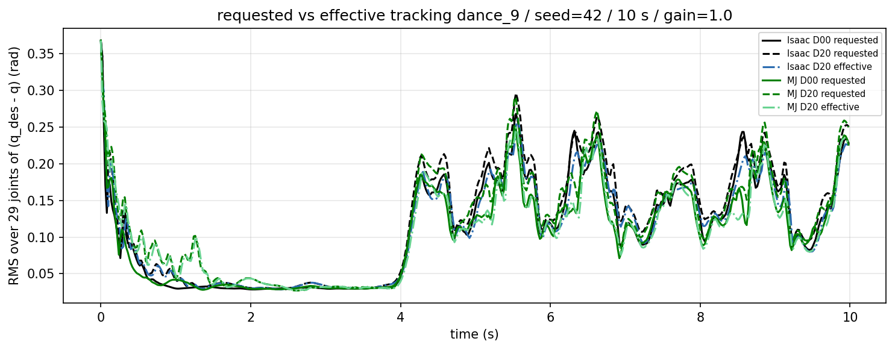
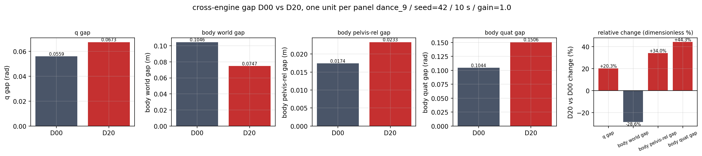

# 三项目 Sim2Sim 一页摘要（最终版，2026-09-02）

**实验链**：接口 G0-I → 资产 G0-A → 单关节执行器隔离 → 全身闭环迁移 → 0/20 ms 延迟鲁棒性；每层 fail-closed 门禁，全部定量结论来自冻结 trace + 独立 validator。

## 1. 三项目 Sim2Sim 实现对比

| | Humanoid Lab | Humanoid Gym | SONIC |
|---|---|---|---|
| 路线 | Isaac Lab/PhysX → deploy MuJoCo | Isaac Gym → MuJoCo 100 Hz | Isaac Lab → MuJoCo/C++ ROS2 |
| policy | ONNX（29 关节 metadata 契约） | TorchScript JIT（705→12） | ONNX + C++ 栈 |
| 观测 | 770 维=5 帧×154，repeat-first | 12 DOF×5 帧，15×0.01 s | 部署侧独立实现 |
| 配对 | 同机器人/权重/初态/动作（A 级） | 单引擎基线（B/C） | 台账 C/D，缺项 unavailable |

## 2. 三条核心结果

1. **右肘 armature 在有效隔离下因果明确**：单关节 |MJ−Isaac| MAE −74.8%（0.006752→0.001704 rad，`04_isolation_N5R2/elbow_gates.json`）；全身 dance_9 保留 −25.7%（0.0682→0.0507，`10_p1_fullbody_elbow/04_analysis/p1_final_gate.json`），伴 body +0.0048 m 小代价。
2. **扩展到全部手臂没有额外整体收益**：13 臂关节同设 0.01 后 E13 反而 −5.0%，29 关节与 body_quat 超 10% guard，decision `NO_INCREMENTAL_ARM_GROUP_EFFECT`（`12_p2_arm_only_v1_1/04_analysis/p2_final_gate.json`）；右肘-only 仍是最小有效修改。
3. **20 ms 下两侧均存活，指标呈 tradeoff**：各 500 周期 10 s 无摔倒无 reset；延迟实测唯一（Isaac 4×5 ms、MJ 10×2 ms）。requested tracking +10.6%/+14.2% 而 effective ≈ D00（执行目标相移）。跨引擎 q gap +20.3%、orientation gap +44.3%；world body gap −28.6% 来自 pelvis/root 平移收敛，pelvis-relative body gap +34.0%——单一 world 指标不能概括一致性（`13_p3_delay20_r4_build/13_p3_delay20/04_analysis/p3_metrics.json`，claim CL-07/08/09）。

## 3. 三张核心图

- 三项目实现对比：上表（claim CL-01）。
- armature 隔离→全身迁移：（配合 `../assets/n5/elbow.png`、`../assets/p1/native_matched_metric_bars.png`）。
- 0/20 ms 分解：、、。

## 4. 适用范围与下一步

限定：L7 29-DOF、dance_9、seed=42、10 s、gain=1.0、当前资产、显式 position-target FIFO、0/20 ms 两档；不外推到其他动作/延迟/原生 DelayBuffer/其他机器人。
下一步（可选研究）：frictionloss/PD 时序/dt/solver 机制定位 P2 变差；更大延迟档；WAIST_ONLY/N6；Gym 50 Hz；SONIC 按 §7 最小检查流程补证据。

*索引与校验：`../FINAL_DELIVERY_INDEX.csv`、`../FINAL_CLAIM_EVIDENCE_MATRIX.csv`；完整报告 `本周三项目Sim2Sim调研与实验总结_最终版.md`。*
