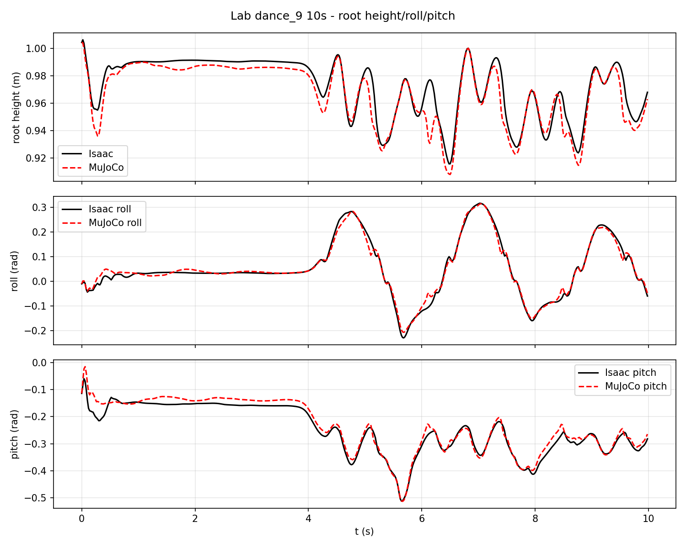
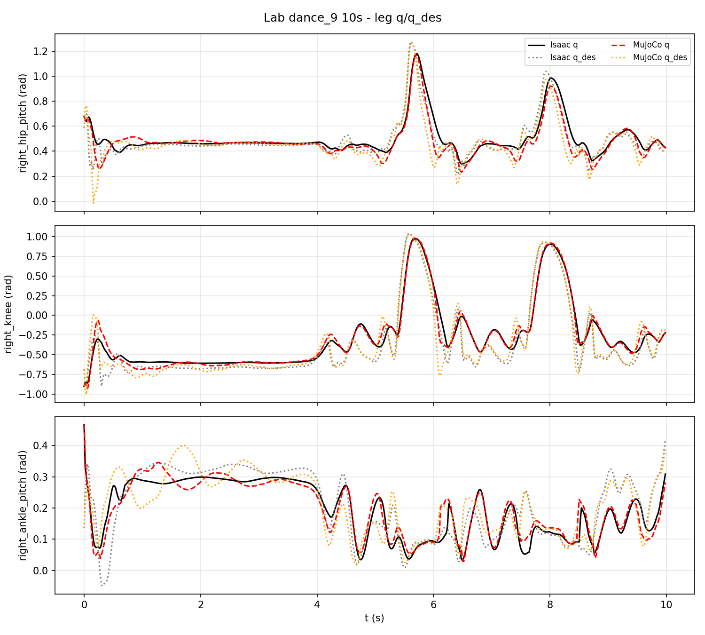
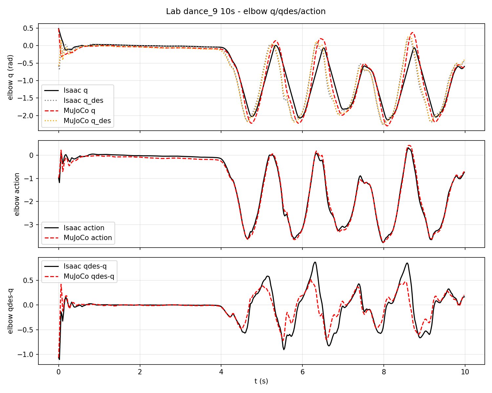
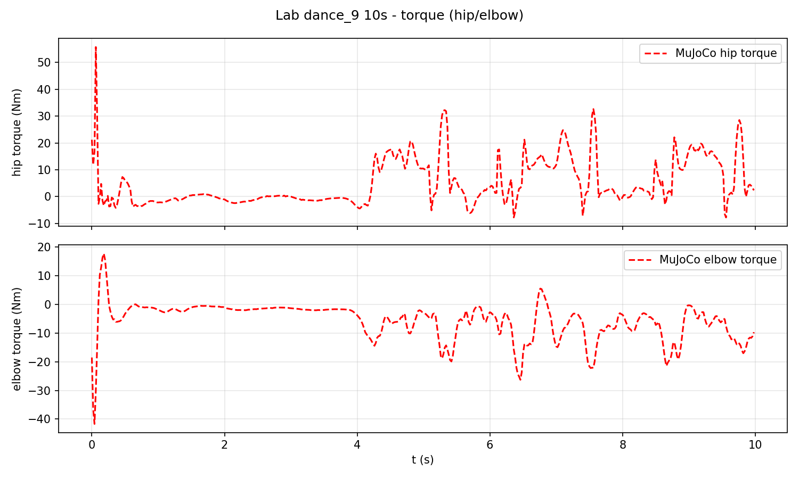
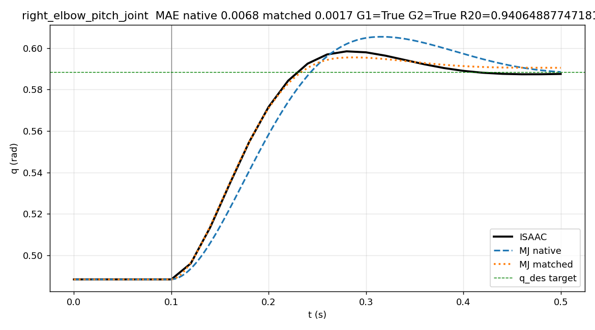
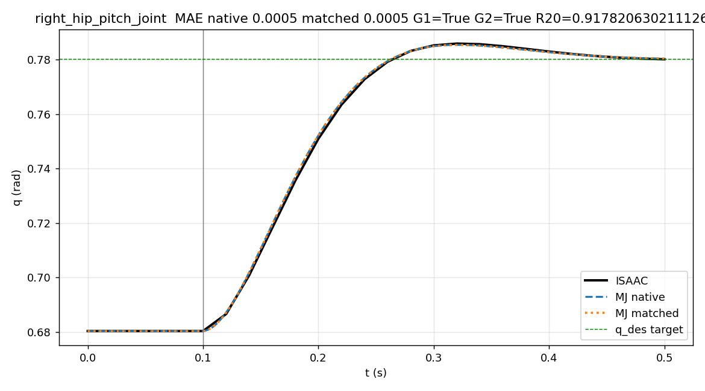

# 三项目 Sim2Sim 调研、实验与经验总结

> 时间：2026-08-24—2026-08-28  
> 对象：Humanoid Lab（主实验）、Humanoid Gym（实现参考）、SONIC（内部路线参考）  
> 本报告的主线：**三个项目怎么做 Sim2Sim → 为什么这样设计实验 → 中间出了什么问题 → 最终得到什么证据 → 下一步如何决策**

---

## 0. 先说结论：本周究竟做成了什么

本周建立了一条可信的 Isaac/PhysX—MuJoCo Sim2Sim 对比链路，并用它回答了一个具体问题：**关节 armature 不一致是否会造成两种物理引擎中的响应差异？**

最终形成四项结果：

1. **读通三套实现**：明确 Humanoid Lab、Humanoid Gym、SONIC 的观测、历史帧、动作映射、PD 控制和仿真步进并不相同，因此三个项目只能比较方法，不能直接比较绝对误差。
2. **建立 Lab 双引擎基线**：同一个 29 自由度舞蹈策略在 Isaac 和 MuJoCo 中均运行 10 秒、500 个控制周期，均未触发跌倒，但关节和根节点轨迹存在可测量差异。
3. **得到一个受限但可信的因果结论**：在右肘单关节、无接触、资产等价的条件下，仅将 MuJoCo armature 从 `0.0685` 对齐到 Isaac 的 `0.01`，相对 Isaac 的 MAE 从 `0.006752` 降到 `0.001704 rad`，改善 `74.8%`。
4. **沉淀实验方法**：实验中发现过一次严重的 URDF 生成错误，因此补齐了资产等价、运行值回读、重复确定性、负对照和哈希绑定门禁，撤回了无效旧结论。

一句话汇报可以表述为：

> 本周完成三项目 Sim2Sim 实现梳理，以 Humanoid Lab 为主建立 Isaac—MuJoCo 受控对比基线，修复并拦截资产生成错误，通过三重复单关节隔离实验确认 armature 对右肘跨引擎响应差异具有显著影响，并给出向全身实验扩展的下一步判据。

---

## 1. 我们研究的 Sim2Sim 到底是什么

机器人策略可以理解成机器人的“大脑”。它读取机器人当前状态和历史状态，输出动作；动作再经过关节目标转换和 PD 控制，交给物理引擎计算下一时刻状态。

```text
仿真器状态 q / dq / root
          ↓
构造观测与历史帧 observation/history
          ↓
策略网络 policy
          ↓
动作 action
          ↓
动作映射 action → q_des
          ↓
PD/执行器计算力矩
          ↓
PhysX 或 MuJoCo 推进一个控制周期
          ↓
产生新的状态，再反馈给策略
```

Sim2Sim 的目标，是让同一策略换一个物理引擎后仍保持相近行为。困难在于两个引擎之间不仅“物理公式不同”，还可能存在以下差异：

- 机器人模型：关节顺序、关节轴、质量、质心和惯量；
- 策略接口：观测顺序、归一化、历史帧初始化；
- 动作语义：动作是绝对角度、相对角度还是缩放后的关节目标；
- 控制语义：PD 是显式力矩还是引擎内部隐式驱动；
- 时间语义：策略频率、物理步长和每次动作保持多少个物理步；
- 引擎机制：摩擦、接触、求解器、限位和 armature。

因此，正确的研究顺序应当是：**先对齐接口和资产，再研究剩余物理差异。**

---

## 2. 三个项目分别如何实现 Sim2Sim

### 2.1 Humanoid Lab：29 自由度舞蹈策略，Isaac 训练/基线，MuJoCo 部署

Humanoid Lab 是本周的主实验对象。它控制 29 个关节，策略模仿 `dance_9` 动作。

#### 2.1.1 观测如何构造

配置入口：`humanoid-lab/deploy/src/era_rl_controller/configs/mimic_dance_9.yaml:1-26`。

每一帧观测包含：

- 参考动作的关节角和速度：58 维；
- 动作锚点方向：6 维；
- 基座角速度：3 维；
- 29 个相对关节角；
- 29 个关节速度；
- 上一时刻的 29 维动作。

每项保存 5 帧历史，因此总输入为：

```text
5 × (58 + 6 + 3 + 29 + 29 + 29) = 770 维
```

历史缓存由 `hist_observations.py:4-50` 的环形队列维护，并按配置顺序拼接。这里的顺序和初始化方式都属于策略接口的一部分，不能随意修改。

#### 2.1.2 策略输出如何变成关节目标

关键代码位于 `mimic_rl_interface.py:34-101`：

```python
obs = self.obs_hist.build_obs()
action = self.policy.run(
    ["actions"],
    {"obs": obs.reshape(1, -1), "time_step": np.array([[self.time_step]], dtype=np.float32)},
)[0]
joint_pos_des = action * self.action_scale + self.default_joint_pos
```

策略输出会先通过 ONNX 内记录的 `action_scale` 和 `default_joint_pos` 转成 29 个目标关节角 `q_des`，随后再由执行器产生控制作用。

#### 2.1.3 Isaac 和 MuJoCo 两侧如何执行

- Isaac/PhysX：物理步长 `0.005s`，每 4 个物理步更新一次策略，即控制周期 `0.02s`；执行器使用 PhysX/IsaacLab 隐式关节驱动。
- MuJoCo：物理步长 `0.002s`，每 10 个物理步更新一次策略，同样得到 `0.02s` 控制周期；每个物理步显式计算 PD 力矩。

MuJoCo 侧核心循环位于 `run_mujoco_onnx.py:745-836`：

```python
obs, _ = builder.build_obs(root_quat, root_ang_vel, q_pol, dq_pol)
action = policy.infer(obs)
q_des = action * action_scale + default_q

for _ in range(10):
    tau = (q_des - q_now) * kp - dq_now * kd
    data.ctrl[:] = tau
    mujoco.mj_step(model, data)
```

另一个关键点是 `map_by_name()`：策略、Sim2Sim 配置和 MJCF 中的关节必须按名字显式映射，缺失关节直接报错，不能用补零掩盖问题。

#### 2.1.4 Lab 的特点

Lab 的优势是双侧数据链完整：同一策略、同一动作、同一初始状态、视频、逐周期 trace、manifest 和哈希都能配对，所以它适合做本周的主实验。

---

### 2.2 Humanoid Gym：12 自由度行走策略，Isaac Gym 训练，MuJoCo 脚本复现

Humanoid Gym 控制的是 XBot 的 12 个腿部关节，任务是速度指令下的行走。它比 Lab 简单，但实现方式不同。

#### 2.2.1 观测和历史帧

入口：`humanoid-gym/humanoid/scripts/sim2sim.py:114-160` 和 `humanoid_config.py:40-46`。

单帧观测为 47 维：

```text
相位 sin/cos 2
+ 速度指令 3
+ 关节角 12
+ 关节速度 12
+ 上一动作 12
+ 机身角速度 3
+ 欧拉角 3
= 47 维
```

保存 15 帧历史，因此策略输入为：

```text
15 × 47 = 705 维
```

#### 2.2.2 动作和 PD 控制

Gym 的核心链路很直接：

```python
action = policy(torch.tensor(policy_input))[0]
target_q = action * 0.25
tau = (target_q - q) * kp - dq * kd
data.ctrl[:] = clip(tau, -tau_limit, tau_limit)
mujoco.mj_step(model, data)
```

物理步长是 `0.001s`，每 10 步更新一次策略，因此控制频率为 100Hz。PD 参数按腿部关节类型设置，例如 roll、pitch 和 ankle 使用不同的 Kp。

#### 2.2.3 Gym 的特点和限制

本周新增的 `sim2sim_record.py` 在原始运行链上补了 `trace.npz`、视频和 manifest。它证明这条 MuJoCo 部署链可运行，但没有与 Isaac Gym 重新跑一组严格配对数据，因此当前属于 B 级单引擎参考。

Gym 与 Lab 的自由度、观测维度、历史长度、动作语义和控制频率均不同，所以不能把两者的 `q RMSE` 或力矩数值直接横向比较。

---

### 2.3 SONIC：29 自由度、64 维运动 token 与 930 维本体历史联合控制

SONIC 是内部技术路线参考。它同样输出 29 维动作，但网络输入和部署链比 Lab 更复杂。

#### 2.3.1 策略输入结构

本体历史观测为：

```text
10 × 29 关节角      = 290
10 × 29 关节速度    = 290
10 × 3 重力方向     = 30
10 × 3 基座角速度   = 30
10 × 29 历史动作    = 290
合计                  = 930 维
```

编码器再产生一个 64 维运动 token，因此 decoder 的输入是：

```text
token 64 + proprioception 930 = 994 维 → 29 维动作
```

代码证据：

- `gear_sonic_deploy/policy/release/observation_config_sonic_release.yaml:10-31` 声明 token 和 10 帧历史观测；
- `g1_deploy_onnx_ref.cpp:1790-1794` 注册 `290/290/30/30` 等观测维度；
- `control_policy.hpp:100-188` 检查 ONNX 输入 `obs_dict` 和输出 `action`，并验证输出维度为 29；
- `SONIC_Training_Report.md:258-290` 记录 `930 + 64 → 994 → 29` 的网络结构。

#### 2.3.2 SONIC 的 Sim2Sim 路线

SONIC 的技术路线同时覆盖 MuJoCo 部署和跨引擎微调：

```text
II：Isaac 训练策略 → Isaac 验证
IM：Isaac 训练策略 → MuJoCo 零样本运行
MM：在 MuJoCo 中继续微调 → MuJoCo 验证
MI：MuJoCo 微调后的策略 → 回到 Isaac 验证
```

现有源码和报告表明，动作空间和逐关节控制语义必须先对齐，否则同一个网络输出在两侧代表的物理意义不同。之后即使接口对齐，仍可能需要在目标引擎中微调策略。

#### 2.3.3 SONIC 当前能说到什么程度

本证据包没有收齐 SONIC 四格的原始 NPZ/CSV、完整日志和哈希，所以：

- 架构与接口实现可以由源码确认；
- 已有视频/报告可以作为路线参考；
- 不能在本报告中把精确跌倒时间、成功率或 RMSE 当成 A 级实验结论；
- “策略绑定某个引擎”目前属于候选解释，仍需继续排除其他因果机制。

---

### 2.4 三个项目最关键的区别

| 项目 | 任务与输出 | 策略输入 | 动作到控制 | 控制频率 | 本周证据角色 |
|---|---|---:|---|---:|---|
| Humanoid Lab | 舞蹈模仿，29 关节 | 770 | `action×scale+default_q`，Isaac 隐式驱动/MJ 显式 PD | 50Hz | A 级主实验 |
| Humanoid Gym | 速度行走，12 腿关节 | 705 | `action×0.25`，MJ 显式 PD | 100Hz | B 级实现参考 |
| SONIC | token 条件全身控制，29 关节 | 994 | decoder 输出 29 动作，部署端另有控制语义 | 需按实际配置核对 | C/D 级路线参考 |

这个表说明：三者可以比较“Sim2Sim 应该对齐哪些环节”，但不能直接比较绝对误差并得出谁更好。

---

## 3. 为什么要这样设计实验

### 3.1 研究问题

实验分两层回答问题：

1. **系统层**：同一个完整舞蹈策略在 Isaac 和 MuJoCo 中能否都稳定运行？二者差多少？
2. **机制层**：观察到差异后，能否通过受控实验确认某一个物理参数是差异来源？

直接在全身舞蹈里同时修改几十个参数，虽然可能让视频“看起来更像”，但无法说明究竟是哪一个参数起作用。因此采用从整体到局部、再从局部返回整体的设计。

### 3.2 实验层级

```text
第一层：Lab 5s/10s 双引擎基线
目的：确认完整策略两侧都能运行，并量化总体差异
                    ↓
第二层：G0 资产等价与接口门禁
目的：确认比较的是同一个机械系统、同一个初态和同一种动作语义
                    ↓
第三层：单关节阶跃隔离
目的：在无重力、无接触条件下，只改变一个物理参数
                    ↓
第四层：负对照与三重复
目的：排除无操作漂移、随机性和文件错配
                    ↓
下一层：把单关节结论带回全身 dance_9 验证
```

### 3.3 为什么选择 elbow 和 hip

- 右肘：MuJoCo 原始 armature 为 `0.0685`，Isaac 对应值为 `0.01`，存在明确待验证差异；实验中只修改这一项。
- 右髋：native 和 matched 模型不修改参数，用作负对照。如果无修改也出现差异，说明实验流程自身不可信。

### 3.4 六个条件和三次重复

每个关节包含：

- Isaac native；
- MuJoCo native；
- MuJoCo matched。

两个关节共 6 个条件。smoke 阶段每个条件先跑 1 次，确认脚本和门禁工作；正式 N5-R2 阶段每个条件跑 3 次，共得到 `6 × 3 = 18` 条原始证据。

### 3.5 门禁分别防什么错误

| 门禁 | 检查内容 | 防止的错误 |
|---|---|---|
| G0 | 拓扑、FK、关节轴、质量、COM、等效惯量 | 两侧机器人模型不等价 |
| G1 | 初态、采样点、阶跃时间、目标关节 | 测错关节或起点不同 |
| G2 | 其他关节漂移、root 漂移、接触 | 隔离实验被其他运动污染 |
| G3 | 力矩饱和 | 参数效应被限幅掩盖 |
| G4 | 最小改善比例和绝对改善量 | 极小数值波动被误判为有效 |
| G5 | hip native/matched 必须一致 | 无操作也产生假变化 |
| G6 | 三重复字段与哈希一致 | 随机性、错文件或错版本 |

---

## 4. 实验中遇到了什么问题，如何纠偏

### 4.1 最严重的问题：隔离 URDF 生成错误

早期单关节实验曾得到“armature 只改善 0.17%，剩余差异主要来自其他机制”的结论。这个结论后来被撤回，因为资产生成脚本有错误。

错误是：程序把 canonical root 的世界变换重复写入每一级局部 `joint origin`。结果导致：

- 右肘下游等效惯量从约 `0.075` 被放大到 `6.83 kg·m²`，约 91 倍；
- 右髋从约 `1.039` 被放大到 `11.92 kg·m²`，约 11.5 倍；
- 最远 link 被推到约 24.5 米。

在这种情况下，Isaac 和 MuJoCo 的比较对象是两个不等价的机械系统，后续任何参数因果结论都无效。

### 4.2 修复方式

修复后遵守两个原则：

1. root 世界位姿只在 articulation 根节点设置一次；
2. 折叠固定关节时只计算局部变换 `T_fixed = T_origin · Rot(axis, q0)`，不重复叠加 root pose。

随后增加独立的 `asset_equivalence_check.py`，不依赖资产生成器本身，重新检查 FK、COM、质量和等效惯量。修复后的 COM 误差为 `5e-8/5e-7m`，等效惯量相对误差约 `1e-7`，G0 通过。

### 4.3 门禁本身也曾存在漏洞

- 早期 G1 的 `q0_maxerr` 实际可能为 `null`，并没有真正检查 canonical 初态；
- 早期 G4 没有最小效应阈值，`0.17%` 这样的变化也可能被判 PASS；
- 旧 trace 缺少 runner/model/canonical 哈希仍可能进入汇总；
- 单次 smoke 曾可能被误写成重复性 PASS。

这些问题后来都改为 fail-closed：缺字段、缺哈希、模型不对应或重复次数少于三次时，直接标记为 FAIL 或 `NOT_EVALUATED`。

### 4.4 这次纠偏说明什么

结果反常时，应先完成以下检查，再研究摩擦、求解器和 PD：

```text
资产真的相同吗？
初态真的写进去了吗？
运行时 Kp/Kd/armature 真的是配置值吗？
策略、模型和 trace 真的是同一版本吗？
```

这也是本周从“看结果”转向“保证实验有效性”的关键变化。

---

## 5. 实验结果是什么

### 5.1 Humanoid Lab 全身 10 秒基线

实验冻结同一个 ONNX 策略、`dance_9`、canonical 初态、50Hz 控制周期、`delay=0`、`gain=1.0` 和历史初始化方式。

Isaac 与 MuJoCo 均运行 10 秒、500 个控制周期，均未触发当前跌倒判据。

| 指标 | 结果 | 小白解释 |
|---|---:|---|
| Isaac—MuJoCo 关节角 RMSE | `0.06233 rad` | 29 个关节总体约 `3.57°` 的均方根差异 |
| `q_des` RMSE | `0.05467 rad` | 两侧闭环状态分叉后，策略给出的目标也开始不同 |
| root height RMSE | `0.00860m` | 机身高度平均量级差约 8.6mm |
| root roll RMSE | `0.01364 rad` | 横滚差约 `0.78°` |
| root pitch RMSE | `0.02006 rad` | 俯仰差约 `1.15°` |
| fall | 两侧均为 `false` | 当前 10 秒和当前判据下均未跌倒 |









[查看 10 秒并排视频](../02_lab_dance9/sidebyside_10s_labeled.mp4)

如何理解这组结果：两个引擎都能完成动作，说明策略具有一定跨引擎稳定性；但关节和根节点并不完全一致，说明仍存在真实的 Sim2Sim gap。由于策略是闭环的，一旦状态出现细小差异，后续观测和 `q_des` 也会逐渐不同，所以全身轨迹分叉不能直接归因于单个参数。

### 5.2 右肘 armature 单变量实验

固定条件：右肘初始角约 `0.488rad`，在 `0.10s` 时增加 `0.10rad` 阶跃；其他 28 个关节固定，root 固定，重力关闭，无接触，Kp/Kd 不变。

| 指标 | MuJoCo native | MuJoCo matched | Isaac |
|---|---:|---:|---:|
| armature | `0.0685` | `0.01` | `0.01` 对应设置 |
| MAE vs Isaac | `0.006752` | `0.001704` | — |
| t50 | `0.17743s` | `0.16329s` | `0.16382s` |

将 armature 对齐后：

- MAE 改善 `74.8%`；
- MuJoCo 的 t50 从 `0.17743s` 接近到 Isaac 的 `0.16382s`；
- 三次重复逐点最大差均为 `0.0`；
- final gate 的 `validity=true/all_pass=true`，G6 三重复检查为 `PASS`。



因此可以得出：**在当前右肘单关节隔离条件下，armature 不一致是跨引擎响应差异的重要原因。**

### 5.3 Hip 负对照

Hip 的 native 和 matched 模型没有参数差异，结果也应当没有差异。实验中两条 MuJoCo 轨迹逐点最大差为 `0.0`，相对 Isaac 的 MAE 均为 `0.000494rad`。



这说明实验流程能够区分“真实干预”和“无操作”，同时排除了重复运行对右肘改善的影响。

### 5.4 Humanoid Gym 参考结果

Gym 的 MuJoCo 记录链运行 10 秒、1000 个控制步：

- 前进 `x=3.73m`；
- 横向位移 `y=-0.78m`；
- 平均前向速度约 `0.373m/s`，指令为 `0.4m/s`；
- 保存了 trace、manifest 和视频。

它证明 12 自由度、705 维输入、100Hz 的部署链可以工作。但由于缺少本周重新生成的 Isaac Gym 配对 trace，只能作为 B 级参考，不能与 Lab 的 RMSE 直接比较。

### 5.5 SONIC 当前结果如何使用

SONIC 的主要价值是路线经验：

- 跨引擎前首先要逐关节对齐动作空间和控制语义；
- 接口对齐后仍可能存在物理残差，需要目标引擎微调；
- 微调后的策略回到源引擎可能退化，提示策略会适应训练引擎；这一现象仍不足以构成单变量因果证明。

由于本证据包没有收齐四格实验的原始日志和哈希，本报告只把这些作为 C/D 级路线参考，不把外部报告里的精确成功率、跌倒时间或奖励数字写成最终结论。

---

## 6. 我们最终能得出什么结论

### 6.1 可以确认的结论

1. Humanoid Lab 的同一舞蹈策略可以在 Isaac 和 MuJoCo 中运行 10 秒且不触发当前跌倒判据，但两侧存在约 `0.0623rad` 的关节角 RMSE。
2. 当前 Lab 双引擎链路已经能够绑定同一策略、初态、模型、runner 和数据文件，具备可复核性。
3. 在右肘单关节、`0.1rad` 阶跃、无重力、无接触、资产等价的条件下，armature 对齐使相对 Isaac 的 MAE 改善 `74.8%`。
4. Hip 无操作负对照和三重复确定性通过，增强了右肘因果结论的可信度。
5. Sim2Sim 的首要工作是对齐 contract 和资产；大规模物理参数搜索应安排在这些基础检查完成之后。

### 6.2 目前不能外推的结论

1. 不能说“整个人形机器人 Sim2Sim 误差减少了 74.8%”；74.8% 只属于右肘隔离阶跃。
2. 不能说 armature 是所有关节、所有动作的唯一主要因素。
3. 不能说 Isaac 与 MuJoCo 已经完全一致；全身轨迹仍有差异。
4. 不能用 Lab、Gym 和 SONIC 的绝对误差直接排名，因为机器人、策略和控制周期不同。
5. 不能把当前仿真结果直接当作真机结论。

---

## 7. 从三个项目总结出的 Sim2Sim 方法

### 7.1 先统一策略 contract

在谈物理参数之前，必须固定：

- joint order；
- observation order 和归一化；
- history 长度、顺序和初始化；
- action scale、default pose；
- control dt 和 physics dt；
- 初始 root/q/dq。

### 7.2 再证明资产等价

URDF 与 MJCF 文件名字相同不代表机械系统相同。至少要比较：

- 拓扑和自由度；
- 关节位置与轴；
- FK；
- link 质量与 COM；
- 关于目标关节的等效惯量。

### 7.3 配置值必须有 runtime readback

脚本配置写了 Kp、Kd、armature，不代表引擎最终使用的就是这些值。正式实验必须记录运行时回读值。

### 7.4 结论需要负对照和最小效应阈值

- 修改目标关节的实验用于观察效果；
- 不修改参数的关节用于确认系统不会凭空产生效果；
- 仅仅“数字变小”不够，必须事先定义最小改善比例和绝对改善量。

### 7.5 视频与数值承担不同职责

- 视频回答：机器人是否明显摔倒、抖动、穿模或行为异常；
- 曲线和 trace 回答：误差发生在哪个关节、何时开始、幅度多大；
- hash 和 manifest 回答：这段视频和数据到底由哪个模型、脚本和配置产生。

---

## 8. 后续怎么做

### P0：先做全身 elbow-only transfer probe

下一步先把单关节结论带回完整 `dance_9`，17 关节 N6 大矩阵暂缓启动：

```text
条件 A：MuJoCo 原始全身模型
条件 B：只对齐右肘 armature 的全身模型
其余策略、动作、初态、Kp/Kd、dt、seed 全部冻结
```

需要收集：

- 右肘 `q/q_des` 与 Isaac 的 MAE、RMSE、相位差；
- 全身 29 关节 RMSE；
- root 高度、roll、pitch；
- fall reason 和生存时间；
- 接触、饱和和运行时参数；
- 至少三次重复及哈希。

决策规则：

- 如果右肘误差明显改善，且 root/fall 不恶化，再进入 N6 的手臂、腰部等分组实验；
- 如果隔离实验有效、全身实验无效，说明接触和闭环耦合覆盖了局部效应，应转查 frictionloss、PD 执行语义、physics dt 和 solver；
- 如果结果无法重复，先修实验链，不讨论物理结论。

### P1：再决定是否扩大 N6

只有 P0 显示单关节结论能迁移到全身，才值得投入 N6。建议先做：

- `ARM_ONLY`：手臂相关关节；
- `WAIST_ONLY`：腰部 3 关节；
- 逐组比较全身 RMSE、root 和稳定性。

### 暂不优先

- 20 秒长时测试；
- delay/gain 大矩阵；
- Gym 50Hz 重训；
- 同时扫描 frictionloss、solver、PD 和 armature。

这些项目成本更高，而且在 P0 结果出来前不能提供更清晰的决策信息。

---

## 9. 证据在哪里

| 内容 | 路径 |
|---|---|
| Lab Isaac/MuJoCo 5s/10s trace、视频和 manifest | `02_lab_dance9/` |
| Lab 10 秒指标 | `09_report/lab_10s_metrics.csv` |
| G0 资产等价 | `04_G0/asset_equivalence_*.json` |
| 单次 smoke | `04_isolation_smoke/` |
| N5-R2 18 条原始证据 | `04_isolation_N5R2/` |
| elbow/hip G6 | `04_isolation_N5R2/elbow_G6.json`、`hip_G6.json` |
| elbow/hip final gate | `04_isolation_N5R2/elbow_gates.json`、`hip_gates.json` |
| Gym trace、视频和 manifest | `05_gym/` |
| SONIC 四格证据台账 | `06_sonic/sonic_II_IM_MM_MI_ledger.csv` |
| 声明—证据索引 | `09_report/evidence_index.csv` |
| 来源阅读记录 | `09_report/source_reading_log.md` |
| 包内完整哈希 | `SHA256.txt` |

证据等级含义：

- A：原始 trace、配置和哈希齐全，可复算并有配对或重复；
- B：有结构化 trace 和 manifest，但缺少完整双引擎配对；
- C：主要是视频或报告描述；
- D：静态代码分析或待验证推断。

---

## 10. 术语表

| 术语 | 含义 |
|---|---|
| DOF | 自由度，可以独立运动的关节数量 |
| obs | 策略输入的机器人状态 |
| history | 过去若干帧状态，让策略感知运动趋势 |
| action | 神经网络输出 |
| q / dq | 关节角 / 关节速度 |
| q_des | 控制器希望关节到达的目标角度 |
| PD | 根据位置误差和速度计算控制力矩的方法 |
| physics dt | 物理引擎每次积分推进的时间 |
| control dt | 策略多久更新一次动作 |
| armature | 关节侧附加转动惯量，会影响加速响应 |
| MAE/RMSE | 两条轨迹平均相差多少的两种指标 |
| t50 | 响应达到目标变化量 50% 的时间 |
| FK | 根据关节角计算各 link 位置的正向运动学 |
| COM | 质心 |
| Ieff | 关于目标关节的等效惯量 |
| negative control | 不施加干预的对照实验，用于检查假变化 |
| manifest/hash | 记录一次实验身份和文件指纹，防止版本错配 |

---

## 11. 环境与范围声明

- 证据包：`R4F_B1_Lab10s_N5R2_B31_20260831.zip`，213 个文件、212 个 payload，包内外 SHA256 均可校验；
- Isaac Sim 5.1.0、IsaacLab 2.3 路线；
- MuJoCo 3.2.7；
- Lab：29 DOF、50Hz 控制；
- Gym：12 DOF、100Hz 控制；
- 本周没有完成 N6、20 秒 Lab、delay/gain 大矩阵或 Gym 50Hz 重训；
- Isaac torque 与 MuJoCo `qfrc_actuator` 语义不同，因此没有强行画成同一 torque 指标；
- 当前结论属于 Sim2Sim，不等同于 Sim2Real 或真机验证。
