# 本周三项目 Sim2Sim 调研与实验总结（可读版 v2，2026-09-02）

> 读前说明：本文为 R7 官方报告的**可读性修订副本**（追加层，官方冻结版见 `../14_final_delivery/report/`，数字与限定语完全一致，冲突以官方版为准）。
> 全文所有链接均为**相对本文件的路径**，图片直接内嵌，视频以链接+规格给出（多数 Markdown 阅读器需联网渲染图片，Typora/VSCode 本地预览可直看）。
> 证据锚点编号 CL-01…10 对应 `../14_final_delivery/FINAL_CLAIM_EVIDENCE_MATRIX.csv`。
> v2.1 增补：各实验小节新增"**实验怎么做**"与逐图"**读图**"说明（判定词汇见 §2.5）；读图块中标 **≈** 的数值是从图上直接读出的近似值，精确值以正文数字与官方交付 CSV/JSON 为准。

---

## 1. 发现问题

### 1.1 我们面对的问题

策略（神经网络控制器）在 Isaac 物理引擎里训练出来，要搬到 MuJoCo 里回放甚至将来部署。两边跑的明明是**同一个策略文件、同一个动作、同一条初始姿态**，轨迹却对不上。需要回答三个问题：

1. 差在哪一层？（接口？机器人模型？控制执行方式？）
2. 差多少？能不能用数字说清楚？
3. 哪些差异会真的改变闭环行为（比如导致摔倒），哪些不会？

### 1.2 第一次翻车教给我们的事

实验早期我们曾在 Isaac 侧搭了一套"单关节隔离"模型，得出"armature 只改善 0.17%、差异另有主因"的结论。后来审查发现隔离模型的生成器有缺陷：根部位姿被重复折叠进每个关节，右肘下游等效惯量被放大约 **91 倍**（Isaac 6.83 vs MuJoCo 0.075 kg·m²），最远连杆被推到 24 米外。相关结论全部撤回。事后固化了三条硬规矩（详见官方版 §4）：

- 生成资产的代码**不许**自己检查自己——审计器独立实现；
- 资产等价性不通过，**禁止**进入任何动力学结论；
- 每道门禁配"真实篡改负测试"，证明它真的会拒绝坏数据。

### 1.3 问题分解：差异只可能来自三层

| 层 | 含义 | 典型例子 |
|---|---|---|
| 接口 | 观测怎么拼、动作怎么读、关节顺序 | history 预填语义、观测维度顺序 |
| 资产 | 两引擎各自加载的机器人模型文件 | 质量、惯量、**armature**、摩擦 |
| 执行语义 | 从动作到力矩再到物理积分的路径 | PD 在哪算、延迟多少、求解器 |

把三层混在一起比，任何因果结论都不可信——这就是五层实验设计的由来（§2）。

### 1.4 本周最终抓到的三个具体现象

1. **资产层实锤**：两侧执行器参数逐项回读后发现，上半身 17 个关节的 armature 数值不同，右肘差 **6.85 倍**（§3，本周性价比最高的一次测量）。
2. **隔离≠全身**：把差异修掉后，单关节改善 74.8%，到全身只剩 25.7%，全臂推广甚至变差（§4.2–4.4）。
3. **延迟的"变好"是错觉**：20ms 延迟下 world 系位置差改善 28.6%，但相对骨盆的身体构型差恶化 34%——单一指标会骗人（§4.5）。

---

## 2. 实验设计

### 2.1 五层门禁流水线

| 层 | 实验 | 控制变量 | 判定门禁 | 通过情况 |
|---|---|---|---|---|
| 1 | 接口 G0-I | 同 ONNX、同 canonical、cycle0 静态注入 | 逐字段 <1e-4 | ✅ CL-02 |
| 2 | 资产 G0-A | 隔离 URDF/MJCF 的 FK/COM/惯量 | 相对差 1e-7 | ✅ CL-03 |
| 3 | 单关节隔离 | 固定基座、0.5s 阶跃、只改 1 个参数 | G1–G6 + 阴性对照 | ✅ CL-04 |
| 4 | 全身闭环迁移 | dance_9 10s × 3 重复、单变量 | 预注册效应阈值 + guard | ✅ CL-05/06 |
| 5 | 延迟鲁棒性 | 0/20ms 受控等时延、双侧同协议 | requested/effective 全记录 | ✅ CL-07/08/09 |

上层不过，下层结论作废（fail-closed）。所有定量结论只来自冻结 trace + 独立 validator，视频仅作观察。

### 2.2 受控对象（适用范围）

L7 29-DOF 机器人 / dance_9 动作 / seed=42 / 10 秒（500 控制周期）/ gain=1.0 / 显式 position-target FIFO / 0 与 20ms 两档延迟。环境：Isaac 侧 Windows Isaac Sim 5.1.0（Py3.11.9），MuJoCo 侧 WSL mujoco 3.2.7；代码与资产全部哈希绑定（`executed_sources/`，见 `../code_snapshot/README_CODE_SNAPSHOT.md`）。

### 2.3 三对关键口径（读懂结果的钥匙）

1. **requested vs effective**：策略发出的目标位置（requested）与执行器**实际收到**的目标（effective，延迟后）。只记前者没资格谈延迟结论。
2. **world vs pelvis-relative**：身体位置误差按世界坐标系算，还是减去骨盆自身位移后算。前者混入"站哪"，后者只看"身体怎么摆"。
3. **tracking vs sensitivity**：tracking 是对目标的跟随误差；sensitivity 是加延迟前后轨迹的位移量（观测量，本周未预注册鲁棒阈值，不下 PASS/FAIL）。

### 2.4 可信度机制

- **3 次重复**：仿真确定性下逐位复现（max diff 0.0 <1e-7），防管线泄漏；
- **阴性对照**：髋关节不受干预时差异 0.0 纹丝不动，防"改哪都有效"假象；
- **真实篡改负测试**：P3 8 项 + P2 2 项 + 最终 5 项，故意改坏数据必须被拒，对照组必须通过；
- **哈希三分**：完整树 / 反馈包 / 最终包各自独立清单，不混称。

### 2.5 判定与图表词汇表（读 §4 各图之前过一遍）

| 词汇 | 含义 |
|---|---|
| G0 资产门禁 | 隔离 URDF/MJCF 逐项对账：FK/质心/等效惯量相对差 ≤1e-7，生成物哈希绑定 |
| G1 采样门禁 | 两侧时间网格严格递增、起止对齐；运行时根部位姿回读误差近零 |
| G2 隔离门禁 | 非目标关节漂移 / 根部漂移 / 接触数全为零——证明"真的只动了一个关节" |
| G3 不饱和门禁 | 全程力矩未触及上限，排除"差异其实是限幅造成"的混淆解释 |
| G4 改善门禁 | 预注册最小效应：MAE 相对改善 ≥10% 且绝对改善 ≥0.001 rad，先注册后看数 |
| G5 阴性对照门禁 | 髋关节：肘部干预模型与原生模型在髋轨迹上逐点差必须 = 0 |
| G6 重复门禁 | 3 次重复的 trace 逐位一致（max diff 0.0），防管线泄漏 |
| t10 / t50 / t90 | 阶跃后轨迹到达目标值 10% / 50% / 90% 的时刻（s） |
| R20 | 阶跃后 20 ms（t=0.12 s）处，Isaac 与 matched 模型离开初始位置的位移之比，≈1 即早期响应对齐；仅作 sanity 记录、不参与门禁 |
| E13 / E14 | 双臂除右肘 13 关节 / 双臂全部 14 关节的 0–2 s RMSE 均值（rad） |
| MAE 0-2s / MAE active | 右肘对 Isaac 误差的两个统计窗口：前 2 s 全程 / 动作最剧烈的"活跃窗口" |
| guard | 预注册保护线（±10%）：干预让非目标指标越线即判负，防止"修一个好三个坏" |
| sensitivity | 同一引擎内 D20 与 D00 两条轨迹的 RMS 位移（观测指标，无 PASS/FAIL） |
| gap | 跨引擎、同延迟配对下两轨迹的 RMS 差，按口径分 q / world / pelvis-rel / orientation 等 |

---

## 3. readback 表：一次启动换一张地图

> 数据本体：`../code_snapshot/n4_isolation/actuator_runtime_contract.csv`（生成脚本同目录）；原始位置 `full_output_archive/04_actuator_isolation/`。

### 3.1 思路

配置文件里写的参数 ≠ 引擎真正用的参数（隔着一层导入默认值、actuator 覆盖、单位换算）。所以**真启动一次 Isaac Kit**、**真编译一次 MuJoCo XML**，从引擎内存里把每个关节的执行器参数读出来，29 行并排成表。成本几分钟，收益是后面所有实验的方向盘。

### 3.2 表里 16 个实测量

| 量 | 含义 | 量纲 |
|---|---|---|
| armature（双侧 runtime） | 电机转子折算到关节的附加转动惯量 | kg·m² |
| kp（requested/runtime/metadata 三路） | PD 比例增益（位置刚度） | N·m/rad |
| kd（三路） | PD 微分增益（速度阻尼） | N·m·s/rad |
| effort_limit / ctrl_range | 力矩输出上限 | N·m |
| velocity limit（仅 Isaac 有值） | 关节角速度上限 | rad/s |
| joint/dof/actuator 三套 id | MuJoCo 内部索引，防数错位 | — |
| gainprm0 / gear | 执行器输入缩放 / 传动比 | — |
| dof_damping / dof_frictionloss | 关节线性阻尼 / 干摩擦（仅 MuJoCo 回读） | N·m·s/rad / N·m |

### 3.3 核对结果：三类

**✅ 双侧一致（排除嫌疑）**

- kp、kd：29/29 逐位相等（Isaac requested == runtime == MuJoCo metadata）；
- 力矩上限：effort_limit == ctrl_range 全部相等（±95/±110/±255/±350）；
- gainprm0=1、gear=1：无隐藏缩放，"ctrl 写多少就是多少 N·m"；
- 腿部 12 关节 armature：髋 roll 0.16473、髋 yaw 0.088、髋 pitch 0.0968、膝 0.0968、踝 0.045，两侧完全相同。

**❌ 双侧不一致（本周主发现，共 17 个关节的 armature）**

| 关节组 | Isaac | MuJoCo | 倍数 |
|---|---|---|---|
| 肩 pitch / 肩 roll / 臂 yaw / 肘 pitch ×左右 + 腰 yaw（9 个） | 0.01 | 0.0685 | 6.85 |
| 肘 yaw / 腕 pitch / 腕 roll ×左右（6 个） | 0.01 | 0.03 | 3.0 |
| 腰 roll / 腰 pitch（2 个） | 0.02 | 0.025102 | 1.26 |

**⬜ 单侧缺失（如实记录，后续扫描候选）**

- 速度上限：Isaac 设了 4.19–20 rad/s，MuJoCo 未设；
- frictionloss：MuJoCo 全部 29 关节清一色 0.1，Isaac 侧未回读——armature 对齐后残余 ~0.013 rad 差异的头号嫌疑人；
- dof_damping：MuJoCo 全 0（阻尼走 runner 外置 PD），Isaac 侧未回读。

### 3.4 这张表如何决定后续实验

右肘差 6.85 倍 → 选它做隔离干预对象（§4.2）；右髋两侧一致 → 选它做**阴性对照**；14 个臂关节不一致 → 设计 P2 组扩展（§4.4）；腰 3 个不一致 → 留作 WAIST_ONLY 后续实验；frictionloss 单侧 → 列为机制扫描第一项。

---

## 4. 结果

### 4.1 两道前置门禁通过（CL-02/03）

- 接口：cycle0 观测/动作/状态逐字段 <1e-4；cycle1 起分叉属动力学差异，移交后续层。
- 资产：下游质心世界位置差 5.06e-8/5.17e-7 m，目标关节等效惯量 0.075245/1.039145 kg·m²（相对差 1e-7）。
- 双引擎 10s 基线：root 高度 RMSE 8.60 mm、q RMSE 0.0623 rad（`full_output_archive/09_report/lab_10s_metrics.csv`）。

### 4.2 单关节隔离：armature 因果成立（CL-04）

**实验怎么做**：把机器人钉在固定基座上，右肘 pitch 从初始 0.4884 rad 出发，在 t=0.1 s 收到一个 +0.1 rad 的位置阶跃，跑满 0.5 s。同一阶跃在三个模型上各跑 3 次：Isaac 原生（参照系）、MuJoCo 原生（armature 0.0685）、MuJoCo 对齐（armature 0.01，**其余参数经 G0 审计逐项等价**——保证单变量）。G0–G6 六道门禁全过（G4 预注册最小效应 10%，实际 74.8%），结论才有效。

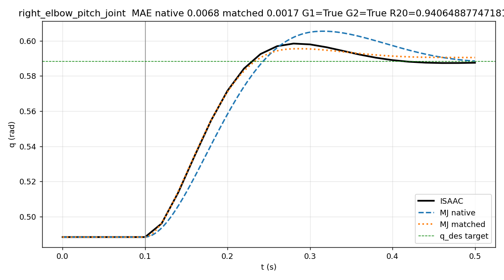

**读图（右肘阶跃响应）**：横轴 0–0.5 s，纵轴右肘角 q（rad）。黑实线 Isaac、蓝长虚线 MJ native、橙点线 MJ matched、绿水平虚线为阶跃目标（0.5884 rad），t=0.1 s 灰竖线是指令下发时刻。**怎么看出 native 坏**：蓝线起跳慢（t50 0.177 s vs Isaac 0.164 s）、冲过头（超调 0.0171 vs 0.0101 rad）、回落拖沓；橙点线全程贴住黑线（t50 0.163 s、超调 0.0071 rad）。标题一行即判定摘要：MAE native 0.0068 → matched 0.0017（对 Isaac 的平均绝对误差），G1=G2=True，R20=0.9406（早期响应比，见 §2.5）。

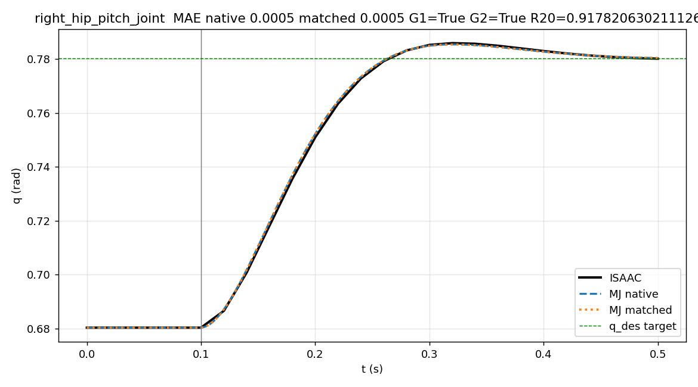

**读图（髋阴性对照）**：同一套阶跃协议打在右髋 pitch 上（该关节两侧 armature 本来就一致，0.0968）。三条线基本重合；其中 MJ native 与 MJ matched 两条线**逐点差严格为 0**（G5），与 Isaac 的残余 MAE 仅 0.0005 rad——这是"两侧本就对齐的关节"的基线噪声水平。这张图排除两种假阳性：干预外溢到别的关节（G2），或指标对任何改动都显示"改善"。

- |MJ−Isaac| MAE 0.006752 → **0.001704 rad（−74.8%）**，t50 0.177→0.163 s；
- 髋对照：干预前后差异 0.0，纹丝不动；
- 残余（matched 后 0.0017 ≠ 0；全身量级 ~0.013 rad，见 §3.3）说明 armature 是有力候选，**非唯一来源**（待查 §3.3 的 ⬜ 项）。

### 4.3 全身迁移 P1：有效但衰减（CL-05）

**实验怎么做**：把 §4.2 验证过的同一改动（右肘 armature 0.0685→0.01）放进真实任务：29 关节全身、骨盆自由浮动、ONNX 策略闭环回放 dance_9 共 10 s。native 与 matched 各 3 次正式运行（共 6 次），逐周期记录观测/动作/关节状态，指标从冻结 trace 复算。回答的问题：**隔离里的因果，放进闭环还剩多少？**

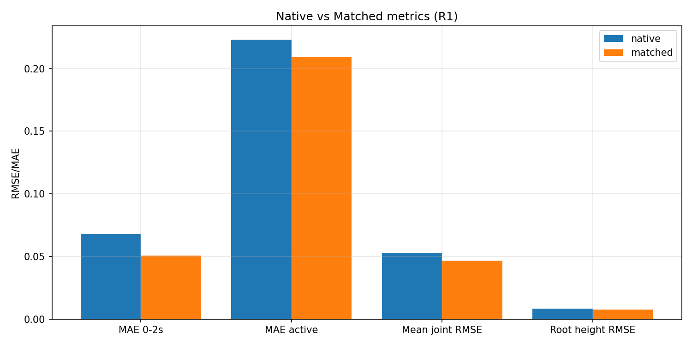

**读图（四组指标柱状）**：每组两根柱（蓝 native / 橙 matched），纵轴为误差值。四组依次是右肘对 Isaac 误差的四个口径：前 2 s MAE（0.0682→0.0507 rad，即 CL-05 主数字 −25.7%）、活跃窗口 MAE（≈0.22→≈0.21）、29 关节平均 RMSE（≈0.053→≈0.046）、root 高度 RMSE（≈0.008，基本不动）。**读法**：橙柱没有一根高于蓝柱，但改善幅度从左到右递减——左端是干预关节本身（直接受益），右端是全身指标（只被连带轻微带动）。

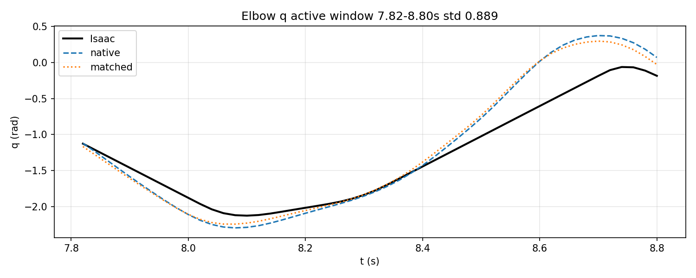

**读图（活跃窗口曲线）**：横轴 7.82–8.80 s（窗口选取标准：右肘动作最剧烈的一段，窗口内 q 标准差 0.889 rad），纵轴右肘角。黑实线 Isaac、蓝虚线 native、橙点线 matched。**读法**：下降段三线几乎重合；分差集中在两个极端——谷底 native 冲得更深（≈−2.3 vs matched ≈−2.23 rad）、峰顶 native 摆得更高（≈+0.37 vs ≈+0.3 rad），matched 都往 Isaac 方向收了一步；但上升段后段（>8.4 s）Isaac 幅值系统性偏小，两条 MJ 线都贴不上——**修 armature 收回了 25.7%，没收干净的部分属于 §3.3 的 ⬜ 待查项**。

- 右肘误差 0.0682 → 0.0507 rad（**−25.7%**），3/3 重复同向；
- 代价：body 位置 +0.0048 m、pelvis +0.0055 m（小量权衡，未过 guard 线）；
- 隔离的 74.8% 到全身打了三三折——**禁止把隔离百分比直接写成全身预期**。

视频：三栏对照（Isaac 原生 / MJ 原生 0.0685 / MJ 对齐 0.01）
`../full_output_archive/10_p1_fullbody_elbow/05_media/isaac_native_matched_10s_labeled.mp4`（295 帧，10s 名义时长，1920×410）。

### 4.4 臂组扩展 P2：全对齐反而变差（CL-06）

**实验怎么做**：P1 只动了右肘；P2 把其余 13 个臂关节的 armature 也一并改成 Isaac 值（审计确认模型**只差这 13 个参数**）。三个条件同协议对比：native（全原生）→ elbow-only（P1 终点）→ arm（再对齐 13 关节，图中标 arm-only）。判分规则：右肘收益必须保住（相对 elbow-only 退化 ≤10%），且系统指标不得越过 ±10% guard。

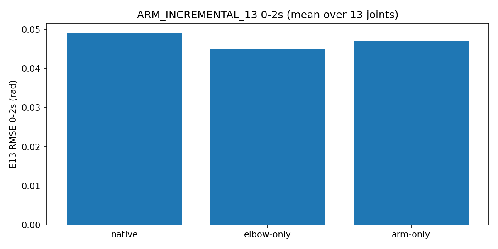

**读图（E13 柱状）**：E13 = 双臂除右肘 13 关节的 0–2 s RMSE 均值（rad）。三根柱：native ≈0.049 → elbow-only 0.0449 → arm 0.0471。**读法**：右肘单点修复顺带把整臂误差拉低一档（0.049→0.0449）；再对齐 13 个关节后柱子不降反升（+5.0%）——"把错的参数全改对"在全身闭环里没有增量收益。

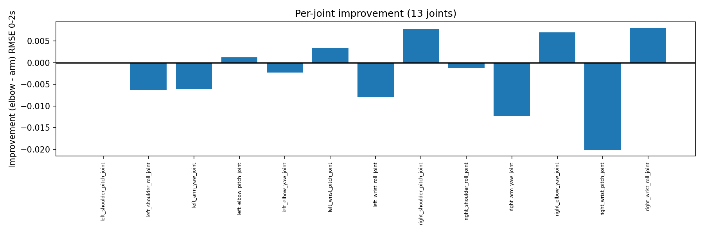

**读图（逐关节改善）**：横轴 13 个关节名，纵轴"改善量 = elbow-only 误差 − arm 误差"（0–2 s RMSE，rad），零线上方 = 对齐有利、下方 = 有害。13 根柱 **5 上 8 下**，幅度从 ≈+0.008 到 ≈−0.02（恶化最深在右腕 pitch），正负与关节的左右、远近、类型都对不出规律。**读法**：这不是"该修哪几个关节"的清单，而是"整组对齐不可预测"的证据——每个关节的利弊由全身耦合决定，不由参数对错直接决定。

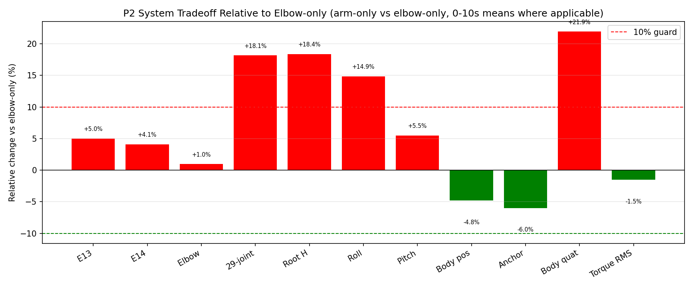

**读图（系统权衡）**：横轴 11 项全身指标相对 elbow-only 的变化（%），红=变差、绿=变好，±10% 虚线为预注册 guard，柱顶印有精确百分比。**读法**：越线的 4 项全在系统层——29 关节总跟踪 +18.1%、root 高度 +18.4%、root roll +14.9%、身体姿态 +21.9%；而关节层指标全部在线内（E13 +5.0%、E14 +4.1%、右肘 +1.0%），身体位置/锚点甚至略好（−4.8%/−6.0%）。一句话：**关节看着没坏多少，整台机器的站姿和姿态已被带偏**——guard 必须设在系统层的原因。

- 13 关节自身误差 E13 0.04489 → 0.04714 rad（**−5.0%，反而变差**），逐关节 5 改善 8 恶化无规律；
- 右肘收益保住（0.0507→0.0512，+0.96% ≤10%）；
- 系统 guard 双超线：29 关节总跟踪 +0.0084（阈值 0.0047）、身体姿态 +0.0229 rad（阈值 0.0104）；body 位置反而 −0.0050 略好；
- 判定 `NO_INCREMENTAL_ARM_GROUP_EFFECT`：MuJoCo 那组"错的"大惯量可能在补偿别的未建模差异（frictionloss/PD 时序）。**最小有效修改停在右肘-only。**

### 4.5 延迟实验 P3：活下来，但"更像"是错觉（CL-07/08/09）

**实验怎么做**：四条件（Isaac/MJ × 0/20ms）各 500 周期 10s，全部无摔倒无 reset。延迟不是"配置里写了"就算数——由 instrumented actuator（显式 position-target FIFO）注入，并从 trace 逐点反推实测唯一：Isaac shift=4×5ms，次优解释差 0.419 rad；MJ shift=10×2ms。每个周期同时记录 requested 与 effective 两份目标；MuJoCo 侧用 P1 的右肘对齐模型（视频标签 right-elbow matched）。

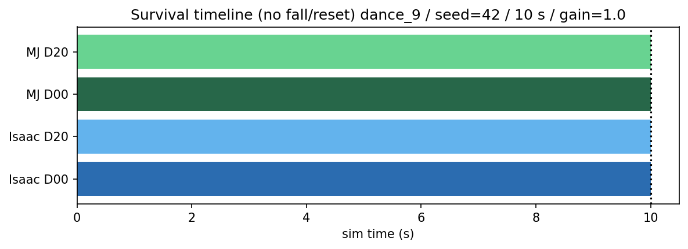

**读图（存活时间线）**：四根水平条 = 四个条件（纵轴自上而下 MJ D20 / MJ D00 / Isaac D20 / Isaac D00），横轴仿真时间 0–10 s，10 s 处虚线为满分线。四根条全部顶满到虚线、无摔倒/reset 标记——这就是 CL-07"两侧 20ms 下都活着"的全部内容。**注意它只回答"活没活"，不回答"像不像"**；像不像看下面五张图。

**(a) 引擎内谁更怕延迟**（sensitivity，D20 vs D00 轨迹位移）：

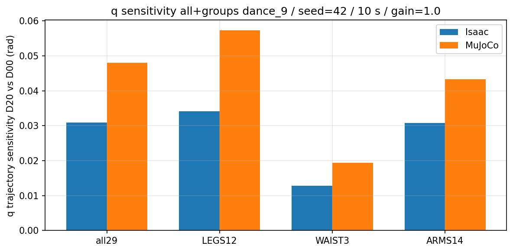

**读图（q 敏感度）**：分组柱状图，横轴四组（all29 / LEGS12 / WAIST3 / ARMS14），蓝柱 Isaac、橙柱 MuJoCo，纵轴 q sensitivity = 同引擎内 D20 与 D00 两条轨迹的 RMS 位移（rad）。四组橙柱全部高于蓝柱（约 1.4–1.7 倍），腰最不敏感、腿差最大。**读法**：这是"MuJoCo 对 20ms 更敏感"的证据；但 sensitivity 是观测量（§2.3 未预注册鲁棒阈值），只陈述事实、不下 PASS/FAIL。

- q sensitivity：Isaac 0.030929 vs MuJoCo 0.048023 rad——**MuJoCo 对 20ms 更敏感约 1.6 倍**；分组 LEGS/WAIST/ARMS：MJ 0.057/0.019/0.043 vs Isaac 0.034/0.013/0.031。

**(b) 变差的是"相位"**（requested/effective 口径）：

**读图（跟踪误差时间序列）**：纵轴是每个控制周期上 29 关节 (q_des−q) 的 RMS（rad），横轴 0–10 s。六条线 = 2 引擎 × 3 口径：黑=Isaac、绿=MJ；实线 D00 requested、虚线 D20 requested、点划线 D20 effective（0ms 时 requested 与 effective 逐点相同，无需另画）。曲线呈三段：开头瞬态峰 ~0.3+ rad、1.5–4 s 平稳期 ~0.03、后半程随动作幅度起伏至 0.2–0.3。**关键模式**：同色虚线系统性高于实线（对"理想指令"的误差被延迟抬高），点划线却回落到实线水平（对"实际听到的指令"跟踪如常）——两线之差就是"晚一拍"的代价，10 s 均值即下方数字。

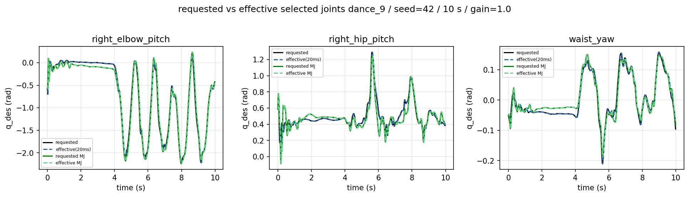

**读图（requested vs effective 曲线）**：三个代表关节（右肘 / 右髋 pitch / 腰 yaw）的目标位置 q_des，每格四条线：黑实线 Isaac requested、蓝虚线 Isaac effective(20ms)、绿实线/虚线 MJ requested/effective。在 10 s 的横轴尺度下，20 ms 平移小到几乎不可见，四条线近乎重合——**这正是要证明的事**：effective 不是"变坏了的指令"，而是同一形状的指令整体晚到一个控制周期。与上一张图合成 CL-08 的相位机制：误差上升全部来自"晚一拍"，不是"跟不住"。

- 对原始指令算跟踪误差：Isaac +10.6%、MJ +14.2%；对**实际收到的**指令算：与 0ms 持平（0.1300/0.1231 rad）；
- 执行器跟它听到的目标跟得一模一样好，只是永远晚一拍。

**(c) 跨引擎：方向相反的两组数字必须并列**：

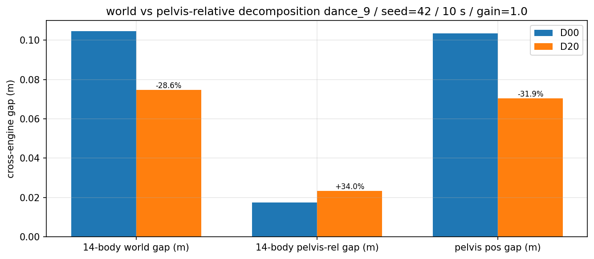

**读图（口径分解）**：三组柱，每组蓝 D00 / 橙 D20，橙柱顶标注变化百分比。统计对象是 14 个被跟踪身体刚体的位置 gap（跨引擎、同延迟配对的 RMS 差，m）：world 系 0.1046→0.0747（−28.6%，"看着变好"）；减去骨盆平移后的 pelvis-relative 0.0174→0.0233（+34.0%，实际变差）；骨盆自身位置 0.1033→0.0704（−31.9%）。**读法**：world 的"改善"幅度与骨盆位置收敛幅度几乎相同——world 误差的大头本来就是"骨盆站偏了"，延迟让两边骨盆的走失路径趋同，world 数字随之缩小；把骨盆扣掉，身体相对构型的分歧其实在扩大。

**读图（四口径全景）**：五个面板，前四面板各画一个跨引擎 gap 的 D00（蓝）/D20（红）对比并在柱顶标数值，第五面板把四个相对变化并排成柱。q gap +20.3%、world −28.6%、pelvis-rel +34.0%、姿态 +44.3%——**除 world 外全线变差**。这张图是"禁止用单一 world 数字宣称 20ms 让两侧更一致"（CL-09）的完整论据。

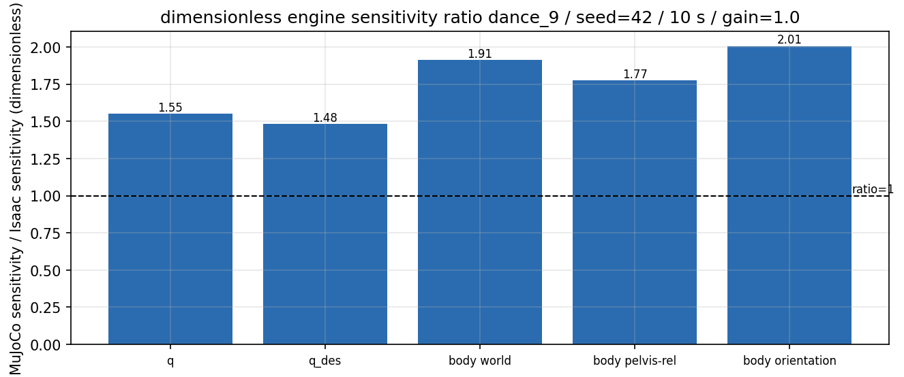

**读图（无量纲比值）**：把每项 sensitivity 化成 MJ/Isaac 比值，黑虚线 ratio=1 表示"两侧同等敏感"。五根柱全部越过 1：q 1.55、q_des 1.48、body world 1.91、body pelvis-rel 1.77、body orientation 2.01。**读法**：排序回答"差在哪个量纲"——指令本身差得最少（1.48），身体姿态差得最多（2.01）；MuJoCo 的"更敏感"是全身性的，不局限于某个局部。

| 跨引擎指标 | D00 → D20 | 变化 |
|---|---|---|
| q gap | 0.0559 → 0.0673 rad | +20.3% |
| body world gap | 0.1046 → 0.0747 m | **−28.6%（看着变好）** |
| body pelvis-relative gap | 0.0174 → 0.0233 m | **+34.0%（其实变差）** |
| body 姿态 gap | 0.1044 → 0.1506 rad | +44.3% |
| pelvis 位置 gap / 姿态 gap | — | −31.9% / +108.2% |

- world 的"改善"来自两边走失路径整体趋同（root 平移收敛），身体相对构型与姿态同时变差 → **禁止用单一 world 数字说"20ms 让两边更一致"**（口径纪律，见 §2.3）；
- MuJoCo 力矩：applied RMS 18.22→18.83 N·m（+3.4%），饱和比例 0.58→0.573（腕踝限位）；Isaac 侧力矩 UNAVAILABLE；
- 全部图表数据 CSV：`../14_final_delivery/assets/p3/data_01…11*.csv`。

四格同步视频（Isaac 0ms / Isaac 20ms / MJ 0ms / MJ 20ms，250 帧 × 25fps，覆盖 10.0s，1280×720；画面内 t 为 nominal simulation time）：
`../full_output_archive/13_p3_delay20_r4_build/13_p3_delay20/05_media/p3_delay_four_panel_10s.mp4`

**视频与静帧怎么看**：画面 2×2 = 引擎（上 Isaac / 下 MuJoCo）× 延迟（左 0ms / 右 20ms），每格标签写明 physics dt（Isaac 0.005 / MJ 0.002 s）、control dt（两侧同为 0.020 s）与模型（Isaac native URDF / MJ right-elbow matched）。下方三张静帧取自视频首/中/尾（对应名义 t=0 / 5.0 / 9.96 s）：首帧四格同姿直立；中帧与尾帧四格仍全部站立——CL-07 存活结论的定性对照。两点诚实声明：Isaac D00 格复用了 P1 时期的近机位基线视频，中帧该格叠加时间戳显示 3.00 s 而其余三格为 5.00 s，这是"帧索引-时间按比例映射"名义假设的直接后果（`../14_final_delivery/assets/p3/media_manifest.json`）；帧间可见的姿态差异（如尾帧各格动作相位不同）只作观察，定量结论一律以冻结 trace 为准。

首/中/尾帧静态检查：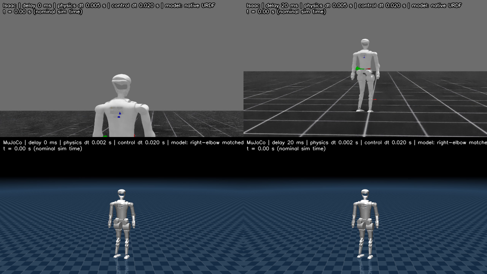 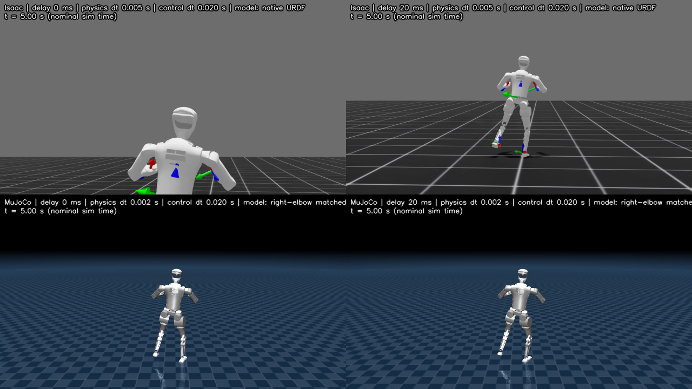 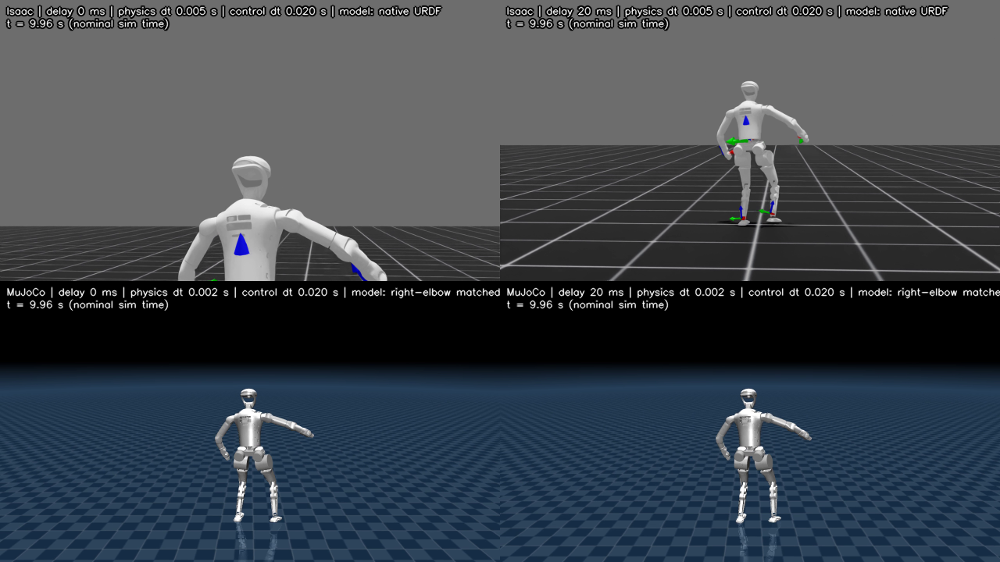

### 4.6 三个项目的基线面貌

- **Lab（定量主线，A 级）**：双引擎 10s 并排视频 `../14_final_delivery/assets/lab/sidebyside_10s_labeled.mp4`（295 帧，Isaac 侧容器时长 8.333s 为 30fps 封装差异，覆盖仿真时间 10.0s，见 `../14_final_delivery/assets/p3/media_manifest.json`）。
- **Gym（参考，B/C 级）**：XBot 12-DOF，MuJoCo 100Hz 带日志基线 10s/1000 步，x 3.73 m、y −0.78 m（`full_output_archive/05_gym/mj_100hz/`）；视频 `../full_output_archive/05_gym/mj_100hz/video.mp4` 与历史视频 `../full_output_archive/05_gym/xbot_walk_existing.mp4`。与 Lab 机器人不同，绝对数值禁止互比（铁律 5）。
- **SONIC（经验台账，C/D 级）**：四象限台账 `full_output_archive/06_sonic/sonic_II_IM_MM_MI_ledger.csv`，缺日志项全部标 unavailable（CL-10）。

**三条视频各看什么**：Lab 并排视频看双引擎整体节奏与大幅动作的相位是否对得上（配对定量基线：root 高度 RMSE 8.60 mm、q RMSE 0.0623 rad，§4.1）；Gym 视频看 12-DOF 机器人在 100Hz 控制环 + 0.150 s history 窗口下的行走与漂移（10 s 走出 x 3.73 m、y −0.78 m），单引擎基线、只作参考；SONIC 没有视频，四象限台账里每个缺日志的格子都显式标 unavailable——"没有证据"本身被记录为证据（CL-10）。

---

## 5. 结论

### 5.1 三句话

1. 执行器参数差异要在**运行时回读**层面定位：本周定位到上半身 17 关节 armature 漂移（最大 6.85×），kp/kd/力矩上限全部排除嫌疑（CL-02…04）。
2. 参数修复的价值随验证范围衰减且可能反转：74.8%（隔离）→ 25.7%（全身右肘）→ 无增量反变差（全臂），最小修改原则胜出（CL-05/06）。
3. 20ms 延迟下双侧存活；"一致性变化"必须按口径分解陈述：requested 误差升、effective 持平、world gap 降与相对构型 gap 升并存（CL-07…09）。

### 5.2 十条 claim 一览（完整限定语见矩阵）

| ID | 一句话 |
|---|---|
| CL-01 | 三项目 Sim2Sim 实现链对比（D 级静态） |
| CL-02 | 接口 G0-I PASS（cycle0 <1e-4） |
| CL-03 | 资产 G0-A PASS（相对差 1e-7） |
| CL-04 | 隔离 armature 修复 −74.8% |
| CL-05 | 全身保留 −25.7% + 小幅 body 权衡 |
| CL-06 | 臂组扩展无增量收益（NO_INCREMENTAL_ARM_GROUP_EFFECT） |
| CL-07 | 0/20ms 双侧 10s 存活，延迟实测唯一 |
| CL-08 | requested 升 / effective 平（相位机制） |
| CL-09 | world −28.6% vs pelvis-relative +34.0% 口径权衡 |
| CL-10 | SONIC 四格台账定级 C/D，缺项不补 |

### 5.3 当前不能说的

> 更大延迟档位、其他动作/机器人、Isaac 原生 DelayBuffer、随机 seed 统计稳健性、SONIC 具体数值——均无本周证据支持（官方版 §6 逐条）。

### 5.4 下一步（按优先级）

1. **机制扫描**：frictionloss / PD 时序 / dt / solver——解释 P2 反转与残余 0.013 rad；
2. WAIST_ONLY：腰 3 个不一致关节的单变量；
3. 多 seed / 多动作的统计稳健性；
4. >20ms 延迟档与原生 DelayBuffer 对照；
5. SONIC 按最小检查清单（官方版 §7 七条）补证据；
6. Gym 50Hz 档、20s 长时程。

---

## 6. 图/视频总索引

| 类别 | 位置 | 数量 |
|---|---|---|
| P3 R5.1 全套 11 图 + 4 张数据 CSV | `../14_final_delivery/assets/p3/` | 15 png + 11 csv |
| N5 隔离（elbow/hip） | `../14_final_delivery/assets/n5/` | 2 png |
| P1 全身迁移 | `../14_final_delivery/assets/p1/` | 8 png |
| P2 臂组 | `../14_final_delivery/assets/p2/` | 11 png |
| Lab 并排 10s 视频 | `../14_final_delivery/assets/lab/` | 1 mp4 |
| P3 四格 10s 视频 | `full_output_archive/13_p3_delay20_r4_build/13_p3_delay20/05_media/` | 1 mp4 |
| P1 三栏 / P2 两栏与三栏视频 | `full_output_archive/10_p1_fullbody_elbow/05_media/`、`12_p2_arm_only_v1_1/05_media/` | 4 mp4 |
| Gym 100Hz + 历史视频 | `full_output_archive/05_gym/` | 2 mp4 |
| 视频来源/时长/复用链 | `../14_final_delivery/assets/p3/media_manifest.json` | — |

## 7. 校验与复现

见 `../OUTPUTS_GUIDE.md`（四层哈希范围）与 `../14_final_delivery/README.md`（validator 命令）；负测试记录 `../14_final_delivery/validation/final_negative_tests.json`、`../r5_1_overlay/06_checks/p3_negative_tests.json`。

---

*版本：R7 可读版 v2.1（2026-09-04）。在 v2 基础上增补 §2.5 词汇表与各实验"实验怎么做 / 读图"说明；§4.2 残余数值原作"~0.0065 rad"无官方出处，已按官方口径改为"matched 后 0.0017 ≠ 0、全身量级 ~0.013 rad"。数字与限定语与官方版一致；本文件为追加层，不改变任何已冻结交付物。*
