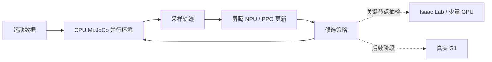
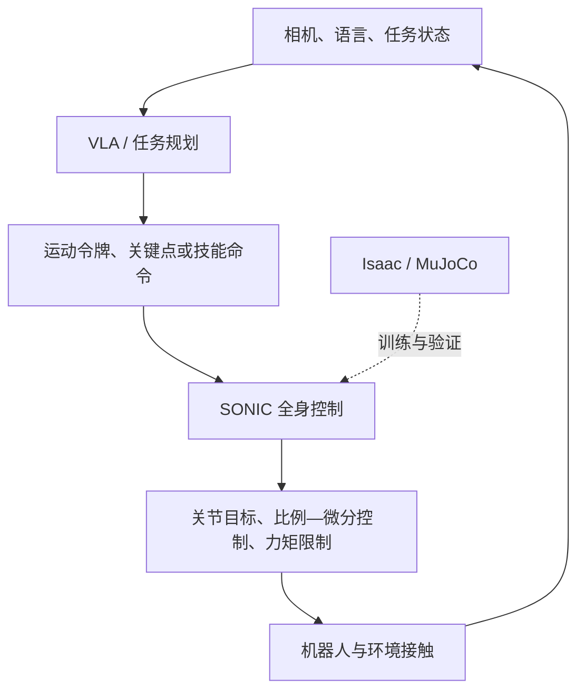
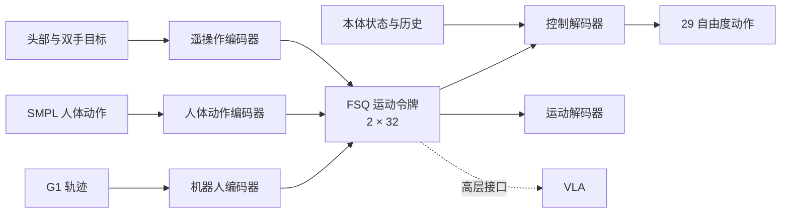

# 基于 SONIC 的 MuJoCo 全身控制路线

> 神经网络处理器（Neural Processing Unit，NPU）训练、跨仿真验证与大规模动作扩展  
> 资料截至 2026 年 8 月 20 日

> **术语规则：**专业缩写首次出现时给出中文含义和英文全称，后文使用缩写；仿真器、框架和代码名称保留原文。

## 摘要

本项目的长期目标是建立可扩展的人形机器人全身控制能力。大规模自然人形运动跟踪控制（Supersizing mOtion tracking for Natural humanoId Control，SONIC）给出了一个成熟的目标架构：把机器人轨迹、人体动作和遥操作信号编码为统一的运动令牌（Motion Token），再由高频控制器输出 Unitree G1 的 29 维关节动作。官方训练依赖 Isaac Lab 和大规模英伟达图形处理器（Graphics Processing Unit，GPU），当前可用资源则以昇腾 NPU 和中央处理器（Central Processing Unit，CPU）为主，GPU 只能承担少量 Isaac 仿真验证。因此，项目不能原样复制官方训练体系，必须重新安排训练与验证的分工。

本地工作已经完成一次关键验证：保留 SONIC 的模型和近端策略优化（Proximal Policy Optimization，PPO）训练器，以原生 CPU MuJoCo 产生采样轨迹，在昇腾 NPU 上更新网络。经过动作语义修正和两轮微调，策略从“快速摔倒”发展到能够跟随步行参考速度。这说明 MuJoCo + NPU 路线可运行，但不能据此推断大规模动作训练或仿真到现实迁移（Simulation-to-Real，Sim-to-Real）已经解决。现有实验只使用两条步行动作；MuJoCo 微调权重回到 Isaac 后仍会失效，说明策略存在明显的引擎绑定。

近期建议不押注单一终局方案。训练主线继续使用 MuJoCo + NPU，从小型多动作集逐步扩大数据规模；稀缺 GPU 用于官方基线和关键模型检查点（checkpoint）的 Isaac 抽检；跨引擎对齐工作用于定位接口、执行器和物理差异，不把“两个引擎参数完全相同”作为目标。真机暂不阻塞前期训练，但在项目进入 Sim-to-Real、系统辨识或视觉—语言—动作模型（Vision-Language-Action，VLA）数据闭环前，需要至少一台可共享的 G1。

---

## 1. 问题与约束

### 1.1 要解决的问题

项目不是单纯复现一篇论文，也不是把 MuJoCo 调得“看起来像 Isaac”。真正的问题是：在现有算力条件下，能否建立一套可扩展的 G1 全身控制训练体系，并用有限的 Isaac 资源判断策略是否过度依赖单一仿真器。

长期目标是大规模动作跟踪，近期必须分阶段推进：先证明少量动作可以稳定训练，再扩大动作覆盖，最后讨论跨仿真和真机。若第一阶段尚未稳定，直接接入十万级动作只会放大数据、奖励和接口问题。

### 1.2 资源边界

| 条件 | 对路线的影响 |
|---|---|
| 训练资源以昇腾 NPU 为主 | 网络训练应保留 PyTorch/NPU 路径，不能依赖统一计算设备架构（Compute Unified Device Architecture，CUDA）专用训练后端 |
| CPU 资源较充足 | 经典 MuJoCo 可用多进程产生并行采样轨迹 |
| NVIDIA GPU 很少 | Isaac 适合做官方基线、关键检查点抽检和失效诊断，不适合作为持续训练后端 |
| 当前没有真实机器人 | 可以完成仿真到仿真迁移（Simulation-to-Simulation，Sim2Sim）和训练体系验证，不能形成 Sim-to-Real 结论 |
| 完整运动数据尚未在当前工作区闭环 | 数据转换代码已具备，但大规模训练前仍需下载、清洗、版本冻结和留出集划分 |

据此，近期最现实的系统分工是：



---

## 2. SONIC 在具身系统中的位置

### 2.1 它解决的是身体执行

具身系统通常包含任务理解、运动生成、全身控制和执行器闭环。SONIC 位于中下层：它接收运动令牌、人体动作或遥操作目标，以约 50 赫兹（Hz）的频率输出全身关节动作。VLA 负责理解图像和语言、选择任务；SONIC 负责把运动意图稳定地执行出来。



这一分层也解释了为什么项目仍值得保留 SONIC。即使训练后端从 Isaac 换成 MuJoCo，统一运动表示、29 自由度（Degrees of Freedom，DoF）解码器和 VLA 接口仍然有用；需要替换的是物理环境和训练工程，不必重新发明上层动作表示。

### 2.2 官方架构

SONIC 使用多路运动编码器，把不同来源的动作压到统一的运动令牌空间。人体参数化模型（Skinned Multi-Person Linear Model，SMPL）用于表示人体动作；有限标量量化（Finite Scalar Quantization，FSQ）把连续特征压缩为离散运动令牌。



训练主体采用策略网络—价值网络（Actor–Critic）结构和 PPO：策略网络使用部署时可获得的本体状态和运动参考，价值网络可以看到更完整的仿真状态。重构、令牌对齐和循环一致性等辅助目标用于维持不同输入形式之间的共同动作语义。

公开资料中的模型规模需要分开表述：论文最大模型约为 4200 万参数；当前本地发布配置加载的策略约为 3700 万参数。论文和后续开放训练使用的数据口径也不同，不能把论文的过滤时长、当前 BONES-SEED 的总时长和本地样例数据合并成一个数字。

### 2.3 为什么不从零复制官方训练

官方训练指南仍以 Isaac Lab 为主，并建议使用大规模多 GPU 训练。2026 年公开的 BONES-SEED 包含 142,220 条动作、约 288 小时，官方流程会将 G1 的逗号分隔值文件（Comma-Separated Values，CSV）转为 MotionLib 的 Python 序列化文件（Pickle，PKL），并过滤不适合 G1 的动作。该规模适合说明最终方向，不适合作为本项目的第一步。

本项目更合理的起点是官方检查点微调：保留已经学到的运动先验，只让策略适应 MuJoCo 的执行器、接触和求解器。等小规模闭环稳定后，再判断是否扩大到从头训练或大规模继续训练。

---

## 3. 从官方 SONIC 到本地版本

### 3.1 四种方案不是同一件事

| 方案 | 训练物理 | 网络计算 | 主要目标 |
|---|---|---|---|
| 官方 SONIC | Isaac Lab / PhysX | NVIDIA GPU | 大规模通用运动跟踪 |
| MuJoCo Playground | MuJoCo XLA（MJX）或 MuJoCo Warp | 主要面向 CUDA GPU | 以 MuJoCo 为原生后端的机器人学习基础设施 |
| 本地 MuJoCo-NPU 版 | 原生 CPU MuJoCo | 昇腾 NPU | 在非 NVIDIA 训练环境中微调 SONIC |
| 跨引擎对齐工作区（不承担训练） | MuJoCo / Isaac 测试 | 离线审计、CPU 测试与少量 GPU 抽检 | 使用训练检查点，建立可归因的接口与跨引擎门禁 |

MuJoCo Playground 证明了以 MuJoCo 为原生后端可以成为独立训练路线，但其 JAX 数值计算框架、MJX 或 Warp 后端不能直接搬到昇腾 NPU。本地版本采取了不同拆法：物理留在 CPU，网络仍使用 PyTorch，把采样轨迹通过共享内存交给 NPU 训练器。

### 3.2 训练后端改造

本地代码在官方训练入口中增加了 MuJoCo 环境分支。`MuJoCoEnvManager` 管理多个 CPU 进程，每个进程持有若干 `MjData`，并行计算状态、奖励和终止条件；PPO、通用运动令牌模型和大部分训练配置继续沿用 SONIC。

这一改造保留了三组关键接口：策略网络观测为 930 维，价值网络观测为 1645 维，令牌编码器观测为 1761 维，动作对应 G1 的 29 个关节目标。

训练端还处理了 NPU 设备检测、混合精度限制、`TensorDict` 到 CPU/NumPy 的转换、检查点保存和跨机器纯 CPU 权重导出。这些工作使“CPU 物理 + NPU 学习”成为可运行链路，而不只是设计文档。

### 3.3 动作语义修正

早期 MuJoCo 环境把所有关节设置为统一的比例增益（Kp）`100` 和微分增益（Kd）`5`，并按关节完整行程缩放动作。官方策略在 Isaac 中学到的动作含义并非如此。同一个网络输出进入两个引擎后，会得到不同关节目标，这是零样本失败的首要原因。

修改版按关节复刻 Isaac 的控制语义：

```text
关节目标 = 默认关节位置 + 动作缩放 × 策略动作
动作缩放 = 0.25 × 力矩上限 / 刚度
输出力矩 = 裁剪[Kp × (关节目标 - 关节位置) - Kd × 关节速度, ± 力矩上限]
```

每个关节分别配置默认位置、刚度、阻尼、等效转子惯量（armature）和力矩上限。网络原始动作不再统一裁剪到 `[-1, 1]`；系统先计算关节目标，再施加关节限位，最后对比例—微分（Proportional-Derivative，PD）控制力矩做限制。这样可以区分策略输出、关节安全边界和执行器能力。

这项修改具有通用性。它修复的是接口定义，而不是针对某一条步行动作调出的奖励参数。独立的对齐工作区进一步将这些常量抽到共享控制配置，减少 Isaac、MuJoCo 和审计工具各自维护一份参数的风险；它负责测试与归因，不承担 NPU 训练。

### 3.4 任务设计修正

第一轮微调产生了一个典型局部最优：机器人能站稳、转向并摆出参考姿势，却没有充分向前推进。原因在于水平掉队不容易触发失败，根位置奖励也不足以抵消“原地踏步”的低风险收益。

第二轮训练加强根位置跟踪，并在水平偏差过大时终止回合。该改动把训练目标从“姿势接近且不摔倒”收紧为“沿参考轨迹推进”。它对当前步行实验有效，但具体权重和终止阈值仍属于实验参数，不能直接推广到下蹲、爬行或舞蹈动作。

### 3.5 评测修正

早期回放脚本曾在推理阶段额外裁剪动作或直接覆盖上肢参考姿势。这些处理会改变策略自身的闭环行为。后续版本默认关闭这些辅助操作，并加入确定性回放、固定动作相位、Isaac 官方权重基线、MuJoCo 微调权重回传 Isaac、训练曲线和视频证据。

评测方式的改进不直接提高策略性能，却提高了结论可信度：视频中出现的动作来自策略本身，而不是回放脚本修饰后的结果。

---

## 4. 已有结果与证据边界

### 4.1 两轮 MuJoCo 微调

内部实验从官方 Isaac 训练权重出发，在 MuJoCo 中进行 NPU 微调。

| 阶段 | 内部实验现象 | 能说明什么 |
|---|---|---|
| 官方权重直接进入早期 MuJoCo 环境 | 很快摔倒 | 动作和控制接口存在明显不一致 |
| 修正逐关节动作语义 | 可以站立，但动作仍快且扭曲 | 接口问题缓解，仍有物理和策略分布差异 |
| 第一轮，5000 iteration | 奖励和存活时间上升；能站稳但推进不足 | MuJoCo + NPU 微调链路可运行，任务设计存在漏洞 |
| 第二轮，11000 iteration | 行进段约 0.73 m/s，参考约 0.72 m/s | 在当前两条步行动作上学会了推进与启停跟随 |
| 微调权重回到 Isaac | 快速失效 | 策略适应了 MuJoCo，尚未形成跨引擎保持能力 |

本地保存了两轮纯策略检查点、训练曲线和对照视频。这些属于项目内部实验，尚未经过真机或独立环境复核。

### 4.2 当前结论

已经确认的事实包括：原生 CPU MuJoCo 能够为 SONIC 提供训练采样轨迹；PyTorch/PPO 网络可以在昇腾 NPU 上继续训练；动作语义对齐是迁移官方检查点的前提；奖励和终止条件会直接决定策略学到“跟踪”还是“苟活”；现有策略对训练引擎敏感。

目前仍不能确认：两条步行动作上的结果能否扩展到大规模动作；MuJoCo 与 Isaac 的物理参数是否对齐；当前奖励和终止条件是否适用于其他动作类型；多动作训练会不会发生遗忘或相互干扰；策略能否部署到真实 G1。

### 4.3 数据现状

当前工作区具备 BONES-SEED、SMPL、SOMA 和遥操作数据的处理代码，也保留两份本地微调策略；但完整训练数据、官方发布检查点和固定版本的成对 Isaac 轨迹记录并未全部在该工作区落地。历史 NPU 实验使用的是服务器上的小型样例数据，其中实际训练只覆盖两条步行动作。

因此，下一阶段首先要冻结数据清单，而不是直接启动“大规模训练”：每条动作需要稳定的标识、帧率、关节顺序、参考根轨迹和版本哈希值，训练集与留出集也要按动作类别划分。

---

## 5. 相关项目如何处理仿真到仿真迁移（Sim2Sim）

这一节只回答一个问题：其他项目怎样把策略从训练仿真送到另一个物理后端，以及哪些做法能直接用于 MuJoCo–Isaac 对齐。HOVER、OmniH2O 和 WholeBodyVLA 没有公开可复用的跨引擎对齐流程，因此不再展开它们的控制架构。

### 5.1 四种可参考的跨仿真路线

| 参考 | 跨仿真方式 | 是否主动对齐物理 | 对本项目的价值 |
|---|---|---|---|
| MuJoCo Playground | MJX / MuJoCo Warp 训练，原生 MuJoCo 独立回放 | 主要依靠共享模型、接口与随机化 | 展示 MuJoCo 原生主训练，尽量减少跨生态转换 |
| Humanoid-Gym | Isaac Gym 训练，MuJoCo 单向回放 | 人工配置资产、关节映射、初始姿态和 PD | 把第二引擎作为部署前门禁 |
| Isaac Lab PhysX↔Newton 指南 | 同一任务在两个后端双向播放 | 先冻结马尔可夫决策过程（Markov Decision Process，MDP）的任务契约，再处理执行器和物理差异 | 提供最完整的跨后端检查清单与 2×2 评测矩阵 |
| ASAP | 用目标域状态—动作轨迹训练增量动作模型 | 用数据学习源域无法表达的剩余差异 | 成对 Isaac 轨迹具备后，再替代无边界手工调参 |

### 5.2 MuJoCo Playground：减少需要对齐的边界

```text
同一 MuJoCo XML 模型格式（MJCF）与任务定义
    → MJX / MuJoCo Warp 批量训练
    → 原生 MuJoCo 独立运行器
    → 域随机化与确定性评测
```

[MuJoCo Playground](https://github.com/google-deepmind/mujoco_playground) 的经验不是如何把 PhysX 参数换算成 MuJoCo 参数，而是尽量让训练与部署共用 MuJoCo 资产、动作定义和任务配置。MJX、Warp 和 Native MuJoCo 仍可能存在数值与实现差异，因此需要独立 runner；但它们共享的模型语义更多，跨后端边界明显小于 Isaac–MuJoCo。

对本项目而言，这是一条绕开长期 Isaac 对齐成本的路线：训练、主评测和部署准备都围绕 MuJoCo 组织，Isaac 只做稀疏的外部抽检。需要借鉴的是共享资产和配置、训练运行器与确定性评测运行器分离，以及随机化后仍保留标称条件评测；不能照搬的是 CUDA 上的 MJX/Warp 计算后端。

### 5.3 Humanoid-Gym：单向跨仿真门禁

```text
Isaac Gym 的 PPO 检查点
    → 导出即时编译（Just-In-Time，JIT）策略
    → MuJoCo 中重新构造观测与历史帧
    → 关节重排、初始姿态、动作缩放、PD 和控制周期
    → 检查存活、步态和命令跟踪
    → 再进入真机
```

[Humanoid-Gym](https://github.com/roboterax/humanoid-gym) 明确要求新机器人进行跨仿真迁移时，检查 MJCF 与统一机器人描述格式（Unified Robot Description Format，URDF）的关节映射，并按照训练策略修改初始关节位置。它的公开脚本本质上是一个独立部署适配器：加载导出的策略，在 MuJoCo 中重新实现相同的观测、历史帧、动作缩放和 PD 控制。

这给我们的直接经验是：零样本失败首先应被视为训练—部署接口契约失败，而不是接触参数失败。本地路线只需反转方向：MuJoCo 检查点进入 Isaac 后，先证明关节顺序、初始状态、观测历史、动作缩放、PD，以及“物理步长 × 控制降频倍数”一致，再把存活时间、速度误差和动作跟踪误差作为门禁。Humanoid-Gym 没有使用成对轨迹拟合两个引擎，也没有证明两边物理严格等价。

### 5.4 Isaac Lab 官方路线：冻结同一个 MDP 任务契约

[Isaac Lab 的 PhysX↔Newton 迁移指南](https://isaac-sim.github.io/IsaacLab/develop/source/how-to/transfer_policies_between_physx_and_newton.html) 给出了更严格的跨仿真定义：同一个检查点在不同物理后端运行时，应该期待相似行为，而不是逐帧相同轨迹。物理预设可以不同，但不能静默改变策略看到的任务。

需要完全一致的内容包括：

1. **动作：**动作项顺序、关节/刚体顺序、维度、目标类型、缩放、偏置和裁剪。
2. **观测：**字段与顺序、维度、历史帧、单位、坐标系、噪声与裁剪。
3. **策略状态：**归一化、循环神经网络（Recurrent Neural Network，RNN）状态、重置、命令，以及策略网络是否使用特权输入。
4. **时序：**物理步长 `dt`、控制降频倍数、策略周期和动作保持。
5. **机构：**活动自由度、从动/等式约束，以及关节和刚体顺序。
6. **回合：**重置、命令分布、终止条件、时长上限和成功定义。

指南特别指出，关节顺序错误的典型表现是策略在几十步内一致性崩溃；这种情况应先排除，不能归因给摩擦。接口通过后，再匹配逐关节力矩上限、刚度、阻尼、摩擦、等效转子惯量、速度限制和饱和行为。域随机化（Domain Randomization）应覆盖可信的不确定性范围；若必须使用极端随机化才能转移，应回头检查标称模型，而不是接受结果。

它还要求评测完整的 2×2 组合：

| 训练后端 | 播放后端 | 本项目对应实验 |
|---|---|---|
| MuJoCo | MuJoCo | MM：本地检查点的源域基线 |
| MuJoCo | Isaac | MI：本地检查点的跨引擎结果 |
| Isaac | Isaac | II：官方或已有 Isaac 检查点基线 |
| Isaac | MuJoCo | IM：官方检查点在本地 MuJoCo 的回放 |

当前 GPU 不足以在 Isaac 重新训练大模型，但 II 和 IM 仍可使用官方 SONIC 检查点。四项一起看，才能区分“MuJoCo 任务本身没搭好”“接口只在一个方向成立”和“策略确实绑定某个求解器”。

### 5.5 ASAP：成对轨迹驱动的后对齐

```text
源域预训练策略
    → 在目标仿真采集状态—动作轨迹
    → 将目标轨迹在源仿真逐状态重放
    → 学习增量动作，使源域下一状态接近目标域
    → 冻结增量模型，在补偿后的源仿真微调原策略
    → 部署微调后的策略
```

[ASAP](https://agile.human2humanoid.com/) 在 IsaacGym→IsaacSim 和 IsaacGym→Genesis 上验证了这条跨仿真路线。它不要求先找到一组完整的等价物理参数，而是利用目标域轨迹训练增量动作模型 `Δa = πΔ(s, a)`，让源仿真使用 `a + Δa` 后复现目标域的状态变化。增量模型被放进源仿真用于微调基础策略，最终部署时移除。

对当前项目，可将源域反转为 MuJoCo、目标域设为 Isaac，但这是工程外推，必须单独验证。启动条件是已经通过接口门禁，并拥有固定资产、检查点、动作、重置条件和时间戳的 Isaac 成对轨迹。如果这些数据还没有闭环，增量模型只会学习日志和接口错误，不能代表物理差异。

### 5.6 从参考项目得到的对齐顺序

```text
G0  固定资产 / 动作 / 检查点 / 重置条件
 ↓
G1  对齐观测、动作、关节顺序和时序
 ↓
G2  做 MM / MI / II / IM 四格基线
 ↓
G3  用关节阶跃、自由落体、PD 落地实验隔离执行器与接触
 ↓
G4  只拟合质量、惯量、PD、等效转子惯量、摩擦等可解释参数族
 ↓
G5  标称用例与留出用例同时改善才接受
 ↓
G6  仍有稳定残差时，再比较 ASAP 式增量动作
```

因此，参考项目给出的不是一套可直接复制的“Isaac 参数转 MuJoCo 参数”，而是三种明确选择：用 MuJoCo 原生训练减少跨引擎边界；用第二引擎做单向或双向门禁；在拥有目标域成对数据后，用残差补偿方法吸收物理模型难以表达的剩余差异。当前项目应该先完成前两项，再决定是否进入第三项。

---

## 6. Isaac–MuJoCo 如何验证

### 6.1 Isaac → MuJoCo 迁移真正难在哪里

迁移的难点不是把 Isaac 资产导出成 MuJoCo 能读取的文件，而是多个差异会同时反映为“机器人摔倒”。如果没有分层证据，同一次失败既可以解释为关节映射错误，也可以解释为执行器不一致、接触模型不同或策略过度适应 Isaac。此时直接调摩擦参数，通常只是在用物理参数补偿尚未查清的接口错误。

| 难点 | 为什么难 | 本项目当前状态 |
|---|---|---|
| **资产不是同一个运行时模型** | Isaac 中的通用场景描述（Universal Scene Description，USD）/URDF 资产与 MuJoCo 的 MJCF 在关节顺序、惯量、碰撞体、限位和默认姿态上可能已经不同；文件名相同不代表运行时参数相同 | 已对三套 G1 模型独立登记并支持运行时审计，但仍需用固定版本逐项核对 |
| **策略动作的物理含义不同** | SONIC 输出的是归一化动作；动作缩放、默认姿态、Kp/Kd、力矩上限和动作裁剪共同决定最终力矩。任何一项不同，两个引擎执行的就不是同一个动作 | 本地版已改为逐关节控制配置，这是目前完成度最高的一层 |
| **观测和时序容易发生“无声错位”** | 关节顺序、坐标系、四元数约定、历史帧、重置状态、物理步长和控制降频只要有一项错位，网络仍能正常前向计算，却会在几十步内闭环发散 | 已建立 100 状态接口门禁；真实 Isaac 成对轨迹仍待采集 |
| **PhysX 与 MuJoCo 没有一组可直接换算的参数** | 两者的接触约束、摩擦、接触偏置和求解器参数含义不同；PhysX 求解器迭代次数与 MuJoCo 的 `solref/solimp` 不能一一对应 | 已设计自由落体、关节阶跃和 PD 落地等隔离实验；尚未得到物理对齐参数 |
| **微小单步差异会被闭环策略放大** | 官方检查点在 Isaac 的动力学和随机化分布中训练。MuJoCo 中很小的状态偏差会改变下一步动作，长期轨迹因此快速分叉；“逐帧相同”既不现实，也不是合理目标 | 应比较存活、跟踪误差和接触统计，而不是要求状态逐帧重合 |
| **缺少可归因的成对数据** | 如果没有同一资产、状态、动作、重置条件和时间戳下的 Isaac–MuJoCo 轨迹，就无法判断某次修改究竟改善了接口还是只对某条轨迹过拟合 | 测试与留出体系已具备；真实 Isaac 成对数据尚未闭环，是当前最直接的瓶颈 |

因此，Isaac → MuJoCo 迁移最难的不是“参数多”，而是**失败来源相互混叠**。本地工作已经把动作接口和实验门禁搭起来，但还不能声称物理已经对齐。下一步应先采集固定条件下的成对 Isaac 轨迹，再决定是否需要继续标定物理参数或引入残差补偿。

### 6.2 先检查控制链

跨引擎问题应按以下顺序处理：


如果观测、动作缩放、PD 或控制周期还不一致，就不能把最终姿态差异归因于摩擦和接触。接口一致之后，再检查质量、惯量、关节轴、碰撞体和执行器；最后才比较接触求解器。

### 6.3 两个引擎的差异

| 层次 | 常见差异 | 验证方式 |
|---|---|---|
| 接口 | 关节顺序、坐标系、历史帧、动作缩放、重置条件 | 同状态数值轨迹，逐字段比较 |
| 刚体模型 | 质量、质心（Center of Mass，CoM）、惯量、关节坐标系、限位 | 导出运行时模型，按名称和单位审计 |
| 执行器 | 默认姿态、Kp/Kd、等效转子惯量、力矩上限、更新时序 | 关节阶跃与无接触响应 |
| 接触 | 碰撞几何、摩擦、接触偏置 | 落体、落脚、滑移和地面反作用力（Ground Reaction Force，GRF）指标 |
| 求解器 | PhysX 迭代次数与 MuJoCo 的 `solref/solimp/impratio` | 行为标定，不做一对一参数换算 |

策略能在两个引擎运行，不代表两边物理严格等价。反过来，某个 MuJoCo 策略无法回到 Isaac，也不能立即证明 MuJoCo 训练路线失败；它首先说明策略对训练分布敏感，需要根据项目目标判断是否必须保留双引擎能力。

### 6.4 当前跨引擎对齐工作区

当前版本已经实现旧 15 自由度模型、Maxwell 29 自由度模型和 Isaac G1 Model 12 29 自由度模型的独立登记，另有关节名称映射、运行时模型审计、100 状态接口轨迹、6 个关节阶跃用例、4 个自由落体用例、8 个 PD 落地用例、13 个拟合用例与 5 个留出用例，以及资产哈希值和来源记录。

这些工作把早期的人工排查升级成了可重复实验，但真实 Isaac 成对数据尚未闭环，对齐阶段也没有新增或优化物理参数。现阶段应把它写成“测量能力已经具备”，不能写成“物理对齐已经完成”。

---

## 7. 分阶段路线

### 阶段一：小型多动作集

先从两条步行动作扩展到一个可解释的动作集合：站立、起步、停止、不同速度行走、转向、下蹲和简单上肢动作。每一类保留未参与训练的动作作为留出集。

这一阶段回答三个问题：训练是否稳定；策略是否真的跟随根轨迹；加入第二类动作后是否破坏第一类动作。只有多随机种子和留出动作同时改善，才扩大数据量。

### 阶段二：数据扩展

接入 BONES-SEED 前先完成转换、过滤和版本冻结。数据扩展按类别分批进行，不一次加载全部动作。每一批记录动作数量、总时长、失败类别、采样比例和训练成本。

评测可分成四层：训练动作、同类留出动作、跨类别动作和扰动物理。平均奖励只能作为训练信号，最终还需要回合完成率、根轨迹误差、关节误差、足端滑移、摔倒率和动作覆盖率。

### 阶段三：Isaac 抽检

GPU 不承担持续训练，只在官方检查点基线、动作接口或控制配置变化、每个阶段的候选检查点，以及 MuJoCo 表现突变时运行。Isaac 抽检用于判断引擎绑定，不要求所有 MuJoCo 检查点在 Isaac 达到完全相同的分数。是否设置双引擎硬门，应由最终交付目标决定。

### 阶段四：处理剩余差异

若多动作 MuJoCo 策略稳定，但反复无法通过 Isaac 抽检，再比较低层适配器（Adapter）、少量 Isaac 采样轨迹微调和更系统的域随机化。三组实验必须使用相同数据和评测集，避免把额外训练量误认为方法收益。

### 阶段五：真机

真机暂不阻塞训练体系建设。进入该阶段前，应完成站立与低速动作的风险分级、急停、关节限位、日志记录和回退策略。第一批真机数据优先用于执行器响应和低风险落脚，不直接挑战复杂全身动作。

### 路线矩阵

| 路线 | 当前价值 | 资源要求 | 继续条件 | 停止或降级条件 |
|---|---|---|---|---|
| MuJoCo + NPU 微调 | 最高，已经小规模跑通 | CPU、NPU、运动数据 | 多动作与留出集同时改善 | 只记忆训练动作，或吞吐无法支持扩展 |
| Isaac–MuJoCo 对齐 | 用于归因和抽检 | 少量 GPU、固定基线 | 接口门禁通过后物理指标可重复 | 没有成对数据时不继续调物理 |
| 适配器 / 残差补偿 | 处理剩余引擎或真机差异 | 成对轨迹 | 小模型改善且不破坏原能力 | 只修训练集，留出集无改善 |
| 多引擎联合训练 | 长期备选 | 更稳定的 GPU 配额 | 少量采样轨迹明显降低引擎绑定 | GPU 成为主要耗时瓶颈 |
| 真实数据标定 | 最终必要 | G1、场地、安全人员 | 未见状态和真实表现改善 | 采集风险高或无法保证可追溯 |

近期不需要决定最终只走哪一条。可以确定的是：MuJoCo + NPU 是训练主线，Isaac 是稀缺验证资源，跨引擎对齐是诊断工具，适配器是条件触发的备选。

---

## 8. 为什么最终需要一台 G1

没有真机并不妨碍验证训练框架，却会把项目结论限制在 Sim2Sim。仿真无法可靠给出执行器背隙、结构柔性、温升、通信延迟、惯性测量单元（Inertial Measurement Unit，IMU）漂移、足底材料和真实地面摩擦。两套仿真器即使结果接近，也可能共享同一种建模误差。

| 真机提供的证据 | 对项目的作用 |
|---|---|
| 关节阶跃、站立扰动和低速动作 | 标定延迟、PD 响应、力矩限制和系统阻尼 |
| IMU、编码器、足端接触和控制日志 | 判断仿真误差来自传感器、执行器还是接触 |
| 遥操作与相机数据 | 建立后续 VLA、适配器和真实数据闭环 |

资源请求可以分阶段提出，而不是立即以“大规模具身智能”为理由采购：先完成小型多动作集和 Isaac 抽检；达到预注册的稳定性与留出集条件后，申请借用、共享或采购一台 G1；第一阶段只做支撑架或保护绳条件下的站立、关节响应和低速行走。若无法获得真机，对外结论明确停留在 MuJoCo 训练和跨仿真验证。

领导需要批准的不是一台展示设备，而是项目从“仿真训练”进入“可部署控制”的实验条件。

---

## 9. 结论

SONIC 适合作为本项目的目标架构，但官方 Isaac 训练体系不适合直接复制。本地版本已经完成有实质意义的改造：用 CPU MuJoCo 替换持续训练物理后端，用昇腾 NPU 更新 SONIC 策略，并修正逐关节动作语义、任务奖励和评测流程。两轮步行微调证明这条链路可运行，也暴露了当前最重要的限制：数据过少，策略明显绑定训练引擎。

下一阶段不应继续围绕单组摩擦参数反复试验，也不应直接启动十万级动作训练。更稳妥的顺序是：小型多动作集、留出评测、分批数据扩展、Isaac 关键节点抽检，最后进入真机。MuJoCo Playground、Humanoid-Gym 和 ASAP 分别提供 MuJoCo 原生训练、跨引擎检查和残差补偿的经验，但它们只能作为工程参照，不能替代本项目自己的 NPU 训练与证据闭环。

项目近期需要回答的核心问题已经从“MuJoCo 能不能训练 SONIC”转为：

> MuJoCo + NPU 能否从两条步行动作扩展到多类全身动作，并在有限 Isaac 验证和后续真机实验中保持可解释的性能边界。

---

## 附录 A：常用术语速查

| 缩写 | 中文名称 | 英文全称或含义 |
|---|---|---|
| SONIC | 大规模自然人形运动跟踪控制 | Supersizing mOtion tracking for Natural humanoId Control |
| NPU / GPU / CPU | 神经网络处理器 / 图形处理器 / 中央处理器 | Neural Processing Unit / Graphics Processing Unit / Central Processing Unit |
| PPO | 近端策略优化 | Proximal Policy Optimization |
| VLA | 视觉—语言—动作模型 | Vision-Language-Action |
| Sim2Sim | 仿真到仿真迁移 | Simulation-to-Simulation |
| Sim-to-Real | 仿真到现实迁移 | Simulation-to-Real |
| DoF | 自由度 | Degrees of Freedom |
| PD | 比例—微分控制 | Proportional-Derivative Control |
| SMPL | 人体参数化模型 | Skinned Multi-Person Linear Model |
| FSQ | 有限标量量化 | Finite Scalar Quantization |
| MDP | 马尔可夫决策过程 | Markov Decision Process |
| MJCF / URDF | MuJoCo XML 模型格式 / 统一机器人描述格式 | MuJoCo XML / Unified Robot Description Format |
| CoM / GRF / IMU | 质心 / 地面反作用力 / 惯性测量单元 | Center of Mass / Ground Reaction Force / Inertial Measurement Unit |

## 附录 B：证据口径

| 类型 | 本报告中的含义 |
|---|---|
| 论文或官方结论 | 来自论文、官方仓库、官方文档或数据集页面 |
| 代码确认事实 | 可从当前工作区代码、配置和版本记录直接确认 |
| 项目内部实验 | 来自本地检查点、日志、曲线、视频和实验报告，尚未独立复核 |
| 待验证 | 只有工具、方案或预期，尚无正式运行数据 |

需要长期保持的边界：旧 15 自由度 MuJoCo 跨仿真版本、当前 29 自由度 MuJoCo-NPU 策略、Maxwell 修改版和独立对齐工作区不能混写；论文最大模型、当前发布模型和本地微调检查点也不能用同一个参数规模代替。

## 附录 C：主要资料

### 官方资料

- [GR00T-WholeBodyControl 官方仓库](https://github.com/NVlabs/GR00T-WholeBodyControl)
- [SONIC 官方训练指南](https://github.com/NVlabs/GR00T-WholeBodyControl/blob/main/docs/source/user_guide/training.md)
- [SONIC MuJoCo Sim2Sim Quick Start](https://github.com/NVlabs/GR00T-WholeBodyControl/blob/main/docs/source/getting_started/quickstart.md)
- [BONES-SEED 数据集](https://huggingface.co/datasets/bones-studio/seed)
- [MuJoCo Playground](https://github.com/google-deepmind/mujoco_playground)
- [Humanoid-Gym](https://github.com/roboterax/humanoid-gym)
- [Isaac Lab：PhysX 与 Newton 策略迁移指南](https://isaac-sim.github.io/IsaacLab/develop/source/how-to/transfer_policies_between_physx_and_newton.html)
- [ASAP 项目页](https://agile.human2humanoid.com/)
- [ASAP 论文](https://agile.human2humanoid.com/static/asap.pdf)

### 本地证据

- [实验记录](./GR00T-WBC-alignment/docs/EXPERIMENTS.md)
- [模型检查点说明](./GR00T-WBC-alignment/checkpoints/README.md)
- [MuJoCo 环境](./GR00T-WBC-alignment/gear_sonic/envs/mujoco_env.py)
- [MuJoCo 并行环境管理器](./GR00T-WBC-alignment/gear_sonic/envs/mujoco_env_manager.py)
- [G1 控制参数](./GR00T-WBC-alignment/gear_sonic/envs/g1_control_profile.py)
- [Isaac–MuJoCo 跨引擎对齐说明](./GR00T-WBC-alignment/docs/isaac_mujoco_alignment/README.md)
- [跨引擎基线配置](./GR00T-WBC-alignment/gear_sonic/config/cross_engine/baselines.yaml)
