# VLA、WAM 与世界模型：从看懂指令到预测并执行动作

> **版本：v1.5｜2026-09-10**  
> 本次修订：v1.5 在文末新增附录 C，讨论 VLA/WAM 架构差异对后训练、强化学习与昇腾适配的影响；v1.4 完成可读性重写与 Mermaid 架构图修订。本文是背景调研，不是本工作区的源码审计或迁移可行性结论。

**本文围绕一个问题展开：机器人听到“把杯子放进托盘”之后，怎样把这句话变成可靠的动作？** 先解释看懂场景的 VLM，再解释生成动作的 VLA，随后介绍预测环境变化的世界模型，最后讨论把预测与动作联合学习的 WAM。

**阅读导航**：§1 建立概念 → §2 理解 VLM → §3 理解 VLA → §4 理解世界模型 → §5 比较 WAM → §6 联系 SONIC 与昇腾适配。只想先建立整体认识，可读 §1、§3.2、§4.1、§5.1 和 §6。关心“不同架构能否共用后训练方案”，可直接读文末附录 C。

**证据约定**：本文沿用工作区 E1–E4 分级。**E3·一手**表示论文或官方资料记载，**E3·解释 / 推断**表示本文的教学性说明或综合判断；二者都不等于源码实证。**E4·待核**表示保留自旧版的二手转述，不用于立项承诺。下文每个表格、图和段落组的证据等级在引导语或结尾标注。本次重点核对核心模型原理及相关一手信源，未对所有产业动态重新做全面调研。

**图示约定**：所有框图均为可在 Markdown 中渲染的 `mermaid` 代码块。实线表示数据流或步骤，虚线表示训练监督、反馈或可选路径，具体含义写在连线上。图展示主要模块与用途，省略精确张量尺寸，不把不同模型画成同一套实现。

---

## 1. 先用一个任务分清四类模型

### 1.1 同样是“把杯子放进托盘”，它们分别解决什么问题？

桌上有一个杯子和一个托盘。机器人需要认出目标、伸手抓取、移动，再松开夹爪。四类模型关注这条链路中的不同问题。（本节为 E3·解释。）

| 类别 | 它回答的问题 | 在这个任务中的作用 | 主要输出 |
|---|---|---|---|
| **VLM：视觉语言模型** | 我看到了什么？指令指向什么？ | 理解“杯子”“托盘”及其位置关系 | 文本回答或供其他模块使用的特征 |
| **VLA：视觉语言动作模型** | 根据当前观察和指令，接下来怎么动？ | 生成接近、抓取、搬运等动作 | 动作值或动作 token |
| **世界模型：World Model** | 接下来环境可能怎样变化？若采取某个动作，会怎样？ | 预测杯子是否被抬起、是否碰到托盘边缘 | 未来图像、内部表征或其他状态量 |
| **WAM：世界动作模型** | 哪些动作与期望的未来变化相匹配？ | 联合学习动作和动作对应的未来变化 | 动作与未来状态；部署时可能省去显式未来生成 |

普通文本 LLM 可以给出“先抓杯子，再移到托盘”的文字步骤。VLM 再接入视觉信息，能够结合现场画面理解任务。机器人真正执行时，还需要把理解结果转成与自身硬件匹配的控制量。**理解指令、生成动作、预测后果，是三个相关但不同的问题。**

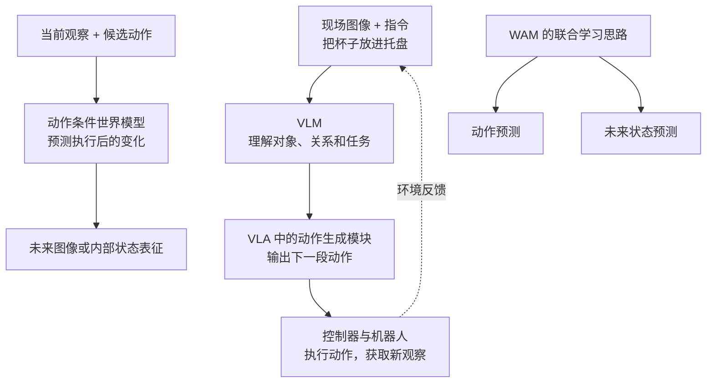

**读图要点**：上半部分是“感知—行动—再感知”的控制回路；中间是可以用于评估动作后果的预测模块；底部强调 WAM 的联合学习目标。三部分用于概念对照，不表示所有系统都按这些框串联。

### 1.2 它们不是一条严格的替代时间线

VLA 可以使用 VLM 作为骨干，世界模型也可以被策略或规划器调用；WAM 则把世界预测和动作学习进一步结合。实际论文经常跨越类别：VLA 可以增加未来预测辅助任务，世界模型可以带奖励预测，WAM 也未必包含独立的 VLM 专家。因此，不能仅凭名字，或“损失函数里有没有某一项”，给所有模型划出互斥边界。（E3·解释 / 推断。）

阅读新模型时，先看三个问题：**输入有哪些？训练时要求预测什么？部署时实际运行哪些模块？** 这比先记模型缩写更容易看清差异。

### 1.3 后文会反复用到的六个词

| 术语 | 通俗解释 | 容易混淆的地方 |
|---|---|---|
| **token** | 模型处理的一小块信息，可以来自文字、图像块或动作编码 | 视觉 token 常是连续向量，不一定是词表中的整数编号 |
| **latent / 隐表征** | 编码器把原始图像等信息压缩成的内部表示 | 有的 latent 可解码成图像，有的只用于特征预测，两者用途不同 |
| **backbone / 骨干** | 承担主要特征处理的网络主体 | “骨干 5B”不代表整个系统总共只有 5B 参数；B 表示十亿 |
| **action chunk / 动作块** | 一次预测未来连续若干步动作 | 一次网络推理可以对应多次控制器执行，不等于每步都重新跑大模型 |
| **rollout / 展开轨迹** | 把状态和动作一步步向未来展开 | 在真实环境中执行，和在模型内部预测，是两种不同的 rollout |
| **embodiment / 本体** | 机器人的身体及接口：关节、夹爪、传感器、动作定义等 | 同一句“抬起杯子”，不同机器人需要不同的动作数值 |

以上为全文术语的教学性说明（E3·解释）。

---

## 2. VLM：图像如何进入语言模型？

### 2.1 核心问题是把视觉信息接到语言处理网络上

语言模型不能直接把一张照片当成一段普通文字读取。常见做法是先用**视觉编码器**把图像变成特征，再通过连接模块，把这些特征交给语言模型。训练使图像内容与文字描述建立对应关系，例如让“杯子”这个词与画面中相应的区域联系起来。（E3·解释。）

CLIP 是理解这段历史的重要起点：它把图像和文本分别编码，通过对比学习让匹配的图文表示更接近。它本身并不是一个能逐字回答问题的聊天模型；它提供的视觉表示，可以被后续多模态系统使用。LLaVA、Flamingo 则展示了把视觉接入生成式语言模型的不同方式。（E3·一手：[CLIP](https://arxiv.org/abs/2103.00020)、[LLaVA](https://arxiv.org/abs/2304.08485)、[Flamingo](https://arxiv.org/abs/2204.14198)。）

### 2.2 LLaVA：把图像特征转换成语言模型能接收的向量

**直观理解**：视觉编码器先“读图”，投影层负责转换特征格式，语言模型再结合图像与问题生成回答。投影层对齐的是向量维度和表示方式，并不是先把整张图片翻译成一句中文。（E3·解释；框图依据 [LLaVA 论文](https://arxiv.org/abs/2304.08485) 简化。）

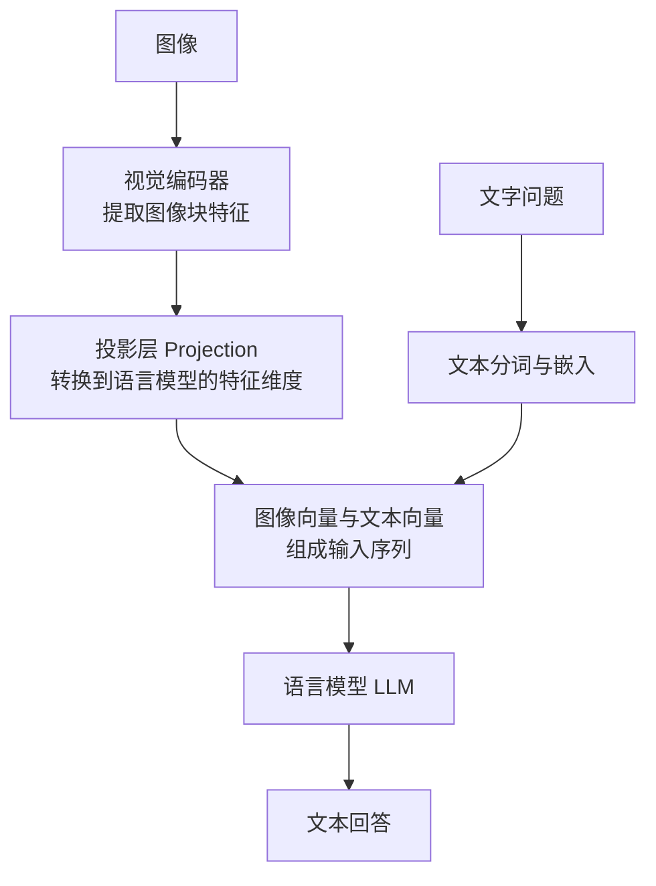

原始 LLaVA 先训练连接层做图文对齐，再做视觉指令微调。后续版本可以调整连接层和训练范围；“视觉编码器永远冻结”不是所有 VLM 的共同规定。（E3·一手 / 解释。）

### 2.3 Flamingo：让语言模型在处理中读取视觉特征

Flamingo 使用另一种连接方式：先把视觉特征整理成固定数量的向量，再在语言模型的层间加入**交叉注意力（cross-attention）**。处理文字时，模型通过这些模块读取相关的视觉信息。门控机制控制新视觉信息注入的强度。（E3·一手 / 解释：[Flamingo 论文](https://arxiv.org/abs/2204.14198)。）

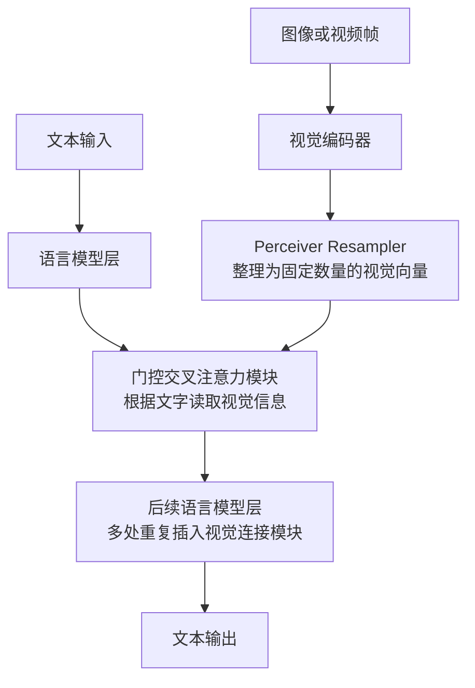

两张图的区别在于：LLaVA 主要把视觉向量接入输入序列；Flamingo 在语言模型内部增加读取视觉信息的通道。它们都需要图文训练来学会如何使用这些信息。

### 2.4 Qwen2-VL：进一步处理不同分辨率和视频时空位置

Qwen2-VL 的重点包括**动态分辨率**与 **M-RoPE（多模态旋转位置编码）**。前者让不同图像对应不同数量的视觉 token；后者帮助模型区分视频时间以及图像中的空间位置。它仍然有视觉编码器和多模态连接过程，不能简单理解成“原生多模态，所以没有桥接模块”。（E3·一手 / 解释：[Qwen2-VL 论文](https://arxiv.org/abs/2409.12191)。）

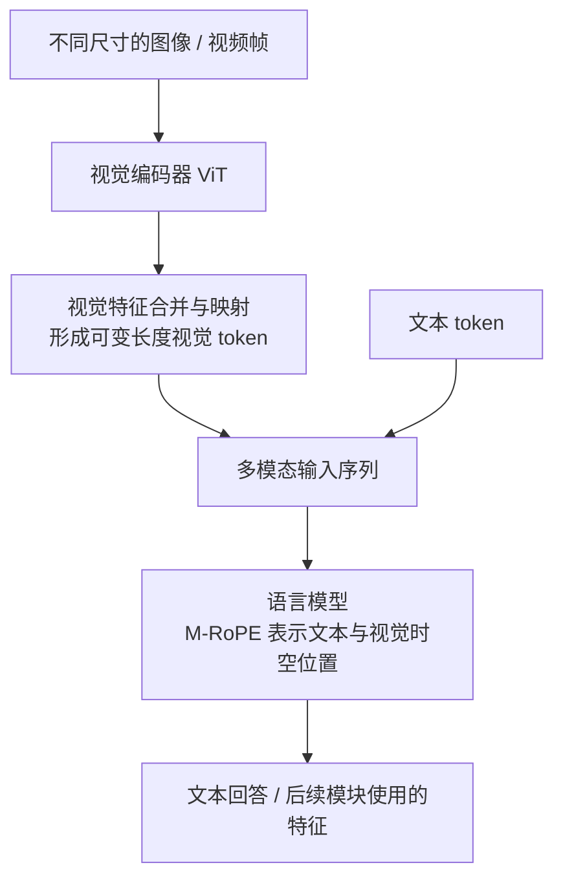

**这三张图是三个设计例子，不是互斥且穷尽的三大流派。** 分辨率处理、特征连接和位置编码可以在同一模型中组合。（E3·解释。）

### 2.5 为什么机器人模型常用 VLM 做骨干？

VLM 已从图文数据中学到对象、属性和语言关系，机器人模型可以在此基础上学习动作，减少从零学习视觉语义的负担。π0 使用 PaliGemma，GR00T N1 使用视觉语言模块接动作模块，都是这种思路的代表。（E3·一手：[π0](https://arxiv.org/abs/2410.24164)、[GR00T N1](https://arxiv.org/abs/2503.14734)。）

但“看得懂杯子”不等于“抓得稳杯子”。图文知识不能自动给出当前机器人的关节目标、夹爪力度或碰撞约束，这正是下一节要解决的问题。（E3·解释。）

---

## 3. VLA：怎样把“看懂”变成动作？

### 3.1 两种动作表示：离散编号与连续数值

机器人动作可以包含末端位移、旋转、夹爪开合，或者关节目标等。具体含义由机器人接口定义。VLA 的一个关键设计问题，是如何让神经网络输出这些量。（E3·解释。）

**离散表示**：把连续数值划分成区间，再预测区间编号。例如，把夹爪开合程度分成若干档，模型先输出档位，再还原成控制数值。RT-2、OpenVLA 属于动作 token 路线的重要代表。RT-1 也使用动作离散化；其官方资料中的 **130k 是演示轨迹数量，动作各维离散成 256 档**，不是“13 万小时数据”或“13 万大小的动作词表”。（E3·一手：[RT-1 官方说明](https://research.google/blog/rt-1-robotics-transformer-for-real-world-control-at-scale/)、[RT-2](https://arxiv.org/abs/2307.15818)、[OpenVLA](https://arxiv.org/abs/2406.09246)。）

**连续生成**：直接在连续动作空间中生成一段轨迹。扩散（diffusion）和流匹配（flow matching）可从噪声出发，逐步形成符合观察与指令的动作。两者数学训练方式不同；在此先理解为“学习如何把随机初值变成合理动作序列”。（E3·解释；π0 是 flow matching 的代表。）

为什么不直接预测一条平均轨迹？因为同一任务可能有多种正确做法：从左边绕过去和从右边绕过去都可行，平均后却可能撞上中间的障碍。这叫**多峰动作分布**。离散概率模型和连续生成模型都能表达多个可能结果，不能说“交叉熵无法表达多种动作”。（E3·解释。）

### 3.2 π0 与 GR00T N1：视觉语言骨干如何连接动作专家？

下图先抽取两者便于理解的共同分工：视觉语言网络处理图像与指令，动作模块结合这些特征和机器人状态生成动作块。它不是某一篇论文的逐层复刻，也不表示两者采用完全相同的注意力连接方式。（E3·解释；依据 [π0](https://arxiv.org/abs/2410.24164) 与 [GR00T N1](https://arxiv.org/abs/2503.14734)。）

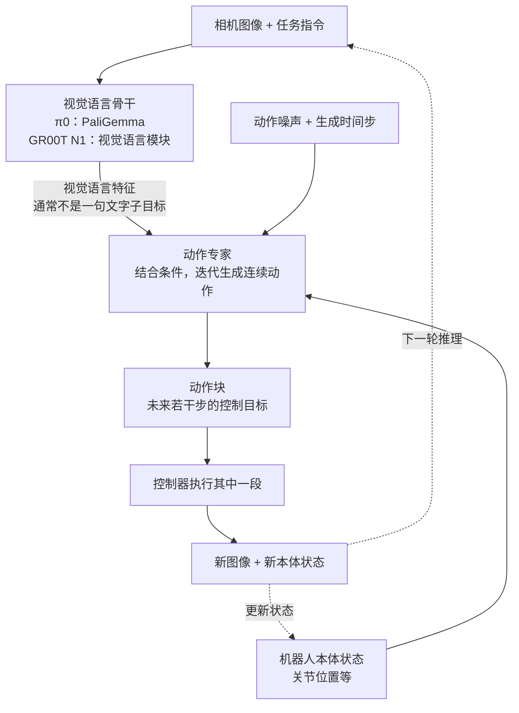

**π0 的阅读重点**是预训练 VLM 与 flow matching 动作专家的结合；它把互联网语义知识用于连续动作学习。**GR00T N1 的论文明确使用双系统表述**：System 2 处理视觉语言，System 1 用 diffusion transformer 生成动作，二者端到端联合训练。（E3·一手。）

“慢思考”和“快动作”是帮助理解计算分工的比喻。System 2 不一定显式输出思维链，也不一定每秒只运行一次；System 1 输出的也不一定直接是电机力矩。要判断具体接口，需要查模型和控制栈实现。（E3·解释。）

### 3.3 三种频率要分开看

假设模型每次预测 20 步动作，控制器以 100 Hz 消费动作，那么整块对应 0.2 秒。系统可以执行一部分后重新预测，也可以一边执行旧动作、一边计算新动作。这只是一个算术例子，不是某个模型的实测配置。（E3·解释。）

| 频率 / 延迟 | 衡量什么 | 对部署的影响 |
|---|---|---|
| **模型推理延迟** | 生成一个动作块要多久 | 决定能多快响应新观察 |
| **策略更新频率** | 每秒根据新观察更新几次动作计划 | 决定纠偏的及时程度 |
| **控制器执行频率** | 每秒向底层发送或更新几次控制目标 | 决定动作执行的时间粒度 |

因此，“7 Hz 的模型闭环”与“100 Hz 的动作执行”可以同时存在。把所有 VLA 都写成“动作头 50–200 Hz”，会掩盖推理、动作分块和底层控制之间的关系。（E3·解释。）

### 3.4 发展脉络：记住设计变化，再记模型名称

下面按技术贡献组织代表工作，而非把每一次商业发布都放进正文。年份与架构来自各论文，意义为本文归纳（E3·一手 / 推断）。

| 阶段 | 代表工作 | 主要变化 |
|---|---|---|
| 2022：多任务机器人策略 | [RT-1](https://arxiv.org/abs/2212.06817) | 用同一策略学习大量语言条件任务 |
| 2023：迁入视觉语言知识 | [RT-2](https://arxiv.org/abs/2307.15818) | 把动作编码为 token，与视觉语言学习结合 |
| 2024：开放通用策略 | [Octo](https://arxiv.org/abs/2405.12213)、[OpenVLA](https://arxiv.org/abs/2406.09246) | 分别提供扩散策略与开放 VLA 的代表实现 |
| 2024：VLM 配连续动作专家 | [π0](https://arxiv.org/abs/2410.24164) | 利用 flow matching 生成连续动作块 |
| 2025：人形基础模型中的双系统 | [GR00T N1](https://arxiv.org/abs/2503.14734) | 视觉语言与动作模块联合训练 |

这些方案仍有不同的延迟、数据和部署取舍，不能把时间线理解成“后一个已淘汰前一个”。

为便于保留规模直觉，下表只列与正文主线直接相关的参数锚点。参数口径来自模型论文（E3·一手），**不能用来直接排列推理速度**。

| 模型 | 参数量级 | 这个数字应怎样读？ |
|---|---|---|
| RT-1 | 约 35M（3500 万） | 机器人专用策略网络，与大 VLM 骨干的资源结构不同 |
| OpenVLA | 7B 级 | 以大型视觉语言骨干学习动作 token |
| π0 | 约 3.3B | PaliGemma 约 3B，加约 300M 动作专家 |
| GR00T N1 | 约 2B | 整体模型的量级，不应再把 2B 当作独立 VLM 后重复加总 |

### 3.5 为什么 VLA 还会失败？

仍以抓杯子为例：模型可能认对杯子，却低估夹爪与杯壁的距离；第一次抓取偏了一点，杯子被推走；后续画面与训练时的成功演示越来越不同，策略继续照原来方式执行，偏差就被放大。这是**累积误差和分布偏移**的一种典型情形。（E3·解释。）

还有两类困难：一是语言步骤合理但动作受几何、接触或动力学限制，实际上做不到；二是真机数据很难覆盖所有物体、光照、初始姿态和失败恢复过程。模仿学习不必然失败，闭环纠偏、补充失败数据和其他训练方法都能改善它；世界模型提供的额外思路是：**学习动作之后可能发生什么，让训练或规划更好地利用这些后果。**（E3·解释 / 推断。）

---

## 4. 世界模型：预测什么，又怎样帮助控制？

### 4.1 “预测未来”有几种不同含义

世界模型可以预测一张未来图像，也可以只预测内部状态；有的接受候选动作，有的只根据过去视频推测后续。**要用于控制，尤其需要区分“世界自然会怎么变”和“我采取这个动作后会怎么变”。** 后者称为动作条件预测。（E3·解释。）

| 路线 | 预测的对象 | 主要用途 | 阅读时的关键问题 |
|---|---|---|---|
| **RL 内部模型**：Dreamer 等 | 隐状态、奖励等 | 在想象轨迹中学习策略；部分方法用于规划 | 预测误差会怎样影响策略学习？ |
| **视频生成**：Genie、Cosmos 等 | 可解码成视频的表示 | 生成环境变化、合成数据或交互场景 | 视频好看之外，动作响应与长期一致性怎样？ |
| **表征预测**：V-JEPA 系 | 编码器提取的特征 | 学习视频表示；动作条件变体可用于规划 | 这些特征是否保留了控制需要的信息？ |
| **3D / 空间表示** | 场景几何、三维表示等 | 空间重建、场景生成和交互 | 只有静态几何，还是也能预测动力学？ |

这是一种用途导向的分类（E3·解释 / 推断），不是互斥分类。视频模型也可能在 latent 中生成；“用 latent”并不自动等于 JEPA；能生成 3D 场景也不自动等于能准确预测接触动力学。

### 4.2 Dreamer：先学习环境模型，再在想象中训练策略

Dreamer 的核心过程是：收集真实交互数据，学习环境的内部表示和变化规律，再让策略在学到的模型中展开轨迹，利用预测的奖励训练。**真实数据用于校正世界模型，想象轨迹用于增加策略学习的经验。**（E3·一手 / 解释：[DreamerV3](https://arxiv.org/abs/2301.04104)。）

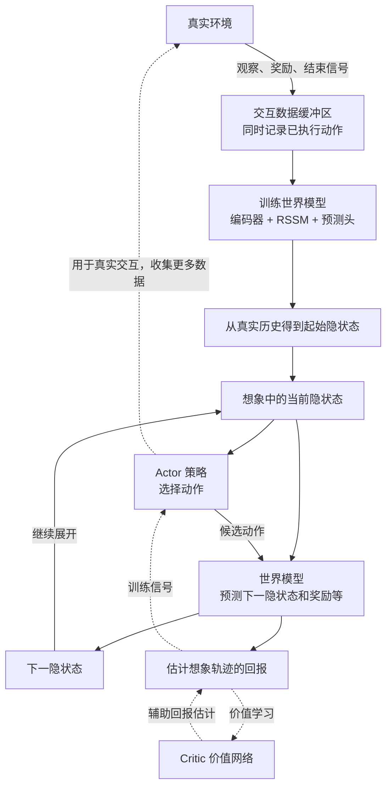

**读图要点**：策略给出动作，世界模型据此预测下一状态；它不是只看视频、自行不断播放未来。RSSM 是循环状态空间模型，用于保存历史信息并描述状态变化；Actor 选择动作，Critic 估计未来回报。图中的训练连线表示学习信号，不表示所有组件都以同一种方式贯通反向传播。（E3·解释。）

这种方法可以减少昂贵的真实试错，但想象仍有计算成本，而且会受到模型误差影响，不能称为“零成本且准确的虚拟试验场”。（E3·推断。）

### 4.3 视频生成：把环境演化呈现出来

视频生成路线更容易直观看到输出。模型把文字、初始图像或交互条件转成视频表示，再生成后续内容。Genie 3 的官方演示强调交互世界；Cosmos 则面向物理 AI 的世界模型与数据生成。**生成逼真的画面，与准确模拟某个机器人的接触过程，是不同的评测要求。**（E3·一手 / 推断：[Genie 3](https://deepmind.google/blog/genie-3-a-new-frontier-for-world-models/)、[Cosmos](https://github.com/nvidia-cosmos)。）

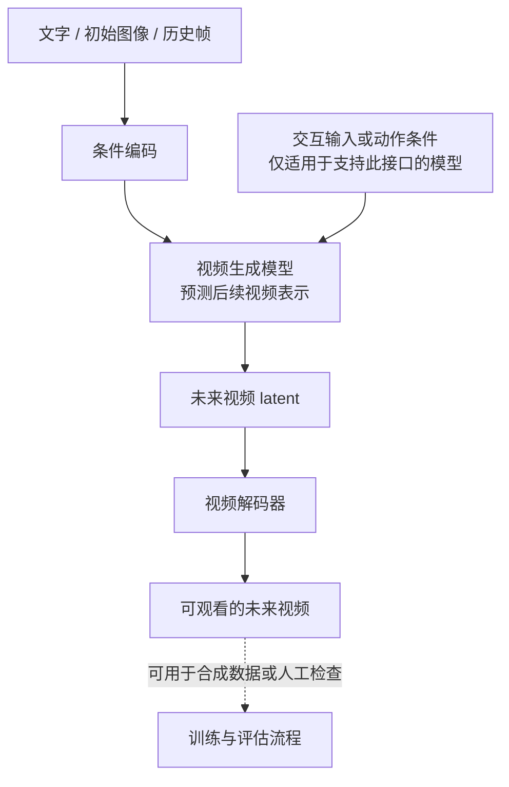

这张图是流程示意，不代表所有视频模型都使用相同的扩散、自回归或压缩架构。（E3·解释。）

### 4.4 V-JEPA 2：预测特征，而不是把每个像素画出来

V-JEPA 2 在大规模视频上学习表征预测；V-JEPA 2-AC 则进一步学习带动作条件的预测，用于机器人规划。两者必须分开看：**基础视频预训练本身没有让模型直接成为机器人控制器。** 论文中的机器人使用方式还包括动作条件后训练与目标驱动规划。（E3·一手：[V-JEPA 2](https://arxiv.org/abs/2506.09985)。）

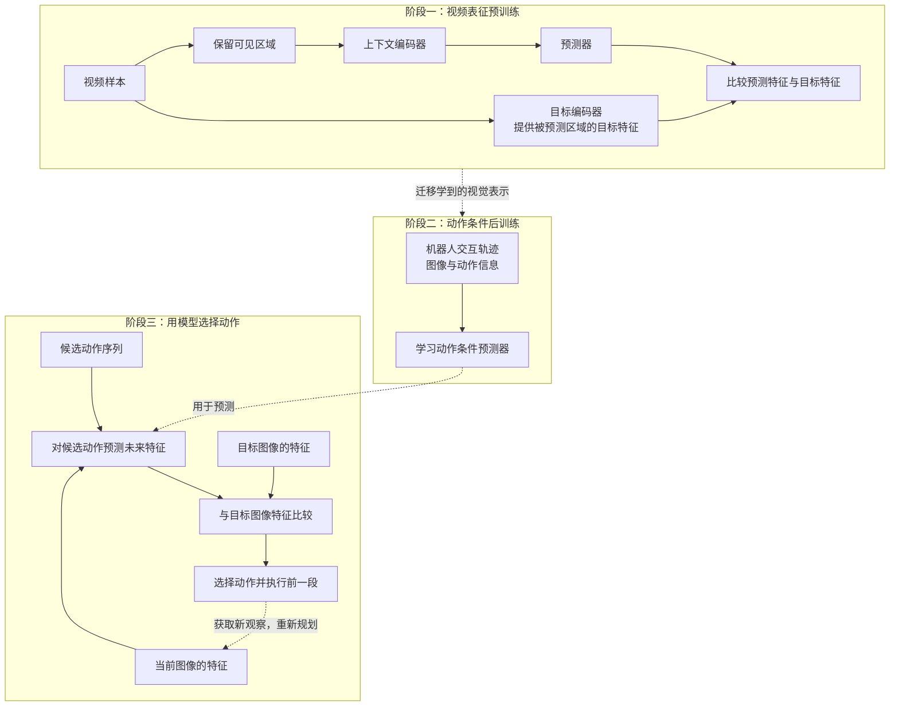

**读图要点**：训练时比较内部特征；规划时比较“预测会到哪里”与“希望到哪里”，执行一段后再规划。论文的零样本部署指没有在目标实验室机器人上另采任务数据，并不表示从未用过机器人交互数据。（E3·一手 / 解释。）

### 4.5 三条主要路线的区别，最终落在用途上

Dreamer 重点是借助模型训练策略；视频生成路线重点是生成可观察的环境变化；V-JEPA 2-AC 展示了在特征空间预测后果并规划的方式。选择哪种方式，要看是否需要可观看的视频、是否有奖励信号、是否需要动作条件预测，以及预测开销能否放进控制回路。（E3·综合判断。）

---

## 5. WAM：把未来预测与动作学习放到一起

### 5.1 为什么联合学习可能有帮助？

仅用动作演示训练时，模型主要学习“看到这种情形，示范者怎么动”。加入未来预测后，模型还需要学习“执行这段动作，观察会怎样变化”。在抓杯子任务中，这相当于同时学习手的运动与杯子被抬起的对应关系。（E3·解释。）

视频预训练提供了利用更多视觉经验的途径，但互联网视频通常没有机器人关节或力矩标签。**视频能补充运动和场景知识，仍需要交互数据或其他机制把这些知识与可执行动作对齐。** 视频的收集、清洗和训练也有成本，不能简化成“免费数据解决真机数据问题”。（E3·推断。）

WAM 是这类联合建模思路的名称之一。不同工作在信息融合、数据训练和部署路径上差别很大。下面按“各自解决了什么问题”介绍五个代表，而不把它们合画成一个通用三专家模型。

### 5.2 DreamZero：让预训练视频模型同时学习动作

DreamZero 建立在视频扩散骨干上，联合预测未来世界状态与动作。项目页报告了 14B 模型经优化实现 7 Hz 闭环，以及跨环境、跨任务的实机实验。这里的频率是模型闭环的工程结果，不能直接换算成底层电机频率，也不能直接移植为其他硬件的性能承诺。（E3·一手 / 推断：[DreamZero 项目页](https://dreamzero0.github.io/)。）

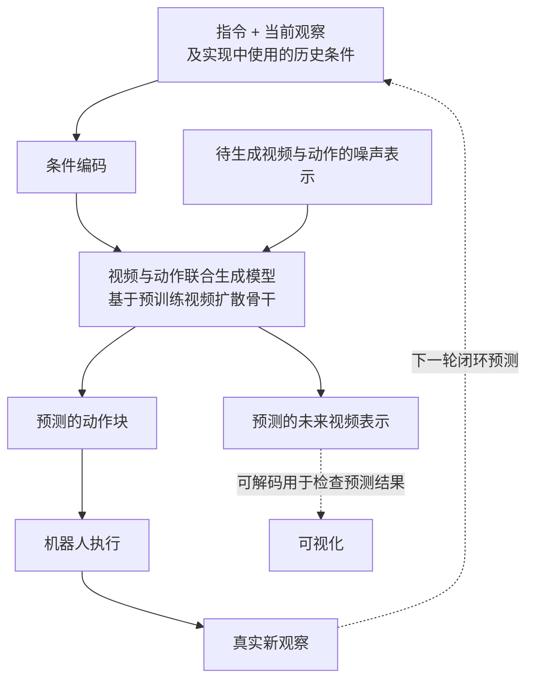

**读图要点**：这张图强调联合输出，不额外假设存在 Qwen 语义专家，也不把它画成“先独立生成完整视频，再从视频翻译动作”。项目页中的 **39.5% 指 task progress（任务进度），不是整项任务成功率**；旧版曾混用了二者。（E3·一手 / 解释。）

### 5.3 LingBot-VA：联合预测之外，还要持续接回真实观察

LingBot-VA 的核心设计包括视频与动作的 MoT、真实观察反馈，以及异步推理执行。MoT（Mixture-of-Transformers）在这里指让不同 Transformer 流协同处理模态；不能直接等同于“大语言模型中的稀疏 MoE 路由”。（E3·一手 / 解释：[LingBot-VA 论文](https://arxiv.org/abs/2601.21998)。）

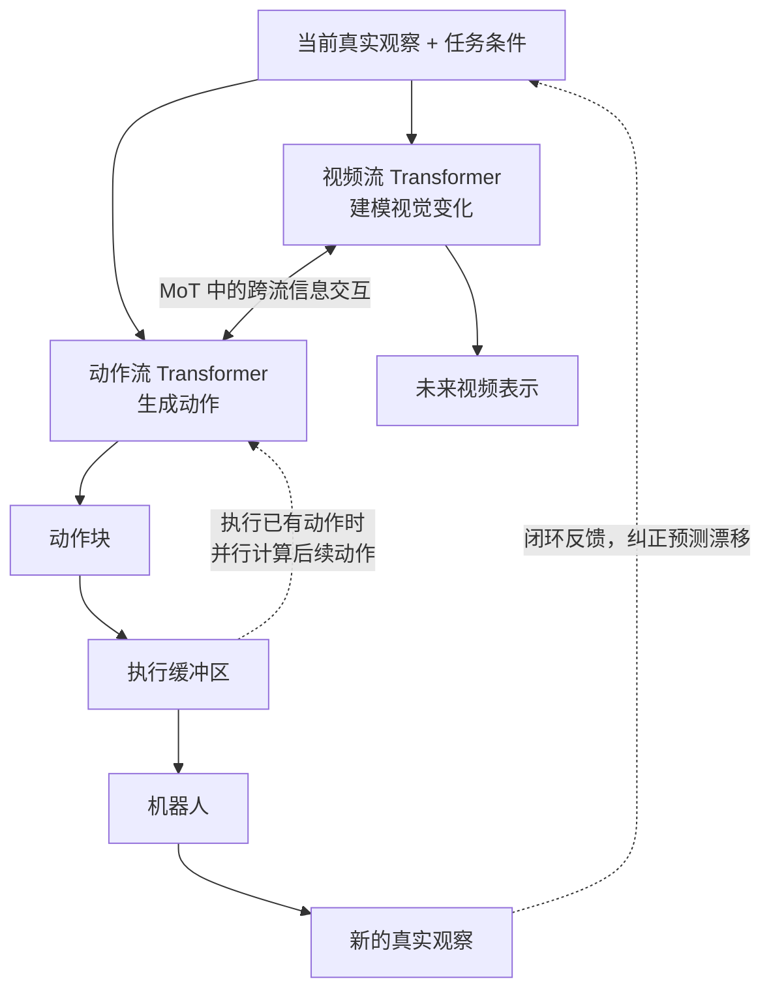

**读图要点**：如果模型一直把自己预测的画面当作下一步事实，小误差可能不断累积。接入真实观察，能重新把预测与现场对齐；异步执行则尝试减少机器人等待推理的空档。它们改善的是不同问题：一个关乎反馈，一个关乎时延。（E3·解释。）

### 5.4 Cosmos Policy：用视频 latent 的位置承载动作和状态

Cosmos Policy 不通过新加一套独立动作网络来接入控制，而是把本体状态、动作块和价值等量编码进视频模型的 latent 序列，再微调模型。可以把这种做法理解为：**沿用模型处理序列的接口，让部分“帧位置”装入非图像数据。** 它们并非相机拍摄的真实画面。（E3·一手 / 解释：[Cosmos Policy §4](https://arxiv.org/html/2601.16163v1)。）

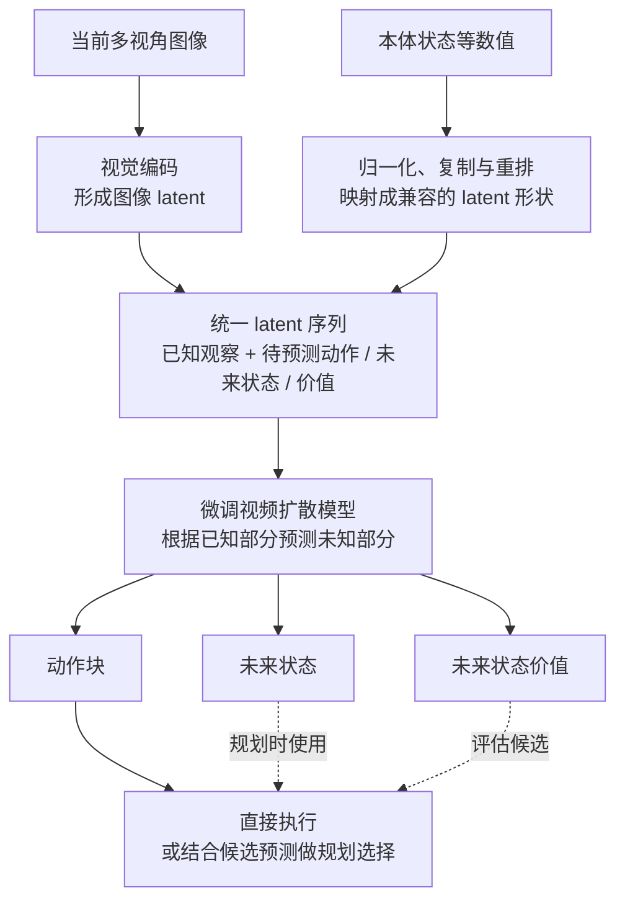

论文的三相机示例含 11 个 latent 位置，这是具体布局，不是通用固定长度。“不改架构”也不等于“不用训练”：仍需适配机器人数据并微调模型。（E3·一手 / 解释。）

### 5.5 Motus：协调语义、视频和动作三类专家

Motus 使用统一潜动作世界模型，把语义理解、视频生成和动作建模联系起来。其三专家结构适合单独画图；不能据此反推 DreamZero 或 LingBot-VA 也有完全相同的模块。（E3·一手 / 解释：[Motus](https://arxiv.org/html/2512.13030v1)。）

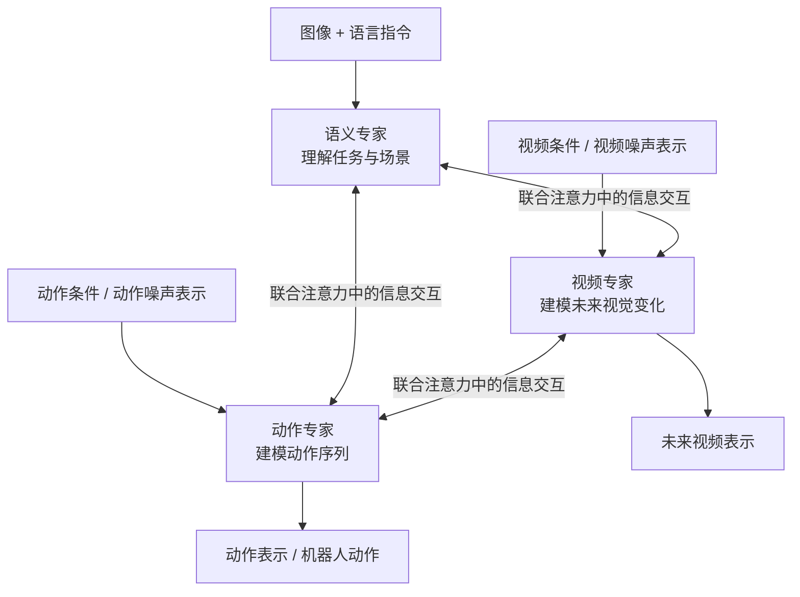

它还使用**潜动作**：从视觉运动中学习描述变化的内部表示，帮助利用缺少机器人动作标签的数据。潜动作提供跨数据的共同表示，但并不是一串天然适配所有机器人、可直接发给电机的命令。（E3·一手 / 解释。）

### 5.6 Fast-WAM：训练时预测未来，部署时是否还要生成未来？

Fast-WAM 把两个容易混在一起的因素拆开：**训练中使用视频预测监督**，与**测试时显式生成未来视频**。其受控实验表明，保留视频共训、跳过测试时未来生成，仍能取得有竞争力的动作效果，并降低延迟。（E3·一手：[Fast-WAM，arXiv:2603.16666](https://arxiv.org/abs/2603.16666)。）

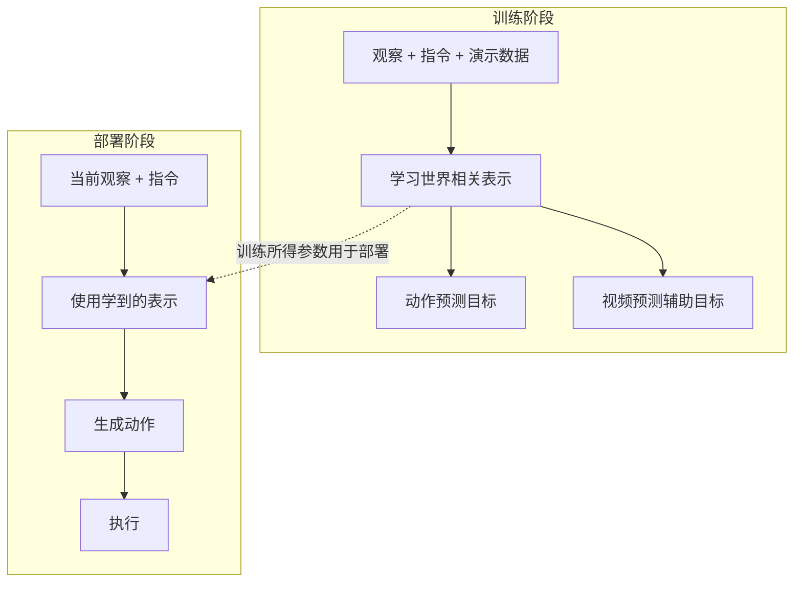

**读图要点**：视频预测对训练有帮助，不代表每次执行都必须生成完整未来视频。反过来，这项实验也不能证明“所有任务中想象都没用”；结果仍受数据量、任务与分布变化影响。后续工作对分布外泛化提出了不同观察，说明这仍是需要对照实验的问题。（E3·一手 / 推断：[后续未来条件研究](https://arxiv.org/abs/2608.04404)。）

### 5.7 五个模型，分别应该记住什么？

以下是对本节一手资料的归纳（E3·推断），不是跨论文性能排名。

| 模型 | 主要设计特点 | 最值得追问的工程问题 |
|---|---|---|
| DreamZero | 视频骨干与动作联合生成 | 视频动作生成怎样达到可用闭环速度？ |
| LingBot-VA | 双流协同、真实反馈、异步执行 | 怎样抑制预测漂移并避免等待？ |
| Cosmos Policy | latent 帧注入，兼顾动作、状态和价值 | 怎样复用现有视频模型接口？ |
| Motus | 三专家协同与潜动作表示 | 怎样利用异构且标签不齐的数据？ |
| Fast-WAM | 保留视频共训，省去部署时显式未来生成 | 哪些训练收益可以低成本带到部署？ |

LIBERO、RoboTwin、真机任务的数字不能不加条件地放在一起排序。比较之前至少要对齐训练数据、任务划分、成功率定义、机器人本体和推理硬件。任务进度、成功率和相对提升也要分开。（E3·方法说明。）

---

## 6. 与 SONIC、物理仿真和昇腾适配有什么关系？

### 6.1 机器人系统比对话模型多了哪些约束？

从前文可以归纳出四个部署层面的区别（E3·推断）。这里比较的是典型文本对话与机器人控制场景，不把所有 LLM 应用都称为开环或低风险。

| 方面 | 文本对话的常见情况 | 机器人控制需要额外解决的问题 |
|---|---|---|
| 输出接口 | 输出文字 | 动作单位、坐标系、关节顺序和控制器接口必须一致 |
| 环境反馈 | 可由用户继续追问 | 动作持续改变场景，需要及时获取新观察并纠偏 |
| 数据获取 | 有大规模既有文本 | 与具体动作对齐的交互数据通常更难获得 |
| 错误后果 | 错误文本可以修改，但仍可能造成现实影响 | 一旦动作已执行，碰撞、跌落等后果不能靠重写输出撤销 |

两者可以共享 Transformer、预训练和后训练方法，但这不能免除控制系统的接口与时序验证。

### 6.2 世界模型与物理引擎怎样分工？

学习型世界模型从数据中预测变化；MuJoCo 等物理引擎按照设定的动力学模型和数值算法计算状态演化。前者可以提供丰富的视觉变化和数据先验，后者适合在明确参数下测试控制与接触。二者都有误差：世界模型可能产生不符合物理的预测，物理引擎也受参数、建模假设和数值精度影响。（E3·解释 / 推断。）

因此，WAM 的发展可以增加合成数据和控制评估的需求，但**不能单凭这一趋势证明 MuJoCo Warp 迁移 NPU 一定值得立项**。B 路线仍需依据本工作区的性能、正确性和实现成本证据判断，权威讨论见 [MuJoCo Warp B 路线报告](../../reports/MuJoCo_Warp架构与昇腾NPU全量迁移B路线报告.md)。

### 6.3 不要把 GR00T 基础模型与 SONIC 全身控制直接画等号

GR00T N1 等基础模型，与本工作区研究的 SONIC / GR00T WholeBodyControl，是相关但需要分别核对接口的对象。上游模型给出什么动作或参考信号，是否以及怎样接入全身控制，必须依据实际集成实现判断。不能因为 GR00T 家族发布新版本，就推定 SONIC 当前的观测定义已经发生变化。（E3·边界说明 / 推断。）

本工作区的原版训练体系、动作语义和观测定义，以 [SONIC 原版训练体系深度解析](../../reports/SONIC原版训练体系深度解析.md) 为准；A 路线现状以 [NPU 适配分支审计](../../reports/SONIC_NPU适配深度报告_zhangqin分支.md) 为准，本文不重复字段拆分。

### 6.4 对昇腾适配，应该把问题落到计算路径上

WAM 可能引入视频 token、扩散迭代、多个专家之间的注意力和缓存，因而增加显存或时延压力。但 Fast-WAM 一类设计也说明，训练时存在的模块，部署时可能被省去。**仅用参数量，不能推出每步计算量增加了几个数量级。**（E3·推断。）

后续若评估一个具体模型，可按以下顺序形成可验证的问题（E3·建议）：

1. **确认部署图**：实际运行哪些编码器、专家、生成步骤？是否解码视频？
2. **确认时延目标**：动作块多长、执行多少步后重规划、能否异步执行？
3. **确认算子与精度**：注意力、缓存、量化和解码在目标 NPU 上的支持及数值表现如何？不能把 NVIDIA 的 NVFP4 实现直接当成昇腾能力。
4. **确认测量口径**：分别记录模型计算、数据搬运、动作执行与闭环任务效果；已有 GPU 加速倍率只作参考。

本文能提供的是候选模型和阅读框架。具体迁移结论需要选定代码版本、硬件与任务后再测量。

---

## 附录 A. 产业动态：保留线索，避免打断原理主线

本附录整理旧版的扩展线索，**整体按 E4·待核处理**。它们不支撑正文的架构和性能结论；未重新核实的参数、融资、订单和“全球首个”等宣传信息不再放入摘要。

| 线索 | 旧版涉及的对象 | 后续引用前需要确认什么 |
|---|---|---|
| 通用与轻量 VLM | PaliGemma、Eagle、Qwen-VL、SmolVLM、InternVL、GLM-V | 具体版本、总参数与骨干参数、许可和发布时间 |
| 其他 VLA / 产品 | Helix、Gemini Robotics、SmolVLA、π0.5、GO-1、F1、NEO | 模型与产品的区别，动作接口和评测条件 |
| GR00T 产品路线 | N1.5 / N1.6 / N1.7 / N2 | 发布公告、可获取版本与计划日期；预告不等于已交付 |
| Cosmos 扩展路线 | 旧版所述 Cosmos 3、16B / 64B 规格及其与 N2 的关系 | 官方模型卡与论文；不依据分析文章推定骨干继承关系 |
| 其他世界模型 | Sora 系、Waymo World Model、Happy Oyster、PlayWorld、LeWorldModel | 论文 / 官方产品页，动作条件与实际能力 |
| 国内 WAM | 酷哇 WAM 2.0、WALL-B、LaWAM | 技术论文、开放实现和独立评测；厂商定位不等于验证结论 |
| 空间智能与产业背景 | World Labs、Spark、General Intuition、AMI Labs | 区分渲染工具、生成模型、公司动态与技术证据 |

旧版的 HTML [架构全景图](/Users/xerxes3/Documents/huawei实习/2026-09-08-物理智能模型架构全景.html) 保留作历史配套。本次更新的是本文内嵌 Mermaid 图；HTML 尚未同步本次概念修正，阅读以本文为准。

## 附录 B. 信源与修订说明

### B.1 正文主要一手资料

正文已在相关解释旁给出直达链接。下表提供按问题检索的入口；“一手资料”在本工作区分级中仍属于 **E3**，不是 E1 源码证据。

| 想了解的问题 | 资料 |
|---|---|
| 图文对齐与视觉接入 | [CLIP](https://arxiv.org/abs/2103.00020) · [LLaVA](https://arxiv.org/abs/2304.08485) · [Flamingo](https://arxiv.org/abs/2204.14198) · [Qwen2-VL](https://arxiv.org/abs/2409.12191) |
| 从机器人策略到 VLA | [RT-1 官方说明](https://research.google/blog/rt-1-robotics-transformer-for-real-world-control-at-scale/) · [RT-2](https://arxiv.org/abs/2307.15818) · [Octo](https://arxiv.org/abs/2405.12213) · [OpenVLA](https://arxiv.org/abs/2406.09246) |
| 连续动作与双系统 | [π0](https://arxiv.org/abs/2410.24164) · [GR00T N1](https://arxiv.org/abs/2503.14734) |
| 世界模型训练与规划 | [DreamerV3](https://arxiv.org/abs/2301.04104) · [V-JEPA 2](https://arxiv.org/abs/2506.09985) · [Genie 3](https://deepmind.google/blog/genie-3-a-new-frontier-for-world-models/) |
| WAM 架构 | [DreamZero](https://dreamzero0.github.io/) · [LingBot-VA](https://arxiv.org/abs/2601.21998) · [Cosmos Policy](https://arxiv.org/abs/2601.16163) · [Motus](https://arxiv.org/abs/2512.13030) |
| 推理时是否需要未来生成 | [Fast-WAM](https://arxiv.org/abs/2603.16666) · [未来条件与分布外泛化研究](https://arxiv.org/abs/2608.04404) |

本次于 **2026-09-09** 重点核对了 Qwen2-VL、RT-1、π0、GR00T N1、DreamerV3、V-JEPA 2、DreamZero、LingBot-VA、Cosmos Policy、Motus 和 Fast-WAM 的相关一手页面。其他入口用于继续阅读，不表示所有论文细节均已审计。

### B.2 旧版二手调研入口

以下保留为检索线索，统一按 **E4·待核** 使用：

- [VLA 综述（自动化学报）](https://www.aas.net/cn/article/doi/10.16383/j.aas.c250394)
- [五篇 WAM 工作的社区解读](https://zhuanlan.zhihu.com/p/2035683269426009731)
- [VLA、世界模型与 WAM 辨析博客](https://jxtang.tech/blog/vla-wam-world-models-cn/)
- [VLM 百科词条](https://en.wikipedia.org/wiki/Vision-language_model) · [VLA 百科词条](https://en.wikipedia.org/wiki/Vision-language-action_model) · [世界模型百科词条](https://en.wikipedia.org/wiki/World_model_(artificial_intelligence))
- [GR00T N2 发布转述](https://www.qbitai.com/2026/03/389569.html) · [酷哇 WAM 2.0 转述](https://www.qbitai.com/2026/02/376429.html) · [LaWAM 解读](https://www.eefocus.com/article/2069935.html)

### B.3 本次修订中影响理解的更正

- **概念**：不再把 VLA、世界模型、WAM 写成互斥且必然替代的阶段；不再用“动作损失 / 文本损失”单项判定类别。
- **架构**：拆开不同 WAM 的模块；补足 Dreamer 的动作条件转移、V-JEPA 的训练与规划区别；取消通用“1 Hz → 50–200 Hz”的假定。
- **数据**：RT-1 的 130k 改为演示轨迹数量；DreamZero 的 39.5% 改为任务进度口径。
- **引用**：Fast-WAM 的正确编号是 **2603.16666**；旧编号 2603.16630 对应另一篇软体机器人论文。百科词条不再标为官方一手来源。
- **结论**：取消“WAM 已取代 VLA”“算力必增一至两个数量级”等超出证据的断言；产业消息移至附录，保留后续查证入口。

修订前全文保存在 [v1.3 备份](/Users/xerxes3/Documents/huawei实习/.revision-backups/2026-09-08-VLA_WAM_世界模型背景调研报告.v1.3.before-readability.md)，便于对照原有型号、参数与报道细节。

---

## 附录 C. VLA / WAM 架构不同，会给我们的后训练带来什么问题？

**会影响，而且不只是换一个模型加载路径：数据怎样切片、优化哪个目标、更新哪些参数、如何计算强化学习信号，以及训练占用多少显存，都可能随架构变化。** 但这不意味着每换一个模型就要重建全部平台。任务定义、原始轨迹存储、实验记录和部分评测设施可以复用，模型输入处理、损失计算与采样过程则需要分别适配。（E3·综合判断。）

本附录以已有预训练权重为起点，讨论用目标任务或目标机器人数据继续训练的情况。模型原理依据前文一手资料；适配建议均为 **E3·推断 / 建议**，尚未经过本工作区代码或 NPU 实跑验证。新增信源访问日期为 **2026-09-10**。

### C.1 先区分两种后训练：跟着示范学，与根据结果学

**监督微调（SFT） / 行为克隆（BC）**：给模型一段成功演示，要求它在相应观察和指令下生成匹配的动作。对于部分 WAM，还同时要求预测演示中的后续观察。π0 的后训练就是利用更聚焦的数据改进下游任务能力的代表。（E3·一手：[π0 §V-A](https://arxiv.org/html/2410.24164v1)。）

**强化学习（RL）后训练**：让策略在真实环境或仿真中尝试，根据任务结果、奖励和约束改进动作。此时不仅要实现训练损失，还要处理策略采样、环境交互、奖励归因和数据更新。扩散策略已有专门的 RL 方法，例如 DPPO；这说明生成式动作策略可以做 RL，但不能直接把普通策略网络的全部训练实现搬过去。（E3·一手 / 推断：[DPPO](https://arxiv.org/abs/2409.00588)。）

因此，在讨论“统一后训练框架”之前，需要说明统一的是离线示范微调、在线 RL，还是两者都要支持。**架构差异会影响两类训练，RL 还会进一步受到动作分布与采样方式的影响。**（E3·解释。）

### C.2 同一份抓杯子数据，不同架构怎样使用？

假设我们录下了机器人把杯子放入托盘的完整过程，包括相机帧、关节状态、指令、已执行动作和时间戳。它可以作为多个模型的共同原始数据，但不能保证转换后的训练样本也完全相同。（以下对比为 E3·解释 / 推断；对应架构见 §3 与 §5。）

| 架构形式 | 样本与训练目标有什么不同？ | 直接共用训练脚本可能遇到什么问题？ |
|---|---|---|
| **离散动作 VLA**，如原始 OpenVLA | 将动作数值编码为 token，预测动作序列；常用交叉熵 | tokenizer、动作范围或 loss mask 不匹配，可能训练了错误位置，或把动作编码错 |
| **连续动作 VLA**，如 π0、GR00T N1 | 构造动作块、噪声与生成时间步，按模型的 flow matching / diffusion 目标训练 | 不能把动作数组直接当文本标签；噪声安排、预测目标及动作归一化要与模型一致 |
| **视频—动作联合 WAM**，如 DreamZero、LingBot-VA | 除动作外，还需按时间对齐未来视频或其 latent；不同目标的可见区域与监督区域要明确 | 随机抽取孤立帧可能破坏时间关系；错误注意力掩码可能让动作预测偷看到部署时不存在的未来信息 |
| **共享 latent 序列的模型**，如 Cosmos Policy | 将图像、本体状态、动作和价值等放进规定的序列布局 | 改机器人或相机数后，位置、掩码与数值映射都可能要改；保留价值学习时，还需要相应的回报目标 |
| **多专家 / 潜动作模型**，如 Motus | 将语义、视频与动作表示送入各自模块，并保持时间和表示对齐 | 数据中缺少某类标签时，需要模型支持的训练路径；潜动作还要与目标机器人的实际动作建立对应 |

这里的“未来视频”通常可以从**同一条已记录的机器人轨迹**中截取，不一定要额外组织一轮数据采集。额外负担主要是保留足够连续的帧、时间同步、多视角信息和编码开销。若历史数据只存了“当前图像—动作”对，后续帧已经丢弃，就可能不足以复现原有的联合预测目标。（E3·解释 / 推断。）

另一个常见问题与模型名称无关：两份数据都写着“7 维动作”，一份可能是末端位姿增量加夹爪，另一份可能是关节目标。即使张量尺寸相同，也不能直接混训。**动作单位、坐标系、绝对量或增量、控制周期，比 shape 是否匹配更重要。** 跨本体时可能需要动作映射、专用输入输出模块或重新标定归一化范围，不能只靠补零。（E3·建议。）

### C.3 “只训动作头”或“统一加 LoRA”，为什么不能一概而论？

**第一，模型未必有一个能单独取出的动作头。** π0 这类架构有明确动作专家，可以研究冻结骨干、只调整动作相关模块的效果；Cosmos Policy 的动作预测则依托共享的视频模型与 latent 布局，不能照搬“找到独立动作头，只训练它”的操作。（E3·一手 / 推断：[π0](https://arxiv.org/html/2410.24164v1)、[Cosmos Policy §4](https://arxiv.org/html/2601.16163v1)。）

**第二，有独立动作模块，也不代表只更新它就够。** 若主要变化是动作尺度或夹爪接口，小范围更新值得作为基线；若新相机视角、物体外观或任务语言超出了原有表示能力，只调末端动作模块可能无法解决问题。此时可能需要更新视觉、语言连接层或跨专家交互模块。是否扩大更新范围，应由验证集和闭环失败案例决定。（E3·建议。）

**第三，LoRA 统一的是一种参数更新方法，不是所有模型的适配位置。** LoRA 通过少量可训练低秩参数调整线性变换。对不同模型，应该加在视觉语言注意力、视频 DiT、动作专家还是跨模态连接层，仍需分别选择；rank 和学习率也不应直接沿用。新增加的动作输入输出层还可能需要完整训练。LoRA 减少可训练参数和优化器状态，但不会自动消除长视频序列的前向计算与激活开销。（E3·原理解释 / 建议；方法来源：[LoRA](https://arxiv.org/abs/2106.09685)。）

冻结参数也要与“关闭梯度计算”分开：如果梯度仍需穿过冻结模块传回上游可训练模块，就不能简单把整段前向放进 `no_grad`。这会影响能省下多少显存，应检查实际计算图。（E3·工程推断。）

### C.4 WAM 的额外问题：动作变好了，世界预测会不会变差？

联合训练常可用下面的**概念式**理解，但它不是所有 WAM 的实际损失公式：（E3·解释。）

> 总训练目标 ≈ 动作目标的权重 × 动作损失 + 世界预测目标的权重 × 世界预测损失 + 模型所需的其他目标。

若后训练只留下动作目标，共享模块可能更适合新任务动作，却削弱原有视频表示或预测能力；若世界预测目标占比过高，有限训练资源又可能更多用于画面细节，而没有明显改善抓取。具体是否发生取决于架构、数据和更新范围，需要观察各分项损失及闭环表现，而不是只看总 loss 下降。（E3·推断。）

Fast-WAM 尤其说明了一个容易漏掉的区别：**部署时不生成未来，不等于后训练时就应删掉视频目标。** 它的研究保留了视频共训。若我们进一步改成仅用动作微调，那是一个需要验证的新方案，不能自动继承原论文的结论。（E3·一手 / 推断：[Fast-WAM](https://arxiv.org/abs/2603.16666)。）

实操中，可先复现目标模型支持的微调配方，再比较“原目标与更新范围”“缩小参数更新范围”“调整辅助目标权重”等有限改动。除了新任务效果，还应留一组旧任务或旧场景检查遗忘；对保留世界预测的模型，增加预测一致性检查。**视频更逼真不保证动作更可靠，动作训练误差更低也不保证闭环成功率更高。**（E3·建议。）

### C.5 如果我们想接现有 PPO / 仿真训练链路，会多出什么问题？

PPO 常需要计算“新旧策略对已采样动作的概率比”。对普通高斯动作策略，动作概率通常容易计算；对离散动作序列，需要明确如何组合各 token 的概率；对经过多步扩散或流匹配生成的动作，最终动作分布的概率一般不能直接按一个普通高斯头来算。（E3·原理解释 / 推断。）

DPPO 的做法之一是把扩散去噪过程也纳入决策过程，从而构造可用于策略梯度的训练方式。它是专门适配的例子，**不代表 DPPO 可以未经修改直接用于任意 flow matching 模型或联合视频—动作 WAM**。（E3·一手 / 推断：[DPPO 官方说明](https://diffusion-ppo.github.io/)。）

此外，动作块会改变交互的时间单位。模型预测 20 步、环境实际只执行前 5 步时，需要记录真正执行的动作段，并明确奖励如何累计、何时终止、折扣和优势估计按哪个时间尺度计算。异步执行还要记录用于生成这段动作的观察与策略版本，避免把不同时间的观察、动作和更新混在一起。（E3·工程建议。）

若奖励来自学到的世界模型，而不是独立的仿真或真实反馈，还存在策略利用预测误差获得虚高奖励的可能。世界模型可以辅助训练，但仍需用独立闭环评估检查效果。（E3·推断。）

对本工作区而言，**复用环境采样与训练基础设施，不等于直接替换 SONIC actor 就完成 VLA/WAM 后训练**。需要先确认训练对象是高层任务策略、动作生成模块，还是全身控制策略，再决定哪些观察、动作、奖励和算法接口可以复用。这里是集成边界判断，未对现有代码作兼容性结论。（E3·建议。）

### C.6 在昇腾上，训练适配还要补哪些检查？

“推理跑通”只能说明前向路径在相应配置下可执行。后训练还要检查反向传播、优化器、混合精度与分布式通信；同一算子的前向可用，也不代表其反向性能与数值表现已经满足训练需求。（以下均为 E3·工程建议，不是对当前 CANN / torch_npu 支持状态的断言。）

| 检查项 | 架构差异怎样影响它？ | 应记录的证据 |
|---|---|---|
| **训练内存与吞吐** | 视频长度、分辨率、专家数量和更新范围改变激活与优化器开销 | 峰值显存、每秒训练样本数、有效 batch size |
| **反向与数值精度** | 自定义注意力、融合算子或特定精度实现可能需要替代 | 同一小批数据的分项 loss、梯度、一次参数更新后的数值对照 |
| **数据准备** | WAM 可能增加视频读取与 VAE 编码；固定编码器时可考虑缓存 | 数据加载时间、编码时间、设备等待比例；确认缓存未破坏增强或训练目标 |
| **通信与模块切分** | 多专家、长序列及冻结方式会改变切分和通信成本 | 各阶段耗时、通信占比、扩展到多卡后的有效吞吐 |
| **最终部署一致性** | 后训练配置与实际采样、动作块执行方式可能不同 | 用实际部署路径评测成功率、恢复能力和闭环延迟 |

还要避免一个算力估计误区：**推理要迭代去噪多次，不表示一次监督训练更新也必须完整展开同样多次。** 许多 diffusion / flow matching 训练在采样的噪声时间点计算目标；RL 若把去噪链纳入优化，则可能需要更多中间量。训练成本要按实际训练算法测，不能由推理步数直接相乘。（E3·一手 / 推断：π0 与 DPPO 的训练方法。）

### C.7 对我们的结论：统一平台，分别适配模型配方

比较可行的做法，是把共同部分与模型特有部分的接口定义清楚：（E3·建议。）

- **共同部分**：原始轨迹及元数据、任务划分、实验记录、检查点管理、环境交互和闭环评测的基本规范。
- **分别适配的部分**：样本窗口与 token / latent 编码、动作映射、注意力与监督掩码、损失与权重、可训练模块、采样方式，以及 RL 所需的动作概率或替代优化目标。

第一步可选择一个目标 VLA 和一个目标 WAM，在同一任务上分别跑通其公开支持的监督微调方案，再比较数据准备、内存、训练吞吐和闭环效果。若之后需要 RL，再为对应的动作生成过程设计接口。比较时保持相同的原始数据划分和任务条件，同时允许各模型使用自己必需的预处理，并如实记录额外数据与计算预算。（E3·建议。）

**架构不同带来的核心问题，是“同一份数据和同一套优化步骤，未必在训练同一种行为”。我们可以复用工程底座，但不能预设一套 SFT / LoRA / PPO 配方能原样覆盖所有 VLA 和 WAM。**（E3·综合判断。）
