# VLA 与 WAM 后训练：方法、框架与源码导读

> **版本：v2.2 · 2026-09-09**（将全部 17 幅字符图改为可渲染的 Mermaid 架构图）  
> **资料快照：2026-09-08。** 星数、发布状态和论文成绩沿用原调研快照，本次不作为实时更新。  
> **阅读目标：**先理解“模型怎样继续学习”，再看各框架负责哪一段，最后判断昇腾迁移应从哪里开始。

本文将“方法原理”“生态清单”“源码实现”分开讲。正文聚焦影响理解和选型的内容；更多项目留在附录 D，源码版本见附录 A。

**证据口径**沿用 [工作区总览](<../../reports/00_总览.md>)：E1 是锁定版本的源码实证；E2 是配置实证；E3 是 README、论文、官方文档或明确标注的推断；E4 是未经复核的外部转述。README 不再与源码统列为 E1。每节用“证据”说明适用范围，框图是对实现的解释性整理，不是原仓库原图。

**图示约定：**所有框图使用 Markdown 的 `mermaid` 代码块，可在支持 Mermaid 的预览中直接渲染。实线表示数据流或调用关系；虚线表示训练监督、参数更新或跨轮反馈，具体含义以连线文字为准。图按主要模块简化，源码细节以相邻代码讲解为准。

原稿基于网络调研与十个本地仓库的静态审查。本次核对了十个仓库的 HEAD、正文新增代码片段及几处关键矛盾；没有运行 GPU/NPU 训练，也没有逐项重新验证论文成绩或全部历史审计项。

## 先读这五点

1. **后训练不等于强化学习。** 用示范数据继续微调是 SFT；让策略尝试任务、根据奖励更新才是 RL。世界模型还可以只负责生产 SFT 数据。
2. **VLA/WAM 是模型设计，SFT/RL 是训练方法。** 这两组概念不是同一层分类。WAM 可以做监督微调，VLA 也可以做 RL。
3. **选框架先看它负责哪一段。** openpi、Isaac-GR00T 的已审查训练入口以 SFT 为主；verl、RLinf 负责 RL 调度；SimpleVLA-RL、VLA-RFT 展示具体的 VLA-RL 配方。（E1，§8–§14）
4. **读 WAM 要分清训练和部署。** DreamZero 联合处理视频与动作；FastWAM 说明，训练时使用视频目标，并不要求部署时每次都生成未来视频。（E1/E3，§10–§11）
5. **昇腾支持要落实到具体组合。** RLinf 已有 OpenVLA-OFT、GR00T 相关 Ascend CI 配置；这不能扩大为“所有 VLA 都支持”，也不能再概括为“端到端 VLA-RL 完全空白”。verl 的设备抽象更系统，但其主库支持 NPU，也不等于 verl-vla 已完成适配。（E1/E2，§7.2、§9.4）

## 阅读路线与目录

| 你想解决的问题 | 建议阅读 |
|---|---|
| SFT、RL、WAM 到底是什么关系？ | §1 → §3 → §4 |
| 怎样选择训练框架？ | §2 → §5 → §7 |
| 想通过代码理解后训练 | §8–§15；每节先看图，再看代码后的解释 |
| 想做昇腾上的 VLA-RL | §7.2 → §9.4 → §14 → §16 |
| 查项目、术语或版本 | 附录 A–D |

- **第一部分：建立全局认识。** §1 概念；§2 SFT 框架；§3 RL 闭环；§4 世界模型的作用；§5 昇腾与通用框架；§6 环境、数据与评测。
- **第二部分：读懂核心实现。** §7 横向比较；§8 verl/verl-vla；§9 RLinf；§10 DreamZero；§11 FastWAM；§12 openpi；§13 Isaac-GR00T；§14 两条 VLA-RL 路线；§15 GR00T-Dreams。
- **第三部分：工作区决策。** §16 迁移启示；§17 未解决的问题。

---

# 第一部分：先理解后训练，再看生态

## 1. 用一个抓取任务理解 VLA、WAM 和后训练

假设机器人收到指令：“把红杯子放到盘子里。”模型已经具备一定的视觉与语言能力，但还需要学会这台机器人的动作格式、这个场景的物体分布，以及失败后如何调整。本文所说的**后训练**，就是在已有模型基础上继续学习这些能力。（E3：概念说明）

### 1.1 VLA 与 WAM：模型输出和内部建模不同

**VLA（Vision-Language-Action）**把图像、语言指令以及可选的机器人状态转换为动作。动作可能是关节目标、末端位姿增量，也可能先表示为离散 token，再解码成连续数值。

**WAM（World Action Model）**在本文重点讨论的 DreamZero/FastWAM 路线中，把世界的未来变化与动作联系起来学习。例如，不仅学习“夹爪应该向右移动”，还学习“这段动作对应的视频变化”。更广义的 WAM 分类还包括先预测未来、再反推动作的级联方案，以及使用隐空间表征的方案；不同文献的范围并不完全一致。（E3，来源见附录 C）

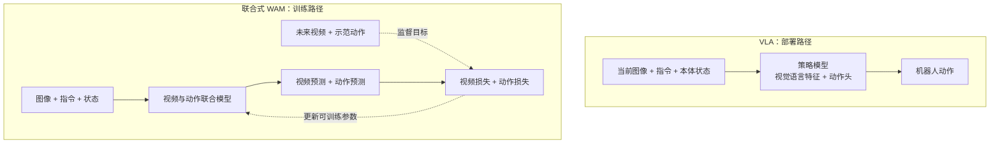

因此，“WAM 取代 VLA”不是本文采用的选型前提。更有用的问题是：**视频预测在训练时带来了什么，以及部署时是否值得支付这部分计算成本。**（E3：分析视角）

### 1.2 三种最容易混淆的后训练方式

| 方式 | 学习信号从哪里来？ | 谁在更新？ | 抓杯子的例子 |
|---|---|---|---|
| SFT / 行为克隆（BC） | 示范中的正确动作 | 策略模型 | 学习人演示的抓取轨迹 |
| 直接 RL | 当前策略尝试任务后得到的奖励 | 策略，可能还有价值网络 | 成功放杯得分，让成功行为更可能出现 |
| 合成数据后 SFT | 世界模型生成视频，IDM 补动作标签 | 下游策略；数据模型是否训练另算 | 先生成抓杯视频，再拿提取的动作训练策略 |

世界模型也可以作为 RL 的环境，但需要另看它是否把新观测回传给策略、奖励如何计算，以及哪些模型被冻结。§14.2 的 VLA-RFT 就不能直接画成与物理仿真完全相同的闭环。（E1/E3）

### 1.3 读后文前只需记住六个词

| 术语 | 本文中的含义 |
|---|---|
| action chunk | 一次预测的多步动作。**预测长度不等于实际执行长度**；可以全部执行，也可以执行前几步后重规划 |
| rollout | 用当前策略收集一次次尝试的轨迹，包括观测、动作、奖励等 |
| actor / critic | actor 决定动作；critic 估计未来回报，帮助判断当前结果好不好 |
| advantage | 动作结果相对某个基线“好多少”，供策略更新使用 |
| log_prob | 某个动作在策略分布下的对数概率或概率密度；PPO/GRPO 等概率比更新需要它 |
| flow matching | 学习一个将噪声逐步变成动作或视频的速度场；§12 用代码解释 |

## 2. SFT 框架：先让模型会模仿

**SFT 的核心是“给条件、对答案、更新参数”。** 答案来自已有轨迹，不需要每个训练批次都连接机器人或仿真器。（E3：原理；openpi/GR00T 实现见 §12–§13）

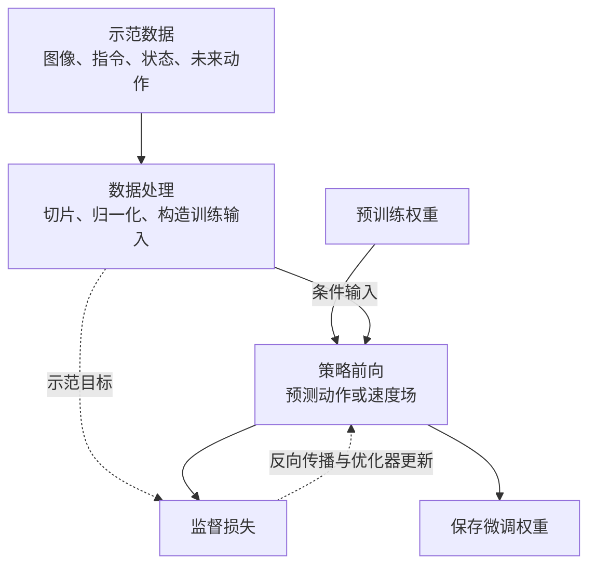

### 2.1 三个主要入口

| 项目 | 适合解决的问题 | 本轮能确认的边界 |
|---|---|---|
| [LeRobot](https://github.com/huggingface/lerobot)（27.3k★） | 希望统一数据、不同策略及训练/部署工具 | 支持多个 VLA 与部分 RL 工作流；本轮未克隆，能力清单主要依据文档，E3 |
| [openpi](https://github.com/Physical-Intelligence/openpi)（13.7k★） | 研究或微调 π0、π0-FAST、π0.5 | 已审查入口为监督训练；有 JAX/PyTorch 两条路径，不能把 PI 论文中的 RL 方法视为本仓已提供，E1/E3 |
| [Isaac-GR00T](https://github.com/NVIDIA/Isaac-GR00T)（8.0k★） | 微调 GR00T，并使用其数据处理和部署链 | N1.7 源码采用 flow matching 动作头；本仓未发现完整 VLA-RL trainer，E1 |

星数仅反映快照时的关注度，不衡量复现难度或硬件兼容性。openpi 与 Isaac-GR00T 的具体实现分别在 §12、§13 展开。

### 2.2 不要把模型仓库和训练平台混为一类

OpenVLA、OpenVLA-OFT 常被研究工作用作基础策略；starVLA 和 dexbotic 更侧重组合模型与训练流程；SONIC 所在的 GR00T-WholeBodyControl 则是全身运动控制栈。它们可以出现在同一套机器人系统中，但负责的任务不同。（E3，仓库索引见附录 D）

同样，通用 LLM/VLM 微调框架支持图像输入，并不能直接说明它支持机器人动作归一化、action chunk、环境交互和轨迹奖励。这些接口正是 VLA 专用层需要补齐的部分。（E3：工程推断）

## 3. RL 后训练：让策略根据尝试结果改进

### 3.1 先看完整闭环

与 SFT 相比，RL 多了“尝试任务”和“评价结果”。训练数据会随当前策略改变，更新后还要把新权重交给下一轮采样使用。（E3：通用 PPO 式架构，具体实现见 §8–§9）

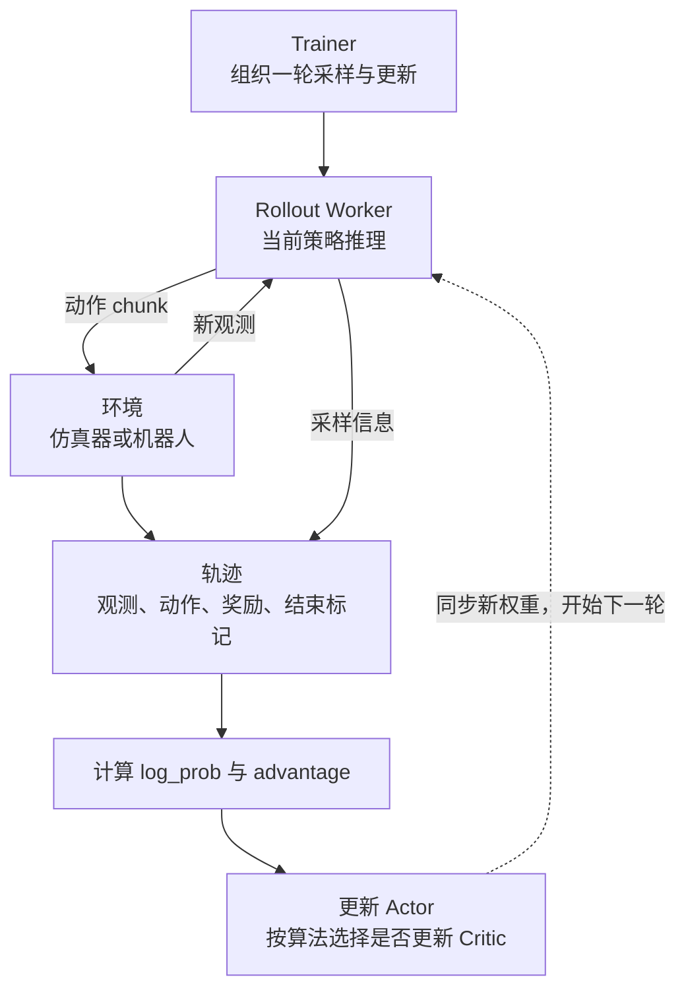

其中有两种“反馈”，不要混淆：环境给新观测，是**控制层面的反馈**；训练器根据奖励改参数，是**学习层面的反馈**。仅能循环执行动作，还不构成 RL 训练。

### 3.2 PPO 与 GRPO：重点是基线如何得到

PPO 风格方法通常借助 critic 估计回报，再计算 advantage；GRPO 常把同一条件下的一组采样结果相互比较，用组内奖励构造基线。两者都不是“成功就复制动作”这么简单，还要限制策略一次更新的幅度。（E3：方法概述）

例如同一任务采样四次，奖励是 `[0, 0, 1, 0]`，组内比较能突出那次成功。但如果全是 0，只有二元奖励时这组样本就难以提供区分信号。这也是某些工作采用动态补采、过滤无区分度样本的原因；SimpleVLA-RL 的实现见 §14.1。（E1/E3）

原调研引用的 [VLA 泛化研究](https://rlvla.github.io/) 报告了其稀疏奖励实验中 PPO 的优势。应把它理解为**特定模型、环境和配方下的实验结果**，不能据此断言所有 VLA 任务都应选 PPO，或 GRPO 普遍无效。（E3）

### 3.3 主要框架在闭环里负责什么

| 框架/工作 | 主要职责 | 阅读重点 |
|---|---|---|
| verl + verl-vla | verl 管分布式 RL；verl-vla 补机器人模型、环境和工作流 | §8：通用底座与专用层如何衔接 |
| RLinf | 把 actor、rollout、环境拆成可调度的 worker | §9：如何并行、如何通信 |
| SimpleVLA-RL | 用仿真任务成功信号更新 VLA | §14.1：奖励与动作采样 |
| VLA-RFT | 用世界模型预测结果和参考轨迹比较，构造奖励 | §14.2：奖励来源与开源边界 |

这些是框架与实现分工（E1）；论文里的成功率和加速比属于实验报告（E3），不能仅由代码存在来证明。

### 3.4 另外两条路线：真机 RL、专家蒸馏

真机 RL 还要处理人工接管、设备重置和采样速度等问题。HIL-SERL 是人参与真实机器人学习的代表，PI 的 RECAP、RLT 也属于值得跟踪的方法；原调研快照中，不能把相关论文方法当作 openpi 的现成训练入口。（E3，附录 C/D）

**RL 专家蒸馏到 VLA**则分两段：先用 RL 训练专家，再采集专家动作，把这些动作当作 VLA 的监督标签。最终 VLA 执行的是 SFT，不是直接使用奖励更新。（E3：原调研所引 Isaac Lab/COMPASS 路线）

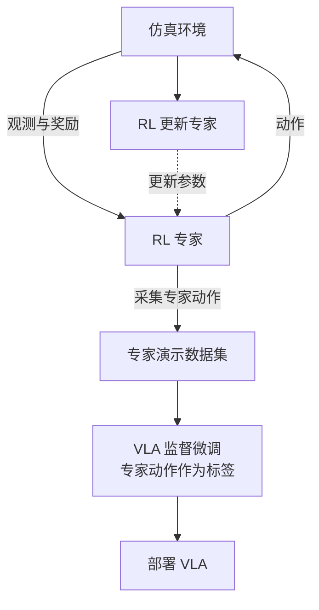

## 4. 世界模型怎样参与后训练

### 4.1 按“世界模型在系统里做什么”分类

| 用法 | 训练数据或信号 | 部署时还需要世界模型吗？ | 代表 |
|---|---|---|---|
| 联合学习视频与动作 | 视频目标 + 动作目标 | 取决于设计；FastWAM 可跳过未来视频生成 | DreamZero、FastWAM |
| 生成训练数据 | 合成视频经 IDM 提取动作标签 | 下游策略可以单独部署 | GR00T-Dreams |
| 评价候选动作/提供想象轨迹 | 世界模型预测结果构成 RL 奖励 | 可以只在训练时使用 | VLA-RFT、WMPO |
| 在隐空间预测并规划 | 预测隐状态，比较目标或代价 | 规划时通常还需要相关模型 | V-JEPA 2-AC 等 |

这是按用途整理的概念分类（E3），不是严格互斥的模型分类。同一个世界模型可能同时承担多种用途。

### 4.2 两幅图分清“造数据”和“做 RL”

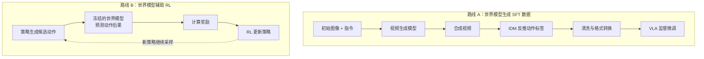

路线 A 的关键风险是标签质量：视频看起来合理，不等于提取出的动作就能让真机复现。路线 B 的关键风险是奖励可靠性：策略可能利用世界模型误差，获得高分却不能在真实环境完成任务。（E3：工程分析）

### 4.3 DreamZero 与 FastWAM 提醒我们区分训练成本和控制延迟

DreamZero 让视频 token、动作 token 进入同一个 DiT；FastWAM 用视频专家与动作专家混合注意力，并提供只以首帧为条件的动作推理路径。后者的消融实验支持其设置下“视频共同训练有价值，但每次推理显式生成未来视频未必必要”的判断。（E1/E3，§10–§11）

原稿中的 110ms、0.6s 等数字来自不同硬件和配置，**不能直接作为同条件速度排名**。还要分别记录：一次模型调用耗时、每次执行多少动作、何时重新观测。§10.3 说明为什么 action chunk 的执行频率不等于闭环重规划频率。

### 4.4 名称相近，职责却不同

| 名称 | 本文中的定位 |
|---|---|
| DreamZero | 视频与动作联合建模的 WAM；不是通用 RL trainer |
| GR00T-Dreams / DreamGen | 合成轨迹和动作标签的数据流程 |
| Meta/UChicago DreamGym | 原调研所引工作面向 LLM agent，不应直接当成机器人 VLA 框架 |
| DreamZero README 中的 Dream Gym | 原调研未找到独立公开实现，继续保留为未核实线索 |
| WorldGym / World-Gymnast | 世界模型评估、训练策略的相关研究，开源状态需单独核验 |

证据：前两项结合本地实现（E1）；其余沿用原调研文献与检索记录（E3/E4）。

## 5. 通用框架与昇腾：支持矩阵要拆开看

### 5.1 “支持 NPU”至少要回答四个问题

1. **模型能算吗？** 注意力、归一化、动作头和采样算子是否兼容。
2. **训练能更新吗？** 自动混合精度、梯度、优化器和分片训练是否正确。
3. **采样能衔接吗？** 环境观测能否进入模型，动作能否解码并执行。
4. **规模化能运行吗？** 多卡通信、权重同步、显存调度和恢复机制是否可用。

这四项是本文的工程检查维度（E3）。通用 LLM 的 NPU 示例通常只覆盖其中一部分，不能替代具体 VLA 配方的验证。

### 5.2 重点框架

| 框架 | 原调研的昇腾依据 | VLA 侧还要确认什么 |
|---|---|---|
| verl | 官方文档与源码中有 NPU 平台、训练及推理适配，E1/E3 | verl-vla 锁定的版本及模型/环境接口 |
| RLinf | Ascend 设备层与具身 CI 配置，E1/E2 | 精确模型版本、算子、通信及实际 CI 结果 |
| MindSpeed-RL / MindSpeed-MM | 原调研引用官方 LLM/VLM 训练材料，E3 | 机器人动作分布、环境交互、轨迹奖励 |
| ms-swift / LLaMA-Factory | 官方 NPU 训练文档，E3 | 不能把 VLM 支持直接扩展为 VLA 支持 |
| AReaL / ROLL | 原调研记录了官方昇腾路径，E3 | 本轮未做机器人链路源码审查 |

更多框架放在附录 D。关于昇腾的决策以 §7.2 的证据分层为准，避免用“官方支持”四个字掩盖模型和版本差异。

### 5.3 当前最合理的验证起点

从**已有具体配方**出发，比把几个“各自支持”的组件拼成一个未经验证的方案更容易定位问题。本文建议优先复核 RLinf 的 Ascend 具身 CI 对应配置；另一路是参考 verl 的平台层与 HF rollout 实现，搭建可控的迁移原型。（E3：基于 E1/E2 的建议，细化步骤见 §16）

## 6. 环境、数据与评测：模型之外的三部分

| 部分 | 它负责什么 | 本文涉及的代表 |
|---|---|---|
| 环境 | 接收动作，推进状态，返回观测与奖励 | LIBERO、RoboTwin、Isaac Lab、MuJoCo、Genesis |
| 数据 | 保存图像、指令、状态、动作及元信息 | LeRobotDataset、DROID、OXE、AgiBot World |
| 评测 | 固定任务与条件，比较策略效果 | LIBERO、SimplerEnv、RoboArena、MolmoSpaces |

同一项目可能承担多种角色。例如 LIBERO 既提供任务环境，也常被用作基准。LeRobotDataset 则是数据组织方式，不能与仿真器相互替代。（E3）

对本工作区尤其要区分：**把训练张量放到 NPU**与**把物理仿真内核迁到 NPU**是两个工程问题。CPU 环境搭配 NPU 策略可以先验证后训练链路；这并不证明 MuJoCo-Warp 已能在 NPU 上运行。A/B 路线的定义与专门报告见工作区总览。（E3：边界说明）

---

# 第二部分：从关键代码读懂框架

## 7. 先建立一张源码地图

### 7.1 哪个框架负责哪件事

| 想看的机制 | 源码入口 | 本文讲解 |
|---|---|---|
| 一轮 RL 更新怎么组织 | verl `trainer_base.py` | §8.1 |
| 新设备怎样接入 | verl `platform_npu.py` | §8.2 |
| 环境与策略怎样同时工作 | RLinf `embodied_runner.py` | §9.2 |
| 视频和动作怎样合在一起 | DreamZero 视频 DiT | §10.1 |
| 不生成未来视频怎样出动作 | FastWAM 注意力 mask | §11.1 |
| flow matching 到底训练什么 | openpi / GR00T 动作头 | §12.1、§13.1 |
| RL 奖励和概率怎样得到 | SimpleVLA-RL / VLA-RFT | §14 |
| 合成视频怎样成为动作数据 | GR00T-Dreams IDM 脚本 | §15 |

正文节选是原文件中的真实语句，中文注释为编辑补充；跨段摘录会标明省略。它们是阅读材料，不是可单独执行的完整脚本。较长路径只放在代码定位链接中，避免打断解释。

### 7.2 昇腾支持：用证据代替“生产级/零适配”标签

| 对象 | 静态证据能说明什么 | 静态证据不能说明什么 |
|---|---|---|
| verl 主库 | 有系统化 NPU 设备抽象、训练/通信/推理配套，E1 | 不能证明任意 VLA 可运行，或达到生产环境要求 |
| RLinf | 有设备层及特定 Ascend 具身 CI 定义，E1/E2 | 未读取运行结果，不能说本次已复现；不能外推全部模型/多机路径 |
| verl-vla、openpi、Isaac-GR00T、SimpleVLA-RL、VLA-RFT、DreamZero、FastWAM、GR00T-Dreams | 原静态审查未找到独立、完整的原生 NPU 适配链 | “没发现适配链”不等于每个算子都不能在 NPU 上执行 |

原稿一边列出 RLinf 的 Ascend 具身测试，一边断言“端到端 VLA-RL 完全空白”，两者冲突。本文改为：**已有特定模型和任务的官方配置入口，覆盖范围与实跑效果仍需按组合验证。**（E2/E3）

### 7.3 动作头怎样读取视觉语言信息

| 模型 | 信息如何进入动作生成 | 直观理解 |
|---|---|---|
| openpi π0 | 视觉语言专家与动作专家共享注意力计算 | 两组 token 在同一次注意力中交流 |
| GR00T N1.7 | 动作 DiT 通过 cross-attention 读取视觉语言特征 | 动作头向视觉语言特征“查询信息” |
| DreamZero | 视频、动作、状态 token 拼接后送入同一个 DiT | 在一条 token 序列中联合建模 |
| FastWAM | 视频与动作专家逐层混合注意力（MoT） | 保留两个专家，通过注意力交换信息 |

证据：E1，各自代码说明见 §10–§13。这些差异决定计算量、缓存方式和适配接口；不能只看名字里是否有 DiT。

### 7.4 为什么“能生成动作”还不等于“能做 PPO”

PPO 一类更新会比较同一动作在新旧策略下的概率。离散 token 策略通常可以从 softmax 得到概率；连续 flow 策略则不能直接照搬这一步。（E3：方法解释）

flow matching 从随机初值出发，沿速度场积分得到动作。**给定初值后的 ODE 路径确定，不代表最终动作没有随机性**；困难在于常见实现并不直接输出容易计算的动作边际密度。相关 RL 实现会对采样过程做额外设计，例如给每步引入高斯转移并计算链上 log_prob。链的联合概率也不能不加说明地等同于最终动作的边际概率。（E1/E3，§14.2）

## 8. verl / verl-vla：把通用 RL 底座接到机器人上

### 8.1 verl 先把一轮更新拆成固定步骤

verl 的 Trainer 负责控制顺序，具体计算由 worker/engine 执行。这样，同一套高层训练流程可以接不同训练后端与 rollout 实现。（E1；下图为实现的概括，E3）

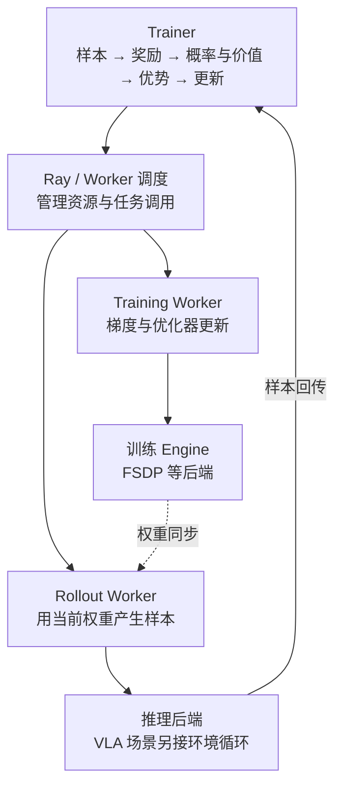

**源码节选（E1）**：[定位 verl/verl/trainer/ppo/v1/trainer_base.py](</Users/xerxes3/Documents/huawei实习/vla_wam_framework_src/verl/verl/trainer/ppo/v1/trainer_base.py:563>)，原文件第 563–564、577–578、581–583、586–588 行。中文注释为本文补充，省略位置已标明。

```python
# 记录采样策略对这些动作的概率，后续与更新后的概率比较。
with marked_timer("old_log_prob", timing_raw, color="blue"):
    batch = self._compute_old_log_prob(batch, metrics=metrics)
# … 省略中间代码 …
# 把奖励转成 advantage：判断哪些动作比基线表现更好。
with marked_timer("adv", timing_raw, color="brown"):
    batch = self._compute_advantage(batch, metrics=metrics)
# … 省略中间代码 …
# 需要 critic 时更新价值网络。
if self.use_critic:
    with marked_timer("update_critic", timing_raw, color="pink"):
        batch = self._update_critic(batch, metrics=metrics)
# … 省略中间代码 …
# critic 预热结束后，才开始更新策略。
if self.config.trainer.critic_warmup <= self.global_steps:
    with marked_timer("update_actor", timing_raw, color="red"):
        batch = self._update_actor(batch, metrics=metrics)
```


这段代码展示了训练的骨架：先取得采样策略的 `old_log_prob`，再计算 advantage，最后更新 actor。`use_critic` 决定是否更新价值网络；`critic_warmup` 允许先训练价值估计，再启动策略更新。原文件前面还有取样、奖励计算，参考策略概率也是可选步骤。

**整体上，Trainer 关心的是数据和步骤，不直接写死“机器人该怎么动”。** 因而接 VLA 时，既要让模型提供动作及训练所需概率，也要把机器人轨迹转换成训练器能消费的数据。仅替换模型名称通常不够。（E3：工程解释）

算法细节再向下看 `verl/trainer/ppo/core_algos.py`：GAE、GRPO advantage 和不同 policy loss 都在那里。第一次阅读时先掌握上面的调用关系，不必先逐个记住算法变体名。（E1）

### 8.2 NPU 平台层：把设备差异集中管理

**源码节选（E1）**：[定位 verl/verl/plugin/platform/platform_npu.py](</Users/xerxes3/Documents/huawei实习/vla_wam_framework_src/verl/verl/plugin/platform/platform_npu.py:37>)，原文件第 37–39、45–47、53–58 行。中文注释为本文补充，省略位置已标明。

```python
# 把华为平台实现注册到统一入口。
@PlatformRegistry.register(platform="huawei")
class PlatformNPU(PlatformBase):
    """Platform backend for Huawei Ascend NPU."""
# … 省略中间代码 …
    # 上层通过属性取设备名，不必到处写 CUDA/NPU 分支。
    @property
    def device_name(self) -> str:
        return "npu"
# … 省略中间代码 …
    # 设备操作交给 torch.npu；可用性也由后端自己检查。
    @property
    def device_module(self) -> ModuleType:
        return torch.npu

    def is_available(self) -> bool:
        return torch.npu.is_available()
```


这里没有改 PPO 公式，而是把“设备叫什么、由哪个模块操作、是否可用”集中到 `PlatformNPU`。同一个类还管理设备可见性、通信等平台差异。上层代码通过统一接口使用后端，减少散落的 `if cuda / if npu`。（E1/E3）

但**统一接口只是适配的一层**。本地快照中还可看到 TensorDict/torch_npu 兼容处理、模型算子 patch、vllm-ascend 集成和权重同步。`NPU_PATCHES` 的模型覆盖有范围，不能把已有 Qwen 相关 patch 自动套到机器人动作头上。（E1；定位：`verl/models/transformers/npu_patch.py:411`）

### 8.3 verl-vla 补上模型、环境和机器人工作流

**源码节选（E1）**：[定位 verl-vla/src/verl_vla/workers/rollout/base.py](</Users/xerxes3/Documents/huawei实习/vla_wam_framework_src/verl-vla/src/verl_vla/workers/rollout/base.py:20>)，原文件第 20–26 行。中文注释为本文补充，省略位置已标明。

```python
def register_vla_rollouts():
    # 把 HF 策略推理注册为三种调度模式下的 rollout 实现。
    registrations = {
        ("hf", "sync"): "verl_vla.workers.rollout.hf_rollout.HFRollout",
        ("hf", "async"): "verl_vla.workers.rollout.hf_rollout.HFRollout",
        ("hf", "async_envloop"): "verl_vla.workers.rollout.hf_rollout.HFRollout",
    }
    # 这里直接更新 verl 的内部注册表，因此依赖上游接口版本。
    _ROLLOUT_REGISTRY.update(registrations)
```


`HFRollout` 表示采样可以直接通过 Hugging Face 模型前向执行，而不是必须使用 vLLM。对机器人动作头而言，这条路径更容易保留模型原有的 `sample_actions` 等接口。（E1/E3）

代价是版本耦合：代码直接写入 verl 的私有注册表，而本地 `requirements.txt` 固定 `verl==0.7.1`。本文审查的 verl 主库是另一个版本，**两份源码可分别研究，不能默认直接组装运行**。（E1/E2）

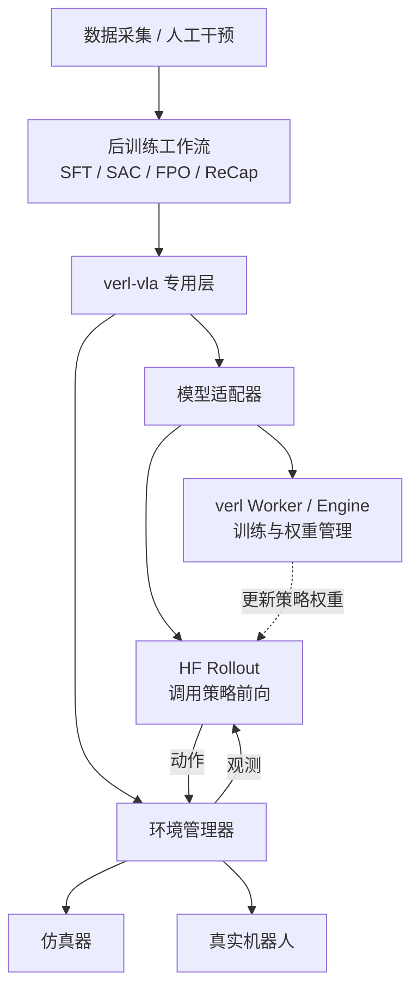

SAC 工作流可混合在线与离线数据；FPO 把 action chunk 作为跨多步的转移来处理；ReCap 串联采集、价值学习和策略训练。这些不是给 PPO 换三个名字，而是不同的数据与更新组织方式。（E1/E3；`src/verl_vla/trainer/`）

### 8.4 本工作区可以借鉴什么

优先借鉴设备接口与模型/环境边界，而不是一开始搬完整套分布式系统。HF rollout 的存在说明可以先不引入高速推理引擎；但 NPU 上仍要验证模型算子、混合精度与权重同步。（E3）

## 9. RLinf：让环境、推理和训练各自工作

### 9.1 三类 worker 和一组通道

RLinf 将环境推进、策略推理、梯度更新拆为不同 worker。Channel 是它们传递观测、动作和轨迹的通道；Cluster/Manager 负责这些 worker 放在哪些资源上。（E1；图为整理，E3）

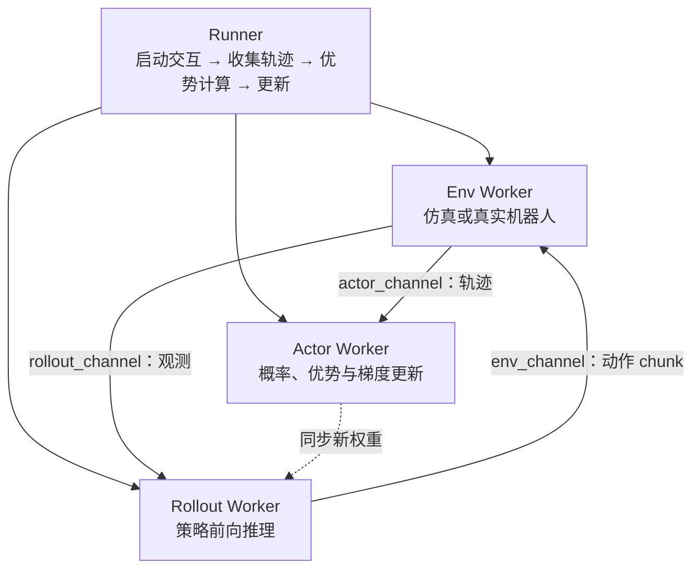

这使慢速环境不必与梯度计算绑定在同一个 Python 执行流程里。至于能加速多少，要看环境耗时、模型大小、通信和部署方式，不能从“用了 Channel”单独推出论文的吞吐倍数。（E3）

### 9.2 代码里怎样启动环境与推理

**源码节选（E1）**：[定位 RLinf/rlinf/runners/embodied_runner.py](</Users/xerxes3/Documents/huawei实习/vla_wam_framework_src/RLinf/rlinf/runners/embodied_runner.py:503>)，原文件第 503–512 行。中文注释为本文补充，省略位置已标明。

```python
# 启动环境交互任务：收动作、推进环境、发回观测。
env_handle: Handle = self.env.interact(
    input_channel=self.env_channel,
    rollout_channel=self.rollout_channel,
    reward_channel=self.reward_channel,
    actor_channel=self.actor_channel,
)
# 启动策略推理任务；两端通过相反方向的 Channel 交换数据。
rollout_handle: Handle = self.rollout.generate(
    input_channel=self.rollout_channel,
    output_channel=self.env_channel,
)
```


注意两次调用的通道方向：环境从 `env_channel` 收动作，向 `rollout_channel` 发观测；策略推理反过来读写。调用返回任务句柄，Runner 随后收集轨迹、等待采样完成，再计算 advantage 并执行 `run_training()`。（E1，原文件第 519–541 行）

因此，这段代码的重点是**先启动两端任务，让它们通过 Channel 交换数据**。如果把第一次调用理解成“环境完整跑完后才调用策略”，就无法理解这个循环。流水化训练另有 `run_pipeline()`，不应与这里的默认更新顺序混为一谈。

### 9.3 GR00T 的 RL 适配多了什么

官方 GR00T 的动作头本来负责监督训练和采样。RLinf 的相关适配额外保存采样链、重算 log_prob，并可引入价值头与探索噪声网络；这些才使动作生成器接上概率比式 RL 更新。（E1，N1.6 `gr00t_action_model.py:704`、`:1097`）

N1.7 适配继承官方动作头，不代表 N1.6 的实现细节、权重与 NPU 补丁能原样复用。选 recipe 时，必须同时锁定 **模型版本、checkpoint、任务配置和硬件后端**。（E1/E3）

### 9.4 Ascend：已有具体入口，仍有覆盖边界

| 层面 | 本次读到的证据 | 正确解读 |
|---|---|---|
| 设备层 | `ascend_npu.py` 有设备实现，E1 | 具备 NPU 平台入口 |
| OpenVLA-OFT | CI 定义 `runs-on: ascend`，安装 OFT/LIBERO 后运行 GRPO 测试，E2 | 有官方具身测试配置；本次未核验测试运行结果 |
| GR00T | Ascend CI 调用 `libero_spatial_ppo_gr00t`；原审查对应 N1.5 路径，E2 | 不能直接扩展成 N1.7 已验证 |
| 专用模型 patch | N1.5 目录有 `npu_patches.py`，N1.6/N1.7 目录未见同名文件，E1 | 表明专用补丁覆盖不同，不能仅靠文件名缺失断言整个模型不可运行 |
| 跨组通信 | 特定 collective 快路径支持列表不含 NPU，存在 GLOO 分支，E1 | 结论限于该通信路径，不能说所有 NPU 通信都不支持 HCCL |
| 高速推理后端 | 原静态审查未确认完整 NPU 路径 | 先验证 HF rollout，再讨论其他引擎 |

CI 定位：[OpenVLA-OFT 测试](</Users/xerxes3/Documents/huawei实习/vla_wam_framework_src/RLinf/.github/workflows/embodied-e2e-tests.yml:418>)、[GR00T 测试](</Users/xerxes3/Documents/huawei实习/vla_wam_framework_src/RLinf/.github/workflows/embodied-e2e-tests.yml:652>)。这些是配置证据，不是“本次训练通过”的记录。

## 10. DreamZero：视频和动作进入同一个模型

### 10.1 联合建模具体发生在哪里

DreamZero 的核心不是“先独立生成完整视频，再接一个动作网络”，而是将视频、动作和状态编码后放进同一个 DiT 中处理。语言与图像提供条件，训练同时约束视频和动作预测。（E1/E3）

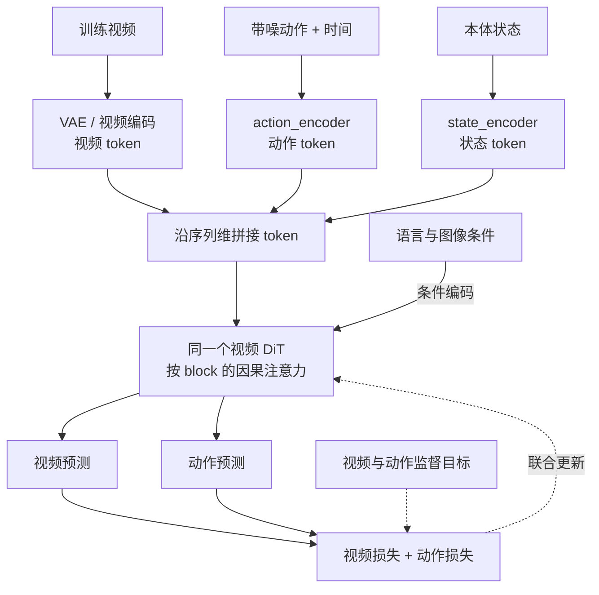

**源码节选（E1）**：[定位 dreamzero/groot/vla/model/dreamzero/modules/wan_video_dit_action_casual_chunk.py](</Users/xerxes3/Documents/huawei实习/vla_wam_framework_src/dreamzero/groot/vla/model/dreamzero/modules/wan_video_dit_action_casual_chunk.py:2059>)，原文件第 2059–2064 行。中文注释为本文补充，省略位置已标明。

```python
# 先把动作编码为与视频 token 兼容的特征。
action_features = self.action_encoder(action, timestep_action, embodiment_id)
action_length = action_features.shape[1]
# state 是机器人的本体状态，也编码为 token。
state_features = self.state_encoder(state, embodiment_id)
# 把动作和状态合在一起。
action_register = torch.cat([action_features, state_features], dim=1)
action_register_length = action_register.shape[1]
# x 原本是视频 token；拼接后交给同一个 DiT 联合处理。
x = torch.cat([x, action_register], dim=1)
```


最关键的是最后一行：`x` 原先承载视频 token，`torch.cat` 沿序列维加入动作和状态 token。它们随后进入同一模型，通过注意力交换信息。`action_register` 在这里是一组附加 token，不是硬件寄存器。

**拼接不代表可以任意读取未来。** 实现还有按视频/动作 block 组织的因果 mask，规定各块能看哪些条件。单看这六行能确认融合方式，完整的信息可见性仍要结合 attention mask。（E1：同文件第 307–553 行）

### 10.2 后训练仍主要是监督目标

训练损失包含视频 flow 预测误差与带 mask 的动作误差。示范视频和动作就是监督信号，没有因为模型叫 WAM 就变成 RL。（E1：`wan_flow_matching_action_tf.py:784`）

训练链使用 Hydra、Trainer 与 DeepSpeed。发布配置提供 LoRA 路径，并训练动作/状态相关模块；“只微调一部分参数”仍然需要做前向与相应反向计算，不能把 LoRA 理解为无需大模型计算。（E1/E2/E3）

原资料报告了少量新本体 play 数据的适配案例，这属于论文/文档实验结果（E3），不是任意机器人只要采集同样时长就能成功的保证。脚本中的短 `max_steps` 也应与正式训练配方区分。

### 10.3 为什么不能把动作频率直接叫“闭环频率”

发布的评测协议说明：一次返回多个动作，客户端执行完这组动作后再查询。它在 chunk 之间反馈观测，但 chunk 内不会每一步都重新请求策略。（E3：仓库协议说明，`eval_utils/policy_server.py:52`）

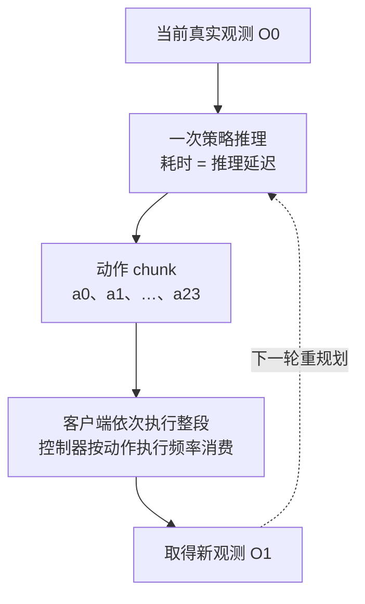

因此，不能把“每秒执行几步动作”直接写成“每秒闭环决策几次”。文档示例中 24 步按 5Hz 执行约需 4.8 秒；这说明动作窗口的时长，尚未包含如何与推理重叠等部署细节。（E3）

### 10.4 开源与复现边界

本地仓库包含模型、训练入口与推理服务，README 另链接数据和权重。这比只有模型定义更完整，但“有代码”与“默认脚本能复现论文结果”仍应分开。原审查还记录了默认训练步数偏短、README 参数表与实际配置不一致等问题，正式复现应以锁定配置为准。（E1/E2/E3）

## 11. FastWAM：训练学视频，部署可以只看首帧

### 11.1 关键不只是加速，而是训练时就准备两种条件

FastWAM 使用视频专家与动作专家，通过 MoT 交换信息。其双模式实现让一部分样本中的动作分支读取完整条件视频，另一部分只读取首帧条件。（E1）

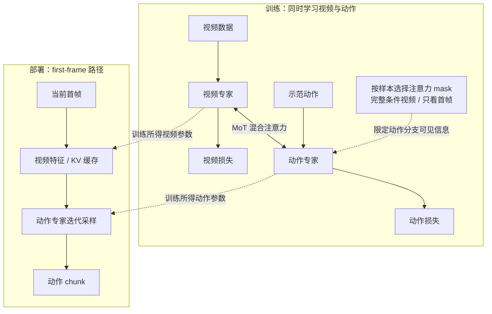

**源码节选（E1）**：[定位 FastWAM/src/fastwam/models/wan22/fastwam_optional_idm.py](</Users/xerxes3/Documents/huawei实习/vla_wam_framework_src/FastWAM/src/fastwam/models/wan22/fastwam_optional_idm.py:47>)，原文件第 47–57 行。中文注释为本文补充，省略位置已标明。

```python
# 复制完整条件的注意力掩码，准备构造“只看首帧”的版本。
first_frame_cond_mask = full_cond_mask.clone()
# 先禁止动作 token 读取整段条件视频。
first_frame_cond_mask[cond_end:, noisy_end:cond_end] = False
# 再只开放首帧所在的 token 区间。
first_frame_cond_mask[
    cond_end:,
    noisy_end : noisy_end + first_frame_tokens,
] = True

# 按样本随机选择完整视频条件或首帧条件。
use_idm_mask = (
    torch.rand((batch_size, 1, 1, 1), device=device) < self.action_idm_prob
)
# 同一个模型在训练中同时接触两种条件。
return torch.where(use_idm_mask, full_cond_mask, first_frame_cond_mask)
```


`False` 先关闭整段条件视频的可见性，随后 `True` 只开放首帧。`torch.where` 再按样本选择掩码。这使部署时的 first-frame 模式不是临时删掉未来输入：**训练阶段已经出现过这种信息受限的条件。**

这段代码证明两种条件如何混训；它本身不能证明效果不下降。性能与泛化收益仍来自论文的对照实验（E3），需要与实现机制分开陈述。

### 11.2 为什么 first-frame 模式更快

它减少视频侧重复计算，复用首帧特征/KV，让动作专家进行后续采样，并省去完整未来视频的 VAE 解码。发布实现还有 `torch.compile` 与 CUDA Graph 相关优化。（E1：`mot.py:474`、`fastwam.py:1100`）

原 README 报告约 110ms@RTX4090、210ms@H20（E3）。这些是特定设置下的数字；移到 NPU 时，“减少重复计算”的设计可以借鉴，CUDA Graph 等机制则需要寻找对应实现，不能直接宣称可移植。

### 11.3 与 DreamZero 的差别

| 比较项 | DreamZero | FastWAM |
|---|---|---|
| 视频与动作如何结合 | 同一 DiT 中拼接 token | 视频/动作专家混合注意力 |
| 本文重点部署路径 | 联合生成视频与动作 | first-frame 条件生成动作 |
| 时间组织 | 按 block 的因果结构 | 单窗口推理 |
| 阅读启示 | 理解联合建模与 chunk 时序 | 区分共同训练和部署计算 |

证据：模型路径 E1；为何有利于选型属于 E3 推断。不要用不同硬件下的延迟数字替代同条件评测。

## 12. openpi：用几行代码理解 flow matching SFT

### 12.1 训练的不是直接动作误差，而是速度误差

先把示范动作与噪声混合，得到中间状态 `x_t`。模型根据图像、指令和这个中间状态预测速度；训练目标要求预测速度接近构造出的目标速度。（E1）

**源码节选（E1）**：[定位 openpi/src/openpi/models/pi0.py](</Users/xerxes3/Documents/huawei实习/vla_wam_framework_src/openpi/src/openpi/models/pi0.py:196>)，原文件第 196–200、212–214 行。中文注释为本文补充，省略位置已标明。

```python
# 生成与示范动作同形状的高斯噪声。
noise = jax.random.normal(noise_rng, actions.shape)
time = jax.random.beta(time_rng, 1.5, 1, batch_shape) * 0.999 + 0.001
time_expanded = time[..., None, None]
# t 接近 1 时更像噪声，接近 0 时更像示范动作。
x_t = time_expanded * noise + (1 - time_expanded) * actions
# 监督目标是从动作指向噪声的速度；推理沿反方向积分。
u_t = noise - actions
# … 省略中间代码 …
# 将动作专家输出投影为预测速度。
v_t = self.action_out_proj(suffix_out[:, -self.action_horizon :])

# 速度预测与目标速度做均方误差，而不是用环境 reward。
return jnp.mean(jnp.square(v_t - u_t), axis=-1)
```


可以用一个动作维度理解：假设示范值为 `0.2`，噪声值为 `1.0`，当 `t=0.5` 时，`x_t=0.6`，目标速度 `u_t=0.8`。这是该插值方向上的速度，不是“机器人要以 0.8 的速度移动”。推理从噪声端向数据端积分，时间方向递减，逐步得到动作。（E3：按代码构造的数值示例）

因此，模型输出的**生成速度场**与机器人最终执行的**物理速度/位姿动作**是两个概念。最终动作还需按模型的数据规范反归一化和解码。

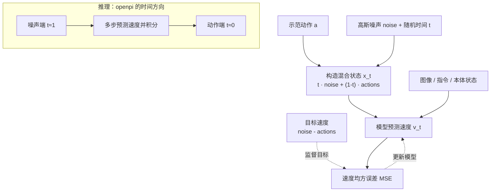

### 12.2 模型和训练入口怎样组织

π0 将视觉语言前缀与动作后缀放入双专家注意力结构。推理可以缓存相对固定的前缀，只对随采样变化的动作部分重复计算；π0-FAST 则使用离散动作 token 和自回归解码，不能把两者的概率计算方式混用。（E1：`gemma.py:201`、`pi0.py:216`、`pi0_fast.py`）

JAX 与 PyTorch 的训练、分布式和数据支持范围不同。动作归一化统计又是 checkpoint 配套资产的一部分：同一个归一化动作值，在不同统计下可能对应不同物理动作。因此，换框架时不能只搬模型权重，还要核对数据字段、动作定义和 normalization stats。（E1/E2/E3）

### 12.3 为什么这里还不是 RL

节选中的标签来自示范动作，损失是速度 MSE；没有环境回报、advantage 或策略概率比。原静态审查未发现完整 RL 训练入口，所以应将本地 openpi 视为本文的 **SFT 实现样本**，不把 PI 的全部研究方法算作该仓库功能。（E1/E3）

## 13. Isaac-GR00T N1.7：相同原理，不同接口与时间方向

### 13.1 flow matching 的时间约定恰好反过来

**源码节选（E1）**：[定位 Isaac-GR00T/gr00t/model/gr00t_n1d7/gr00t_n1d7.py](</Users/xerxes3/Documents/huawei实习/vla_wam_framework_src/Isaac-GR00T/gr00t/model/gr00t_n1d7/gr00t_n1d7.py:229>)，原文件第 229–235 行。中文注释为本文补充，省略位置已标明。

```python
# actions 来自数据集中的示范动作。
actions = action_input.action
noise = torch.randn(actions.shape, device=actions.device, dtype=actions.dtype)
# 为每个样本抽一个噪声混合位置。
t = self.sample_time(actions.shape[0], device=actions.device, dtype=actions.dtype)
t = t[:, None, None]  # shape (B,1,1) for broadcast

# 这里 t=0 是噪声、t=1 是数据，与 openpi 的约定相反。
noisy_trajectory = (1 - t) * noise + t * actions
# 目标速度也相应反向：从噪声指向动作。
velocity = actions - noise
```


openpi 写成 `x_t = t·noise + (1-t)·actions`，GR00T 写成 `x_t = (1-t)·noise + t·actions`。两者都是线性混合，只是把时间轴两端交换了，所以目标速度的符号也随之交换。（E1/E3）

| 约定 | t=0 | t=1 | 目标速度 |
|---|---|---|---|
| openpi | 动作 | 噪声 | `noise - actions` |
| GR00T N1.7 | 噪声 | 动作 | `actions - noise` |

这不是谁对谁错。迁移动作头时，如果只复制采样公式，却保留另一套时间条件与积分方向，就可能出现能运行但训练目标错位的问题。（E3：工程推断）

### 13.2 视觉语言骨干与动作头分工

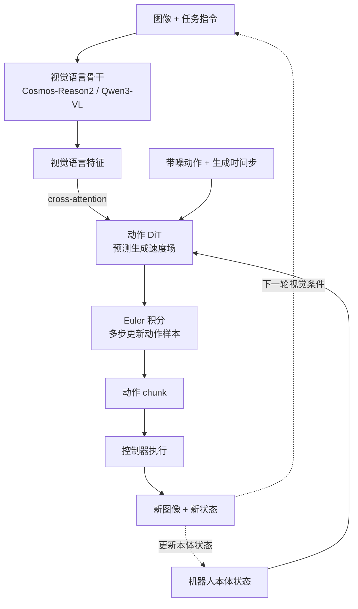

N1.7 的动作 DiT 读取骨干特征，而不是像 DreamZero 一样把所有内容都放进同一视频 DiT。发布实现使用少量 Euler 步，并支持利用上一段动作约束重叠区间的 RTC 机制，以衔接连续控制。（E1：`gr00t_n1d7.py:358–435`；图为 E3 整理）

### 13.3 微调选项和 RL 边界

配置提供骨干、视觉、projector、动作模型等可训练开关，原审查未找到接入 LoRA 的微调路径。因此，依赖列表出现 `peft` 不能单独作为“支持 LoRA”的证据。（E1/E2）

数据侧还包含多数据集采样、动作字段映射和归一化；部署侧有导出与服务工具。它们使训练部署链更完整，但并不自动构成 RL trainer。需要 GR00T 的 RL 后训练时，应继续看 RLinf 等框架对动作概率、轨迹和奖励的适配。（E1/E3）

## 14. 两个 VLA-RL 例子：环境奖励与世界模型奖励

### 14.1 SimpleVLA-RL：先看最直观的任务成功信号

该实现将环境完成标记转成二元奖励，并把它放在轨迹末尾的有效位置。模型必须通过整段动作完成任务，但奖励本身很简单。（E1）

**源码节选（E1）**：[定位 SimpleVLA-RL/verl/trainer/main_ppo.py](</Users/xerxes3/Documents/huawei实习/vla_wam_framework_src/SimpleVLA-RL/verl/trainer/main_ppo.py:38>)，原文件第 38–42 行。中文注释为本文补充，省略位置已标明。

```python
def verify(self, data):
    # complete 是环境给出的任务完成标记。
    completes = data.batch['complete'].tolist()
    batch_size = data.batch['responses'].size(0)
    assert len(completes) == batch_size
    # 成功变成 1.0，失败变成 0.0；奖励不需要大模型打分。
    score = [float(item) for item in completes]
```


`complete` 是任务环境给出的结果，`score` 就是一组 0/1。奖励函数不需要理解每一帧“做得像不像专家”。后续算法负责把结果转换成 advantage，用来调整采样动作的概率。

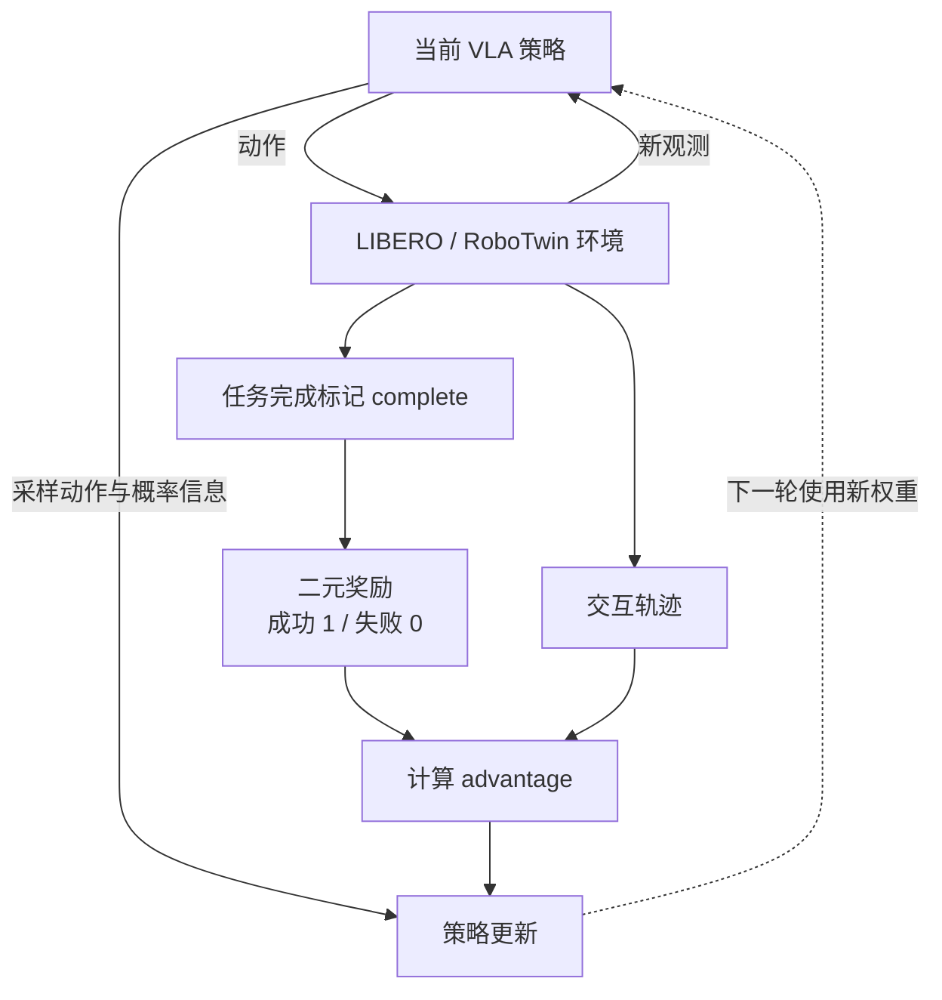

该仓直接包含修改过的 verl 源码，复现要注意实际 import 的是仓内版本。rollout 使用 HF forward 采样，说明这条算法路径不强制依赖 vLLM；但 NPU 上还需验证 FSDP、算子和环境接口，不能据此说“换成 NPU 就能跑”。（E1/E3）

原实现还有动态补采与组内成功率过滤。直观上，这是避免一批全成功或全失败的样本缺少区分信号；非对称 clipping、温度等也属于其具体配方，而非所有 VLA-RL 的固定要求。（E1/E3）

**动作词表的 64 位问题：原稿的结论需要撤回。** 原稿只比较 `[-320:-64]` 与 `+31744`，认定偏移了 64 位，却遗漏了有效词表大小的定义：

**源码节选（E1）**：[定位 SimpleVLA-RL/verl/utils/vla_utils/openvla_oft/modeling_prismatic.py](</Users/xerxes3/Documents/huawei实习/vla_wam_framework_src/SimpleVLA-RL/verl/utils/vla_utils/openvla_oft/modeling_prismatic.py:1367>)，原文件第 1367–1367、1730–1736 行。中文注释为本文补充，省略位置已标明。

```python
# 动作解码使用的是扣除词表填充后的有效词表大小。
self.vocab_size = self.config.text_config.vocab_size - self.config.pad_to_multiple_of
# … 省略中间代码 …
# logits 的末尾 64 位被跳过，再取 256 个动作候选。
action_logits_last256 = action_logits[..., -256-64:-64]
scaled_logits = action_logits_last256 / temperature
probs = torch.softmax(scaled_logits, dim=-1)
assert probs.shape[-1] == 256
probs_flat = probs.reshape(-1, probs.shape[-1])
# 按概率随机抽一个候选，而不是总取最大值。
sampled_indices_flat = torch.multinomial(probs_flat, num_samples=1)
# 把候选区间内的相对下标，映射回有效词表的 token id。
original_ids_flat = sampled_indices_flat + (self.vocab_size - 256)
```


设 logits 总长度为 `L`，词表填充为 `p=64`。代码定义有效词表大小为 `L-p` 时，切片起点是 `L-320`，映射起点是 `(L-64)-256`，两者相等。因此，**不能仅凭这两行认定存在 64 位偏移**。（E1/E3：源码与代数核对）

复现时应检查 checkpoint 的实际 logits 长度、`text_config.vocab_size` 和 `pad_to_multiple_of` 是否满足上述关系。这里把原稿的“已发现偏移”修正为“需要核对维度约定”，并未声称本次已运行 checkpoint 验证。

### 14.2 VLA-RFT：用想象结果与参考轨迹的差异作奖励

VLA-RFT 先让策略生成动作，再用冻结的世界模型预测结果，与参考视频比较。原稿笼统称其为“世界模型环境闭环”，但所审查路径没有把生成像素逐步回传给策略，应画出这个边界。（E1/E3）

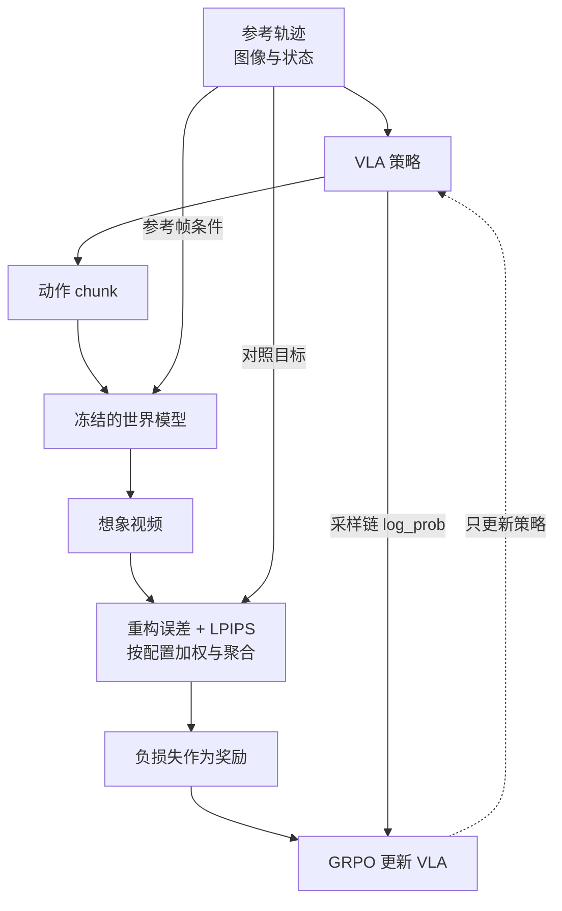

这里“可验证奖励”指可自动计算的比较信号，不代表物理正确性已获验证。即使想象视频更像参考视频，也仍要检查真实环境任务是否成功。（E3：奖励语义）

**连续动作如何得到用于 RL 更新的概率？** 代码对去噪链的每一步建立高斯转移：

**源码节选（E1）**：[定位 VLA-RFT/train/verl/verl/workers/actor/dp_actor.py](</Users/xerxes3/Documents/huawei实习/vla_wam_framework_src/VLA-RFT/train/verl/verl/workers/actor/dp_actor.py:170>)，原文件第 170–178 行。中文注释为本文补充，省略位置已标明。

```python
# flow 给出去噪方向，dt 是积分步长，得到下一步均值。
mean_next = x_k + dt * flow

# per-dim logp
# 为该步构造高斯分布，std 决定探索噪声的幅度。
dist = torch.distributions.Normal(
    mean_next.to(torch.float32),
    std.to(torch.float32).clamp_min(1e-6)
)
# 计算已采样的下一状态 x_k1 在当前分布下的 log_prob。
step_logp = dist.log_prob(x_k1.to(torch.float32))  # (B, chunk_len, action_dim)
# 累加的是去噪链各步的条件 log_prob。
logp_per_dim += step_logp
```


`mean_next` 是沿 flow 前进一步得到的均值，`std` 决定该步随机性。训练时读取采样保存的 `x_k1`，重算它在当前策略下的 log_prob，再沿链累加。这些概率参与 RL 更新，不是视频相似度奖励本身。

把两部分分开就容易理解：**世界模型回答“这组动作的结果值得多少分”；策略采样链回答“当前策略有多倾向于产生这条采样路径”。** 两者通过 RL 损失连接。（E1/E3）

原稿写死 `-(MAE+LPIPS)` 也过于简化：实现支持按配置选择重构误差，设置权重，并采用均值、末帧或折扣聚合；最终取负损失作为奖励。（E1：`ray_trainer.py:1334–1398`）

**复现的主要阻碍是资产边界。** 原调研记录世界模型权重未发布、其训练代码不在本仓；仅有策略训练代码，仍不足以完整复现。当前世界模型生成路径还依赖 vLLM 的增量 token 生成，更换后端属于额外工程工作。（E1/E3）

### 14.3 对照着看两条路线

| 问题 | SimpleVLA-RL | VLA-RFT |
|---|---|---|
| 谁预测动作后果？ | 仿真器推进物理状态并渲染 | 学习得到的世界模型 |
| 奖励是什么？ | 任务成功 0/1 | 想象结果与参考视频的距离取负 |
| 新观测回到策略吗？ | 环境观测随交互回流 | 本文审查路径不回流生成像素 |
| 概率从哪里来？ | 离散动作 token 分布 | 随机去噪链的高斯转移 |
| 优先检查什么？ | 动作解码、环境与采样一致性 | 世界模型资产、误差与奖励可靠性 |

证据：实现差异 E1，检查优先级 E3。

## 15. GR00T-Dreams：把视频加工成 SFT 数据

### 15.1 IDM 做的是反推动作

IDM（Inverse Dynamics Model）输入观测变化，输出可能导致这种变化的动作。例如从夹爪移动前后的图像，估计这一段的动作标签。它和策略的方向不同：策略根据当前条件决定未来动作，IDM 利用观测序列来推断动作。（E3：定义；本仓实现 E1）

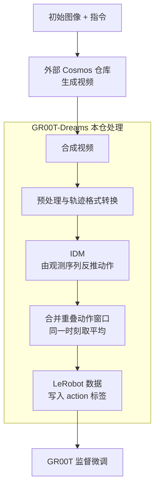

更准确的开源描述是**管线跨多个仓库，依赖外部模型与权重**。视频生成阶段外链 Cosmos，不等于它闭源；但 GR00T-Dreams 本仓也不能称为无需外部依赖的全流程实现。原稿“全开源”和“半开源”的二选一表述都不足以说明复现边界。（E1/E3）

### 15.2 为什么动作预测要合并

**源码节选（E1）**：[定位 GR00T-Dreams/IDM_dump/dump_idm_actions.py](</Users/xerxes3/Documents/huawei实习/vla_wam_framework_src/GR00T-Dreams/IDM_dump/dump_idm_actions.py:288>)，原文件第 288–292 行。中文注释为本文补充，省略位置已标明。

```python
# 同一时刻可能被多个重叠动作窗口预测。
for s in action_dict:
    # 把这些预测平均，得到该时刻的一条动作标签。
    mean_action = np.mean(action_dict[s], axis=0)
    # 将标签写入轨迹的 action 列。
    traj_data.at[s, "action"] = mean_action

# 保存带动作标签的数据，交给下游 SFT。
save_trajectory_data(traj_data, dataset, tid, output_dir)
```


IDM 滑动预测多个 action chunk，同一个时刻可能落在几个窗口里。`action_dict[s]` 收集这些重复预测，取平均后写入一条标签。这样得到下游可以直接读取的逐时刻动作列。

**平均只能合并预测，不能证明动作正确。** 如果模型反推错了，多窗口平均也无法把它变成真实专家标签。因此，后续仍要评估合成数据训练出的策略表现。（E3）

### 15.3 数据和设备方面的边界

原审查记录，合成数据里的 state 可能以零占位，不能把它当成真实本体感知；部分推理代码还硬编码 `.cuda()`。迁移时要同时检查数据语义和设备调用，不能只把输出存成 LeRobot 格式就认为数据已合格。（E1/E3：`IDM_dump/dump_idm_actions.py:457` 及数据处理路径）

---

# 第三部分：对本工作区意味着什么

## 16. 昇腾上的验证顺序与可借鉴设计

### 16.1 先跑通一个具体闭环

以下是依据静态证据提出的验证顺序（E3），不是已完成的 NPU 实验：

1. **选已有 Ascend CI 配置的模型/任务组合。** 优先核对 RLinf 的 OpenVLA-OFT + LIBERO 入口，锁定其代码、模型资产和依赖版本。
2. **先核对单次动作。** 从图像和状态出发，检查动作维度、反归一化、token 映射、数值范围以及有限值。
3. **再跑短轨迹和一次更新。** 确认观测回流、任务结束、奖励、log_prob、梯度和权重同步都能衔接。
4. **最后优化吞吐。** 在闭环正确后，再比较多环境、通信、分片、缓存与推理后端。

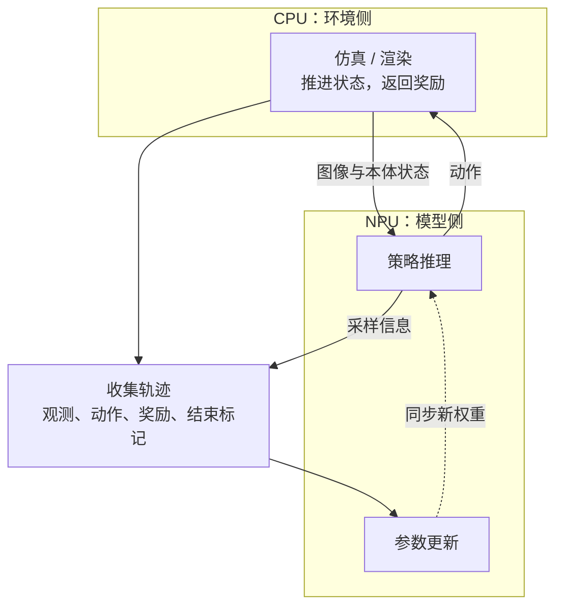

这与工作区 A 路线的职责划分相近；B 路线的物理仿真迁移仍以专门报告为准，本文不重复其算子与工程拆分。

### 16.2 三个值得借鉴的实现点

| 来源 | 借鉴什么 | 不应直接推出什么 |
|---|---|---|
| verl | 用平台接口集中处理设备差异 | 不能由此推出任意机器人模型已经支持 NPU |
| RLinf | 环境、推理、训练分工；Channel 传递数据 | 不能把论文加速比直接用于本工作区 |
| FastWAM / openpi | 缓存固定条件，减少动作采样时的重复计算 | CUDA 专用优化仍需要后端实现 |

这些是设计建议（E3），其实现依据在相应源码章节（E1）。

### 16.3 生态跟踪与 SONIC 的关系

dexbotic 的 gr00tsonic 集成是原调研记录的后续线索，但尚未进行本地源码解析；可先确认它究竟包装了哪些训练/推理接口，再讨论与本工作区的复用关系。（E3）

GR00T N2 的发布计划、实时榜单、外部硬件后端进展都保留为跟踪项。其他硬件的 Warp 后端报道可以提供设计线索，**不能替代昇腾版本的工程与性能证明**。（E3/E4）

## 17. 尚未解决的问题与本次修订边界

### 17.1 后续复核清单

| 问题 | 目前掌握什么 | 还缺什么 |
|---|---|---|
| RLinf Ascend 具身链是否稳定 | 有源码与 CI 配置 | 对应提交的 CI 结果、硬件实跑和长训练记录 |
| SimpleVLA-RL 动作 token 是否对齐 | padding 可解释原稿所谓 64 位偏移 | 具体 checkpoint 的 logits/config/解码联查 |
| VLA-RFT 能否完整复现 | 策略更新与奖励代码可读 | 世界模型资产与完整复现配方 |
| GR00T N2 / Dream Gym 的公开范围 | 原调研的发布计划或 README 线索 | 实际发布物及当前状态 |
| 生态覆盖是否完整 | 已审查十仓，另有网络清单 | LeRobot、dexbotic、vjepa2、cosmos-framework 等深入审查 |

### 17.2 本次修订做了哪些实质调整

除了重写结构和解释，本次收紧了五处会影响理解的表述：

- action chunk 的预测长度不等于执行长度，也不等于重规划间隔。
- RLinf 已有 Ascend 具身 CI 配置，“端到端完全空白”改为“特定组合已有入口，覆盖与结果待验证”。
- SimpleVLA-RL 的 64 位偏移不再作为已证实缺陷；补上词表 padding 的解释。
- flow ODE 不直接提供常用概率接口，不等于不存在概率密度；链上 log_prob 与最终动作边际密度需区分。
- GR00T-Dreams 用跨仓库依赖描述公开范围，避免“外链就等于闭源”；VLA-RFT 奖励也改为按配置解释。

正文新增代码片段已与本地快照核对。原稿其余网络清单属于历史资料索引，不能据此作实时排名、完整性声明或立项承诺。

---

## 附录 A：克隆清单与 commit 溯源

**表 A1：各仓库 HEAD（2026-09-08 克隆时点）**

| 仓库 | commit | 解析重点 |
|---|---|---|
| verl | `0d3f56a`（2026-09-08，v0.10.0.dev） | RL 后训练架构 + Ascend 适配 |
| verl-vla | `6ddf611`（2026-09-01，钉 verl==0.7.1） | VLA 专用 SFT/RL/HITL |
| RLinf | `1c9eed0`（2026-09-07） | 具身 RL infra + GR00T recipe + Ascend 成熟度 |
| dreamzero | `ab790c1`（2026-04-19） | WAM 旗舰模型/训练/推理 |
| FastWAM | `7faa711`（2026-08-20） | 表征派 WAM 双模式 |
| openpi | `215abfb`（2026-08-25） | π0/π0-FAST/π0.5 SFT 栈 |
| Isaac-GR00T | `51d4c89`（2026-08-20） | N1.7 模型/微调/部署 |
| SimpleVLA-RL | `7c51662`（2026-01-06） | veRL-based VLA PPO |
| VLA-RFT | `376693e`（2025-10-06） | 世界模型 RLVR |
| GR00T-Dreams | `ec3881d`（2025-10-23） | DreamGen 数据引擎 |

十个本地仓库 HEAD 已在本次编辑中逐一核对，与表中短 commit 一致。源码位于 `vla_wam_framework_src/`；本次仅修改报告。

## 附录 B：术语速查（按首字母）

| 术语 | 解释 |
|---|---|
| BC / SFT | 行为克隆 / 监督微调；本文中均以示范为主要学习信号 |
| DiT | Diffusion Transformer；可用于扩散或 flow 的预测网络，名称不等于具体训练目标 |
| LoRA | 冻结大部分原权重，训练低秩增量参数的微调方式 |
| HF | Hugging Face；本文 HF rollout 指直接调用相关模型执行推理的路径 |
| KV cache | 缓存注意力中的 Key/Value，避免重复编码已有条件 |
| PPO / GRPO | 近端策略优化 / 组相对策略优化；见 §3.2 |
| 1F1B | one-forward-one-backward，流水线前后向交替调度 |
| adaRMS | 按条件（如去噪时间步）调制的 RMSNorm（π0.5 使用） |
| CANN / HCCL / GLOO | 昇腾算子驱动栈 / 华为集合通信库 / PyTorch 的 CPU 通信后端——本文所指 GLOO 回退限于被审查的通信路径，不能外推全部 NPU 通信 |
| CFG | classifier-free guidance，条件生成技巧，需双倍前向；省略即提速 |
| Dr.GRPO / DAPO / GSPO / SAPO / CISPO | 相关策略优化变体；实现目标与约束不同，不能只按名称互换 |
| EEF | end-effector，末端执行器 |
| FSDP | PyTorch 全分片数据并行（参数/梯度/优化器态切卡） |
| GAE | 广义优势估计（advantage 计算） |
| IDM | Inverse Dynamics Model，由观测序列反推动作 |
| LPIPS | 学习型感知相似度（图像距离度量） |
| MoT | Mixture of Transformers，多专家逐层混合注意力结构 |
| RLPD / SAC / TD3+BC | 在线 RL 混离线数据池 / Soft Actor-Critic / TD3 加行为克隆正则 |
| RTC | GR00T 系的滑窗动作 inpainting 机制（real-time control：重规划时约束上一 chunk 的重叠动作段） |
| ZeRO-2 | DeepSpeed 显存切分等级 2（含 offload 变体为优化器卸载到 CPU） |

## 附录 C：主要网络来源

GitHub/Gitee API（2026-09-08 实测）、各仓库 README、[NVIDIA WAM 博客](https://developer.nvidia.com/blog/pretrained-to-imagine-fine-tuned-to-act-the-rise-of-world-action-models/)、[NVIDIA GTC 2026 新闻稿](http://nvidianews.nvidia.com/news/nvidia-and-global-robotics-leaders-take-physical-ai-to-the-real-world)、[复旦 WAM 综述](https://arxiv.org/abs/2605.12090)、[NUS WAM 综述](https://arxiv.org/abs/2606.20781)、[DreamZero 论文](https://arxiv.org/abs/2602.15922)、[Fast-WAM 论文](https://arxiv.org/abs/2603.16666)、[World-Gymnast 论文](https://arxiv.org/abs/2602.02454)、[π\*0.6 RECAP 论文](https://arxiv.org/abs/2511.14759)、[RLinf 论文](https://arxiv.org/abs/2509.15965)、[veRL Ascend 文档](https://verl.readthedocs.io/en/latest/ascend_tutorial/en/)、[ms-swift NPU 文档](https://github.com/modelscope/ms-swift/blob/main/docs/source/BestPractices/NPU-support.md)、[ROLL Ascend 指南](https://alibaba.github.io/ROLL/docs/User%20Guides/Hardware%20Support/ascend_usage)、[RLinf Ascend CANN 指南](https://rlinf.readthedocs.io/en/latest/rst_source/guides/ascend_cann.html)、[赵行智源大会演讲](https://www.aibangbots.com/a/10195)、[摩尔线程 MT Lambda 报道](https://www.qbitai.com/2026/05/420084.html)、[Genie 3 博客](https://deepmind.google/blog/genie-3-a-new-frontier-for-world-models/)、[Awesome-WAM](https://github.com/OpenMOSS/Awesome-WAM)、[awesome-embodied-vla-va-vln](https://github.com/jonyzhang2023/awesome-embodied-vla-va-vln) 等（正文已内联）。


## 附录 D：扩展项目索引（沿用原调研快照）

以下用于找到进一步阅读的入口，不作为当前功能承诺。未在 §8–§15 展开的项目，本次没有重新做源码审查；分类与简介按 E3 历史资料理解。星数与短期榜单已从扩展索引中省去。

### D.1 模型与专用工具

| 项目 | 在全景中的位置 |
|---|---|
| [OpenVLA](https://github.com/openvla/openvla) / [OpenVLA-OFT](https://github.com/moojink/openvla-oft) | 常见 VLA-RL 基础策略与微调配方 |
| [dexbotic](https://github.com/dexmal/dexbotic) | 多模型训练/推理工具箱；SONIC 集成待深入核对 |
| [starVLA](https://github.com/starVLA/starVLA) | 模块化 VLA 训练代码 |
| [Psi0](https://github.com/physical-superintelligence-lab/Psi0) | 人形 loco-manipulation；不是 PI 官方 π 系仓库 |
| [RDT-1B](https://github.com/thu-ml/RoboticsDiffusionTransformer) / [RDT2](https://github.com/thu-ml/RDT2) | 机器人动作生成模型 |
| [AgiBot-World](https://github.com/OpenDriveLab/AgiBot-World) | 数据与模型生态 |
| [Qwen-VLA](https://github.com/QwenLM/Qwen-VLA) | VLA 模型族入口 |
| [HY-Embodied](https://github.com/Tencent-Hunyuan/HY-Embodied) | 具身模型生态 |
| [spirit-v1.5](https://github.com/Spirit-AI-Team/spirit-v1.5) | 策略模型；原稿引用的榜单宣传仍待核验 |
| [GalaxeaVLA](https://github.com/OpenGalaxea/GalaxeaVLA) | G0.5 等策略入口 |
| [unifolm-vla](https://github.com/unitreerobotics/unifolm-vla) | 宇树 VLA 路线 |
| [wall-x](https://github.com/X-Square-Robot/wall-x) | WALL 系模型入口 |
| [RoboBrain2.5](https://github.com/FlagOpen/RoboBrain2.5) | 具身视觉语言“大脑”；不能直接视为端到端动作策略 |
| [every-embodied](https://github.com/datawhalechina/every-embodied) | 中文学习资料 |

### D.2 RL 研究与通用训练框架

| 项目 | 用途线索 |
|---|---|
| [VLA-RL](https://github.com/GuanxingLu/vlarl) / [VLARLKit](https://github.com/VLARLKit/VLARLKit) | VLA-RL 训练实现与工具 |
| [GRAPE](https://github.com/aiming-lab/GRAPE) | 偏好对齐路线 |
| [HIL-SERL](https://github.com/rail-berkeley/hil-serl) | 人参与的真机 RL |
| [QC](https://github.com/ColinQiyangLi/qc) / [TD-MPC2](https://github.com/NicklasHansen/tdmpc2) / [RL-100](https://github.com/Lei-Kun/RL-100) | 真机学习、控制与样本效率 |
| [openpi-RLT](https://github.com/Yyshadow/openpi-RLT) | RLT 社区实现，应与官方发布区分 |
| [ms-swift](https://github.com/modelscope/ms-swift) / [LLaMA-Factory](https://github.com/hiyouga/LlamaFactory) | 通用模型微调，昇腾文档见附录 C |
| [AReaL](https://github.com/areal-project/AReaL) / [ROLL](https://github.com/alibaba/ROLL) | 通用 RL 系统，原调研记录了昇腾路径 |
| [slime](https://github.com/THUDM/slime) / [OpenRLHF](https://github.com/OpenRLHF/OpenRLHF) | 通用 RL 后训练基础设施 |
| [TRL](https://github.com/huggingface/trl) / [NeMo-RL](https://github.com/NVIDIA-NeMo/RL) | 模型后训练工具与分布式训练 |
| [EasyR1](https://github.com/hiyouga/EasyR1) / [SkyRL](https://github.com/NovaSky-AI/SkyRL) / [verl-agent](https://github.com/langfengQ/verl-agent) | 多模态或 agent RL 相关实现 |
| [MindSpeed-RL](https://gitee.com/ascend/MindSpeed-RL) | 昇腾 RL 生态入口；迁址与依赖以实际发布为准 |

### D.3 世界模型与数据引擎

| 项目 | 用途线索 |
|---|---|
| [LingBot-VA](https://github.com/Robbyant/lingbot-va) | 视频与动作联合模型 |
| [RynnVLA-002](https://github.com/alibaba-damo-academy/RynnVLA-002) | 自回归联合建模 |
| [cosmos-framework](https://github.com/NVIDIA/cosmos-framework) | 多模态世界模型训练与策略服务，待源码深读 |
| [Motus](https://github.com/thu-ml/Motus) / [UWM](https://github.com/WEIRDLabUW/unified-world-model) | 隐动作、视频与动作联合建模 |
| [V-JEPA 2](https://github.com/facebookresearch/vjepa2) | 隐空间世界预测；2-AC 动作条件后训练值得跟进 |
| [WMPO](https://github.com/WM-PO/WMPO) | 世界模型辅助策略优化 |
| [Alpamayo recipes](https://github.com/NVlabs/alpamayo-recipes) | 自动驾驶域的工程参考，不能直接当机器人 recipe |
| [DreamDojo](https://github.com/NVIDIA/DreamDojo) | 人类视频与 latent action 世界模型 |
| [GigaWorld-0](https://github.com/open-gigaai/giga-world-0) / [GigaWorld-Policy](https://github.com/open-gigaai/giga-world-policy) | 世界模型、数据与策略路线 |
| [GE-Sim-V2](https://github.com/AgibotTech/GE-Sim-V2) / [Genie-Envisioner](https://github.com/AgibotTech/Genie-Envisioner-V1) | 动作条件视频模拟器等路线 |
| [UnifoLM-WMA](https://github.com/unitreerobotics/unifolm-world-model-action) | 世界模型与动作路线 |
| [FasterWAM](https://github.com/hustvl/FasterWAM) | 与本文 FastWAM 名称相近，但不是同一项目 |

### D.4 仿真与资料入口

| 入口 | 阅读用途 |
|---|---|
| [Isaac Lab](https://github.com/isaac-sim/IsaacLab) / [Isaac Sim](https://github.com/isaac-sim/IsaacSim) | 仿真、机器人任务与训练环境 |
| [MuJoCo](https://github.com/google-deepmind/mujoco) / [MuJoCo-Warp](https://github.com/google-deepmind/mujoco_warp) / [Playground](https://github.com/google-deepmind/mujoco_playground) | 物理仿真及训练环境生态 |
| [Newton](https://github.com/newton-physics/newton) / [Warp](https://github.com/NVIDIA/warp) | 物理求解与 GPU 内核基础 |
| [Genesis](https://github.com/Genesis-Embodied-AI/genesis-world) / [ManiSkill](https://github.com/mani-skill/ManiSkill) | 仿真任务与并行环境 |
| [SimplerEnv](https://github.com/simpler-env/SimplerEnv) | 策略评测环境 |
| [GR00T-WBC](https://github.com/NVlabs/GR00T-WholeBodyControl) | SONIC 上游运动控制栈，与 VLA SFT 区分 |
| [Awesome-RL-VLA](https://github.com/Denghaoyuan123/Awesome-RL-VLA) / [Awesome-VLA-Post-Training](https://github.com/AoqunJin/Awesome-VLA-Post-Training) | 扩展检索起点，不当作实现证据 |

