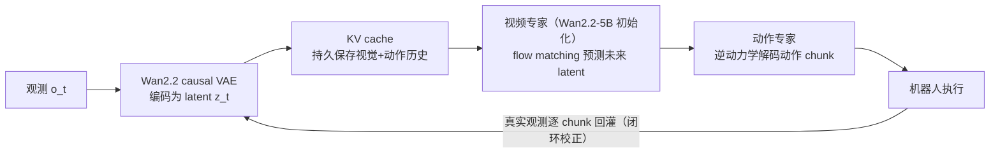
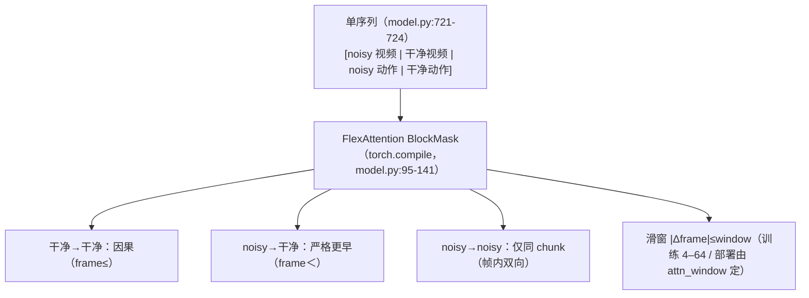

# LingBot-VA 调研：自回归视频-动作世界模型（蚂蚁灵波 Robbyant）

> **版本：v1｜2026-09-14**
> 材料：论文 [arXiv:2601.21998v2](https://arxiv.org/abs/2601.21998)（Causal World Modeling for Robot Control，RSS 2026）+ **开源代码** `Robbyant/lingbot-va` @ `7c6ffa9`（Apache-2.0，本地锚点 `vla_wam_framework_src/LingBot-VA`，2026-09-14 clone）+ 权重/数据集（HF `robbyant/lingbot-va-*`）+ **LingBot-VA 2.0 论文** [arXiv:2607.08639v2](https://arxiv.org/abs/2607.08639)（仓库内 `LingBot_VA2_paper.pdf`，**代码未开源**）+ 媒体发布通稿（E4，仅背景）。
>
> 证据口径沿用 [00_总览](<../../reports/00_总览.md>) §3：E1 源码行号（锁定 commit）、E2 配置实证、E3 文档/论文/官方资料或明确标注的推断、E4 外审转述未复核。与同周 [Motus2 调研](2026-09-14-Motus2调研.md) 互为对照：**LingBot-VA v1 代码+权重全开，本文以源码审计为主；Motus2 无码，此前以直系前代 v1 代码代审**。

## 0. 结论（TL;DR）

1. **身份**：蚂蚁集团具身智能公司**灵波科技（Robbyant）**的"世界-动作模型"（World-Action Model, WAM）。v1 于 2026-01-29 随"灵波开源周"发布（代码+权重+数据全开），论文 RSS 2026；**v2.0 于 2026-07-09 发布**（论文公开，**代码/权重未放**，E3·检索 2026-09-14）。（E3·一手）
2. **内核**：**自回归（AR）扩散**视频-动作世界模型——视频 latent 与动作 token 交错成**单一序列**、严格因果（chunk 间 AR、chunk 内并行去噪）；动作经**逆动力学（IDM）**从预测的视觉转移中解码；KV cache 持久记忆 + 每 chunk 真实观测回灌形成闭环。（E3·一手 + E1）
3. **工程三件套**：① **Noisy History Augmentation**（训练时 50% 概率把历史噪声到 s∈[0.5,1]）→ 推理时视频**半程去噪**（Euler 3 步到 s≈0.6）省掉近一半算力；② **异步推理**（预测与执行并行）；③ **FDM 重锚定**——naive async 会因"幻觉漂移"退化（消融：74.3% vs 92.9%），用当前观测做一次前向动力学想象即可补回。（E1/E3）
4. **数字**：RoboTwin 2.0 **92.9%（Easy）/ 91.6%（Hard）**，50 任务平均，长程（Horizon=3）增益 +8.2/+9.1 最显著；LIBERO 平均 **98.5%**（Long 98.5%）；真机六任务（30–50 demos 微调）SR 全面优于 π0.5。（E3·一手）
5. **代码审计要义（E1）**：**released code = 共享骨干版**——单个 30 层 3072 维 transformer，动作经 `action_embedder` 注入；论文描述的"双流非对称专家（视频 3072 + 动作 768，+350M，总 5.3B）"是**尚未发布的 separated 版本**（README 明说 "stay tuned"）。另有两个部署硬坑：训练必须 `attn_mode="flex"`、推理必须 `"torch"/"flashattn"`（手动改 `transformer/config.json`）；released 评测客户端是**同步**流程，论文的 async/FDM 未包含在其开源评测脚本中。

---

## 1. 身份与谱系

| 项 | 内容 | 证据 |
|---|---|---|
| 团队 | 灵波科技（Robbyant，蚂蚁集团旗下具身智能公司）；通信作者 Yujun Shen、Yinghao Xu | E3·一手 |
| v1 论文 | [arXiv:2601.21998](https://arxiv.org/abs/2601.21998)，v1 2026-01-29 / v2 2026-03-22；**RSS 2026** | E3·一手 |
| v1 发布 | 2026-01-30 官宣开源，系"灵波开源周"四连发收官作（LingBot-Depth/VLA/World/VA） | E4·媒体 |
| v2.0 | [arXiv:2607.08639](https://arxiv.org/abs/2607.08639)（Native Video-Action Pretraining），2026-07 发布；属六模型全家桶（+VLA 2.0/World 2.0/Video/Depth 2.0/Vision） | E3·一手 + E4·媒体 |
| 开源出口 | 代码 [Robbyant/lingbot-va](https://github.com/Robbyant/lingbot-va)（Apache-2.0，1.8k★）；权重 `robbyant/lingbot-va-base`、`-posttrain-robotwin`、`-posttrain-libero-long`；训练数据 `robbyant/robotwin-clean-and-aug-lerobot` | E3·一手（检索） |
| v2.0 开源状态 | **未放码**：GitHub 组织下无 `lingbot-va-v2` 仓库，HF 无 v2 权重；仅论文 PDF 随 v1 仓库分发 | E3·检索 |

与工作区的关系：9/8 调研的 WAM 架构表已列 LingBot-VA（与 DreamZero、Cosmos Policy、Motus 并列）；MotuBrain/Motus 系的对比表也以 LingBot-VA 为最强基线（92.9/91.5）。本文补上其**源码级**与 **v2 论文级**细节。

## 2. 方法拆解

### 2.1 两阶段分解：先预测世界，再由转移解码动作

与"观测→动作"的 VLA 不同，LingBot-VA 把控制写成两个条件分布（论文 §3.1，E3·一手）：

```
Stage 1 视觉动力学（世界模型）: z_{t+1:t+K} ~ p_θ(· | z_≤t, a_<t)
Stage 2 逆动力学（动作解码）  : a_{t:t+K-1} ~ g_ψ(· | ẑ_{t+1:t+K}, z_≤t, a_<t)
```

`z` 为视频 VAE latent，`a` 为投影后与视频 token 同维的动作 token。关键在于**条件里带动作历史**（绝对位姿动作编码本体轨迹），且逆动力学看的是**预测未来**而非当前帧——"先想象，再动手"。



### 2.2 AR 化的三个设计动机（论文 §1/§3.2，E3·一手）

- **反应性（reactivity）**：chunk 式开环生成无法及时纠偏；AR 每步只生成一个 chunk，天然可以吸收最新观测。
- **记忆（memory）**：chunk 间无持久上下文会"失忆"；KV cache 保存完整交互历史（对应其实验中的"计数/搜索"记忆任务）。
- **因果性（causality）**：段内双向注意力违背物理时间箭头；LingBot-VA 全序列严格因果，chunk 内并行去噪。

### 2.3 与 Motus 系的同族对照（E3·解释 + E1）

| 维度 | LingBot-VA v1 | Motus v1 | Motus2 |
|---|---|---|---|
| 视频骨干 | Wan2.2-5B（**因果** VAE + patchify，N=192 token/帧） | Wan2.2-5B | Wan2.2-TI2V-5B |
| 动作-视频融合 | 单序列交错，动作投影回视频维（released：共享骨干） | MoT 三专家（动作→WAN 头空间 + 理解专家） | 单骨干 + action-first 掩码 |
| 时间结构 | **严格因果 AR** + KV cache + 半程去噪 | chunk 单窗、无掩码、无历史 | chunk-AR + 滑动窗/全历史/混合记忆 |
| 自进化 | 无（纯模仿 + 部署期闭环） | 无 | **有（value + DiffusionNFT MBRL + Best-of-N）** |
| 触觉 | 无 | 无 | 有（触觉专家） |
| 开源 | 代码+权重全开 | 代码+权重全开 | 仅 README |

**读法**：LingBot-VA 押注"**时间序列的因果正确性**"（AR+KV cache+异步），Motus2 押注"**决策-学习闭环**"（评估器+RL）。两者都建立在 Wan2.2-5B 视频先验上，代表国内 WAM 的两条路线。

## 3. 代码级解剖（v1 开源代码 @ `7c6ffa9`，E1）

### 3.1 仓库地图

| 路径 | 作用 |
|---|---|
| `wan_va/modules/model.py` | 核心：FlexAttention 掩码、KV cache、30 层 DiT、`forward_train`/`forward` |
| `wan_va/train.py` | 训练回路：双流调度器、noisy history、chunk/窗口采样、loss |
| `wan_va/wan_va_server.py` | 推理服务：`_infer`（视频/动作两段去噪）、`_compute_kv_cache`、VAE 解码 |
| `wan_va/utils/sever_utils.py` | 异步 server（rank0 起 websocket，多卡广播） |
| `wan_va/dataset/lerobot_latent_dataset.py` | LeRobot + 预提取 latent 数据集（`latents/*.pt`） |
| `wan_va/configs/*.py` | robotwin / libero / franka / demo 各本体配置 |
| `evaluation/{robotwin,libero}/` | 评测 server/client（发 websocket 请求） |
| `script/` | `run_launch_va_server_sync.sh`、`run_va_posttrain.sh` |

### 3.2 训练时的一条序列装下"整段历史 + 当前预测"（本仓库最核心的设计）

`forward_train` 把四种 token 拼成**一条**序列（`model.py:721-724`）：

```
[ noisy 视频 | 干净视频 | noisy 动作 | 干净动作 ]
```

配合 `FlexAttnFunc` 构造的块状掩码（`model.py:154-201`），可见性规则为：

| 规则 | 谓词（源码） | 语义 |
|---|---|---|
| 干净→干净 | `noise_id==1 & frame≤` | 历史之间因果可见 |
| noisy→干净 | `noise_id==0→1 & frame<`（**严格早于**） | 去噪中的 token 可看更早历史，**看不到同帧干净版**（防抄答案） |
| noisy→noisy | `noise_id==0 & frame==` | 仅同一 chunk 内互看（chunk 内并行去噪） |
| 滑窗 | `|Δframe| ≤ window` | 注意力窗口，训练随机 4–64（`train.py:246`） |



其他训练细节（E1/E2）：视频与动作各用独立 FlowMatchScheduler（`train.py:138-141`，SNR shift 分别为 5.0 / 1.0 或 0.05）；历史噪声增强 `noisy_cond_prob=0.5`、s∈[0.5,1]（`train.py:192-203`）而动作历史保持干净（`train.py:231-236`）；chunk 大小随机 1–4（`train.py:245`）；序列 padding 到 128 倍数（`model.py:752-757`）。

### 3.3 "MoT" 的真实实现：released 版是共享骨干（重要审计发现）

- 模型配置（`model.py:597-651`）：patch `(1,2,2)`、24 头 ×128 = 3072、**30 层**、FFN 14336、动作维 30、文本维 4096（T5）；`action_embedder: Linear(30→3072)`（`:627`）、`action_proj_out: Linear(3072→30)`（`:649`）、动作侧独立的 `condition_embedder_action`（深拷贝，`:635`）。
- 但注意力只有**一套**：`WanTransformerBlock`（`:468-566`）里 video/action token 在同一 `attn1` 自注意力里处理；所谓双流只体现在**输入/输出投影分离**。
- 论文（E3）描述的是"视频 3072 + 动作 768（4× 窄）、独立 QKV、+350M 参数、总 5.3B"的**双流版**；README（E3）确认"shared backbone 已放，separated 版敬请期待"——**截至 2026-09-14 未发布**。故：论文的参数量/结构不能直接套用到已发布权重上（待核）。

### 3.4 KV cache：槽位式、有界窗口、区分"想象/真值"

`WanAttention`（`model.py:289-465`）实现了产品级 cache：

- 预分配 `[B, total_tolen, H, D]` 的 K/V 槽位（`init_kv_cache:345-364`），容量由 `attn_window` 决定：`(attn_window//2)×latent_token/chunk + (attn_window//2)×action_token/chunk`（`create_empty_cache:661-669`；RoboTwin `attn_window=72`，即 36 个 chunk 的窗口）。
- 满时**按 id 序号淘汰最老槽位**（`allocate_slots:366-385`，FIFO）。
- `update_cache` 语义三分：`0` 临时写入（用完 `restore_cache` 回滚，训练与中间步用）；`1` 写入**预测**（`is_pred=True`）；`2` 写入**真值**（`_compute_kv_cache` 用，`wan_va_server.py:594-602`）。
- `clear_pred_cache`（`:333-338`）在每轮闭环开始前清掉上一轮"想象"的 token——这就是"闭环校正"的落点。

### 3.5 推理服务（`wan_va_server.py`）

`_infer`（`:443-570`）分两段串行去噪：

1. **视频段**：Euler + flow scheduler，`update_cache=1` 仅在最后一步（提交预测 latent 进 cache）；CFG 系数 5（`:513-516`）；`video_exec_step≥0` 可截断去噪步数。
2. **动作段**：以 π 生成的动作 latent 为条件解码动作 chunk，CFG 系数 1（即关闭，`:552-555`）；无效动作通道清零（`:563`）。

配置口径（E2）：RoboTwin 用 `num_inference_steps=25` 视频 / `action_num_inference_steps=50` 动作，LIBERO 为 20/50；论文对外报告的是 **Euler 3 步视频（积分到 s=0.6）+ 10 步动作**，二者不一致（配置是"上限"，论文是收敛后的实测口径，待核）。

**已发布评测客户端是同步流程**（`evaluation/robotwin/eval_polict_client_openpi.py:558-608`）：预测一整段 → 在环境里逐步执行并采集关键帧 → `compute_kv_cache=True` 回灌真值。论文中的异步 + FDM 重锚定管线**未随评测脚本发布**（E3 论文口径 vs E1 代码口径的差异，待核）。

### 3.6 部署工程与已知坑

- 推理显存：单卡 RoboTwin ≈**24GB**（VAE/text_encoder offload），i2va ≈18GB（README，E3）。
- **`attn_mode` 必须手动切换**（README §98-109）：训练用 `"flex"`（掩码必需），推理用 `"torch"/"flashattn"`；读的是权重目录里 `transformer/config.json`，不切换会直接报错。
- 训练按 FSDP 全参分片（`wan_va/distributed/fsdp.py`；README 称 post-train 用 FSDP + LeRobot 格式，E3）。
- 数据管线为"预提取 latent"模式：视频先离线用 Wan2.2 VAE 编码成 `latents/*.pt`（含 `latent_num_frames/height/width`），训练只读 latent（`lerobot_latent_dataset.py:144-246`，E1；README Step 3 明示，E3）——**与 Motus v1 的"光流隐动作预计算"同类做法，但目标是 Wan VAE latent**。

### 3.7 配置矩阵（E2）

| 配置 | attn_window | frame_chunk_size | action_per_frame | 分辨率 | 推理步（视频/动作） | SNR shift（视频/动作） | 有效动作通道 |
|---|---|---|---|---|---|---|---|
| robotwin | 72 | 2 | 16 | 256×320 | 25/50 | 5.0/1.0 | 14/30 |
| libero | 30 | 4 | 4 | 128×128 | 20/50 | 5.0/0.05 | 7/30 |
| franka | 30 | 4 | 20 | 224×320 | 5/10 | 5.0/1.0 | 14/30 |
| demo | 30 | 4 | 8 | 256×256 | 5/10 | 5.0/1.0 | 6/30 |

注：`action_per_frame` 即每视频帧绑定的动作步数（论文 τ=4 的交错设计）；RoboTwin 配置写 16，与该任务 12.5fps 视频 + 50Hz 动作的 τ=4 口径不符（待核）。

## 4. 数据与训练配方（v1，E3·一手）

- **数据**：聚合六源约 **16K 小时**机器人操作数据——Agibot、RoboMind、InternData-A1（仿真）、OXE（OpenVLA 子集）、UMI、RoboCOIN，另含内部采集；90/10 训练/验证。
- **统一动作接口**：双臂各 `7 (EEF pos+quat) + 7 (关节，少于 7 维补零) + 1 (夹爪)` = 15 维，总 **30 维**；逐维 quantile 归一化（配置 `norm_stat`）。
- **预训练**：**1.4T tokens**；AdamW 峰值 lr 1e-4、wd 0.01、cosine + warmup、bf16、grad clip 2.0；文本 dropout 0.1（CFG）；inverse dynamics loss 权重 λ=1；视频与动作 scheduler 独立。
- **后训练**：50 demos 即可部署（3K steps、lr 1e-5；或 1K steps、lr 1e-4 快速版）；RoboTwin 多任务：每任务 50 clean + 500 randomized 演示、50K steps；LIBERO 四套件各 500 demos、4K steps。
- **动作网络初始化**（论文 §3.3）：直接复制视频权重再按 α=√(dv/da) 缩放，训练远稳于随机初始化（消融图 7）。

## 5. 实验与数字（E3·一手）

**RoboTwin 2.0**（50 任务，成功率 %）：

| 方法 | Easy | Hard | 均值 |
|---|---|---|---|
| X-VLA | 72.9 | 72.8 | 72.9 |
| π0 | 65.9 | 58.4 | — |
| π0.5 | 82.7 | 76.8 | 79.8 |
| Motus | 88.7 | 87.0 | 87.9 |
| **LingBot-VA** | **92.9 (+4.2)** | **91.6 (+4.6)** | 92.2 |

分层看：Horizon=1 为 94.18/93.56；Horizon=2 为 90.35/86.95；Horizon=3 为 93.22/93.28——**任务越长增益越大**（+8.2/+9.1 over 次优），支撑其"AR 记忆"叙事。

**LIBERO**（3 seeds × 500 trials）：Spatial 98.5 / Object 99.6 / Goal 97.2 / Long 98.5，**平均 98.5%**。

**真机六任务**（50 trials/task；PS=进度分，SR=成功率；README 表）：

| 方法 | Make Breakfast | Pick Screws | Insert Tube | Unpack Delivery | Fold Clothes | Fold Pants |
|---|---|---|---|---|---|---|
| π0.5 (PS/SR) | 73.0/70.0 | 74.0/50.0 | 79.2/30.0 | 73.0/25.0 | 62.9/30.0 | 30.0/30.0 |
| **LingBot-VA (PS/SR)** | **97.0/75.0** | **82.5/70.0** | **85.8/40.0** | **84.5/65.0** | 48.8/35.0 | **76.7/70.0** |

SR 六项全面领先；PS 除 Fold Clothes（48.8 vs 62.9）外领先（论文正文称两指标全面领先，表中该项不一致，待核）。

**关键消融**（RoboTwin Easy）：FDM 异步 90.4 vs **naive 异步 74.3** vs 同步基线 92.9（异步≈持平但快 2×）；WAN 直接微调仅 80.6（预训练价值）。

**能力画像**：少样本（10 demos 即领先 π0.5；30–50 demos 真机适配）、长程记忆（数数/搜索任务显著优于 π0.5）、新物体/新位置泛化。

## 6. LingBot-VA 2.0：从"改造视频模型"到"具身原生预训练"（论文级，E3·一手）

v2.0 论文明确批评 v1 是"把数字内容生成模型改成因果视频-动作模型"的**改造（retrofit）路线**，指出三大局限（重建 VAE 缺语义、双→因果改造损伤先验、推理太慢），并给出四点原生设计：

1. **Semantic Visual-Action Tokenizer**：ViT 自编码器 + 冻结 Perception Encoder 做语义对齐；另训一个**无动作标签的潜动作 tokenizer**（IDM/FDM 自监督学"转移"）——把世界状态与动作放进同一语义 latent 空间。
2. **Strict Causal Pretraining**：从零开始用因果 DiT 预训练（吃 web 图像/视频），避免"双向→因果"改造的知识遗忘。
3. **Sparse MoE**：视频专家为 MoE-13B-A1.9B（Ne=128 专家、k=8、group-limited top-k、aux-loss-free 均衡，DeepSeekMoE 风格），动作专家保持 dense——扩容不增推理 FLOPs。
4. **Foresight Reasoning + 加速套件**：异步预测/执行 + 用策略自身的前向动力学步重锚定；训练期 **MCP（Multi-Chunk Prediction）** 一次监督多个未来 chunk（+29.7pt @5k steps、2.3× 训练加速）；推理用一致性蒸馏（视频 5 步/动作 10 步 → **各 2 步**）、FP8 TensorRT、paged/ragged KV cache + FlashInfer、运行时开销削减——**927ms → 142ms/chunk，异步频率 35Hz → 225Hz**（K=32 控制步/chunk）。
- 另有：分层 VLM planner（~2Hz 出子任务上下文）、人体视频 in-context 提示（人类演示视频作任务上下文；论文 ICL 实验为每任务 15 条演示的四个已见任务上训，测四个**未见组合任务**且不更新参数）、人类-机器人协同训练（域特有动作头 + 共享专家）。
- **数字**：RoboTwin **93.8/93.4（均值 93.6）** vs v1 92.2 / π0.5 79.8；tokenizer 消融（1.3B 模型）：自研 86.6/83.1 vs Wan2.2 VAE 78.0/76.0；真机四任务（每任务 20 demos）优于 π0.5 与 v1；训练用 Muon+AdamW 混合优化器、FSDP、模态独立 timestep shift。
- **开源状态**：论文公开，**代码/权重未放**（GitHub/HF 检索无 va-v2；Press release 仅说"发布"，E4）。

## 7. 与本工作区的关系（E3·解释，不代表立项意见）

1. **不属 SONIC 主线**：双臂操作 WAM，不涉人形全身控制（WBC）与 MuJoCo/MJWarp 仿真栈；RoboTwin 用 SAPIEN，与 A/B 迁移路线无交集。
2. **对 ① 报告附录 C 的价值（两条）**：①它是"**因果 AR + KV cache + 异步推理**"路线的完整开源样本，可与 Motus 系的"chunk + 掩码 + MBRL"路线对照讨论 WAM 的推理成本结构；②其 v2.0 的**量化/蒸馏/paged KV cache** 优化清单（142ms/chunk、225Hz）是"后训练与部署算力构成"讨论的现成材料——但均基于 GPU/TensorRT 堆栈，昇腾侧只可迁移方法论（E3·推断）。
3. **可直接复现的资产**：代码+权重+数据全开（Apache-2.0），是当前 WAM 调研中**唯一可上手跑通**的大模型（对比 Motus2 仅 README）；若后续要做"WAM 推理性能基准"，它是首选对象。
4. **与 Motus2 的互补性**：两者同用 Wan2.2-5B 系骨干、同为国产团队（蚂蚁 vs 生数），一个开源一个未开；跟踪时可互为参照。

## 8. 待核清单

- [ ] LingBot-VA 2.0 是否/何时放码与权重（GitHub `Robbyant/*`、HF `robbyant/*`）；论文称"peak 225Hz"的硬件口径（GPU 型号）需核。
- [ ] "separated 双流版"（动作 768 维、+350M、总 5.3B）是否发布；released 共享骨干版与论文参数量的对应关系。
- [ ] 论文 async/FDM 管线 vs released 同步评测脚本的差距（源码中未见到 FDM 前向动力学步的独立实现）。
- [ ] RoboTwin 配置 `action_per_frame=16` 与论文 τ=4（12.5fps 视频/50Hz 动作）的口径冲突。
- [ ] README 真机表 Fold Clothes 的 PS 反转（48.8 vs 62.9）与论文"两指标全面领先"的矛盾。
- [ ] v2.0 真机 4 任务的 SR/PS 具体数值（论文 Fig.8 柱状图，文本提取有歧义）。

## 参考（一手）

- v1 论文：[arXiv:2601.21998v2](https://arxiv.org/abs/2601.21998)（Causal World Modeling for Robot Control, RSS 2026）
- v1 代码（E1 锚点）：[Robbyant/lingbot-va](https://github.com/Robbyant/lingbot-va) @ `7c6ffa9`，本地 `vla_wam_framework_src/LingBot-VA`（2026-09-14 clone，Apache-2.0）
- v1 权重/数据：[HF robbyant/lingbot-va-base](https://huggingface.co/robbyant/lingbot-va-base)、`-posttrain-robotwin`、`-posttrain-libero-long`；数据集 [robbyant/robotwin-clean-and-aug-lerobot](https://huggingface.co/datasets/robbyant/robotwin-clean-and-aug-lerobot)
- v2.0 论文：[arXiv:2607.08639v2](https://arxiv.org/abs/2607.08639)（Native Video-Action Pretraining）；仓库内 `LingBot_VA2_paper.pdf`
- 背景媒体（E4）：灵波开源周四连发报道（2026-01-30）、LingBot-VA 2.0 发布通稿（2026-07-10）
