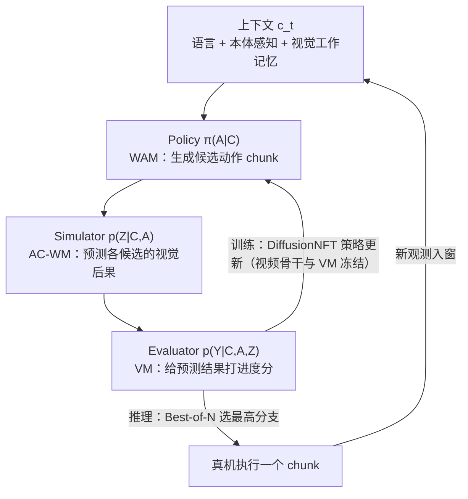
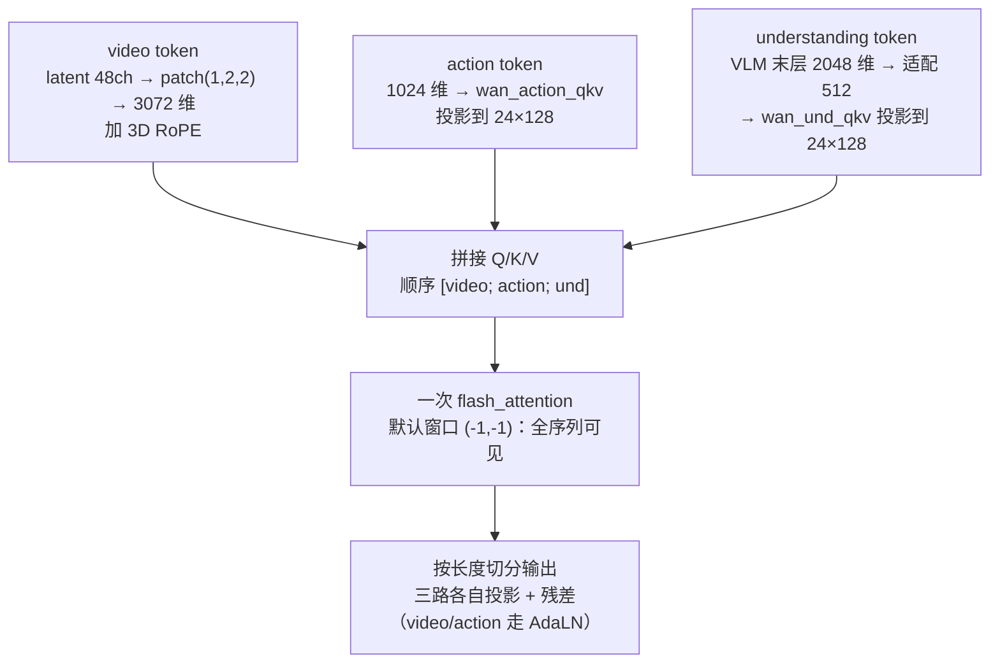

# Motus2 调研：自进化通用世界模型（生数 GensPI × 清华）

> **版本：v1.2｜2026-09-14**
> 修订记录：v1.2 做了一轮文风修订（按 humanizer-zh 去掉破折号堆砌、三段式排比、否定式排比、粗体滥用和空话连接词），事实、数字、引用与 E 级标注没有任何改动。v1.1 增补 §2.4 与 §3：用直系前代 Motus v1 的开源代码（`thu-ml/Motus` @ `f771216`，2026-09-14 clone 至 `vla_wam_framework_src/Motus`）做架构级解剖，并与 Motus2 论文口径逐项对差；v1（同日早前版）是纯论文级调研。
>
> 材料：arXiv [2608.30237v2](https://arxiv.org/abs/2608.30237) 全文（v1 2026-08-31 / v2 2026-09-10）、[项目页](https://motus-robotics.github.io/motus2)、GitHub [`shengshu-ai/Motus2`](https://github.com/shengshu-ai/Motus2)、HuggingFace [`motus-robotics`](https://huggingface.co/motus-robotics)（后两者为 2026-09-14 检索状态）。发布背景见 §1 的 E4 媒体来源，只作背景用，不拿来做技术论断。
>
> 证据口径沿用 [00_总览](<../../reports/00_总览.md>) §3：E1 源码行号、E2 配置实证、E3 文档/论文/官方资料或明确标注的推断、E4 外审转述未复核。WAM/VLA 概念基础见 [9/8 世界模型背景调研](<../2026_0907-0913_调研与归档/2026-09-08-VLA_WAM_世界模型背景调研报告.md>) §4–§5，本文不重复。Motus2 本体无码可审：§3 的 E1 证据全部针对 v1 代码，凡是涉及 Motus2 的架构判断都是论文口径（E3）；v1 不等于 v2，差异对照见 §2.3 和 §2.4。

## 0. 结论（TL;DR）

1. 生数科技（论文署名 GensPI）与清华朱军团队的灵巧操作通用世界模型（General World Model, GWM），2026-09-10 外滩大会发布；arXiv v1 8/31、v2 9/10。它是 [Motus v1](https://arxiv.org/abs/2512.13030)（CVPR 2026）的直系续作。（E3·一手 + E4·媒体背景）
2. 一个共享参数的 video–action 模型同时充当三个控制接口：policy（WAM，出动作）、simulator（AC-WM，预测未来画面）、evaluator（value model，打进度分）。实现手段是 stage-specific attention mask 加轨迹级监督路由；失败数据只喂 simulator 和 evaluator，不训 policy。（E3·一手，§3.1–§3.2）
3. 数据约 13 万小时 egocentric 语料（单目 11.25 万上下，立体 1.74 万上下），立体子集（2k/4k/10k/20k h）拟合出人类数据 scaling law `L* ≈ 0.101 − 0.005·ln D`；中训练用了超过 100 h 的 robot 轨迹加人机对齐数据。（E3·一手，§4–§5.3）
4. 真机成绩（20 rollouts/任务）：主套件平均从 Pretrain-SFT 的 51% 提高到 **84%**，π0.5 与 WAN-SFT 基线都是 0%；MBRL 加规划把 65% 推到 **75.0%**；长程记忆真机 57.5%（global autoregression）对 25%（hybrid memory）；触觉专家 60% 到 72.5%。（E3·一手，§5.2–§5.6）
5. 开源状态只能算"建了个仓库"：GitHub 上只有 README 和路线图，代码权重写着"9 月内逐步放出"，勾选项一个没完成；HF 没有 Motus2 权重；总参数量未披露，已知骨干是 Wan 2.2-TI2V-5B。眼下只能做文献级跟踪，谈复现或迁移都还早；架构细节已用前代 v1 的开源代码补上（§3，E1）。（E3·一手，2026-09-14 检索）

---

## 1. 身份与谱系

| 项 | 内容 | 证据 |
|---|---|---|
| 论文 | Motus2: A Self-Evolving General World Model for Dexterous Manipulation，arXiv 2608.30237（v2 2026-09-10） | E3·一手 |
| 团队 | 论文署名：GensPI¹（生数）+ 清华²；通讯作者朱军；GitHub 组织为 `shengshu-ai` | E3·一手 |
| 发布 | 媒体称 2026-09-10 外滩大会由生数科技 CEO 发布，现场演示了撕纸、翻书、开易拉罐等真机 demo | E4·媒体（背景） |
| 谱系 | Motus v1（2025-12，CVPR 2026，8B MoT 三专家）→ MotuBrain（2026-04，姊妹项目）→ Motus2 | E3·一手（v1 模型卡/项目页） |
| 官方出口 | 项目页、GitHub、HF 都在 `motus-robotics`、`shengshu-ai` 名下；v1 代码在 `thu-ml/Motus` | E3·一手（检索） |

与工作区的关系：9/8 调研的两份文档已在 §5.5 与框架表里引过 Motus v1（三专家、潜动作），本文是同一谱系的续作审计。

## 2. 方法拆解

### 2.1 三个接口，一套权重

Motus2 把一个模型的输出拆成三种条件分布（action-first 因子分解）：

```
p(At, Zt, Yt | ct) = π(At|ct) · p_wm(Zt|ct,At) · p_vm(Yt|ct,At,Zt)
                      policy(WAM)   simulator(AC-WM)    evaluator(VM)
```

其中 `ct` 是语言、当前本体感知和视觉工作记忆的拼接；`At` 为动作 chunk，`Zt` 是其潜未来观测，`Yt` 为离散化的任务进度值（201 bins）。三个分布共用同一套权重，不存在三个分开训练的网络，理解成同一骨干上的三种查询模式更准确。（E3·一手，§3.1–§3.2）



### 2.2 阶段化掩码与监督路由

- 掩码分两段。预训练用 joint mask，chunk 内视频和动作双向可见；中训练起换成 action-first mask，动作 token 看不到本 chunk 的未来视频和 value query，未来视频可以读动作，value query 两边都能读、自己对其他 token 不可见。跨 chunk 始终因果。（E3·一手，§3.2 / Fig.2）
- chunk 间自回归，chunk 内低层动作由 flow matching 联合去噪；每个动作 chunk 对应 `κ=2` 个 latent frame，中后训练 `W=8`，预训练 Stage 2 为 `W=12`。（E3·一手，附录 E）
- 监督按轨迹分流：成功轨迹才激活动作监督；失败和次优轨迹里的动作保持干净，只用来当 simulator 和 evaluator 的条件与监督。论文原话的大意是，失败能教动力学和价值，但别教出坏动作。（E3·一手，§3.2）

### 2.3 与 Motus v1 的差异（注意勿混用结论）

| 维度 | Motus v1（2025-12） | Motus2（2026-09） |
|---|---|---|
| 架构 | MoT 三专家：VLM(Qwen3-VL-2B)+VGM(Wan2.2-5B)+动作专家，≈8B | 单一共享 video–action 骨干（Wan 2.2-TI2V-5B 初始化），语言经 cross-attention；总规模未披露 |
| 建模自由度 | UniDiffuser 调度，五模式（WM/VLA/IDM/VGM/联合预测） | 三接口因子分解（policy/simulator/evaluator）+ chunk 自回归 |
| 新增能力 | 无 | 价值评估器 + DiffusionNFT MBRL + Best-of-N 规划；长程记忆；触觉专家 |
| 动作表示 | 光流隐动作预训练（v1 摘要） | 预训练动作为 134 维手部表示重定向到 Wuji 20-DoF 关节角；全文未见"隐动作"表述（检索范围内） |
| 评测 | RoboTwin 2.0 仿真 88.66/87.02 + 真机 | 自有真机 5 任务（无公共 benchmark）+ 记忆/触觉探针 |
| 开源 | 代码和权重已开（`thu-ml/Motus`、HF） | 只有 README，路线图未开始 |

（v1 列来自 v1 论文与 HF 模型卡，E3·一手；v2 列来自本论文，E3·一手；"未见隐动作表述"只是检索范围内的观察，标 E3·待核。）

### 2.4 架构机制视角：v1 源码到 Motus2 论文的逐项增量

再把两代放进同一张机制表。左列每一条都来自 v1 源码（E1，commit `f771216`，file:line 见 §3），右列是 Motus2 论文的说法（E3·一手）。

| 机制 | Motus v1（源码实证，E1） | Motus2（论文口径，E3） |
|---|---|---|
| 模态融合 | 三专家 trimodal 联合注意力：video/action/und 三路各自投影后拼 Q/K/V，一次 `flash_attention`（`bak/wan/modules/model.py:227-237`） | 单共享 video–action 骨干；语言走 cross-attention；全文未见 understanding expert/VLM（疑被移除，待核） |
| 可见性 | 无模态掩码、窗口内全双向；只给 video token 加 3D RoPE（`model.py:200-202`） | action-first mask + 只读 value query `U`；跨 chunk 因果 |
| 上下文 | 首帧条件、单窗预测、无历史（`motus.py:795-814`） | 滑动窗（默认）/ 全历史自回归 / 混合记忆 + KV 驱逐与 RoPE 重定基 |
| 预训练动作 | 读 repo 外预计算的光流潜动作 `.pt`（`data/latent_action/latent_action_dataset.py:232-243`） | 人手 134 维重定向到 Wuji 20-DoF 关节角（论文附录 C/D） |
| 监督 | 成功轨迹 video/action 两路 MSE（`motus.py:884-895`） | 轨迹级路由：失败只喂 simulator/evaluator；value 分类（201 bins） |
| 自进化 | 无 | Best-of-N 规划 + DiffusionNFT MBRL |
| 触觉 | 无 | 轻量触觉专家（30 层，与骨干逐层配对） |
| 部署成本 | 每步联合去噪 video+action；预测视频只存可视化、不进控制（`inference/robotwin/Motus/deploy_policy.py:254,262-278`） | action-first inference：常规控制只跑 policy factor，不生成未来画面 |

把两代并排看，Motus2 的改动可以用一句概括：骨架不换，做加法。具体算四处。第一，给注意力加阶段化掩码和 value 查询；第二，把上下文从单帧条件扩成工作记忆；第三，外挂触觉专家；第四，训练从 SFT 扩到价值模型加在线扩散 RL。左列各项的源码依据放在 §3。（E3·解释）

## 3. 代码级解剖：Motus v1 怎么把这套架构落地（E1）

> 前提：Motus2 未放码，本节解剖的是 v1 官方代码（`thu-ml/Motus` @ `f771216`，Apache-2.0，本地锚点 `vla_wam_framework_src/Motus`）。Motus 系的骨架由它定义，Motus2 论文自称 "built on Motus"，所以这是眼下唯一能复核的架构基线。v2 没说清楚的细节，一律记待核。

### 3.1 仓库地图

| 路径 | 作用 |
|---|---|
| `models/motus.py` | 主装配：三模块 + `training_step` + 三个版本的 `inference_step` |
| `models/action_expert.py` | 动作专家：输入编码、30 块、解码器 |
| `models/und_expert.py` | 理解专家：VLM 适配器 + 30 块（无解码器） |
| `models/wan_model.py` | WAN 封装：VAE `encode_video/decode_video`、patch embedding |
| `bak/wan/**` | Wan 2.2 上游代码副本；MoT 改造点在 `modules/model.py` 的 `WanSelfAttention.forward` |
| `train/train.py` | torchrun/DeepSpeed 训练循环、参数组与冻结策略 |
| `inference/robotwin/Motus/deploy_policy.py` | RoboTwin 部署闭环，"怎么用"的权威示例 |
| `configs/*.yaml` | 各本体配置（`robotwin` / `latent_action` / `ac_one` / `lerobot`） |
| `data/latent_action/*.py` | 潜动作数据集：读预计算 `latent_action_dim14/*.pt` |

### 3.2 一次联合注意力如何融合三模态

三路 token 先各自投影到 WAN 的 24×128 头空间，再拼成一条序列做一次注意力：



- 拼接与切分在 `bak/wan/modules/model.py:227-262`；RoPE 只加在 video 的 Q/K 上（同文件 `:200-202`）。
- 各专家的块只持有自己那一侧的参数，包括投影到 WAN 头空间的权重；注意力计算完全借用 WAN 自注意力（设计注释见 `action_expert.py:216-225`）。
- 有两点对迁移和审计很重要。一是三模态共享一次全局注意力，没有任何模态隔离，Motus2 要加的掩码就加在这里；二是序列长度等于视频 token（约 `3×H/32×W/32`）加动作 chunk 再加 VLM 序列（数百 token），单层注意力的复杂度对三者总和成平方（E1·计算）。

### 3.3 动作专家：1024 维、30 块、与 WAN 逐层 1:1

- 每层 `ActionExpertBlock` 持有 `wan_action_qkv`（形状 `[3, 24, 1024, 128]`）、输出投影 `wan_action_o`、Q/K RMSNorm、自己的 FFN 和 6 参数 AdaLN（`action_expert.py:227-259`）。
- 输入编码有两套：预训练用 `ActionEncoder`（纯动作，没有 state token），微调用 `StateActionEncoder`（1 个 state token 加动作 chunk），位置编码是固定正弦（`action_expert.py:87-213`）。
- Register token 在微调时 4 个，预训练 0 个（`motus.py:569-590`）；解码走 AdaLN 调制加 `mlp1x_silu` 动作头（`action_expert.py:262-304`）。
- chunk 长度公式是 `action_chunk_size = num_video_frames × video_action_freq_ratio`（`motus.py:86`）。RoboTwin 配置算出来 8 帧 × 2 = 16（`configs/robotwin.yaml:7,13`），HF 模型卡写 48，两处对不上，记入待核。
- 官方 README 标称动作专家约 641.5M 参数（E3）。

### 3.4 理解专家：把冻结 VLM 接进注意力

- VLM（Qwen3-VL-2B）全程冻结、不做截断（`motus.py:529-535`），只取末层 hidden states（`motus.py:323-330`），经 2048→512 的 `mlp3x_silu` 适配后进入联合注意力。
- 30 块与 WAN 层数一一对应；没有解码器，也没有位置编码，位置信息由 VLM 自带（`und_expert.py:108-141`）。
- 这里有个实现层的发现：推理去噪循环内每一步都会重新调用 `extract_und_features`（`motus.py:950` 在循环前调一次，`:973` 又在循环内逐帧重算），同一份 VLM 前向被重复执行。如果 Motus2 已经去掉 VLM 分支（§2.4），这笔开销自然消失；若保留，落地时该修（E3·推断）。

### 3.5 UniDiffuser 在这套代码里到底是什么

代码里没有叫 UniDiffuser 的类。它指的是一条约定：视频和动作各自独立加噪，又在同一注意力里联合去噪。

- 训练时 video 与 action 各自采样独立的 timestep/sigma，各自构造 `noisy = x·(1−σ) + ε·σ` 和目标 `ε − x`；首帧走 teacher forcing，其 target 置 0（`motus.py:803-814`）；两路 MSE 按配置权重相加（`motus.py:884-895`，robotwin 权重 1:1，E2）。
- 推理时是 Euler 循环从 t=1 到 0，视频和动作在同一循环里同步去噪（`motus.py:956-1017`）；RoboTwin 默认 10 步（`configs/robotwin.yaml:85`）。
- 仓库里另有 DPM++ 和 UniPC 两版采样器，都是注释状态（`motus.py:1030-1347`），当前生效的只有 Euler。
- 尺寸换算：latent 帧数为 `1 + num_video_frames/4`，空间是 `H/32 × W/32`（`motus.py:617-619`）；WAN 侧 patch `(1,2,2)`、dim 3072、24 头、30 层、FFN 14336（`bak/wan/configs/wan_ti2v_5B.py:20-25`）。
- README 声称 UniDiffuser 调度能切换五种模式（世界模型 / VLA / 逆动力学 / 视频生成 / 联合预测，E3），但我在推理实现里只找到"视频+动作联合去噪"一条路径，没看到显式模式开关（E1，检索范围），列入待核。

### 3.6 训练与数据（代码/配置口径）

- 三阶段（README，E3）：Stage 1 只训 VGM（数据金字塔 level 2/3/5），Stage 2 三专家加潜动作（level 2–5），Stage 3 在目标机器人上 SFT（level 6）。
- 潜动作是预计算资产。数据集只读 `latent_action_dim14/*.pt`（`data/latent_action/latent_action_dataset.py:232-243`，E1），光流到潜动作的生成脚本没有随仓库发布（待核）。
- 优化配置（E2，`configs/robotwin.yaml`）：batch 8、lr 5e-5、weight decay 0.01、warmup 200、线性调度 `f_max 0.99 → f_min 0.4`、grad clip 0.5、时间采样 `logit_normal`；DeepSpeed 给了 zero1/zero2 配置。
- 冻结策略（E1，`train/train.py:477-491`）：VLM 冻结，WAN 可配独立学习率（`wan_learning_rate`，robotwin 里是注释态）。

### 3.7 部署链路（以 RoboTwin 为例）

`update_obs` 缓存观测，`get_action` 里当前帧先过 T5 文本编码和 VLM（图+指令），再联合去噪，动作进 `action_cache` 逐个执行。预测出的未来帧只用来保存可视化帧网格，不进控制回环（`inference/robotwin/Motus/deploy_policy.py:232-280`，E1）。算了未来画面而控制用不上，这笔浪费正是 Motus2 用 action-first inference 要省掉的（E3·推断）。官方显存要求（E3，README）：推理超过 24 GB（预编码 T5）或约 41 GB（不预编码）；训练超过 80 GB，A100/H100/B200 级别。

## 4. 数据与训练配方

### 4.1 13 万小时数据金字塔（Table 1 要点，E3·一手）

| 来源 | 相机 | 原始小时 | 分辨率 | 获取方式 |
|---|---|---|---|---|
| Egocentric-100K | 单目 | 100,500 | 480×360 | 开源 |
| Egocentric-10K | 单目 | 10,000 | 480×360 / 512×512 | 开源 |
| EgoVerse | 单目 | 1,200 | 512×512 | 开源 |
| EgoDex | 单目 | 800 | 480×360 / 512×512 | 开源 |
| Ropedia | 立体 | 7,000 | 512×512 | 混合 |
| EgoScale | 立体 | 6,000 | 640×384 | 采购 |
| LightWheel | 立体 | 1,200 | 640×480 | 采购 |
| JD-Group | 立体 | 2,000 | 512×512 | 采购 |
| CyberOrigin | 立体 | 1,200 | 640×416 | 采购 |
| 合计 | 混合 | ≈130,000 | 混合 | — |

另有数十小时人机对齐数据（Wuji 数据手套加 VIVE tracker，不驱动机器人），中训练总数据量超过 100 h。手部统一成 134 维表示（腕 3+4，20 个指尖关键点 ×3，左右各 67），预训练阶段离线重定向到 Wuji 20-DoF 关节。（E3·一手，§4 / 附录 B–D）

### 4.2 三段训练（E3·一手，附录 E）

| 阶段 | 数据 | 关键超参 |
|---|---|---|
| Stage 1 视频预训练 | 低分辨率单目 500K steps → 高分辨率单目 340K steps；1–2 干净 latent frame 条件 | 仅视频通路 flow matching |
| Stage 2 联合预训练 | 立体 egocentric + 人类动作 450K steps；`W=12`、`κ=2`、历史 1–5 chunk 随机 | AdamW 2e-5、bf16、clip 0.5 |
| 中训练 | robot 轨迹 + 人机对齐，640×384 立体，`W=8`；policy/simulation/evaluation 采样比 0.85/0.10/0.05 | value 201 bins、loss 权重 0.05 |
| 后训练 | 目标机器人 SFT（默认 5 步去噪）；再叠加 MBRL、长程记忆、触觉分支 | 记忆分支 10K steps、评测 50 步去噪 |

### 4.3 人类数据 scaling law（立体）

在 2k/4k/10k/20k 小时嵌套子集上，验证误差随数据量对数线性下降：`L* ≈ 0.101 − 0.005·ln D`（同一 held-out 集合，小时数是过滤和切分前的原始时长）。（E3·一手，§5.3，Fig.5）

## 5. 自进化闭环：Best-of-N 与 MBRL

### 5.1 Best-of-N 规划（推理时，不改权重）

候选 action chunk 采样 N 个，simulator 各自预测未来，evaluator 打分，执行最高分的那个 chunk，然后回到真机新观测重新规划（receding-horizon）。（E3·一手，§3.3.2）

### 5.2 DiffusionNFT 策略优化（训练时）

- 价值监督用相对进度：成功轨迹段为正 `r=Δt/(T−t)`，失败遥操作与无关任务段为负 `−Δt/(T−t)`（照搬 VLAC）。失败样本在这里不是废料。（E3·一手，§3.3.1）
- 策略更新用 [DiffusionNFT](https://proceedings.iclr.cc/paper_files/paper/2026/hash/d8e68ddfe22520b45b8fb8d5cbde5a21-Abstract-Conference.html)（本组 ICLR 2026 Oral，前向过程在线扩散 RL），把候选价值转成 flow-matching 策略更新；只更新动作相关参数，视频骨干与 evaluator 冻结。`β=0.1`、EMA 0.99、参考策略每 10 次 trainer 更新发布一次、超过 600 s 的陈旧样本丢弃。（E3·一手，论文 §3.3.2 / 附录 E.3）
- 工程侧是 Ray 宏异步流水线（借鉴 AcceRL），把离线前缀采样、想象 rollout 与打分、参考目标构造、策略优化四段解耦；每个前缀 8 个策略候选加 1 个 GT 锚点，想象视界 1 chunk。（E3·一手，同上）

结果（Put Phone + Multi-Finger，真机 20 rollouts/任务，E3·一手，§5.4 Table 3）：

| 配置 | Put Phone | Multi-Finger | 均值 |
|---|---|---|---|
| Motus2 | 60% | 70% | 65.0% |
| + Planning | 65% | 70% | 67.5% |
| + MBRL | 65% | 80% | 72.5% |
| + MBRL + Planning | 70% | 80% | 75.0% |

## 6. 长程记忆与触觉

### 6.1 三种上下文机制（E3·一手，论文 §3.4）

| 机制 | 做法 | 成本 |
|---|---|---|
| Sliding window（默认） | 固定窗、只保留最近干净观测；KV cache 驱逐 + 时间 RoPE 重定基 | 有界（流式部署默认，2-chunk 缓存） |
| Global autoregression | 全历史保留、episode 级 RoPE | KV/注意力随 episode 线性增长 |
| Hybrid memory | MemoryWAM 式：2 锚帧 + 4 近帧全分辨率 + 8 memory tokens/latent frame | 折中压缩 |

长程变体用变长 episode packing 训练（block-diagonal 因果掩码，100 latent-frame 预算，单 micro-batch 最多 8 条）。结果（Find Square + Press Button）：仿真里 global AR 78% 对 hybrid 52%，真机 57.5% 对 25.0%。在这两个探针上，压缩记忆明显不如全历史（E3·一手，§5.5 Table 4）。注意这是该团队自己设计的任务，别外推成通用结论。

### 6.2 轻量触觉专家（E3·一手，论文 §3.5 / 附录 E.3）

- 架构上是一个 30 层 transformer，hidden 128、4 heads，与骨干逐层配对，读骨干在 `σc=0.2` 处刷新的分离 KV 缓存，不重跑完整视频骨干。
- 节奏上把 48 动作 chunk 拆成 8 个 6 动作子块（30 Hz 下每块 0.2 s），执行前用最新触觉窗逐个细化；力信号 90 Hz。
- 训练辅助是未来力窗预测（`λpred=0.1`）；Sharpa 形变图只作条件，不作预测目标。
- 传感器接口：Wuji Hand 2 为 1086 维双手向量（176 个三轴测点/手加 30 个聚合值）；Sharpa Wave 为 60 维力/力矩加 10 指垫形变图。

结果：Pull Out Paper Cup 65→75%，Tear Paper 55→70%，均值 60.0→72.5%（+12.5 pt）（§5.6 Table 5）。

## 7. 主结果与数字口径

主套件（自有真机，20 rollouts/任务，宏平均；E3·一手，§5.2 Table 2）：

| 初始化 | Place Ball | Multi-Finger | Attach Eraser | Screw Bulb | Put Phone | 均值 |
|---|---|---|---|---|---|---|
| π0.5（对照） | 0 | 0 | 0 | 0 | 0 | 0% |
| WAN-SFT | 0 | 0 | 0 | 0 | 0 | 0% |
| Pretrain-SFT | 60 | 35 | 90 | 55 | 15 | 51% |
| Motus2 (Midtrain-SFT) | 100 | 70 | 100 | 90 | 60 | 84% |

读这些数字时注意三件事。全部是真机、严格成功判定（部分完成算失败）、每任务 20 个配置，而且没有公共 benchmark（v1 有 RoboTwin 2.0，两代成绩不能直接比）。π0.5 在同一 SFT 数据、观测接口和评测协议下跑出 0%，这是该团队协议下的结果，不能外推成"π0.5 做不了灵巧操作"。媒体传播时常用的"65→75""+12.5pt"都是上面那几个小规模真机探针的切片，不是大样本统计（E3·解释）。

## 8. 开源与可复现性（2026-09-14 状态）

| 出口 | 状态 |
|---|---|
| GitHub `shengshu-ai/Motus2` | 只有 README；5 commits；路线图（Stage 1/2 权重、视频预训练码、VLA/Value 训练码、MBRL、记忆与变长设施、触觉码）全部未勾选；公告"9 月内逐步放出" |
| HuggingFace `motus-robotics` | 只有 v1 时代 4 个模型（Motus、Motus_Wan2_2_5B_pretrain、Motus_robotwin2、pi0.5_robotwin2），无 Motus2 权重 |
| 模型规模 | 论文未披露总参数；骨干为 Wan 2.2-TI2V-5B |
| 复现路径（过渡期） | Motus v1（`thu-ml/Motus`，代码权重全开）已 clone 至本地锚点 `vla_wam_framework_src/Motus`（@ `f771216`），§3 已据此完成架构解剖 |

（E3·一手：仓库/HF 页检索）

## 9. 与本工作区的关系（E3·解释，不代表立项意见）

1. 不属于 SONIC 主线。Motus2 是双臂灵巧操作（dexterous manipulation）WAM，不涉及人形全身控制（WBC），也不碰 MuJoCo/MJWarp 仿真栈，与 A/B 两条迁移路线没有直接交集。
2. 可以作 ① 报告附录 C 的新案例。附录 C 讨论"VLA/WAM 架构差异对后训练、RL 与昇腾适配的影响"，Motus2 是迄今把价值模型、在线扩散 RL（DiffusionNFT）和测试时搜索塞进单一 WAM 的完整样本；它"只更新动作相关参数、视频骨干冻结"的 MBRL 配方，对讨论后训练算力构成有参考价值。§3 的 v1 源码解剖还能当"WAM 落地成本"的实证基线（注意力结构、每步联合去噪、VLM 重复前向都点到了）。
3. 昇腾适配视角（推断）：视频扩散骨干、flow matching、KV cache 窗口重定基、Best-of-N 多候选想象，这套推理成本结构比普通 VLA 重；官方材料里没有任何 NPU 证据，眼下也没码，先放着（E3·推断）。
4. 产业信号方面，该模型出自国内团队（生数 × 清华），走的是商业发布（外滩大会），跟踪国产具身模型生态时算高关注项；但技术细节目前只能依赖论文自述，所有数字要保留厂商口径（对应 00_总览 E3/E4 的使用限制）。
5. 后续动作：一是 9 月下旬复查 GitHub 路线图勾选与 HF 上新，若放码就把本文升级为源码审计；二是若只做概念引用，直接引本文档加 9/8 调研的 v1 小节，不必重复展开。

## 10. 待核清单

- [ ] Motus2 代码/权重是否按路线图放出（GitHub / HF）；放出后核对模型总参数量、是否保留 v1 "隐动作"通路、推理显存。
- [ ] v2 是否保留 v1 的 understanding expert/VLM 分支、register token、"动作 token 无 RoPE"等架构细节（论文未述；§2.4/§3 的对照基于 v1 代码）。
- [ ] v1 RoboTwin 动作 chunk 口径：配置算出 16（8 帧 × 频率比 2），HF 模型卡写 48（§3.3）。
- [ ] v1 光流潜动作生成脚本未随仓库发布；v2 数据管线中 134 维到 20-DoF 的重定向有协议描述、无代码（论文附录 C/D）。
- [ ] v2 论文相对 v1 全文的其他差异（本文只对比了检索范围内的部分）。
- [ ] "外滩大会发布"的官方一手通稿（当前只有 E4 媒体来源）。
- [ ] MBRL 的 65→75% 是否有更大样本或多任务复现（当前 2 任务 × 20 rollouts）。

## 参考（一手）

- 论文：[arXiv:2608.30237v2](https://arxiv.org/abs/2608.30237)（全文引用为 §号与附录号）
- 项目页：<https://motus-robotics.github.io/motus2>
- 代码（路线图）：<https://github.com/shengshu-ai/Motus2>
- 权重（v1 时代）：<https://huggingface.co/motus-robotics>
- 前代：[Motus v1, arXiv:2512.13030](https://arxiv.org/abs/2512.13030) / [thu-ml/Motus](https://github.com/thu-ml/Motus)；姊妹项目 [MotuBrain, arXiv:2604.27792](https://arxiv.org/abs/2604.27792)
- Motus v1 源码锚点（§3 的 E1 出处）：[thu-ml/Motus](https://github.com/thu-ml/Motus) @ `f771216`，本地 `vla_wam_framework_src/Motus`（2026-09-14 clone）
- 背景媒体（E4）：新智元 2026-09-12 报道（外滩大会发布与演示清单）
