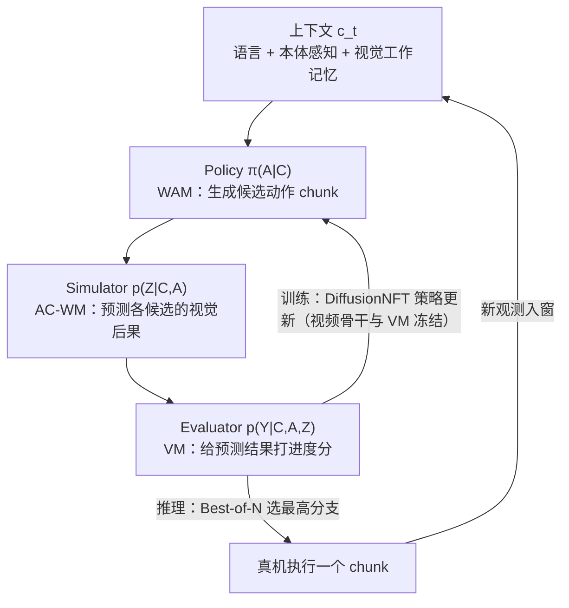

# Motus2 调研：自进化通用世界模型（生数 GensPI × 清华）

> **版本：v1｜2026-09-14**
> 材料：arXiv [2608.30237v2](https://arxiv.org/abs/2608.30237) 全文（v1 2026-08-31 / v2 2026-09-10）、[项目页](https://motus-robotics.github.io/motus2)、GitHub [`shengshu-ai/Motus2`](https://github.com/shengshu-ai/Motus2)、HuggingFace [`motus-robotics`](https://huggingface.co/motus-robotics)（后两者为 2026-09-14 检索状态）。发布背景见 §1 的 E4 媒体来源，仅作背景，不用于技术论断。
>
> 证据口径沿用 [00_总览](<../../reports/00_总览.md>) §3：E1 源码行号、E2 配置实证、E3 文档/论文/官方资料（标注一手的）或明确标注的推断、E4 外审转述未复核。WAM/VLA 概念基础见 [9/8 世界模型背景调研](<../2026_0907-0913_调研与归档/2026-09-08-VLA_WAM_世界模型背景调研报告.md>) §4–§5，本文不重复；**本文不是源码审计**，Motus2 目前也无码可审。

## 0. 结论（TL;DR）

1. **身份**：生数科技（论文署名 GensPI）+ 清华朱军团队的灵巧操作通用世界模型（General World Model, GWM），2026-09-10 外滩大会发布；arXiv v1 8/31、v2 9/10。是 [Motus v1](https://arxiv.org/abs/2512.13030)（CVPR 2026）的直系续作。（E3·一手 + E4·媒体背景）
2. **内核**：**一个共享参数的 video–action 模型暴露三个控制接口**——policy（WAM，出动作）/ simulator（AC-WM，预测未来画面）/ evaluator（value model，打分进度）。靠 stage-specific attention mask 与轨迹级监督路由实现，失败数据只训 simulator/evaluator、不训 policy。（E3·一手，§3.1–§3.2）
3. **数据**：~13 万小时 egocentric 语料（单目 ≈11.25 万 + 立体 ≈1.74 万），立体子集（2k/4k/10k/20k h）拟合出人类数据 scaling law `L* ≈ 0.101 − 0.005·ln D`；中训练用 >100 h robot 轨迹 + 人机对齐数据。（E3·一手，§4–§5.3）
4. **收益数字（真机，20 rollouts/任务）**：主套件平均从 Pretrain-SFT 51% → **Motus2 84%**（π0.5 与 WAN-SFT 基线均 0%）；MBRL+规划 65%→**75.0%**；长程记忆用 global autoregression 真机 **57.5%** vs hybrid memory 25%；触觉专家 60%→**72.5%**。（E3·一手，§5.2–§5.6）
5. **开源状态：只建了仓库**。GitHub 仅有 README + 路线图（代码/权重"9 月内逐步放出"，尚无任何勾选项）；HF 上无 Motus2 权重；模型总参数未披露（骨干为 Wan 2.2-TI2V-5B）。**当前只能做文献级跟踪，复现/迁移评估为时过早。**（E3·一手，2026-09-14 检索）

---

## 1. 身份与谱系

| 项 | 内容 | 证据 |
|---|---|---|
| 论文 | Motus2: A Self-Evolving General World Model for Dexterous Manipulation，arXiv 2608.30237（v2 2026-09-10） | E3·一手 |
| 团队 | 论文署名：GensPI¹（生数）+ 清华²；通讯作者朱军；GitHub 组织为 `shengshu-ai` | E3·一手 |
| 发布 | 媒体称 2026-09-10 外滩大会由生数科技 CEO 发布，并现场演示撕纸/翻书/开易拉罐等真机 demo | E4·媒体（背景） |
| 谱系 | Motus v1（2025-12，CVPR 2026，8B MoT 三专家）→ MotuBrain（2026-04，姊妹项目）→ Motus2 | E3·一手（v1 模型卡/项目页） |
| 官方出口 | 项目页 / GitHub / HF 均为 `motus-robotics`、`shengshu-ai` 名下；v1 代码在 `thu-ml/Motus` | E3·一手（检索） |

与工作区的关系：9/8 调研的两份文档已在 §5.5 与框架表中引过 Motus v1（三专家、潜动作），本文是同一谱系的续作审计。

## 2. 方法拆解

### 2.1 一模型三接口（核心记法）

Motus2 把"决策—预测—评估"写成同一模型上的三个条件分布（action-first 因子分解）：

```
p(At, Zt, Yt | ct) = π(At|ct) · p_wm(Zt|ct,At) · p_vm(Yt|ct,At,Zt)
                      policy(WAM)   simulator(AC-WM)    evaluator(VM)
```

其中 `ct` = 语言 + 当前本体感知 + 视觉工作记忆；`At` 为动作 chunk，`Zt` 为其潜未来观测，`Yt` 为离散化任务进度值（201 bins）。三者不是分开训练的网络，而是同一骨干上的三种"查询模式"。（E3·一手，§3.1–§3.2）



### 2.2 阶段化掩码 + 监督路由（工程关键）

- **mask 分两段**：预训练用 joint mask（chunk 内视频/动作双向可见）；中训练起换成 **action-first mask**——动作 token 看不到本 chunk 的未来视频与 value query，未来视频可读动作，value query 读两者但对其他 token 不可见。跨 chunk 始终因果。（E3·一手，§3.2 / Fig.2）
- **chunk-autoregressive**：chunk 间自回归，chunk 内低层动作由 flow matching 联合去噪；`κ=2` latent frames/动作 chunk（中后训练 `W=8`，预训练 Stage 2 `W=12`）。（E3·一手，附录 E）
- **监督路由（卖点）**：仅成功轨迹激活动作监督；**失败/次优轨迹的中动作保持干净，只作为 simulator/evaluator 的条件与监督**——"从失败中学动力学与价值，但不学坏动作"。（E3·一手，§3.2）

### 2.3 与 Motus v1 的差异（注意勿混用结论）

| 维度 | Motus v1（2025-12） | Motus2（2026-09） |
|---|---|---|
| 架构 | MoT 三专家：VLM(Qwen3-VL-2B)+VGM(Wan2.2-5B)+动作专家，≈8B | 单一共享 video–action 骨干（Wan 2.2-TI2V-5B 初始化），语言经 cross-attention；总规模未披露 |
| 建模自由度 | UniDiffuser 调度，五模式（WM/VLA/IDM/VGM/联合预测） | 三接口因子分解（policy/simulator/evaluator）+ chunk 自回归 |
| 新增能力 | — | 价值评估器 + DiffusionNFT MBRL + Best-of-N 规划；长程记忆；触觉专家 |
| 动作表示 | 光流隐动作预训练（v1 摘要） | 预训练动作为 134 维手部表示重定向到 Wuji 20-DoF 关节角；全文未见"隐动作"表述（检索范围内） |
| 评测 | RoboTwin 2.0 仿真 88.66/87.02 + 真机 | 自有真机 5 任务（无公共 benchmark）+ 记忆/触觉探针 |
| 开源 | 代码+权重已开（`thu-ml/Motus`、HF） | 仅 README，路线图未开始 |

（v1 列：E3·一手，v1 论文与 HF 模型卡；v2 列：E3·一手，本论文；"未见隐动作表述"为检索范围内的观察，标 E3·待核。）

## 3. 数据与训练配方

### 3.1 13 万小时数据金字塔（Table 1 要点，E3·一手）

| 来源 | 相机 | 原始小时 | 分辨率 | 获取方式 |
|---|---|---|---|---|
| Egocentric-100K | 单目 | 100,500 | 480×360 | 开源 |
| Egocentric-10K | 单目 | 10,000 | 480×360 / 512×512 | 开源 |
| EgoVerse | 单目 | 1,200 | 512×512 | 开源 |
| EgoDex | 单目 | 800 | 480×360 / 512×512 | 开源 |
| Ropedia | 立体 | 7,000 | 512×512 | 混合 |
| EgoScale | 立体 | 6,000 | 640×384 | 采购 |
| LightWheel | 立体 | 1,200 | 640×480 | 采购 |
| JD-Group | 立体 | 2,000 | 512×512 | 采购 |
| CyberOrigin | 立体 | 1,200 | 640×416 | 采购 |
| **合计** | 混合 | **≈130,000** | 混合 | — |

另有数十小时人机对齐数据（Wuji 数据手套 + VIVE tracker，不驱动机器人），中训练总数据量 >100 h。手部统一为 134 维表示（腕 3+4、20 指尖关键点×3，左右各 67）；预训练阶段离线重定向到 Wuji 20-DoF 关节。（E3·一手，§4 / 附录 B–D）

### 3.2 三段训练（E3·一手，附录 E）

| 阶段 | 数据 | 关键超参 |
|---|---|---|
| Stage 1 视频预训练 | 低分辨率单目 500K steps → 高分辨率单目 340K steps；1–2 干净 latent frame 条件 | 仅视频通路 flow matching |
| Stage 2 联合预训练 | 立体 egocentric + 人类动作 450K steps；`W=12`、`κ=2`、历史 1–5 chunk 随机 | AdamW 2e-5、bf16、clip 0.5 |
| 中训练 | robot 轨迹 + 人机对齐，640×384 立体，`W=8`；policy/simulation/evaluation 采样比 0.85/0.10/0.05 | value 201 bins、loss 权重 0.05 |
| 后训练 | 目标机器人 SFT（默认 5 步去噪）；再叠加 MBRL / 长程记忆 / 触觉分支 | 记忆分支 10K steps、评测 50 步去噪 |

### 3.3 人类数据 scaling law（立体）

在 2k/4k/10k/20k 小时嵌套子集上，验证误差随数据量对数线性下降：`L* ≈ 0.101 − 0.005·ln D`（同一 held-out 集合；小时数为过滤/切分前的原始时长）。（E3·一手，§5.3，Fig.5）

## 4. 自进化闭环：Best-of-N 与 MBRL

### 4.1 Best-of-N 规划（推理时、不改权重）

候选 action chunk 采样 N 个 → simulator 各预测未来 → evaluator 打分 → 执行最高分 chunk → 回到真机新观测重新规划（receding-horizon）。（E3·一手，§3.3.2）

### 4.2 DiffusionNFT 策略优化（训练时）

- 价值监督：成功轨迹段正进度 `r=Δt/(T−t)`，失败遥操作与无关任务段负进度 `−Δt/(T−t)`（照搬 VLAC 相对进度）。失败不再是废料。（E3·一手，§3.3.1）
- 用 [DiffusionNFT](https://arxiv.org/abs/2608.30237)（本组 ICLR 2026 Oral，前向过程在线扩散 RL）把候选价值转成 flow-matching 策略更新；**只更新动作相关参数，视频骨干与 evaluator 冻结**。`β=0.1`、EMA 0.99、参考策略每 10 次 trainer 更新发布一次、>600 s 陈旧样本丢弃。（E3·一手，§3.3.2 / 附录 E.3）
- 工程：Ray 宏异步流水线（借鉴 AcceRL），解耦离线前缀采样 / 想象 rollout 与打分 / 参考目标构造 / 策略优化；每前缀 8 个策略候选 + 1 个 GT 锚点，想象视界 1 chunk。（E3·一手，同上）

**结果（Put Phone + Multi-Finger，真机 20 rollouts/任务）**：

| 配置 | Put Phone | Multi-Finger | 均值 |
|---|---|---|---|
| Motus2 | 60% | 70% | 65.0% |
| + Planning | 65% | 70% | 67.5% |
| + MBRL | 65% | 80% | 72.5% |
| + MBRL + Planning | 70% | 80% | **75.0%** |

（E3·一手，§5.4 Table 3）

## 5. 长程记忆与触觉

### 5.1 三种上下文机制（E3·一手，§3.4）

| 机制 | 做法 | 成本 |
|---|---|---|
| Sliding window（默认） | 固定窗、只保留最近干净观测；KV cache 驱逐 + 时间 RoPE 重定基 | 有界（流式部署默认，2-chunk 缓存） |
| Global autoregression | 全历史保留、episode 级 RoPE | KV/注意力随 episode 线性增长 |
| Hybrid memory | MemoryWAM 式：2 锚帧 + 4 近帧全分辨率 + 8 memory tokens/latent frame | 折中压缩 |

长程变体用**变长 episode packing**（block-diagonal 因果掩码，100 latent-frame 预算、单 micro-batch ≤8 条）训练。

**结果（Find Square + Press Button）**：仿真 global AR 78% vs hybrid 52%；真机 **57.5% vs 25.0%**——压缩记忆在本评测中明显劣于全历史（E3·一手，§5.5 Table 4；注意这是该团队自己的探针任务，不能外推通用）。

### 5.2 轻量触觉专家（E3·一手，§3.5 / 附录 E.3）

- 架构：30 层 transformer、hidden 128、4 heads；与骨干逐层配对，读骨干在 `σc=0.2` 处刷新的**分离 KV 缓存**，不重跑完整视频骨干。
- 节奏：48 动作 chunk 拆 8 个 6 动作子块（30 Hz 下每块 0.2 s），执行前用最新触觉窗逐个细化；力信号 90 Hz。
- 训练辅助：未来力窗预测（`λpred=0.1`）；Sharpa 形变图仅作条件、不作预测目标。
- 传感器：Wuji Hand 2 为 1086 维双手向量（176 个三轴测点/手 + 30 聚合值）；Sharpa Wave 为 60 维力/力矩 + 10 指垫形变图。

**结果**：Pull Out Paper Cup 65→75%，Tear Paper 55→70%，均值 60.0→72.5%（+12.5 pt）（§5.6 Table 5）。

## 6. 主结果与数字口径

主套件（自有真机，20 rollouts/任务，宏平均；E3·一手，§5.2 Table 2）：

| 初始化 | Place Ball | Multi-Finger | Attach Eraser | Screw Bulb | Put Phone | 均值 |
|---|---|---|---|---|---|---|
| π0.5（对照） | 0 | 0 | 0 | 0 | 0 | 0% |
| WAN-SFT | 0 | 0 | 0 | 0 | 0 | 0% |
| Pretrain-SFT | 60 | 35 | 90 | 55 | 15 | 51% |
| **Motus2 (Midtrain-SFT)** | 100 | 70 | 100 | 90 | 60 | **84%** |

**口径注意事项（阅读厂商数字时）**：
- 全部为真机、严格成功判定（部分完成=失败）、20 配置/任务；无公共 benchmark（v1 有 RoboTwin 2.0，两代数字**不可直接比**）。
- 对照 π0.5 在同一 SFT 数据/观测接口/评测协议下为 0%，属该团队协议下的结果，不可外推为"π0.5 不能做灵巧操作"。
- 幻方/媒体传播时常用"65→75""+12.5pt"等切片数字，均为上述小规模真机探针，非大样本统计（E3·解释）。

## 7. 开源与可复现性（2026-09-14 状态）

| 出口 | 状态 |
|---|---|
| GitHub `shengshu-ai/Motus2` | 仅 README；5 commits；路线图（Stage 1/2 权重、视频预训练码、VLA/Value 训练码、MBRL、记忆与变长设施、触觉码）全部未勾选；公告"9 月内逐步放出" |
| HuggingFace `motus-robotics` | 仅 v1 时代 4 个模型（Motus、Motus_Wan2_2_5B_pretrain、Motus_robotwin2、pi0.5_robotwin2），无 Motus2 权重 |
| 模型规模 | 论文未披露总参数；骨干 = Wan 2.2-TI2V-5B |
| 复现路径（过渡期） | Motus v1（`thu-ml/Motus`，代码+权重全开）可作为架构学习与工具链准备的替代锚点 |

（E3·一手：仓库/HF 页检索）

## 8. 与本工作区的关系（E3·解释，不代表立项意见）

1. **不属 SONIC 主线**：Motus2 是双臂灵巧操作（dexterous manipulation）WAM，不涉及人形全身控制（WBC）、不涉 MuJoCo/MJWarp 仿真栈，与 A/B 两条迁移路线无直接交集。
2. **可作 ① 报告附录 C 的新案例**：附录 C 讨论"VLA/WAM 架构差异对后训练、RL 与昇腾适配的影响"，Motus2 是迄今把**价值模型 + 在线扩散 RL（DiffusionNFT）+ 测试时搜索**塞进单一 WAM 的完整样本；其"动作相关参数才更新、视频骨干冻结"的 MBRL 配方，对讨论"后训练算力构成"有参考价值。
3. **昇腾适配视角（推断）**：视频扩散骨干 + flow matching + KV cache 窗口重定基 + Best-of-N 多候选想象，推理成本结构比普通 VLA 重；官方公布物中**无任何 NPU/昇腾证据**，且当前无码，无从做起（E3·推断）。
4. **产业信号**：该模型出自国内团队（生数 × 清华）且走商业发布（外滩大会），若跟踪国产具身模型生态，属高关注项；但技术细节目前**只能依赖论文自述**，所有数字应保留厂商口径（对应 00_总览 E3/E4 使用限制）。
5. **后续动作建议**：① 9 月下旬复查 GitHub 路线图勾选与 HF 上新（若放码，可升级为源码审计任务）；② 若只做概念引用，直接引本文档 + 9/8 调研 v1 小节，勿重复展开。

## 9. 待核清单

- [ ] Motus2 代码/权重是否按路线图放出（GitHub / HF）；放出后核对：模型总参数量、是否保留 v1 "隐动作"通路、推理显存。
- [ ] v2 论文相对 v1 全文的其他差异（本文仅对比了检索范围内的部分）。
- [ ] "外滩大会发布"的官方一手通稿（当前仅 E4 媒体来源）。
- [ ] MBRL 的 65→75% 是否有更大样本/多任务复现（当前 2 任务 × 20 rollouts）。

## 参考（一手）

- 论文：[arXiv:2608.30237v2](https://arxiv.org/abs/2608.30237)（全文引用为 §号与附录号）
- 项目页：<https://motus-robotics.github.io/motus2>
- 代码（路线图）：<https://github.com/shengshu-ai/Motus2>
- 权重（v1 时代）：<https://huggingface.co/motus-robotics>
- 前代：[Motus v1, arXiv:2512.13030](https://arxiv.org/abs/2512.13030) / [thu-ml/Motus](https://github.com/thu-ml/Motus)；姊妹项目 [MotuBrain, arXiv:2604.27792](https://arxiv.org/abs/2604.27792)
- 背景媒体（E4）：新智元 2026-09-12 报道（外滩大会发布与演示清单）
