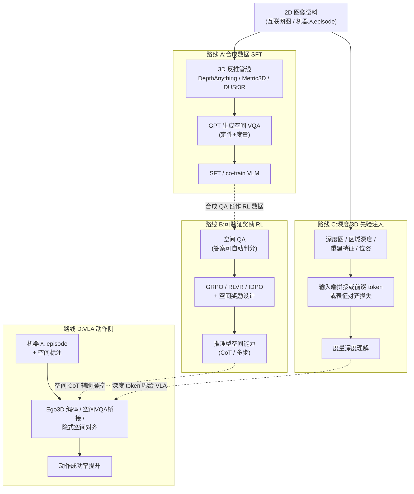

# 图像空间与深度理解的后训练生态调研:方法、数据集与框架

> **版本:v1.0 · 2026-09-17**
> **资料快照:2026-09-17**(网络检索,未逐篇核读源码)
> **证据口径:**本文全部论据来自论文摘要/项目页/README/官方文档的自述与检索摘要,统一按 **E3** 计;个别来自二手转述(如引用数、检索摘要中的数字)按 **E4** 计,均在行内标注。没有本地源码实证(E1)与配置实证(E2)。**论文自报成绩一律视为 E3,不得直接用于立项承诺。**
> **阅读目标:**先理解"VLM 为什么学不到空间/深度、后训练怎么补",再看四条算法路线各自的代表工作与代价,最后落到数据集、训练框架与选型建议(§7–§9)。

---

## 先读这六点

1. **空间/深度缺失是训练范式的产物,不是模型容量问题。**主流 VLM 的视觉编码器以 2D 语义对比学习(CLIP 系)为主,caption/VQA 语料几乎不含度量几何;有工作实证深度信息在 VLM embedding 中"线性不可读"(embedding-space depth injection 实验,E3,arXiv:2607.11173)。所以补空间能力靠**后训练注入新监督信号**,而不是加参数。
2. **四条算法路线,按"监督信号从哪来"划分。**A. 合成空间 VQA 数据做 SFT(海量、便宜、上限受合成质量约束);B. 可验证奖励 RL/GRPO(空间答案天然可自动判分,2025 年主流);C. 深度/3D 先验直接注入输入端或表征(最直接对准"深度",需改数据管线或结构);D. VLA 动作侧空间对齐(空间能力以动作成败为最终出口)。
3. **路线 A 是奠基,路线 B 是当前性价比最高增量。**SpatialVLM(CVPR'24,2B 条 VQA)确立"2D 反推 3D → 生成 QA → SFT"范式;2025 年起同一批数据换成 GRPO 训练,普遍比 SFT 再高数个百分点(STAR-R1 报 +23%,SpatialThinker 报 +5.5% vs SFT,均 E3)。
4. **"学到深度"最直接的是路线 C。**SpatialBot 直接把深度图当第二输入;SD-VLM 把深度编码为前缀 token;SpatialRGPT 用区域级深度。三者都证明:不注入几何信号,纯文本 QA 很难学到度量深度。
5. **数据侧已经不缺"燃料"。**训练集从 45 万(SpaRE)到千万级(InternSpatial)都有开源;机器人向有 NVIDIA RoboSpatial(100 万图 + 5000 个 3D 扫描 + 300 万空间关系标注)。瓶颈从数据量转移到**合成-真实 gap 与评测污染**。
6. **框架不是瓶颈,verl/ms-swift 原生支持多模态 GRPO。**本工作区 `vla_wam_framework_src/` 已有 verl 与 RLinf 源码锚点;复现路线 B 的工作量主要在数据管线与奖励函数,不在训练框架(与 9/8 后训练框架调研结论一致)。

## 目录

| 你想解决的问题 | 建议阅读 |
|---|---|
| VLM 为什么学不到空间/深度? | §1 |
| 快速建立全景 | §2 |
| 想做合成数据 SFT | §3 + §7.1 |
| 想上 RL/GRPO | §4 + §8 |
| 就想让模型"读懂深度" | §5 |
| 落到 VLA/机器人操控 | §6 |
| 选数据集 / 选框架 / 选型决策 | §7 / §8 / §9 |
| 风险与未解决问题 | §10 |

---

## 1. 问题定义:VLM 为什么学不到图片中的空间与深度

"空间/深度信息"在此拆成三层能力,后训练文献分别针对它们:

1. **定性空间关系**(qualitative):左右/上下/前后、包含、相邻、朝向。2D 平面关系(图片里的左右)与 3D 场景关系(世界坐标系里的前后)经常冲突——这是 VLM 出错重灾区(左右混淆、"近处大物体在后面"类错误)。
2. **定量度量**(metric/quantitative):两点实际距离多少米、物体尺寸、"A 比 B 近多少"。需要深度与相机参数,文本 caption 里几乎不存在此类监督。
3. **多视/跨视角几何**(multi-view/cross-view):从两张图判断是否同一地点、相机怎么动、物体 3D 位置推断。

缺失原因(E3,综合多篇论文动机部分):

- 视觉编码器主流为 CLIP 系对比学习,对比目标对"实例级语义"敏感,对像素级几何弱;
- 预训练语料(image-caption)以语义描述为主,度量信息稀疏;
- 机制层面:Depth-Ordinal Prompting(arXiv:2607.11173)做了 embedding-space depth injection(ESDI)实验,发现深度信息在 VLM 隐表示中线性不可读,且该缺陷与空间任务失败因果相关(E3)。

因此后训练的目标是:**引入含几何真值(或伪真值)的新监督信号**,分四条路线,见下节。

## 2. 全景:四条后训练路线

四条路线不是互斥选项而是常见组合:A 产出的数据集直接喂 B;C 的深度 token 可以嵌入 D 的 VLA。时间线上,A 集中在 2024,C 在 2024–2025 持续,B 在 2025 年爆发(DeepSeek-R1 带动 RLVR 范式),D 在 2025 下半年起密集出现。

---

## 3. 路线 A:合成空间 VQA 数据 + SFT

### 3.1 奠基:SpatialVLM 与 VQASynth 管线

**SpatialVLM**(Google DeepMind,CVPR 2024,arXiv:2401.12168,引用 1100+,E4 计数):

- **管线**(开源为 [VQASynth](https://github.com/remyxai/VQASynth)):互联网图像 → DepthAnything/Metric3D 估计深度 → DUSt3R/3D 提升恢复相机位姿与点云 → 滤掉低置信重建 → 在 3D 场景中采样物体对,用规则+GPT 生成"定性关系/度量数值"两类 QA → 与通用语料 **co-train**(不单独 SFT,防灾难遗忘)。
- **规模**:10M 图像、20 亿 VQA(E3)。
- **效果**:定性+定量空间 VQA 显著超过基座(PaLI-5B);衍生出机器人应用(用空间 QA 做 chain-of-thought、约束求解式抓取,E3)。

这条管线的本质:**把单目 3D 提升模型的几何先验"蒸馏"进 VLM 的语言接口**。后续几乎所有合成空间数据集都是它的变体(换提升模型、换场景源、换 QA 模板)。

### 3.2 代表后续工作

| 工作 | 出处 | 数据规模 | 差异点(E3) |
|---|---|---|---|
| SpaRE | arXiv:2504.20648 | 455k 样本 / 3.4M QA | 先探测基座弱项再定向合成;强调**格式鲁棒**(同一问题换问法不失灵);报基准最高 +49% |
| MM-Spatial / CA-VQA | Apple, arXiv:2503.13111 | ~70 万训练 QA | 合成带相机位姿/3D 感知 QA;系统分析**训练分布 vs 评测分布**的 gap,是"合成-真实差距"最坦率的分析之一 |
| SAT | arXiv:2412.07755 | — | Spatial Aptitude Training,合成+真实混合,验证空间能力可迁移 |
| Sparkle | NeurIPS'24, arXiv:2410.16162 | — | 从 2D 检测/分割数据自举空间监督;基础空间能力→组合泛化 |
| InternSpatial | 上海AI Lab, arXiv:2506.18385 | ~2500 万样本(E3) | 单视+多视任务并入同一训练集,配套 InternSpatialBench,规模最大 |
| Ego3D-VLM | arXiv:2509.06266 | — | 自我中心视角的 3D 空间后训练框架,任意基座 VLM 可用,配 Ego3D-Bench |

### 3.3 路线 A 的固有局限

- **误差传播**:提升模型(Metric3D/DUSt3R)的度量误差直接污染 QA 真值,天花板受 2D→3D 反推质量约束(E3,MM-Spatial 有量化讨论)。
- **模板同质化**:QA 句式单一会导致"会答题不会看图"(SpaRE 的格式鲁棒训练即针对此)。
- **评测污染**:合成模板与公开 benchmark 高度同构,报分虚高(见 §10)。

---

## 4. 路线 B:可验证奖励 RL(GRPO/DPO)

### 4.1 为什么空间任务适合 RLVR

空间 QA 的答案(坐标、相对方向、深度排序、格子位置)可以**规则自动判分**,不需要人工偏好标注,也不易奖励 hacking(几何答案对错客观)。这使它成为 DeepSeek-R1 式 RLVR 的理想场景:rollout → 规则打分 → GRPO 更新,无需训练 reward model。

### 4.2 代表工作一览

| 工作 | 出处 | 核心设计(E3) |
|---|---|---|
| VSI / R1-Zero 训练 | arXiv:2504.00883 | GRPO + VSI-100k(ScanNet-200/OmniObject3D 合成,107k 图 / 1.1M QA);R1-Zero 式(无 SFT 冷启动)显著提升空间推理 |
| SVQA-R1 | arXiv:2506.01371 | **Spatial-GRPO**:扰动空间关系构造"视角一致奖励"(同一问题在两个等效视角下答案应一致),提供不依赖真值的奖励思路 |
| SpaceR | arXiv:2504.01805,引用 ~126(E4) | 视频空间推理;SG-RLVR(空间引导可验证奖励),证明范式可扩展到长视频 |
| STAR-R1 | arXiv:2505.15804 | 跨视角对应任务;消融显示 RL 比 SFT 高约 23%(E3 自报) |
| SpatialReasoner-R1 | NeurIPS'25, arXiv:2506.21656 | **fDPO**(细粒度 DPO):按空间技能拆分偏好信号,DPO 路线代表;配 Basic3D/SFT/RL 三段数据 |
| SpatialThinker | NeurIPS'25, arXiv:2511.07403 | 详见 §4.3 |
| Embodied-R | arXiv:2504.12680 | 具身场景(机器人自我中心)的可验证奖励 RL |
| Spatial-SSRL | CVPR'26, InternLM | 自监督 RL,免工具、轻量,兼容 RLVR 范式(最新,细节待核,E3) |
| SpatialLadder | ZJU-REAL | 渐进式课程:感知→对齐→推理;报 3B 模型平均 +23.4% 达 SOTA(E3/E4) |
| VST | arXiv:2511.05491 | 两阶段 SFT+RL,从空间感知到推理分层构建 |

### 4.3 案例解剖:SpatialThinker(当前该路线的典型配方)

选它详写是因为训练配方公开最完整、基座与我们的技术栈(Qwen2.5-VL)重合(E3,arXiv:2511.07403 + HF 模型卡):

- **基座**:Qwen2.5-VL-3B / 7B(另有 Qwen3-VL 30B 变体)。
- **数据**:STVQA-7K——仅 **7,587** 条基于 Visual Genome 场景图合成的空间 VQA(对比路线 A 的百万级,凸显 RL 样本效率)。
- **算法**:GRPO 在线 RL,奖励为**词典序门控的多目标函数**,四分量:format(输出结构)→ count(物体计数)→ accuracy(答案正确)→ spatial grounding(区域级空间定位质量)。
- **机制**:模型先构建任务相关物体的场景图再逐步推理(模拟人类空间感知)。
- **自报成绩**:7B 版比 SFT +5.5%、比稀疏奖励 RL +3.2%,空间能力接近翻倍;7B 匹敌 GPT-5、30B 超 GPT-5 与 Claude 4(E3,基准为 8 个空间 benchmark + 通用 VQA;数字不可直接外推)。

### 4.4 路线 B 的局限

- 奖励仍是**答案层面**的判分,度量深度的连续误差(差 0.3m 还是差 3m)通常没有被细粒度奖励利用(SpatialThinker 的 grounding 分量是少数例外);
- Long CoT 训练成本高、推理变慢;
- 与路线 A 共享评测污染风险。

---

## 5. 路线 C:深度/几何先验注入(最直接对准"深度")

分三个子类:输入端注入、重建先验做表征监督、世界模型式"想象"。

### 5.1 输入端注入深度信号

| 工作 | 出处 | 做法(E3) |
|---|---|---|
| SpatialBot / SpatialBot-3B | BAAI, NeurIPS'24, arXiv:2406.13642 | RGB + **深度图双输入**,SpatialQA 微调(深度图分析/3D 距离/真实测量三类任务);官方建议优先用传感器深度,无则用估计深度;配 SpatialBench 评测 |
| SD-VLM | NeurIPS'25, arXiv:2503.11175 | **深度编码为前缀 token**(depth-encoding),token 开销低,推理可裁剪;空间测量 SOTA,配 MSMU-Bench |
| SpatialRGPT | NeurIPS'24(Anjie Cheng 等) | **区域级深度**(region-level depth)输入 + grounded 空间推理,把深度绑定到物体框而非全图 |
| SSR | NeurIPS'25, yliu-cs.github.io/SSR | rationale 引导:让模型生成深度感知推理链再作答 |
| SIFThinker | arXiv:2508.06259 | 推理过程中对**深度 token 逐步验证**,深度增强 bounding box 与自然语言交错输出 |

### 5.2 重建先验做表征/监督

- **ROSS3D**(ICCV'25):把单目 3D 重建特征作为**前缀序列特征**注入,感知端不需要 3D 真值。
- **R2D3**:从 2D 重建 3D 场景,以重建一致性学空间推理。
- **VLM-3R**(微软):指令对齐的 3D 重建增强,统一 6-DoF 定位/空间推理。
- **G2VLM**:利用 2D MLLM 已有几何知识,几何引导图对比学习,即插即用。
- **SpaceMind**(arXiv:2511.23075):相机引导的模态融合模块。
- **2D-to-3D Data Lifting**(ICCV'25):通用管线,把任意 2D 数据升维出 3D 标注。

### 5.3 世界模型/隐空间"想象"

- **MindJourney**(NeurIPS'25):测试时优化 VLM 隐状态,借冻结视频扩散世界模型推动隐状态沿**相机轨迹移动**——相当于在想象中"绕到物体后面看",零训练接近 SOTA(E3)。
- **SpatialDreamer / MILO**:隐式空间世界建模,证明局域一致的隐空间足以承载场景几何。

**评注:**5.1 子类工程落地最直接(改数据加载器+加一路 token),5.2 改动居中,5.3 多为推理期技巧、与训练框架交集尚浅,列为观察项。

---

## 6. 路线 D:VLA/机器人动作侧的空间后训练

与 SONIC/GR00T 方向最贴:空间理解的最终出口是动作,监督信号可以来自动作成败。

| 工作 | 出处 | 设计(E3) |
|---|---|---|
| SpatialVLA | RSS'25, arXiv:2501.15830,引用 ~500(E4) | 110 万真实机器人 episode 训练;**Ego3D 位置编码**(把相机/本体 3D 信息注入观测)+ **自适应动作网格**(action 离散化);空间指令泛化与操控成功率提升 |
| Spatial Forcing | arXiv:2510.12276,引用 ~100(E4) | **即插即用**的隐式空间表征对齐策略,声称可与任意 VLA 训练过程集成,不改架构 |
| InSpire | ICRA'26, arXiv:2505.13888 | 在指令前插入空间 VQA("物体在机器人哪个方向?")作为观测与动作之间的**桥接语言**;有 FAST 变体 |
| DepthVLA | arXiv:2510.13375 | 预训练深度预测模块显式接入 VLA |
| RoboRefer | NeurIPS'25 | 机器人空间指代+推理 |
| PixelVLA | OpenReview | 像素级理解改造,提升 visuomotor 泛化 |
| MetaSpatial | arXiv:2503.18470 | RL 后训练使 3D 场景生成的物体摆放更符合空间常识(元宇宙向,方法论同源) |

**选型含义:**对已有 VLA(如 GR00T 系),侵入最小的是 Spatial Forcing / InSpire 类(不动骨干);SpatialVLA 的 Ego3D 编码是架构级方案,上限高但要重训。

---

## 7. 数据集清单("数据库")

### 7.1 训练用

| 数据集 | 规模(E3 自报) | 来源域 | 开源处 |
|---|---|---|---|
| SpatialVLM / VQASynth | 2B QA / 10M 图 | 互联网图 | VQASynth(GitHub) |
| VSI-100k | 107k 图 / 1.1M QA | ScanNet-200 + OmniObject3D | HF(为 GRPO 设计) |
| SpaRE | 455k 样本 / 3.4M QA | 合成(弱项定向) | 开源 |
| CA-VQA(MM-Spatial) | ~70 万 QA | 合成(带相机位姿) | Apple 开源 |
| SpatialQA(SpatialBot) | 深度图/3D 距离/测量三类 | 传感器+估计深度 | BAAI-DCAI |
| InternSpatial | ~2500 万样本 | 单视+多视通用 | 书生·格物 |
| **RoboSpatial**(NVIDIA) | **100 万图 + 5000 个 3D 扫描 + 300 万空间关系标注** | 机器人自我中心图 ↔ 3D 扫描配对,自动标注管线 | NVlabs/RoboSpatial |
| SpatialVID | 2 万视频 / 240 万 QA | 视频 | NJU-3DV |
| 2D-to-3D Data Lifting | 管线(非固定集) | 任意 2D→3D 升维 | ICCV'25 开源 |
| STVQA-7K(SpatialThinker) | 7,587 条 | Visual Genome 场景图 | HF |

**机器人向首选 RoboSpatial**(2D 自我中心图像与 3D 扫描配对,正是路线 A 管线在机器人域的成品);通用大杂烩选 InternSpatial;RL 起步选 VSI-100k。

### 7.2 评测用(权威基准)

| 基准 | 测什么 | 备注 |
|---|---|---|
| BLINK | 多视推理、**相对深度估计**、反射等 14 项感知 | 曾揭示主流 VLM 近随机 |
| SpatialBench(arXiv:2511.21471) | 综合 2D/3D 空间 | SpatialBot 系配套 |
| OmniSpatial | 综合(横向/纵向/拓扑/动作) | |
| 3DSRBench / Spatial457 | 3D 空间关系 / 6 维度细粒度 | |
| CV-Bench-3D | 3D 空间理解 | SpatialVLM 常用 |
| MSMU-Bench | **空间测量**(度量) | SD-VLM 配套 |
| Ego3D-Bench | 自我中心 3D | Ego3D-VLM 配套 |
| STI-Bench | 度量级时空(视频) | |
| MMSI-Bench / SSbench / SUBench / SpatiaLab(ICLR'26) | 多图 / 监控视角 / 关系理解 / 真实世界 | 新一代,抗污染设计 |

---

## 8. 训练框架(工具链)

| 框架 | 定位 | 多模态/空间相关能力(E3) |
|---|---|---|
| [verl](https://github.com/verl-project/verl) | 生产级 RL 后训练库(HybridFlow) | 原生多模态 GRPO 示例;VLM-R1 等多数空间 RL 论文的底座;2026-05 起 VeRL-Omni 预发布(多模态/扩散/全模态 RL) |
| [ms-swift](https://github.com/modelscope/ms-swift) | 全流程训练(300–400+ MLLM) | 原生 SFT/DPO/GRPO + LoRA,Megatron-SWIFT 可扩 30B 级;Qwen 系支持最全 |
| [LLaMA-Factory](https://github.com/hiyouga/LlamaFactory) | 易用型(Web UI,100+ 模型) | SFT/DPO 为主;RL 走衍生项目 EasyR1(2025-02 起,多模态 GRPO) |
| TRL | HF 官方 | 有 VLM GRPO 官方 recipe(cookbook) |
| Unsloth | 单卡效率 | 视觉模型 RL 支持 |

**与工作区资产的衔接:**`vla_wam_framework_src/` 已有 verl 与 RLinf 源码锚点(9/8 周调研)。路线 B 的论文级配方(SVQA-R1/SpatialThinker 类)≈ verl 多模态 GRPO + 自定义奖励函数,**迁移成本主要在数据管线(VQASynth 式 3D 反推)而不在训练框架**。若在昇腾上跑,verl 的设备抽象与 RLinf 的 Ascend CI 经验(9/8 报告 §7.2/§9.4)是既有结论,此处不重复。

---

## 9. 选型建议(按目标场景)

**场景 1:只想要"模型看懂深度/相对位置"(最小改动)**
- 方法:SpatialBot 路线——深度图当第二输入 + SpatialQA(或 RoboSpatial 子集)SFT。
- 工具:LLaMA-Factory / ms-swift,LoRA 即可。
- 注意:需要为每帧配深度(传感器优先,否则 DepthAnything 估计)。

**场景 2:想要推理型空间能力(CoT、多步、可泛化)**
- 方法:先 A 后 B——合成 QA 做轻量 SFT,再 GRPO(奖励参考 SpatialThinker 四分量或 SVQA-R1 视角一致)。
- 工具:verl(或 ms-swift)。
- 数据:VSI-100k 起步,自域数据用 VQASynth 管线合成。

**场景 3:落到 VLA 操控(与 SONIC/GR00T 衔接)**
- 侵入从小到大:InSpire(空间 VQA 前缀,推理期即可试)→ Spatial Forcing(训练期对齐,不改架构)→ DepthVLA(接深度模块)→ SpatialVLA(Ego3D 编码,重训)。
- 论据等级提醒:上表成绩全部 E3,引入前应先在自域小规模 A/B。

---

## 10. 未解决的问题与风险

1. **评测污染**(E3):合成训练模板与公开基准同构,自报分数虚高风险普遍;新基准(SpatiaLab、SUBench 等)主打抗污染,但横向对比仍不可靠。**立项时应以自建held-out集为准。**
2. **合成-真实 gap**(E3):MM-Spatial 的系统分析显示训练分布对评测分布敏感;互联网图合成 ≠ 机器人自我中心视角(后者 RoboSpatial/SpatialQA 更对口)。
3. **度量深度的连续监督缺位**:RLVR 奖励多为答案级判分,深度"差多少"的连续误差信号(类似 depth-aware reward)尚未见系统工作(E3 推断,截至快照日)。
4. **深度 token 的部署代价**(E3):SD-VLM 类前缀 token 推理可裁剪,但训练期 token 长度与显存开销仍需实测;在昇腾上的算子兼容性未知(工作区待验证项)。
5. **VLA 侧因果性**:空间能力提升 ↔ 操控成功率提升的因果链,Spatial Forcing/SpatialVLM 均只给了相关性证据(E3);若迁移到 GR00T,建议先做空间能力前后测+操控 A/B 的成对实验设计。

---

## 附录:持续跟踪资源

- 论文清单:[Awesome-Spatial-Intelligence-in-VLM](https://github.com/mll-lab-nu/Awesome-Spatial-Intelligence-in-VLM)(方法+数据集+基准,最全)、[Awesome-spatial-visual-reasoning-MLLMs](https://github.com/vaew/Awesome-spatial-visual-reasoning-MLLMs)、[Awesome-Multimodal-Spatial-Reasoning](https://github.com/zhengxuJosh/Awesome-Multimodal-Spatial-Reasoning)、[Awesome-VLA-Post-Training](https://github.com/AoqunJin/Awesome-VLA-Post-Training)
- 综述:Multimodal Spatial Reasoning in the Large Model Era(arXiv:2510.25760,2025-10);Reinforced MLLM: A Survey on RL-Based Reasoning(arXiv:2504.21277)
- 本文主要来源:arXiv 2401.12168 / 2504.20648 / 2503.13111 / 2506.18385 / 2504.00883 / 2506.01371 / 2504.01805 / 2505.15804 / 2506.21656 / 2511.07403 / 2504.12680 / 2406.13642 / 2503.11175 / 2509.06266 / 2511.23075 / 2501.15830 / 2510.12276 / 2505.13888 / 2510.13375 / 2411.16537(RoboSpatial)/ 2607.11173(ESDI);检索快照 2026-09-17。
