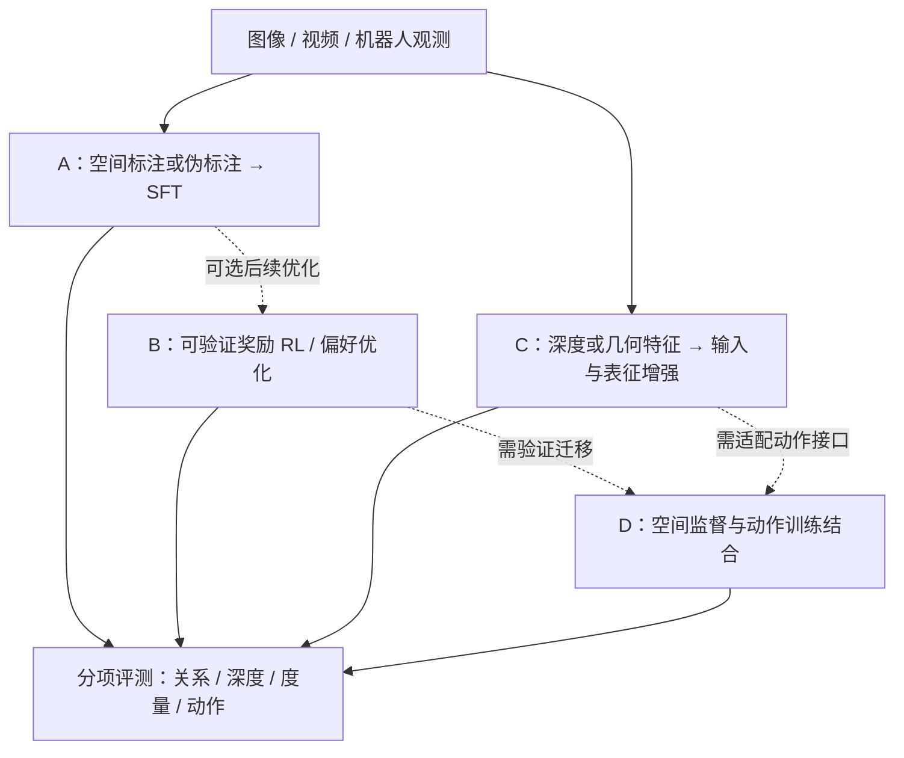

# 图像空间与深度理解的后训练生态调研：方法、数据集与框架

> **版本：v1.3 · 2026-09-18**
>
> 本轮修订：在 v1.2 基础上补充已核对的实验效果（测试集、对照值、差值和限制），并区分同基座消融、跨模型比较与综合分。主要勘误见附录 A。
>
> **证据范围：**核心条目已核对论文摘要、部分正文、作者项目页或官方文档，未做本地源码审计与训练复现。论文结果与官方功能说明按 **E3（来源自述）** 计；本文的比较、风险分析和实施建议按 **E3（分析或建议）** 计。未核实线索单列，不参与选型结论。没有新增 E1/E2 实验实证，论文自报成绩不直接用于立项承诺。
>
> **调研边界：**面向“如何改善 VLM 对图像中空间关系、深度和尺度的理解”。VLA 作为下游迁移方向讨论；无需训练的深度提示作为对照方案讨论。本文不把二者混同为 VLM 后训练。

## 摘要：现有证据能支持什么

空间能力可以通过专门的数据、优化目标和几何输入改善，但“空间问答得分提高”“恢复可靠的度量几何”“机器人动作更准确”是三个不同目标，应分别评测。现有论文支持定向补充空间监督的价值，尚不足以推出“能力缺陷与模型容量无关”或“GRPO 普遍比 SFT 更划算”。（E3，综合分析；来源见 §3–§6）

本文保留四条研究路线：A 用空间数据做监督微调，B 用奖励或偏好信号优化回答，C 在输入或表征中引入几何信息，D 将空间监督接入动作模型。它们分别涉及数据、优化、表征和下游任务，可以组合使用，并非互斥算法。（E3，本文分类）

对当前研究，建议先明确要补的是相对关系、度量误差还是动作泛化，再建立固定测试集与基线。只有当输入和标签足以支持目标问题时，比较 SFT、RL 或深度增强才有解释力。框架已有多模态训练入口，但具体模型与昇腾后端的组合仍需验证。（E3，建议；框架来源见 §8）

| 阅读目的 | 对应章节 |
|---|---|
| 区分空间、深度和度量能力 | §1 |
| 比较四条路线及其代价 | §2–§6 |
| 选择训练数据与评测集 | §7 |
| 选择框架、判断 NPU 迁移边界 | §8 |
| 形成可执行的验证方案 | §9–§10 |

## 1. 先定义要改善的能力

### 1.1 空间理解不是单一指标

下表是本文的任务划分与评测建议（E3，分析），用于避免把不同类型的提升汇成一个含义不清的“空间总分”。

| 能力 | 典型问题 | 必须明确的条件 | 建议指标 |
|---|---|---|---|
| 图像平面关系 | A 在 B 的左边还是右边？ | 图像坐标、目标指代 | 分类准确率、指代正确率 |
| 相对深度与遮挡 | A 比 B 更靠近相机吗？ | 观察视角、物体可见区域 | 深度排序准确率、遮挡关系准确率 |
| 度量空间 | 两物体相距多少米？ | 尺度来源、坐标系、距离定义 | 绝对/相对误差、阈值内比例 |
| 多视角与时空关系 | 换一个视角后物体在哪里？ | 相机运动、跨帧对应、动态物体 | 对应准确率、位姿或位置误差 |
| 动作侧空间能力 | 能否到达目标并完成抓取？ | 机器人坐标、动作接口、控制预算 | 闭环成功率、末端误差、碰撞率 |

例如，“杯子在碗前面”可能指更靠近相机，也可能指机器人前方或碗自身朝向的前方。参考系没有定义时，即使答案格式正确，也未必有唯一真值。RoboSpatial 将 ego-/world-/object-centric 参考系理解作为问题动机之一。（E3，来源自述：[RoboSpatial](https://arxiv.org/abs/2411.16537v5)）

### 1.2 为什么通用视觉语言训练不够

SpatialVLM 将不足归因于训练数据缺少 3D 空间知识，并展示了补充空间 VQA 的收益；SpaRE 则报告，常见视觉语言数据中的空间关系分布不均，许多关系属于监督稀缺的长尾。这些结果支持“补数据和训练目标值得尝试”，不能单独排除容量、分辨率、架构和训练预算的影响。（E3，来源自述与分析：[SpatialVLM](https://arxiv.org/abs/2401.12168v1)、[SpaRE](https://arxiv.org/abs/2504.20648v1)）

还需要区分“模型中没有深度信息”和“下游推理难以利用深度信息”。Depth-Ordinal Prompting 的作者报告，深度信息能够到达语言模型，但不易被推理过程利用；直接附加伪深度图可能降低表现，将其转换为目标相关的深度排序文本则可能改善结果。该工作是**无需训练的输入增强**，不能据此概括所有 VLM 的内部表征。（E3，来源自述：[DOP](https://arxiv.org/abs/2607.11173v1)）

工程上还应检查尺度来源：单目图像或相对深度排序并不自动提供可靠的米制尺度。对度量任务，需要记录传感器、标定或估计模型的尺度假设；相机内参也不能单独消除单目尺度歧义。（E3，几何分析）

## 2. 四条路线：改变了什么，代价在哪里

以下比较是工程判断，不是同条件实验排名（E3）。

| 路线 | 主要改动 | 适用目标 | 主要成本与限制 |
|---|---|---|---|
| A：空间数据 SFT | 增加空间 QA、定位或测量监督 | 补关系覆盖、建立任务接口 | 数据生成与质检；伪标签误差、模板偏差 |
| B：奖励/偏好优化 | 用正确性、一致性、定位质量等信号优化输出 | 已具备一定感知能力后的回答与推理改善 | 在线采样或偏好轨迹生成；奖励有效性与训练稳定性 |
| C：几何输入/表征 | 引入深度、区域几何或重建特征 | 相对深度、空间测量、几何 grounding | 深度获取、对齐、模型适配与部署开销 |
| D：动作侧迁移 | 联合空间监督、表征对齐与动作学习 | 操控和跨场景动作泛化 | 机器人数据、动作接口、闭环评测 |

A→B 是一种候选流程；R1-Zero-like 工作也探索过不做任务专用 SFT 冷启动的训练。是否先 SFT，应由基座能力、数据和对照实验决定。（E3，来源自述与建议：[vsGRPO](https://arxiv.org/abs/2504.00883v2)）

## 3. 路线 A：空间数据与监督微调

### 3.1 SpatialVLM 与 VQASynth 要分开理解

SpatialVLM 提出自动生成 3D 空间 VQA 的方法，论文报告规模为 1000 万张图像、20 亿条 VQA，并报告定性和定量空间问答改善。这里的规模是论文训练数据口径，不代表同规模数据已公开、可直接下载。（E3，来源自述：[论文](https://arxiv.org/abs/2401.12168v1)）

[VQASynth](https://github.com/remyxai/VQASynth) 是 remyxai 提供的开源复现工具，README 将其描述为 SpatialVLM 的 open-source reproduction。应将其视为第三方工具链，不能将其依赖、实现细节或生成数据直接归为 SpatialVLM 官方发布物。（E3，README 自述）

这一类方法通常把图像中的对象及几何估计转为空间问答。其价值在于把几何监督接入语言输出；其风险在于把估计误差一并写进答案。是否使用真实 3D 数据、估计深度或文本描述，应在数据清单中逐项记录。（E3，方法归纳）

### 3.2 代表工作及可借鉴之处

| 工作 | 已核对的核心内容（E3，作者自述） | 对当前研究的启发（E3，分析） |
|---|---|---|
| [SpaRE](https://arxiv.org/abs/2504.20648v1) | 从详细图像描述生成空间 VQA；455k 样本含 3.4M QA | 检查关系长尾与问法覆盖；不能把描述生成的 QA 一律当作 3D 测量真值 |
| [MM-Spatial / CA-VQA](https://arxiv.org/abs/2503.13111) | 利用带开放集标注的 3D 场景数据，覆盖关系、尺寸、距离与 3D grounding | 适合研究有尺度信息的室内空间任务；先核对场景域与标签定义 |
| [InternSpatial](https://arxiv.org/abs/2506.18385) | 摘要报告 12M QA，覆盖单视与多视、19 种指令格式 | 可用于扩大覆盖，但需按任务类型抽样，而非只按总量选数据 |
| [RoboSpatial](https://arxiv.org/abs/2411.16537v5) | 真实室内与桌面场景；图像与 3D 扫描配对，关注机器人空间理解 | 机器人域的候选数据；仍需核对相机、参考系和具体任务匹配程度 |

SFT 基线应报告空间指标和通用能力保留情况。合成数据的收益需要在独立场景、不同问法和不同视觉分布上验证，不能仅用同模板测试集验收。（E3，建议）

## 4. 路线 B：可验证奖励 RL 与偏好优化

### 4.1 先区分算法，再讨论奖励

**RLVR** 描述奖励可验证这一训练设定，**GRPO** 是可用于该设定的在线优化算法。**DPO/fDPO** 则利用偏好信号优化模型，不能直接与在线 GRPO 视为同一流程。本文将二者并列讨论，是因为它们都改变了空间回答的优化信号。（E3，方法归纳；参考 [TRL GRPO 文档](https://huggingface.co/docs/trl/grpo_trainer)、[fDPO 论文](https://arxiv.org/abs/2506.21656v3)）

空间问题在具备明确真值时，便于自动判分。但“可判分”不等于“奖励可靠”：解析器漏洞、答案枚举、单位混淆、宽松容差和伪标签偏差都可能使高奖励偏离实际能力。STAR-R1 就专门对过度枚举和不采取有效变换设置惩罚。（E3，分析与来源自述：[STAR-R1](https://arxiv.org/abs/2505.15804v3)）

### 4.2 代表工作

| 工作 | 核心设计（E3，作者自述） | 阅读重点 |
|---|---|---|
| [vsGRPO / VSI-100k](https://arxiv.org/abs/2504.00883v2) | 对 Qwen2-VL 做 R1-Zero-like GRPO，研究视频空间推理 | 视频输入、KL 设置、与 SFT/DPO 的比较条件 |
| [SVQA-R1](https://arxiv.org/abs/2506.01371v1) | 通过镜像等空间扰动构造 view-consistent reward | 变换前后标签如何对应；一致性不意味着答案字面不变 |
| [SpaceR](https://arxiv.org/abs/2504.01805v2) | 视频空间推理；SG-RLVR 引入 map imagination；数据含空间与通用任务 | 视频采样成本、空间收益与通用能力保留 |
| [STAR-R1](https://arxiv.org/abs/2505.15804v3) | 跨视角变换推理，奖励部分正确并惩罚枚举等行为 | 细粒度奖励的作用与任务特异性 |
| [SpatialReasoner-R1](https://arxiv.org/abs/2506.21656v3) | fDPO 对描述 grounding 与逻辑推理片段使用细粒度偏好 | 偏好轨迹生成成本；与在线 RL 的区别 |
| [SpatialThinker](https://arxiv.org/abs/2511.07403v2) | 将场景图生成融入推理，使用 dense spatial rewards | 结构化 grounding 的增益及奖励消融 |

这些论文的基座、任务、预算和指标不同。本文不把各自的百分比提升拼成算法排行榜；若引用具体增幅，需要同时给出表格、基线、绝对百分点或相对增幅定义。（E3，比较原则）

### 4.3 SpatialThinker：值得复核的配方，而非普遍结论

SpatialThinker 将任务相关对象与关系的场景图构建纳入推理，并使用 STVQA-7K 和密集空间奖励。当前核对的是 arXiv v2；页面注明 NeurIPS 2025 多个 **workshop** 录用，不能写作主会录用。（E3，来源自述：[论文与版本记录](https://arxiv.org/abs/2511.07403v2)）

它适合作为“结构化 grounding 是否优于仅奖励最终答案”的研究案例。但数千条训练问题并不等于只付出数千次推理成本：在线 RL 还要计入每题采样数、训练轮数和输出长度。判断样本效率与算力效率时应分别统计。（E3，分析）

本轮不沿用旧稿中的“四分量门控顺序”“+5.5% / +3.2%”及跨模型胜负结论。这些细节需要对齐同一论文版本、奖励公式和实验表后再引用，不能混用摘要与模型卡的不同口径。

### 4.4 什么情况下值得尝试 RL

建议先确认：目标答案可稳定判分；基座能产生一部分有效候选；训练奖励与独立评测指标有对应关系。对于度量问题，可以设计连续误差奖励，但需先处理单位、尺度和异常值；这不应被表述成已经证明的研究空白。（E3，建议）

镜像一致性也需要正确的变换规则。例如左右标签通常随水平镜像交换；对每张图都输出同一答案的策略，可能看似稳定却不理解空间。应把正确性与一致性分别统计。（E3，分析）

## 5. 路线 C：把几何信号接入模型

### 5.1 三种已核对的接入方式

| 工作 | 几何信号如何进入模型（E3，来源自述） | 实施时需检查（E3，建议） |
|---|---|---|
| [SpatialBot](https://arxiv.org/abs/2406.13642) | RGB 与深度图双输入，使用 SpatialQA 训练 | 深度单位、编码形式、RGB-depth 对齐；不能假设任意 VLM 都能直接读懂深度图 |
| [SD-VLM](https://arxiv.org/abs/2509.17664) | 深度位置编码与图像 embedding 相加，即 `Evision = Eimage + Edepth` | 需适配视觉特征路径；不是单纯在文本前添加 depth token |
| [SpatialRGPT](https://arxiv.org/abs/2406.01584) | 区域表示与可选深度模块结合，支持区域提示 | 区域框/掩码、深度和视觉特征的对应关系 |

SD-VLM 的机制见论文 Figure 5 与公式 (3)。旧稿中的“前缀 token、推理可裁剪”不能由该机制推出，已删除。（E3，论文正文：[NeurIPS 2025 论文](https://papers.neurips.cc/paper_files/paper/2025/file/30bc3a3a44c9d2e3f32e6dd1cd18f552-Paper-Conference.pdf)）

### 5.2 训练用几何与部署用几何要分别记录

几何信号可以只在训练时用于表征监督，也可以在推理时继续作为输入。前者要核查教师特征、对齐损失及收益是否保留；后者还要计入深度获取、传输、预处理和模型推理的完整延迟。架构是否改变、部署是否需要深度传感器，不能仅凭“几何增强”四字判断。（E3，分析）

DOP 提供了另一种对照：把估计深度转成针对问题的排序文本，无需更新模型权重。它适合检验输入形式是否影响已有深度信息的利用，但只有序关系的提示不能替代米制测量。（E3，来源自述与分析：[DOP](https://arxiv.org/abs/2607.11173v1)）

### 5.3 这条路线仍需防止什么

深度传感器有缺测与噪声，估计深度有域偏移与尺度误差；把错误几何输入模型，可能比不输入更差。应至少比较 RGB-only、RGB+估计深度，并在具备条件时增加 RGB+传感器深度，单列遮挡、反光和低纹理场景。（E3，建议）

原稿提到的重建特征、世界模型与隐空间“想象”工作保留为附录 B 的待核读线索。本轮不据此承诺工程改动大小或性能上限。

## 6. 路线 D：空间能力如何迁移到机器人动作

| 工作 | 已核对的方法（E3，作者自述） | 迁移边界（E3，分析） |
|---|---|---|
| [SpatialVLA](https://arxiv.org/abs/2501.15830v5) | Ego3D Position Encoding 与 Adaptive Action Grids；官方仓库报告 1.1M 真实机器人 episodes | 涉及输入与动作表示，需核对机器人及动作离散化方式 |
| [Spatial Forcing](https://arxiv.org/abs/2510.12276v2) | 将 VLA 中间视觉 embedding 与预训练 3D 模型的几何表征对齐 | 需要训练期特征接口与教师信号，不能等同于零成本插件 |
| [InSpire](https://arxiv.org/abs/2505.13888v3) | 在指令前加入空间问题，并将空间回答及动作预测与真值对齐；面向自回归 VLA | 包含训练监督，不能将“推理时加一句提示”称为完整复现 |
| [DepthVLA](https://arxiv.org/abs/2510.13375v1) | 以共享注意力连接 VLM、深度 transformer 与 action expert | 架构适配范围较大，需核对训练和部署两端 |

SpatialVLA 的规模来源为[官方仓库](https://github.com/SpatialVLA/SpatialVLA)（E3，README 自述）。本节方法成绩均未在当前机器人与硬件环境下复现。

与工作区的衔接应先定位模块：空间 VLM/VLA 方法可能作用于感知、任务规划或动作生成层；不能因名称同含 GR00T，就假设它们与 SONIC/WholeBodyControl 的输入输出契约相同。移植前应核对实际观测、动作维度、频率及控制层级。（E3，迁移建议，非对本地源码的审计结论）

验证时应同时保留空间能力测试与闭环动作测试。前者改善而后者不变，可能说明收益未传到控制环节；后者改善也可能由其他训练变化造成。需要控制数据量、训练预算和输入条件，才能缩小归因范围。（E3，建议）

## 7. 数据集与评测：按能力和数据形态选择

### 7.1 训练资源

下表的数量均为作者公开口径（E3），不代表本地已下载或验证。图像、QA、场景、episode 不是同一种计数单位。

| 资源与来源 | 规模或形态 | 更适合的用途 | 使用前待核事项 |
|---|---|---|---|
| [SpatialVLM](https://arxiv.org/abs/2401.12168v1) | 论文报告 10M 图像、2B VQA | 研究大规模空间数据生成思路 | 原始数据是否发布；与第三方 VQASynth 分开记账 |
| [SpaRE](https://arxiv.org/abs/2504.20648v1) | 455k 样本、3.4M QA | 关系覆盖与语言问答 SFT | 描述来源、关系分布、场景去重 |
| [CA-VQA](https://arxiv.org/abs/2503.13111) | 基于室内 3D 场景的多任务 QA | 关系、度量和 3D grounding | 版本、下载规模、尺度与坐标定义 |
| [InternSpatial](https://arxiv.org/abs/2506.18385) | 12M QA；单视与多视 | 广覆盖空间训练 | 各子任务占比、训练/测试隔离 |
| [RoboSpatial](https://arxiv.org/abs/2411.16537v5) | 1M 图像、5k 扫描、3M 关系标注 | 机器人相关参考系与空间任务 | 底层场景许可、视角与自域匹配 |
| [SpatialQA](https://github.com/BAAI-DCAI/SpatialBot) | RGB-depth 空间问答 | 双输入深度理解 | 深度编码、缺测处理、数据版本 |
| [MSMU](https://arxiv.org/abs/2509.17664) | 700k QA、2.5M 数值标注、10k CoT 样本 | 空间测量 | 数值单位、标注来源、独立测试划分 |
| [STVQA-7K](https://arxiv.org/abs/2511.07403v2) | 约 7k 空间问答 | 场景图 grounding 与奖励研究 | 场景图字段、奖励所需标签、版本一致性 |
| [VSI-100k](https://arxiv.org/abs/2504.00883v2) / [SpaceR-151k](https://arxiv.org/abs/2504.01805v2) | 视频空间训练资源；SpaceR 含 91k 空间问题与 60k 通用样本 | 视频/多帧空间推理 | 帧采样、视频许可、与静态图像目标的差异 |

不能仅凭论文规模宣称“数据已经足够”。可用性还取决于下载权限、许可、标签质量、场景覆盖及与目标任务的匹配程度。原稿对 VSI-100k 的“107k 图 / 1.1M QA”未完成来源对应，本版不再沿用。（E3，审查结论）

### 7.2 评测资源

| 基准与来源 | 已核对的定位（E3） | 本文建议（E3） |
|---|---|---|
| [BLINK](https://arxiv.org/abs/2404.12390) | 14 类视觉感知任务，含相对深度与多视角推理 | 按子任务报告，避免总分掩盖深度短板 |
| [3DSRBench](https://arxiv.org/abs/2412.07825) | 3D 空间推理评测 | 核对参考系和视角划分后使用 |
| [SpatialBot 的 SpatialBench](https://huggingface.co/datasets/RussRobin/SpatialBench) | 位置、存在性、计数、可达性、大小比较等任务 | 与同名资源区分；数据访问需接受其条件 |
| [SpatialRGPT-Bench](https://anjiecheng.me/SpatialRGPT/) | 区域相关的 3D 空间推理 | 检查区域提示是否与实际输入一致 |
| [MSMU-Bench](https://arxiv.org/abs/2509.17664) | 空间测量与理解 | 关注数值误差；增加非同源测试集 |
| [InternSpatial-Bench](https://arxiv.org/abs/2506.18385) | 单视空间任务，并研究多视旋转预测 | 避免与训练集同场景、同模板泄漏 |

评测建议采用“公开基准分项结果 + 自域 held-out 场景 + 输入扰动对照”。自建测试集也需要按场景或轨迹去重，不能仅将同一场景的不同 QA 随机切分。新发布或自称抗污染的基准，也不自动保证没有泄漏。（E3，建议）

## 8. 框架与昇腾迁移：支持算法不等于支持目标组合

| 框架 | 本轮核对的公开能力（E3，官方自述） | 选型时的检查项（E3，建议） |
|---|---|---|
| [verl](https://verl.readthedocs.io/en/latest/examples/multi_modal_example.html) | 提供多模态 GRPO 示例 | 目标 VLM、rollout 后端、图像/视频处理、自定义奖励接口 |
| [ms-swift](https://github.com/modelscope/ms-swift) | 提供多模态 SFT、DPO、GRPO 等训练能力 | 精确模型版本、训练模式、LoRA 与后端的兼容组合 |
| [LLaMA-Factory](https://github.com/hiyouga/LlamaFactory) | 提供多模型微调入口，适合作为 SFT 候选 | 自定义深度输入或视觉模块能否被正确加载与训练 |
| [TRL](https://huggingface.co/docs/trl/grpo_trainer#training-vision-language-models) | GRPO 文档列出 VLM 训练入口与已测试模型 | 自定义奖励、processor、生成与训练的一致性 |
| [EasyR1](https://github.com/hiyouga/EasyR1) | 基于 verl 的多模态 RL 框架 | 与上游版本差异、目标模型和部署后端支持 |

EasyR1 应按其自身说明归为基于 verl 的框架，不能仅因维护者关联而当作 LLaMA-Factory 内置的 RL 模块。TRL 也明确提示并非所有 VLM 都保证兼容。（E3，官方自述，来源同表）

本工作区已有相关源码与前期调研，可以作为继续核读的入口；本篇没有据此完成昇腾兼容性验收。NPU 侧至少需要逐项验证：视觉与新增几何算子、混合精度、分布式通信、rollout 引擎、权重同步、保存恢复以及端到端吞吐。先跑通一个完整训练更新与恢复流程，再估算规模化成本。（E3，建议）

框架版本和模型清单变化较快，落地时需锁定 commit、依赖、模型 revision 和配置。本文不保留“支持模型最多”“框架不是瓶颈”等无法从功能列表推出的排名或成本结论。

## 9. 选型建议：从目标到最小可解释实验

以下均为 E3 实施建议，不是已执行计划。

| 目标 | 第一组对照 | 何时增加复杂度 | 暂不能承诺 |
|---|---|---|---|
| 改善左右、前后、深度排序 | 原模型 vs 空间 QA SFT；统一参考系 | 仍有稳定错误且可自动判分时，再比较 RL | SFT 或 RL 必然跨域泛化 |
| 改善米制距离和尺寸 | 原模型 vs 有尺度监督的 SFT；再加入几何输入对照 | 证明深度质量和尺度可靠后，尝试表征级融合 | 相对深度图直接带来准确米制测量 |
| 改善多步/跨视角推理 | 同基座、同数据的 SFT 与 GRPO/偏好优化 | 收益在独立场景成立且推理预算可接受 | 少量问题意味着低训练成本 |
| 改善机器人操控 | 固定动作接口与训练预算，加入一种空间监督 | 空间与闭环指标均有证据后再扩大规模 | VLM 榜单收益直接传递到 SONIC/GR00T |

### 9.1 一个可复用的验证顺序

1. **固定问题与测试集。**写清目标对象、参考系、单位、场景划分及主指标；保留通用能力回归测试。
2. **诊断基线。**区分对象识别、指代、参考系、深度估计、数值输出和多步推理错误。用图像遮蔽、指令改写或视角变换检查模型是否依赖视觉信息。
3. **一次比较一种主要变化。**A 路线先测空间 SFT；C 路线比较有无深度及深度来源；B 路线与 SFT 使用同一基座和数据划分，并披露训练与推理预算。
4. **再做系统迁移。**对候选方法核查 NPU 算子与 rollout 链路；VLA 额外执行闭环对照。最终记录精度、吞吐、显存/内存、延迟和失败分布。

LoRA 可以作为参数高效微调的候选，但是否足够取决于更新模块和任务；不能预先写成“LoRA 即可”。同样，把新模态送入模型可能涉及 processor、视觉编码、位置编码和 checkpoint，不能笼统估算为“只改数据加载器”。（E3，工程建议）

## 10. 风险与结论边界

| 风险 | 需要保留的证据或对照（E3，建议） |
|---|---|
| 伪深度或合成 QA 误差 | 标注来源、质检样本、深度质量分层；避免把伪标签当实测真值 |
| 场景与模板泄漏 | 按场景/轨迹隔离；分别检查图像、文字模板和近重复样本 |
| 奖励与目标不一致 | 奖励函数反例、解析失败、枚举答案、单位错误与连续误差检查 |
| 统计与成本口径不一致 | 样本数、场景数、随机种子、区间；区分相对增幅和百分点，记录 rollout/token 成本 |
| 深度与硬件域变化 | 传感器/估计深度分开报告；测完整推理链，包含预处理及额外模型 |
| 空间问答收益无法迁移到动作 | 同预算闭环对照、动作误差与失败案例；不以问答榜单替代操控验收 |

目前可支持的判断是：这四类方法提供了可复用的研究路径和部分公开资源。当前目标更需要哪一种，应由错误诊断、数据条件和系统约束决定；“最优算法”“数据已足够”“昇腾可直接复现”仍需本地实验回答。（E3，综合判断）

## 11. 已核对的实验效果

本节补充论文中可以直接对表的结果。全部属于 E3：作者论文、作者仓库或模型卡报告，未在本地复现。差值按表内数值相减，`pp` 表示百分点；综合分若混合多个子任务，不称为单一准确率。不同论文使用的基座、数据和测试集不同，不能据此排列“最佳方法”。

### 11.1 空间数据与 SFT

| 工作 | 测试集与指标 | 对照 → 方法 | 说明 |
|---|---|---:|---|
| SpatialVLM | 331 道定性空间 VQA，准确率 | PaLM 2-E 50.4% → 75.2%（+24.8 pp） | 同训练流程有无空间数据；定量题范围命中率仅 33.9% → 37.2%（+3.3 pp）。[表 1–2](https://arxiv.org/html/2401.12168v1#S4.T1) |
| SpaRE | 3DSRBench，准确率 | Qwen2-VL-2B 46.5% → SpaRE-2B 54.4%（+7.9 pp） | What’s Up A 为 44.6% → 93.4%，但 HallusionBench 61.2 → 58.2，通用能力有回退。[表 3](https://arxiv.org/html/2504.20648v1#S4.T3) |
| MM-Spatial / CA-VQA | Binary 准确率；Ego-Dist. 误差阈值命中率 | 59.1% → 68.8%（+9.7 pp）；0.6% → 40.0%（+39.4 pp） | 后者是有尺度的室内 3D 数据；Average 混合不同指标，不能泛称准确率。[表 3](https://arxiv.org/html/2503.13111v2#S5.T3) |
| InternSpatial | InternSpatial-Bench 综合分 | 58.9 → 71.0（+12.1 分） | 综合多种题型；VSI-Bench 为 41.6 → 52.3（+10.7 分）。ChartQA 下降 1.6 分。[表 2–4](https://arxiv.org/html/2506.18385v1#S4.T2) |
| RoboSpatial | BLINK 空间子集；SpatialBench position 类别 | 71.3% → 79.0%（+7.7 pp）；55.9% → 70.6%（+14.7 pp） | 是空间问答/位置判断，不是机器人闭环成功率。[表 4](https://arxiv.org/html/2411.16537v5#S4.T4) |

VQASynth 是第三方 SpatialVLM 复现工具。其 SpaceLLaVA 模型卡没有可确认的同基座增益，因此不能把 SpatialVLM 的 75.2% 直接归给 VQASynth。Ego3D-VLM 也应单列为推理时工具增强：GPT-4o 接入 Ego3D 后，Ego3D-Bench 56.7% → 73.2%（+16.5 pp），测距 RMSE 19.2 → 7.4 m；同时延迟 5.2 → 8.6 s、显存 18.1 → 26.5 GB。[Ego3D 表 1、11](https://arxiv.org/html/2509.06266v2#S5.T1)

### 11.2 奖励与偏好优化

| 工作 | 测试集与指标 | 对照 → 方法 | 说明 |
|---|---|---:|---|
| vsGRPO | VSI-Bench 综合分 | Qwen2-VL-2B 23.3 → 35.4（+12.1 分） | 同基座；综合分混合数值题和选择题。SFT 为 29.6，方法再高 5.8 分。[表 2](https://arxiv.org/html/2504.00883v2#S3.T2) |
| SVQA-R1 | Q-Spatial++ Success Rate | SFT 37.62% → 58.42%（+20.80 pp） | 成功定义为误差落在真值 0.5–2 倍；sMAPE 109.13 → 68.36。Spatial-GRPO 模块相对 format+semantic reward 为 52.48% → 58.42%。[表 3、5](https://arxiv.org/html/2506.01371v1#S4.T3) |
| SpaceR | VSI-Bench；SPAR-Bench | Qwen2.5-VL-7B 34.4 → 45.6（+11.2 分）；33.8 → 37.6（+3.8 分） | 同 32 帧设置；SFT 的 VSI 为 41.6，去掉 map imagination 后为 43.9。[表 1–2](https://arxiv.org/html/2504.01805v2#S5.T1) |
| STAR-R1 | TVR 跨视角 OOD TAcc | STAR-SFT 30.9% → 53.9%（+23.0 pp） | ID 反而 84.2% → 76.3%（−7.9 pp）；总体 TVR 为 48.7% → 61.4%。[表 1–2](https://arxiv.org/html/2505.15804v3#S4.T2) |
| SpatialReasoner-R1 | SpatialRGPT-Bench 定性 / 定量准确率 | DPO 91.48% → fDPO 95.59%（+4.11 pp）；68.22% → 77.30%（+9.08 pp） | 同 8B 方法变体，分别对应关系分类和距离/方向任务。[表 1](https://arxiv.org/html/2506.21656v3#S4.T1) |
| SpatialThinker | 14 个基准平均准确率 | Qwen2.5-VL-7B 62.8% → 70.5%（+7.7 pp） | 同 STVQA-7K 训练；SFT 64.9，Vanilla GRPO 67.2。BLINK relative-depth 子项低于 Vanilla GRPO 75.0% → 72.6%。[表 4、6](https://arxiv.org/html/2511.07403v2#S4.T4) |

### 11.3 几何增强与动作侧方法

| 工作 | 测试集与指标 | 对照 → 方法 | 说明 |
|---|---|---:|---|
| SpatialBot / SD-VLM / SpatialRGPT | 论文主表分别报告 SpatialBench、MSMU-Bench、SpatialRGPT-Bench | 本轮未将不同版本的表格数字合并为统一提升 | 三者输入形式、深度来源和评测集不同；SD-VLM 正文与表 2 有小数冲突，应以主表为准。 |
| SpatialVLA | SIMPLER WidowX，Put Eggplant in Yellow Basket | 去 Ego3D 37.5% → 完整 87.5%（+50.0 pp） | 同架构消融；另有 LIBERO-Spatial 83.6% → 88.2%（+4.6 pp）。[表 IV–V](https://arxiv.org/html/2501.15830v5) |
| Spatial Forcing | LIBERO 四套件平均成功率 | 92.7% → 96.9%（+4.2 pp） | OpenVLA-OFT 同基座消融；Long 为 +8.0 pp，Spatial 仅 +0.4 pp。[表 2](https://arxiv.org/html/2510.12276v2) |
| InSpire | LIBERO-90 未见 suite 平均成功率 | miniVLA-VQ 3.6% → 13.6%（+10.0 pp） | seen 为 83.3% → 89.5%；绝对未见成功率仍低。[表 I](https://arxiv.org/html/2505.13888v3) |
| DepthVLA | SIMPLER WidowX 四任务平均成功率 | π0 58.8% → DepthVLA 74.8%（+16.0 pp） | Stack Block +32.5 pp，但 Put Spoon −5.9 pp；增加约 600M 参数，延迟 190 → 210 ms/chunk。[表 I](https://arxiv.org/html/2510.13375v1) |
| RoboRefer | RefSpatial-Bench-Unseen mask 命中率 | SFT 33.77% → RFT 41.56%（+7.79 pp） | 不是机器人完成率；正文写 +9.1 与表值不一致，以表值为准。[表 2](https://arxiv.org/html/2506.04308v2) |
| PixelVLA | SIMPLER Google Robot VA | Baseline 40.0% → PixelVLA 50.1%（+10.1 pp） | 增益同时包含 CAT 与 PUE；附表存在不同均值口径，不混用。[表 4](https://arxiv.org/html/2511.01571v2) |

Spatial-SSRL 在七个空间基准上的均分为 Qwen2.5-VL-3B 45.91 → 50.54（+4.63 分）、7B 52.69 → 56.58（+3.89 分）；SpatialLadder 的 Qwen2.5-VL-3B 在 VSI-Bench 为 29.4 → 45.7（+16.3 分），域外三基准为 43.6 → 50.8（+7.2 分）。这些是作者报告，不等于本地复现。[Spatial-SSRL 表 1](https://arxiv.org/html/2510.27606v2#S4.T1)、[SpatialLadder 表 1–2](https://arxiv.org/html/2510.08531v1#S4.T1)

MetaSpatial 是室内 3D 布局生成 VLM，不是机器人 VLA：Collision 38.2% → 11.5%、Constraint violation 95.5% → 70.8%（均为越低越好），GPT-4o 评估得分 0.35 → 0.62。该结果不能写成机器人控制成功率提升。[表 1](https://arxiv.org/html/2503.18470v2)

### 11.4 如何读这些数字

这些提升主要来自作者自己的训练/评测设置，不能直接比较大小。读表时至少保留四个字段：基座和训练预算、测试集及子任务、对照是同基座消融还是跨模型、是否存在退步或额外输入。后续若在本工作区复现，建议优先复刻同基座、同测试集的对照，并同时报告绝对值、百分点差、置信区间和失败类别；只报告“提升百分之多少”会掩盖指标定义和分母差异。

## 附录 A：v1.1 → v1.2 主要勘误

| 原表述 | 本版处理与依据 |
|---|---|
| 空间缺陷与容量无关，加参数解决不了 | 改为监督不足是已被研究的因素，不排除其他因素；见 §1 |
| DOP 证明所有 VLM 深度线性不可读 | 按作者摘要改为深度信息的可利用性问题，限定研究范围；见 §1.2 |
| VQASynth 是 SpatialVLM 的官方开源管线 | 明确为 remyxai 第三方复现工具；见 §3.1 |
| SD-VLM：arXiv 2503.11175、前缀 token | 正确编号为 2509.17664；机制为深度位置编码与图像特征相加。旧编号对应低光视频增强论文；见 §5 |
| InternSpatial 约 2500 万样本 | 按已核对摘要改为 1200 万 QA；见 §3、§7 |
| SpatialThinker 标为 NeurIPS'25，混列增幅 | 明确为 workshop 录用；移除尚未对齐版本的细节与比较；见 §4.3 |
| 视角一致意味着答案相同；规则奖励难以被钻空子 | 改为按变换规则对应答案，并明确奖励漏洞风险；见 §4 |
| InSpire 推理时加前缀即可复现 | 补充空间回答与动作真值的训练对齐条件；见 §6 |
| SpatialBot 的 SpatialBench 对应 2511.21471 | 改用作者数据卡与 SpatialBot 论文，避免同名资源混淆；见 §7.2 |
| GRPO 性价比最高、框架不是瓶颈 | 改为需对齐数据、预算、模型与后端后验证；见 §8–§9 |

## 附录 B：保留线索与后续核读范围

旧稿中的 SAT、Sparkle、Ego3D-VLM、Embodied-R、Spatial-SSRL、SpatialLadder、VST、SSR、SIFThinker、ROSS3D、R2D3、VLM-3R、G2VLM、SpaceMind、2D-to-3D Data Lifting、MindJourney、SpatialDreamer、MILO、RoboRefer、PixelVLA、MetaSpatial，以及其他未在 §7 展开的数据集和基准，本轮未逐项核读，暂不参与方法排名或实施建议。

后续纳入正文时，至少补齐论文标题与版本、作者来源链接、训练/推理改动、数据许可与可下载状态、结果所在表格。引用量、SOTA 或“任意模型可用”等宣传性信息不作为优先级依据。

可通过以下清单发现线索，再返回论文与作者仓库核实；清单本身不作为方法和成绩的证明：

- [Awesome-Spatial-Intelligence-in-VLM](https://github.com/mll-lab-nu/Awesome-Spatial-Intelligence-in-VLM)
- [Awesome-spatial-visual-reasoning-MLLMs](https://github.com/vaew/Awesome-spatial-visual-reasoning-MLLMs)
- [Awesome-Multimodal-Spatial-Reasoning](https://github.com/zhengxuJosh/Awesome-Multimodal-Spatial-Reasoning)
- [Awesome-VLA-Post-Training](https://github.com/AoqunJin/Awesome-VLA-Post-Training)
